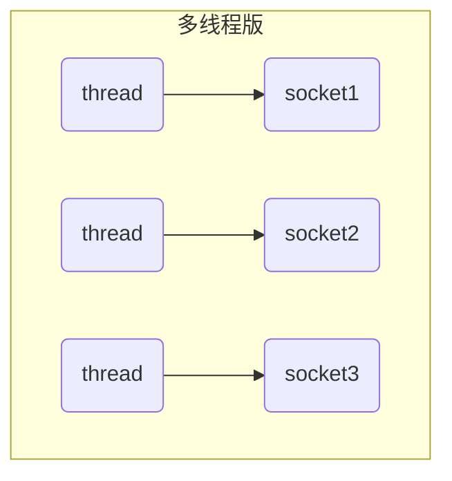
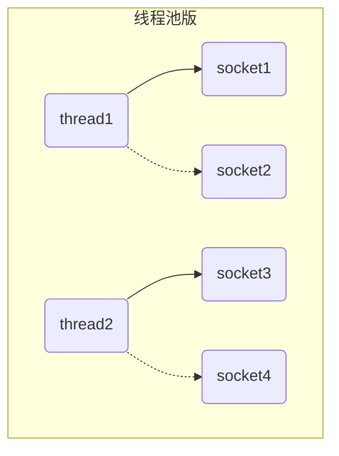
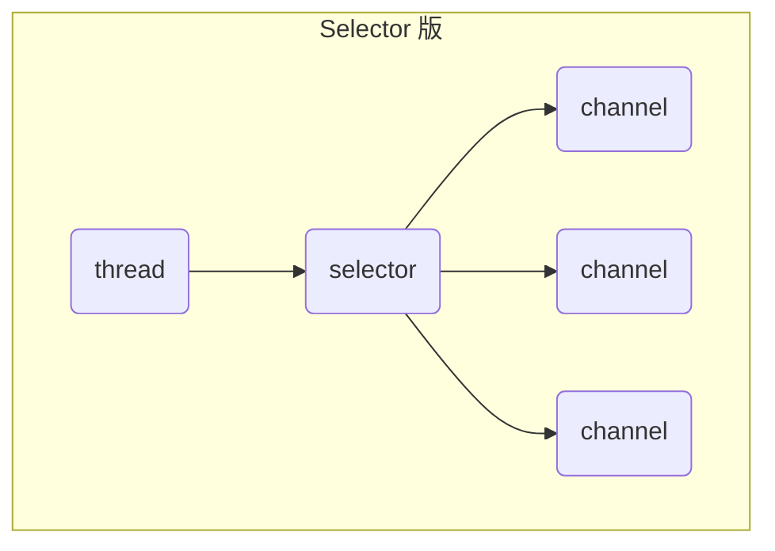
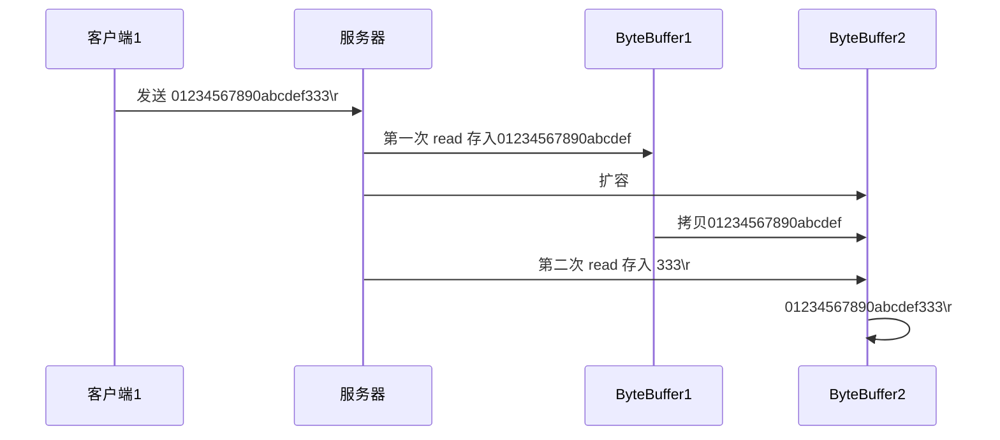

# NIO

## 文件编程

### Channel & Buffer

channel 有一点类似于 stream，它就是读写数据的**双向通道**，可以从 channel 将数据读入 buffer，也可以将 buffer 的数据写入 channel，而之前的 stream 要么是输入，要么是输出，channel 比 stream 更为底层


常见的Channel有

- FileChannel
- DatagramChannel
- SocketChannel
- ServerSocketChannel

buffer 则用来缓冲读写数据，常见的 buffer 有

* ByteBuffer
  * MappedByteBuffer
  * DirectByteBuffer
  * HeapByteBuffer
* ShortBuffer
* IntBuffer
* LongBuffer
* FloatBuffer
* DoubleBuffer
* CharBuffer

⚠️ Buffer 是**非线程安全的**

### FileChannel 

> FileChannel 只能工作在阻塞模式下
>
> 不能直接打开 FileChannel，必须通过 FileInputStream、FileOutputStream 或者 RandomAccessFile 来获取 FileChannel，它们都有 getChannel 方法
>
> * 通过 FileInputStream 获取的 channel 只能读
> * 通过 FileOutputStream 获取的 channel 只能写
> * 通过 RandomAccessFile 是否能读写根据构造 RandomAccessFile 时的读写模式决定

使用 FileChannel 读取文件内容

```java
@Test
public void testFileChannel() {
    String deviceNameFile = "D:\\VSCodeProjects\\study\\work-log\\2023-09\\6-问题.md";
    try (RandomAccessFile file = new RandomAccessFile(deviceNameFile, "rw")) {
        FileChannel channel = file.getChannel();
        // 分配内存 ( limit = 10, position = 0 )
        ByteBuffer buffer = ByteBuffer.allocate(10);
        do {
            // 写入到 buffer ( limit = 10, position = len )
            int len = channel.read(buffer);
            System.out.println("读到字节数  " + len);
            // -1 表示读到了末尾
            if (len == -1) {
                break;
            }
            // 切换 buffer 为读模式 ( limit = position, position = 0 )
            buffer.flip();
            while (buffer.hasRemaining()) {
                System.out.println(((char) buffer.get()));
            }
            // 切换 buffer 为写模式 ( limit = 10, position = 0 )
            buffer.clear();
        } while (true);
    } catch (IOException e) {
        e.printStackTrace();
    }
}
```

- 编码顺序

  - 分配一个ByteBuffer，进行内存初始化
  - 向 buffer 写入数据，例如调用 channel.read(buffer)
  - 调用 flip() 切换至**读区buffer模式**
  - 从 buffer 读取数据，例如调用 buffer.get()
  - 调用 clear() 或 compact() 切换至**写入buffer模式**
  - 重复 1~4 步骤

- 原理

  - 属性

    - capacity：初始化容量
    - position：读写指针
    - limit：写限制

  - 一开始刚分配内存的时候：position = 0，limit = capacity

    

  - 写模式下，position 是写入位置，limit 等于容量，下图表示写入了 4 个字节后的状态

    

  - flip 动作发生后，position 切换为读取位置，limit 切换为读取限制

    

  - 读取4个字节后：position = 4

    

  - clear 切换写后：limit = capacity，position  = 0

    

  - compact 方法，是把未读完的部分向前压缩，然后切换至写模式

    


### 常用方法

**分配空间**

可以使用 allocate 方法为 ByteBuffer 分配空间，其它 buffer 类也有该方法

```java
Bytebuffer buf = ByteBuffer.allocate(16);
```

**向 buffer 写入数据**

有两种办法

* 调用 channel 的 read 方法
* 调用 buffer 自己的 put 方法

```java
int readBytes = channel.read(buf);
buf.put((byte)127);
```


**从 buffer 读取数据**

同样有两种办法

* 调用 channel 的 write 方法
* 调用 buffer 自己的 get 方法

```java
int writeBytes = channel.write(buf);
byte b = buf.get();
```

get 方法会让 position 读指针向后走，如果想重复读取数据

* 可以调用 rewind 方法将 position 重新置为 0
* 或者调用 get(int i) 方法获取索引 i 的内容，它不会移动读指针


**mark 和 reset**

mark 是在读取时，做一个标记，即使 position 改变，只要调用 reset 就能回到 mark 的位置

> 注意：rewind 和 flip 都会清除 mark 位置


**字符串与 ByteBuffer 互转**

```java
// 方式一
ByteBuffer buffer1 = StandardCharsets.UTF_8.encode("你好");
// 方式二
ByteBuffer buffer2 = Charset.forName("utf-8").encode("你好");

// ByteBuffer 转 String
CharBuffer buffer3 = StandardCharsets.UTF_8.decode(buffer1);
System.out.println(buffer3.getClass());		// class java.nio.HeapCharBuffer
System.out.println(buffer3.toString());
```


**channel相关**

- **关闭**：channel 必须关闭，不过调用了 FileInputStream、FileOutputStream 或者 RandomAccessFile 的 close 方法会间接地调用 channel 的 close 方法

- **位置**

  - 获取当前位置

    ```java
    long pos = channel.position();
    ```

  - 设置当前位置

    ```java
    long newPos = ...;
    channel.position(newPos);
    ```

  - 设置当前位置时，如果设置为文件的末尾

    * 这时读取会返回 -1 

    * 这时写入，会追加内容，但要注意如果 position 超过了文件末尾，再写入时在新内容和原末尾之间会有空洞（00）

- **大小**：使用 size 方法获取文件的大小

- **强制写入**：操作系统出于性能的考虑，会将数据缓存，不是立刻写入磁盘。可以调用 force(true)  方法将文件内容和元数据（文件的权限等信息）立刻写入磁盘


### Scattering Reads

分散读：将一个channel分散读到多个buffer

```java
@Test
public void testScatteringReads() {
    try (RandomAccessFile file = new RandomAccessFile(testFile, "rw")) {
        while (true){
            FileChannel channel = file.getChannel();
            ByteBuffer buffer1 = ByteBuffer.allocate(3);
            ByteBuffer buffer2 = ByteBuffer.allocate(4);
            ByteBuffer buffer3 = ByteBuffer.allocate(5);
            // channel 可以分散到多个 buffer 中
            long read = channel.read(new ByteBuffer[]{buffer1, buffer2, buffer3});
            if (read == -1) {
                break;
            }
            buffer1.flip(); buffer2.flip(); buffer3.flip();
            while (buffer1.hasRemaining()) {
                System.out.print(((char) buffer1.get()));
            }
            System.out.println();
            while (buffer2.hasRemaining()) {
                System.out.print(((char) buffer2.get()));
            }
            System.out.println();
            while (buffer3.hasRemaining()) {
                System.out.print(((char) buffer3.get()));
            }
            System.out.println();
            buffer1.clear(); buffer2.clear(); buffer3.clear();
        }
    } catch (IOException e) {
        e.printStackTrace();
    }
}
```

### Gathering Writes

收集写：将多个 buffer 的数据填充至 channel

```java
@Test
public void testGatheringWrites(){
    try (RandomAccessFile file = new RandomAccessFile(testFile,"rw")){
        FileChannel channel = file.getChannel();
        ByteBuffer buffer1 = ByteBuffer.allocate(4);
        ByteBuffer buffer2 = ByteBuffer.allocate(4);
        channel.position(11);		// 指定写入的位置
        buffer1.put(new byte[] {64,65,66,67});
        buffer2.put(new byte[] {'a','b','c','d'});
        buffer1.flip(); buffer2.flip();
        // get方法会使指针后移，导致只能读取一次 --- 若既要又要，需再次调用flip方法，将指针指到0
//        while (buffer1.hasRemaining()) {
//            System.out.print(((char) buffer1.get()));
//        }
//        System.out.println();
//        while (buffer2.hasRemaining()) {
//            System.out.print(((char) buffer2.get()));
//        }
//        System.out.println();
        
        // 通过 FileChannel 写到文件
        channel.write(new ByteBuffer[]{buffer1,buffer2});
    }catch (IOException e) {
        e.printStackTrace();
    }
```

> channel.write()不能保证一次将buffer中的内容全部写入，可以用while
>
> ```java
> while(buffer.hasRemaining()){
> 	channel.write(buffer);
> }
> ```

### 黏包、半包

网络上有多条数据发送给服务端，数据之间使用 \n 进行分隔
但由于某种原因这些数据在接收时，被进行了重新组合，例如原始数据有3条为

* Hello,world\n
* I'm zhangsan\n
* How are you?\n

变成了下面的两个 byteBuffer (黏包，半包)

* Hello,world\nI'm zhangsan\nHo
* w are you?\n

**解决**

```java
@Test
public void testNianbao() {
    ByteBuffer buffer = ByteBuffer.allocate(32);
    buffer.put("Hello,world\nI'm zhangsan\nHo".getBytes());
    split(buffer);
    buffer.put("w are you?\nhaha!\n".getBytes());
    split(buffer);
}
// 切割
private void split(ByteBuffer buffer) {
    buffer.flip();
    int oldLimit = buffer.limit();
    for (int i = 0; i < oldLimit; i++) {
        // buffer.get(i) 指针不移动
        if (buffer.get(i) == '\n') {
            System.out.println("---------   " + i);
            // 新的 buffer 用于输出，需要容量调节，老的 buffer 用于整理
            ByteBuffer newBuffer = ByteBuffer.allocate(i + 1 - buffer.position());
            // 限制复制到 newBuffer 的内容
            buffer.limit(i+1);
            newBuffer.put(buffer);
            debugAll(newBuffer);
            // 恢复 limit
            buffer.limit(oldLimit);
        }
    }
    buffer.compact();
}
```

### 两个Channel 传输数据

小文件拷贝

```java
@Test
public void testCopyFile() {
    try (FileChannel from = new FileInputStream(testFile).getChannel();
         FileChannel to = new FileOutputStream("D:\\VSCodeProjects\\study\\work-log\\2023-09\\test.txt").getChannel()) {
        from.transferTo(0, from.size(), to);
    } catch (IOException e) {
        e.printStackTrace();
    }
}
```

大文件拷贝

```java
@Test
public void testCopyOldFile() {
    try (FileChannel from = new FileInputStream(testFile).getChannel();
         FileChannel to = new FileOutputStream("D:\\VSCodeProjects\\study\\work-log\\2023-09\\test.txt").getChannel()) {
        // 效率高，底层会利用操作系统的零拷贝进行优化
        long size = from.size();
        for (long left = size; left > 0; ) {    // left 表示剩余字节
            System.out.println("指针: " + (size - left) + ",剩余: " + left);
            // transferTo 返回值为实际传输的字节数
            left -= from.transferTo(size - left, left, to);
        }
    } catch (IOException e) {
        e.printStackTrace();
    }
}
```

### Path相关

jdk7 引入了 Path 和 Paths 类

* Path 用来表示文件路径
* Paths 是工具类，用来获取 Path 实例

```java
Path source = Paths.get("1.txt"); // 相对路径 使用 user.dir 环境变量来定位 1.txt

Path source = Paths.get("d:\\1.txt"); // 绝对路径 代表了  d:\1.txt

Path source = Paths.get("d:/1.txt"); // 绝对路径 同样代表了  d:\1.txt

Path projects = Paths.get("d:\\data", "projects"); // 代表了  d:\data\projects


path.normalize();	// 正常化路径,如d:\\data\\projects\\a\\..\\b会将.\..替换掉
```

### Files相关

```java
Files.exists(path);				// 检查文件是否存在
Files.createDirectory(path);	// 创建一级目录，如果已存在抛异常，多级目录抛异常
Files.createDirectories(path);	// 创建多级目录
Files.copy(sourcePath,targetPath);	// 复制文件，已存在抛异常
Files.copy(sourcePath,targetPath,StandardCopyOption.REPLACE_EXISTING);	// 已存在，则覆盖
Files.move(sourcePath, targetPath, StandardCopyOption.ATOMIC_MOVE);	// 原子移动
Files.delete(targetPath);		// 删除文件或目录，文件不存在抛异常，目录还有文件抛异常
```

遍历文件目录

```java
@Test
public void testFiles() throws IOException {
    Path path = Paths.get("c:\\");
    AtomicInteger dirCount = new AtomicInteger();
    AtomicInteger fileCount = new AtomicInteger();
    Files.walkFileTree(path, new SimpleFileVisitor<Path>() {
        @Override
        public FileVisitResult preVisitDirectory(Path dir, BasicFileAttributes attrs) throws IOException {
            System.out.println(dir);
            dirCount.incrementAndGet();
            return super.preVisitDirectory(dir, attrs);
        }
        @Override
        public FileVisitResult visitFile(Path file, BasicFileAttributes attrs) throws IOException {
            System.out.println(file);
            fileCount.incrementAndGet();
            return super.visitFile(file, attrs);
        }
    });
    System.out.println("############## 文件有:" + fileCount);
    System.out.println("############## 目录有:" + dirCount);
}
```

拷贝多级目录

```java
long start = System.currentTimeMillis();
String source = "D:\\Snipaste-1.16.2-x64";
String target = "D:\\Snipaste-1.16.2-x64aaa";

Files.walk(Paths.get(source)).forEach(path -> {
    try {
        String targetName = path.toString().replace(source, target);
        // 是目录
        if (Files.isDirectory(path)) {
            Files.createDirectory(Paths.get(targetName));
        }
        // 是普通文件
        else if (Files.isRegularFile(path)) {
            Files.copy(path, Paths.get(targetName));
        }
    } catch (IOException e) {
        e.printStackTrace();
    }
});
long end = System.currentTimeMillis();
System.out.println(end - start);
```

## 网络编程

### Selector

selector 单从字面意思不好理解，需要结合服务器的设计演化来理解它的用途

**多线程版设计**



- 内存占用高
- 线程上下文成本高
- 只适合连接数少的场景

**线程池版设计**



- 阻塞模式下，线程仅能处理一个socket连接
- 仅适用短连接场景

**Selector版设计**



- 调用selector的select方法会阻塞，直到channel发生读写就绪事件
- 读写就绪事件发生时，select方法就会返回这些事件交给thread处理

### 阻塞

- 阻塞模式下，相关方法都会导致线程暂停

  - ServerSocketChannel.accept 会在没有连接建立时让线程暂停
  - SocketChannel.read 会在没有数据可读时让线程暂停
  - 阻塞的表现其实就是线程暂停了，暂停期间不会占用cpu，但线程相当于闲置

- 单线程下，阻塞方法之间互相影响，几乎不能正常工作，需要多线程支持

- 但多线程下，又有新问题

  - 32位jvm一个线程320k，64位jvm一个线程1024k，如果连接数过多，必然导致 OOM，并且线程太多，反而会因为频繁上下文切换导致性能降低

  - 可以采用线程池技术来减少线程数和线程上下文切换，但治标不治本，如果有很多连接建立，但长时间 inactive，会阻塞线程池中所有线程，因此不适合长连接，只适合短连接

**服务端**

```java
@Test
public void testServer() {
    ByteBuffer buffer = ByteBuffer.allocate(16);
    // 创建了服务器, 绑定监听端口
    try (ServerSocketChannel ssc = ServerSocketChannel.open().bind(new InetSocketAddress(8080))) {
        // 连接集合
        ArrayList<SocketChannel> channels = new ArrayList<>();
        while (true) {
            // accept 建立与客户端连接， SocketChannel 用来与客户端之间通信
            SocketChannel sc = ssc.accept();    // 阻塞方法，线程停止运行
            // 放到连接集合
            channels.add(sc);
            // 从连接中读
            for (SocketChannel channel : channels) {
                channel.read(buffer);           // 阻塞方法，线程停止运行
                buffer.flip();
                debugAll(buffer);
                buffer.clear();
            }
        }
    } catch (Exception e) {
        e.printStackTrace();
    }
}
```

**客户端**

```java
@Test
public void testClient() throws IOException {
    SocketChannel sc = SocketChannel.open();
    sc.connect(new InetSocketAddress("localhost", 8080));
    
    System.out.println("xxxxx");
}
```

### 非阻塞

* 非阻塞模式下，相关方法都不会让线程暂停
  * 在 ServerSocketChannel.accept 在没有连接建立时，会返回 null，继续运行
  * SocketChannel.read 在没有数据可读时，会返回 0，但线程不必阻塞，可以去执行其它 SocketChannel 的 read 或是去执行 ServerSocketChannel.accept 
  * 写数据时，线程只是等待数据写入 Channel 即可，无需等 Channel 通过网络把数据发送出去
* 但非阻塞模式下，即使没有连接建立，和可读数据，线程仍然在不断运行，白白浪费了 cpu
* 数据复制过程中，线程实际还是阻塞的（AIO 改进的地方）

**服务端**

```java
@Test
public void testServer() {
    ByteBuffer buffer = ByteBuffer.allocate(16);

    try (ServerSocketChannel ssc = ServerSocketChannel.open().bind(new InetSocketAddress(8080))) {
        ssc.configureBlocking(false); // 非阻塞模式

        ArrayList<SocketChannel> channels = new ArrayList<>();
        while (true) {
            // 非阻塞，线程还会继续运行，如果没有连接建立，但sc是null
            SocketChannel sc = ssc.accept();
            sc.configureBlocking(false); // 非阻塞模式
            channels.add(sc);
            for (SocketChannel channel : channels) {
                // 非阻塞，线程仍然会继续运行，如果没有读到数据，read 返回 0
                int read = channel.read(buffer);
                if(read <= 0){
                    continue;
                }
                buffer.flip();
                debugAll(buffer);
                buffer.clear();
            }
        }
    } catch (Exception e) {
        e.printStackTrace();
    }
}
```

### 多路复用

单线程可以配合 Selector 完成对多个 Channel 可读写事件的监控，这称之为多路复用

* 多路复用仅针对网络 IO、普通文件 IO 没法利用多路复用
* 如果不用 Selector 的非阻塞模式，线程大部分时间都在做无用功，而 Selector 能够保证
  * 有可连接事件时才去连接
  * 有可读事件才去读取
  * 有可写事件才去写入
    * 限于网络传输能力，Channel 未必时时可写，一旦 Channel 可写，会触发 Selector 的可写事件

- 好处
  - 一个线程配合 selector 就可以监控多个 channel 的事件，事件发生线程才去处理。避免非阻塞模式下所做无用功
  - 让这个线程能够被充分利用
  - 节约了线程的数量
  - 减少了线程上下文切换

### Selector事件

- 事件发生后，要么处理，要么取消（cancel），不能什么都不做，否则下次该事件仍会触发，这是因为 nio 底层使用的是水平触发

- channel必须工作在非阻塞模式才能和Selector一起使用，FileChannel 没有非阻塞模式，因此不能配合 selector 一起使用

- 绑定的事件类型可以有

  * connect - 客户端连接成功时触发
  * accept - 服务器端成功接受连接时触发
  * read - 数据可读入时触发，有因为接收能力弱，数据暂不能读入的情况
  * write - 数据可写出时触发，有因为发送能力弱，数据暂不能写出的情况

- 监听Channel事件

  ```java
  // 返回值代表有多少 channel 发生了事件
  int count = selector.select();					// 阻塞直到绑定事件发生
  int count = selector.select(long timeout);		// 阻塞直到绑定事件发生，或是超时（时间单位为 ms）
  int count = selector.selectNow();				// 不会阻塞，也就是不管有没有事件，立刻返回，自己根据返回值检查是否有事件
  ```


#### accept 事件

> `SelectionKey.OP_ACCEPT`事件在Java的NIO（Non-blocking I/O）中表示有新的客户端连接请求。
>
> 当你的应用程序运行在服务器模式并且注册了`OP_ACCEPT`事件后，一旦有新的客户端尝试连接到服务器，这个事件就会被触发。在事件处理代码中，你通常会调用`ServerSocketChannel.accept()`方法来接受这个新的连接，这会返回一个新的`SocketChannel`对象，代表与客户端的连接。
>
> 然后，你通常会将这个新的`SocketChannel`注册到`Selector`上，并监听`OP_READ`和/或`OP_WRITE`事件，这样你就可以在非阻塞的方式下读取或写入数据。
>
> 所以，简单来说，`OP_ACCEPT`事件就是用来在新的客户端连接到来时得到通知，并接受这个连接的。

**服务端**

```java
@Test
public void testServer() {
    try (ServerSocketChannel ssc = ServerSocketChannel.open().bind(new InetSocketAddress(8080))) {
        // 设置ssc为非阻塞
        ssc.configureBlocking(false);
        // 注册
        Selector selector = Selector.open();
        ssc.register(selector, SelectionKey.OP_ACCEPT);
        while (true) {
            // 阻塞直到绑定事件发生
            int count = selector.select();
            // accept 建立与客户端连接， SocketChannel 用来与客户端之间通信
            // 获取所有事件
            Set<SelectionKey> selectionKeys = selector.selectedKeys();
            // 遍历所有事件，逐一处理
            Iterator<SelectionKey> iterator = selectionKeys.iterator();
            while (iterator.hasNext()){
                SelectionKey selectionKey = iterator.next();
                // 判断事件类型
                if (selectionKey.isAcceptable()) {
                    ServerSocketChannel accept = (ServerSocketChannel)selectionKey.channel();
                    // 事件必须处理
                    SocketChannel sc = accept.accept();
                }
                // 处理完毕，必须将事件移除
                iterator.remove();
            }
        }
    }catch (Exception e) {
        e.printStackTrace();
    }
}
```

**客户端**

```java
@Test
public void testClient() throws IOException {
    try (Socket socket = new Socket("localhost", 8080)) {
        System.out.println(socket);
        socket.getOutputStream().write("world".getBytes());
        System.in.read();
    } catch (IOException e) {
        e.printStackTrace();
    }
}
```

#### read 事件

```java
@Test
public void testServer() {
    try (ServerSocketChannel ssc = ServerSocketChannel.open().bind(new InetSocketAddress(8080))) {
        // 设置ssc为非阻塞
        ssc.configureBlocking(false);
        // 注册, 关注 accept 事件
        Selector selector = Selector.open();
        ssc.register(selector, SelectionKey.OP_ACCEPT);
        while (true) {
            // 阻塞直到绑定事件发生
            int count = selector.select();
            // 获取所有事件
            Set<SelectionKey> selectionKeys = selector.selectedKeys();
            // 遍历所有事件，逐一处理
            Iterator<SelectionKey> iterator = selectionKeys.iterator();
            while (iterator.hasNext()) {
                SelectionKey key = iterator.next();
                // 判断事件类型
                if (key.isAcceptable()) {
                    ServerSocketChannel accept = (ServerSocketChannel) key.channel();
                    // 事件必须处理
                    SocketChannel sc = accept.accept();
                    System.out.println(sc);
                    sc.configureBlocking(false);    // 配置为非阻塞
                    // 注册到selector, 关注 read 事件
                    sc.register(selector, SelectionKey.OP_READ);
                } else if (key.isReadable()) {
                    SocketChannel sc =(SocketChannel) key.channel();
                    ByteBuffer buffer = ByteBuffer.allocate(16);
                    int read = sc.read(buffer);
                    if (read == -1) {
                        key.cancel();
                        sc.close();
                    }else {
                        debugAll(buffer);
                    }
                }
                // 处理完毕，必须将事件移除
                iterator.remove();
            }
        }
    } catch (Exception e) {
        e.printStackTrace();
    }
}
```

#### write 事件

* 非阻塞模式下，无法保证把 buffer 中所有数据都写入 channel，因此需要追踪 write 方法的返回值（代表实际写入字节数）
* 用 selector 监听所有 channel 的可写事件，每个 channel 都需要一个 key 来跟踪 buffer，但这样又会导致占用内存过多，就有两阶段策略
  * 当消息处理器第一次写入消息时，才将 channel 注册到 selector 上
  * selector 检查 channel 上的可写事件，如果所有的数据写完了，就取消 channel 的注册
  * 如果不取消，会每次可写均会触发 write 事件

> 在Java的NIO（Non-blocking I/O）中，`SelectionKey.OP_WRITE`事件表示一个通道已经准备好写数据。
>
> 在大多数情况下，当你向一个`SocketChannel`写数据时，都能立即写入。因此，在常规的网络I/O编程中，你可能不需要经常关注`OP_WRITE`事件。
>
> 然而，有一些情况下你可能需要关注`OP_WRITE`事件：
>
> 1. **当输出缓冲区满时**：如果你试图向一个已经满了的输出缓冲区写入数据，`write()`方法可能不会写入所有的数据，或者可能会阻塞（在阻塞模式下）。在这种情况下，你可以注册`OP_WRITE`事件，当输出缓冲区有更多的空间时，`OP_WRITE`事件会被触发。
>
> 2. **当需要进行流量控制时**：如果你的应用需要根据网络的状况来控制发送数据的速度，你可以使用`OP_WRITE`事件。你可以在准备好发送数据时注册`OP_WRITE`事件，然后在`OP_WRITE`事件被触发时发送数据。
>
> 需要注意的是，不断地关注`OP_WRITE`事件可能会导致CPU使用率过高，因为当通道可以写入数据时，`OP_WRITE`事件会一直被触发。因此，在你写入数据后，你可能需要取消关注`OP_WRITE`事件，直到你有更多的数据需要写入。

**服务端**

```java
@Test
public void testWriteServer() throws Exception {
    Selector selector = Selector.open();
    ServerSocketChannel ssc = ServerSocketChannel.open();
    ssc.bind(new InetSocketAddress(8080));
    ssc.configureBlocking(false);
    SelectionKey sscKey = ssc.register(selector, 0, null);
    sscKey.interestOps(SelectionKey.OP_ACCEPT);
    while (true) {
        selector.select();
        Iterator<SelectionKey> iterator = selector.selectedKeys().iterator();
        if (iterator.hasNext()) {
            SelectionKey key = iterator.next();
            iterator.remove();
            if (key.isAcceptable()) {
                SocketChannel sc = ssc.accept();
                sc.configureBlocking(false);
                SelectionKey scKey = sc.register(selector, SelectionKey.OP_READ);
                // 向客户端发送内容
                StringBuilder stringBuilder = new StringBuilder();
                for (int i = 0; i < 10000; i++) {
                    stringBuilder.append("a");
                }
                ByteBuffer buffer = Charset.defaultCharset().encode(stringBuilder.toString());
                int i = sc.write(buffer);
                // 如果有剩余的未读字节，才需要关注 write 事件
                if (buffer.hasRemaining()) {
                    // 在原有 read 事件上多关注 write 事件
                    scKey.interestOps(scKey.interestOps() + SelectionKey.OP_WRITE);
                    // 将 buffer 作为附件
                    scKey.attach(buffer);
                }
            } else if (key.isWritable()) {
                // 拿到附件
                ByteBuffer buffer = (ByteBuffer) key.attachment();
                SocketChannel sc = (SocketChannel) key.channel();
                int i = sc.write(buffer);
                if (!(buffer.hasRemaining())) {
                    // 写完啦
                    key.interestOps(key.interestOps() - SelectionKey.OP_WRITE);
                    key.attach(null);
                }
            }
        }
    }
}
```

**客户端**

```java
@Test
public void testWriteClient() throws Exception {
    Selector selector = Selector.open();
    SocketChannel sc = SocketChannel.open();
    sc.connect(new InetSocketAddress("localhost", 8080));
    sc.configureBlocking(false);
    sc.register(selector, SelectionKey.OP_READ | SelectionKey.OP_CONNECT);
    int count = 0;
    while (true) {
        selector.select();
        Iterator<SelectionKey> iterator = selector.selectedKeys().iterator();
        while (iterator.hasNext()) {
            SelectionKey key = iterator.next();
            iterator.remove();
            if (key.isConnectable()) {
                System.out.println(sc.finishConnect());
            } else if (key.isReadable()) {
                ByteBuffer buffer = ByteBuffer.allocate(24);
                count += sc.read(buffer);
                buffer.clear();
                System.out.println(count);
            }
        }
    }
}
```

#### connect 事件

上例中客户端就注册了 connect 事件

> 在Java NIO（Non-blocking I/O）中，`SelectionKey.OP_CONNECT`事件主要用于客户端
>
> 表示一个客户端的连接操作可以进行了，通知程序连接操作已经完成或者可以进行。这个事件主要在客户端使用非阻塞模式并尝试连接到服务器时使用。
>
> 在非阻塞模式下，`SocketChannel.connect()`方法可能在连接建立之前就返回。这时，你需要注册`OP_CONNECT`事件，并在事件被触发时调用`SocketChannel.finishConnect()`方法来完成连接操作。
>
> 如果`SocketChannel`是阻塞模式，那么`connect()`方法会一直阻塞到连接完成，所以不需要注册`OP_CONNECT`事件。

### 一些问题

#### 💡 select 何时不阻塞

* 事件发生时
  * 客户端发起连接请求，会触发 accept 事件
  * 客户端发送数据过来，客户端正常、异常关闭时，都会触发 read 事件，另外如果发送的数据大于 buffer 缓冲区，会触发多次读取事件
  * channel 可写，会触发 write 事件
  * 在 linux 下 nio bug 发生时
* 调用 selector.wakeup()
* 调用 selector.close()
* selector 所在线程 interrupt

#### 💡为何要 iter.remove()

因为 select 在事件发生后，就会将相关的 key 放入 selectedKeys 集合，但不会在处理完后从 selectedKeys 集合中移除，需要我们自己编码删除。例如

* 第一次触发了 ssckey 上的 accept 事件，没有移除 ssckey 
* 第二次触发了 sckey 上的 read 事件，但这时 selectedKeys 中还有上次的 ssckey ，在处理时因为没有真正的 serverSocket 连上了，就会导致空指针异常

#### 💡 cancel 的作用

cancel 会取消注册在 selector 上的 channel，并从 keys 集合中删除 key 后续不会再监听事件

#### 💡 write 为何要取消

只要向 channel 发送数据时，socket 缓冲可写，这个事件会频繁触发，因此应当只在 socket 缓冲区写不下时再关注可写事件，数据写完之后再取消关注

#### 💡 边界处理

**问题**

```java
// 服务端
@Test
public void testBorderIssuesServer() throws IOException{
    ServerSocket ss = new ServerSocket( 8080);
    while (true) {
        Socket s = ss.accept();
        InputStream inputStream = s.getInputStream();
        byte[] bytes = new byte[4];
        while (true) {
            int read = inputStream.read(bytes);
            if(read == -1){
                break;
            }
            System.out.println(new String(bytes,0,read));
        }
    }
}

// 客户端
@Test
public void testBorderIssuesClient() throws IOException {
    Socket s = new Socket("localhost", 8080);
    OutputStream outputStream = s.getOutputStream();
    outputStream.write("hello".getBytes());
    outputStream.write("ssss".getBytes());
    outputStream.write("你好".getBytes());
    s.close();
}
```

```
hell
osss
s你
好
```

**分析**


* 一种思路是固定消息长度，数据包大小一样，服务器按预定长度读取，缺点是浪费带宽
* 另一种思路是按分隔符拆分，缺点是效率低
* TLV 格式，即 Type 类型、Length 长度、Value 数据，类型和长度已知的情况下，就可以方便获取消息大小，分配合适的 buffer，缺点是 buffer 需要提前分配，如果内容过大，则影响 server 吞吐量
  * Http 1.1 是 TLV 格式
  * Http 2.0 是 LTV 格式




**服务器端**

```java
@Test
public void testBorderIssuesServer() throws IOException {
    // 开一个 Selector
    Selector selector = Selector.open();
    // 开一个 ServerSocketChannel , 绑定端口, 配置非阻塞, 注册到 Selector
    ServerSocketChannel ssc = ServerSocketChannel.open().bind(new InetSocketAddress(8080));
    ssc.configureBlocking(false);
    SelectionKey sscKey = ssc.register(selector, 0, null);
    // 注册的 SelectionKey 只关注 accept 事件
    sscKey.interestOps(SelectionKey.OP_ACCEPT);
    while (true) {
        // 没有事件发生，线程阻塞，有事件解除阻塞，事件未处理时不会阻塞
        selector.select();
        // 处理事件
        Iterator<SelectionKey> iterator = selector.selectedKeys().iterator();
        while (iterator.hasNext()) {
            SelectionKey key = iterator.next();
            // 处理事件时 key 必须手动移除，但是还在 selector 中，因为未处理
            iterator.remove();
            if (key.isAcceptable()) {
                // 处理 accept 事件
                // 拿到 ServerSocketChannel 接收 SocketChannel，配置为非阻塞, 注册到 Selector
                ServerSocketChannel channel = (ServerSocketChannel) key.channel();
                SocketChannel sc = channel.accept();
                sc.configureBlocking(false);
                // 将一个 ByteBuffer 作为这个 Channel 的附件，用于后续的一些处理（边界问题、扩容问题）
                ByteBuffer buffer = ByteBuffer.allocate(16);
                SelectionKey scKey = sc.register(selector, 0, buffer);
                // 对于 SocketChannel 只关注 read 事件
                scKey.interestOps(SelectionKey.OP_READ);
            } else if (key.isReadable()) {
                // 处理 read 事件
                try {
                    // 拿到 SocketChannel 对应的附件，将数据放到附件（ByteBuffer） 中
                    SocketChannel channel = (SocketChannel) key.channel();
                    ByteBuffer buffer = (ByteBuffer) key.attachment();
                    int read = channel.read(buffer);
                    // 客户端正常关闭连接后 读到的就是-1
                    if (read == -1) {
                        // 事件必须处理，不取消会一直存在于 Selector 中，这里是真正的移除
                        key.cancel();
                    } else {
                        // 处理边界
                        split(buffer);
                        // 扩容
                        if (buffer.position() == buffer.limit()) {
                            ByteBuffer newBuffer = ByteBuffer.allocate(buffer.capacity() * 2);
                            buffer.flip();
                            // 复制到新的 buffer 中，新的 buffer 作为附件
                            newBuffer.put(buffer);
                            key.attach(newBuffer);
                        }
                    }
                } catch (IOException e) {
                    e.printStackTrace();
                    // 客户端异常断开，key必须移出，即事件必须处理（取消）
                    key.cancel();
                }
            }
        }
    }
}
```

**客户端**

```java
// 老方式
@Test
public void testBorderIssuesClient() throws IOException, InterruptedException {
    Socket s = new Socket("localhost", 8080);
    OutputStream outputStream = s.getOutputStream();
    outputStream.write("hello\n".getBytes());
    outputStream.write("ssss\nsdsfsfadaff1234567\n".getBytes());
    outputStream.write("你好\n".getBytes());
    Thread.sleep(5000);
    s.close();
}

// Channel 方式
@Test
public void testBorderIssuesClient() throws IOException, InterruptedException {
    SocketChannel sc = SocketChannel.open();
    sc.connect(new InetSocketAddress("localhost", 8080));
    SocketAddress address = sc.getLocalAddress();
    // sc.write(Charset.defaultCharset().encode("hello\nworld\n"));
    sc.write(Charset.defaultCharset().encode("0123\n456789abcdef"));
    sc.write(Charset.defaultCharset().encode("0123456789abcdef3333\n"));
    System.in.read();
}

// 文件
@Test
public void testBorderIssuesClient() throws IOException, InterruptedException {
    Socket s = new Socket("localhost", 8080);
    OutputStream outputStream = s.getOutputStream();
    FileChannel file = FileChannel.open(Paths.get(testFile));
    ByteBuffer buffer = ByteBuffer.allocate(16);
    while (true){
        int read = file.read(buffer);
        if(read == -1){
            break;
        }
        buffer.flip();
        outputStream.write(buffer.array());
        System.out.println(new String(buffer.array()));
    }
    Thread.sleep(5000);
    s.close();
}
```

#### 💡ByteBuffer 大小分配

* 每个 channel 都需要记录可能被切分的消息，因为 ByteBuffer 不能被多个 channel 共同使用，因此需要为每个 channel 维护一个独立的 ByteBuffer
* ByteBuffer 不能太大，比如一个 ByteBuffer 1Mb 的话，要支持百万连接就要 1Tb 内存，因此需要设计大小可变的 ByteBuffer
  * 一种思路是首先分配一个较小的 buffer，例如 4k，如果发现数据不够，再分配 8k 的 buffer，将 4k buffer 内容拷贝至 8k buffer，优点是消息连续容易处理，缺点是数据拷贝耗费性能
  * 另一种思路是用多个数组组成 buffer，一个数组不够，把多出来的内容写入新的数组，与前面的区别是消息存储不连续解析复杂，优点是避免了拷贝引起的性能损耗

### 多线程优化

前面的代码只有一个选择器，没有充分利用多核 cpu，如何改进呢？

分两组选择器

* 单线程配一个选择器，专门处理 accept 事件
* 创建 cpu 核心数的线程，每个线程配一个选择器，轮流处理 read 事件


```java
public class ChannelTest {

    public static void main(String[] args) throws IOException {
        // 1.通过boos启动
        new BossEventLoop().register();
    }

    /**
     * 专门一个boos线程处理 accept 事件
     */
    static class BossEventLoop implements Runnable {

        /**
         * boos 对应的 Selector
         */
        private Selector boss;

        /**
         * 固定数量的 worker
         */
        private WorkerEventLoop[] workers;

        /**
         * 计数器用于分配 worker
         */
        private final AtomicInteger index = new AtomicInteger();

        /**
         * 标记是否注册
         */
        private volatile boolean started = false;

        @Override
        public void run() {

            while (true) {
                try {
                    // 5. boss 监听事件
                    boss.select();
                    Iterator<SelectionKey> iterator = boss.selectedKeys().iterator();
                    while (iterator.hasNext()) {
                        SelectionKey key = iterator.next();
                        iterator.remove();
                        if (key.isAcceptable()) {
                            ServerSocketChannel ssc = (ServerSocketChannel) key.channel();
                            SocketChannel sc = ssc.accept();
                            sc.configureBlocking(false);
                            // 6.分配 worker
                            int i = index.incrementAndGet() % workers.length;

                            /*
                             *  7.注册worker >>>>>>>>>>>>> 关注点1:
                             *      在单线程的情况下，我们用的一个Selector，调用select方法阻塞了，
                             *   直到事件发生解除阻塞，将连接的SocketChannel注册到同一个Selector上
                             *      但是在多线程中，worker单独一个Selector，必须要控制注册时是非阻塞的，
                             *   这里，我们将select方法调用和注册放到一个线程中，可以更好的控制执行顺序
                             *
                             *   入口 >>>
                             */
                            workers[i].register(sc);
                        }
                    }
                } catch (IOException e) {
                    e.printStackTrace();
                }
            }

        }

        /**
         * 注册 boos
         */
        public void register() throws IOException {
            if (!started) {
                // 2.初始化 boos
                ServerSocketChannel ssc = ServerSocketChannel.open();
                ssc.bind(new InetSocketAddress(8080));
                ssc.configureBlocking(false);
                boss = Selector.open();
                SelectionKey key = ssc.register(boss, 0, null);
                // 只关注 accept 事件
                key.interestOps(SelectionKey.OP_ACCEPT);

                // 3.初始化 work容器, 这里初始化两个 worker
                workers = initEventLoop();

                // 4.开启 boos 线程
                new Thread(this, "boss").start();
                started = true;
            }
        }

        /**
         * 初始化 work容器
         *
         * @return
         */
        private WorkerEventLoop[] initEventLoop() {
            WorkerEventLoop[] workerEventLoops = new WorkerEventLoop[2];
            for (int i = 0; i < workerEventLoops.length; i++) {
                workerEventLoops[i] = new WorkerEventLoop(i);
            }
            return workerEventLoops;
        }
    }

    /**
     * 专门一个 worker 线程处理 读写 事件
     */
    static class WorkerEventLoop implements Runnable {
        /**
         * worker 对应的 Selector
         */
        private Selector worker;

        /**
         * 容器索引、线程名
         */
        private final int index;

        /**
         * 标记是否注册
         */
        private volatile boolean start = false;

        /**
         * 阻塞队列，用于控制事件监听和事件注册的顺序
         */
        private final ConcurrentLinkedQueue<Runnable> tasks = new ConcurrentLinkedQueue<>();

        public WorkerEventLoop(int index) {
            this.index = index;
        }

        @Override
        public void run() {
            while (true) {
                try {
                    /*
                     * 9.2 监听与注册 >>>>>>>>>>>>> 关注点3:
                     *      最关键的点，终于放到了一个线程
                     *   但是新的SocketChannel也被分配到了这个worker，但是还没注册所以监听不到就绪的事件，会一直阻塞，还是会出问题
                     *   所以需要调用wakeup方法唤醒线程
                     */
                    worker.select();    // 阻塞了，直到事件发生
                    Runnable task = tasks.poll();
                    if (task != null) {
                        task.run();
                    }

                    // 处理事件
                    Iterator<SelectionKey> iterator = worker.selectedKeys().iterator();
                    if (iterator.hasNext()) {
                        SelectionKey key = iterator.next();
                        iterator.remove();
                        if (key.isReadable()) {
                            SocketChannel sc = (SocketChannel) key.channel();
                            ByteBuffer buffer = ByteBuffer.allocate(128);
                            try {
                                int read = sc.read(buffer);
                                if (read == -1) {
                                    key.cancel();
                                    sc.close();
                                } else {
                                    debugAll(buffer);
                                }
                            } catch (IOException e) {
                                e.printStackTrace();
                                key.cancel();
                                sc.close();
                            }
                        }
                    }
                } catch (IOException e) {
                    e.printStackTrace();
                }
            }
        }

        /**
         * 注册
         *
         * @param sc
         * @throws IOException
         */
        public void register(SocketChannel sc) throws IOException {
            if (!start) {
                // 8.初始化worker的Selector并启动worker线程
                worker = Selector.open();
                new Thread(this, "work-" + index).start();
                start = true;
            }

            /*
             *  9.1 注册过程进队列 >>>>>>>>>>>>> 关注点2:
             *      上面8开启的线程开始监听事件，需要将指定的 SocketChannel 注册到 Selector
             *    将 SocketChannel 的注册过程放到阻塞队列，来控制此 SocketChannel 注册时机
             */
            tasks.add(() -> {
                SelectionKey key;
                try {
                    key = sc.register(worker, 0, null);
                    key.interestOps(SelectionKey.OP_READ);
                    /* 9.3 注册新的 `SocketChannel` 后，立即检查是否有新的就绪事件。
                     *      `register` 方法可能在 select 方法阻塞等待时被调用，
                     *  这种情况下，如果不立即检查就绪事件，新注册的 `SocketChannel` 的就绪事件可能会被延迟处理
                     *  而 `selectNow()` 能确保新注册的 `SocketChannel` 的就绪事件能被尽快处理。
                     *      >>>>>>> 这里主要是立即检查就绪的事件
                     */
                    worker.selectNow();
                } catch (IOException e) {
                    e.printStackTrace();
                }
            });
            /*
             * 10. 唤醒 >>>>>>>>>>>>> 关注点4:
             *      防止 select 方法先于注册之前执行，而导致的一直阻塞
             *      wakeup有先唤醒机制，无需担心先阻塞还是先注册
             */
            worker.wakeup();
        }
    }
}
```

> ### 💡 如何拿到 cpu 个数
>
> * 上述代码worker容器的容量是写死的，实际是根据服务器的核心数分配的
> * Runtime.getRuntime().availableProcessors() 如果工作在 docker 容器下，因为容器不是物理隔离的，会拿到物理 cpu 个数，而不是容器申请时的个数
> * 这个问题直到 jdk 10 才修复，使用 jvm 参数 UseContainerSupport 配置， 默认开启

### UDP

- UDP是数据报传输，所以需要用到DatagramChannel

- UDP 是无连接的，client 发送数据不会管 server 是否开启
- server 这边的 receive 方法会将接收到的数据存入 byte buffer，但如果数据报文超过 buffer 大小，多出来的数据会被默默抛弃

**服务端**

```java
@Test
public void testUDPServer() {
    try (DatagramChannel channel = DatagramChannel.open()) {
        DatagramSocket socket = channel.socket();
        socket.bind(new InetSocketAddress(9999));
        ByteBuffer buffer = ByteBuffer.allocate(32);
        // 收到的数据报放到 buffer
        channel.receive(buffer);
        debugAll(buffer);
    } catch (Exception e) {
        e.printStackTrace();
    }
}
```

**客户端**

```java
@Test
public void testUDPClient() {
    try (DatagramChannel channel = DatagramChannel.open()) {
        ByteBuffer buffer = Charset.defaultCharset().encode("hello");
        InetSocketAddress address = new InetSocketAddress("localhost", 9999);
        channel.send(buffer, address);
    } catch (IOException e) {
        e.printStackTrace();
    }
}
```

可以看到两个现象

- 服务端没有while循环，收到数据报后就结束阻塞
- 服务端没有accept事件的监听，即无需建立连接
- 客户端在没有服务端的情况下也可发送成功，还是因为没有建立连接的过程

**对比**

- TCP流程
  - 阻塞版本中，while监听accept事件，建立连接，拿到SocketChannel放入集合，遍历SocketChannel读数据
  - 多路复用版本中，将ServerSocketChannel注册到Selector中，while监听accept事件，拿到SocketChannel也注册到Selector中，关注读事件，对于就绪的事件放到SelectorKey中，对SelectorKey中的可读事件进行读数据
- UDP流程
  - 直接在DatagramChannel中获取DatagramSocket，进行数据报的读取

## NIO & BIO & AIO

### stream vs channel

* stream 不会自动缓冲数据，channel 会利用系统提供的发送缓冲区、接收缓冲区（更为底层）
* stream 仅支持阻塞 API，channel 同时支持阻塞、非阻塞 API，网络 channel 可配合 selector 实现多路复用
* 二者均为全双工，即读写可以同时进行

### IO模型

同步阻塞、同步非阻塞、同步多路复用、异步阻塞（没有此情况）、异步非阻塞

* 同步：线程自己去获取结果（一个线程）
* 异步：线程自己不去获取结果，而是由其它线程送结果（至少两个线程）


当调用一次 channel.read 或 stream.read 后，会切换至操作系统内核态来完成真正数据读取，而读取又分为两个阶段，分别为：

* 等待数据阶段
* 复制数据阶段


**阻塞IO**

- 用户态调用 channel.read 或 stream.read 
- 切换内核态等待数据
- 内核态复制数据并交给用户态


**非阻塞IO**

- 用户态多次调用 channel.read 或 stream.read 同时进行
- 内核态等待数据

- 内核态复制数据并交给用户态


**信号驱动** --- 略

**异步IO**

- 线程1用户态调用 channel.read 或 stream.read ，并携带一个回调方法
- 内核态等待数据，有结果了通过回调方法通知用户态
- 内核态复制数据并通过线程2回调方法交给用户态


**阻塞 IO vs 多路复用**

- 阻塞IO：每次用户态内核态的切换都只能处理一个事件，经历等待数据、复制数据、等待连接、建立连接的过程

  - 用户态读，内核态等待数据，拿到accept事件结果，复制数据给用户态
  - 内核态等待建立连接和建立连接
  - 连接上后将read事件结果返回给用户态
  - 重复以上

  

- 多路复用：通过select，每次用户态内核态的切换可以将就绪的事件都返回，然后依次通过内核态获取对应事件的数据

  

### 零拷贝

**传统IO的问题**

```java
File f = new File("./data.txt");
RandomAccessFile file = new RandomAccessFile(f,"r");

byte[] buf = new byte[(int)f.length];
file.read(buf);

Socket socket = ...;
socket.getOutputStream().write(buf);
```

> **内部流程** --- 三次用户态内核态的切换、四次数据拷贝，java 的 IO 实际不是物理设备级别的读写，而是缓存的复制，底层的真正读写是操作系统来完成的
>
> 
>
> - java 本身并不具备 IO 读写能力，因此 read 方法调用后，要从 java 程序的**用户态**切换至**内核态**，去调用操作系统（Kernel）的读能力，将数据读入**内核缓冲区**。这期间用户线程阻塞，操作系统使用 DMA（Direct Memory Access）来实现文件读，其间也不会使用 cpu
>
>   > DMA 也可以理解为硬件单元，用来解放 cpu 完成文件 IO
>
> - 从**内核态**切换回**用户态**，将数据从**内核缓冲区**读入**用户缓冲区**（即 byte[] buf），这期间 cpu 会参与拷贝，无法利用 DMA
>
> - 调用 write 方法，这时将数据从**用户缓冲区**（byte[] buf）写入 **socket 缓冲区**，cpu 会参与拷贝
>
> - 接下来要向网卡写数据，这项能力 java 又不具备，因此又得从**用户态**切换至**内核态**，调用操作系统的写能力，使用 DMA 将 **socket 缓冲区**的数据写入网卡，不会使用 cpu


**NIO优化**

- **优化1：通过DirectByteBuf** 

  * ByteBuffer.allocate(10)  HeapByteBuffer 使用的还是 java 内存

  * ByteBuffer.allocateDirect(10)  DirectByteBuffer 使用的是操作系统内存

  > 大部分步骤与优化前相同，不再赘述。唯有一点：java 可以使用 DirectByteBuf 将堆外内存映射到 jvm 内存中来直接访问使用
  >
  > * 这块内存不受 jvm 垃圾回收的影响，因此内存地址固定，有助于 IO 读写
  > * java 中的 DirectByteBuf 对象仅维护了此内存的虚引用，内存回收分成两步
  >   * DirectByteBuf 对象被垃圾回收，将虚引用加入引用队列
  >   * 通过专门线程访问引用队列，根据虚引用释放堆外内存
  > * 减少了一次数据拷贝，用户态与内核态的切换次数没有减少


* **优化2：底层采用了 linux 2.1 后提供的 sendFile 方法**，java 中对应着两个 channel 调用 transferTo/transferFrom 方法拷贝数据

  * java 调用 transferTo 方法后，要从 java 程序的**用户态**切换至**内核态**，使用 DMA将数据读入**内核缓冲区**，不会使用 cpu
  * 数据从**内核缓冲区**传输到 **socket 缓冲区**，cpu 会参与拷贝
  * 最后使用 DMA 将 **socket 缓冲区**的数据写入网卡，不会使用 cpu

  可以看到

  * 只发生了一次用户态与内核态的切换
  * 数据拷贝了 3 次

  

* 优化3：linux 2.4

  * java 调用 transferTo 方法后，要从 java 程序的**用户态**切换至**内核态**，使用 DMA将数据读入**内核缓冲区**，不会使用 cpu
  * 只会将一些 offset 和 length 信息拷入 **socket 缓冲区**，几乎无消耗
  * 使用 DMA 将 **内核缓冲区**的数据写入网卡，不会使用 cpu

  整个过程仅只发生了一次用户态与内核态的切换，数据拷贝了 2 次。所谓的【零拷贝】，并不是真正无拷贝，而是在不会拷贝重复数据到 jvm 内存中，零拷贝的优点有

  * 更少的用户态与内核态的切换
  * 不利用 cpu 计算，减少 cpu 缓存伪共享
  * 零拷贝适合小文件传输

  

### AIO

AIO 用来解决数据复制阶段的阻塞问题

* 同步意味着，在进行读写操作时，线程需要等待结果，还是相当于闲置
* 异步意味着，在进行读写操作时，线程不必等待结果，而是将来由操作系统来通过回调方式由另外的线程来获得结果

> 异步模型需要底层操作系统（Kernel）提供支持
>
> * Windows 系统通过 IOCP 实现了真正的异步 IO
> * Linux 系统异步 IO 在 2.6 版本引入，但其底层实现还是用多路复用模拟了异步 IO，性能没有优势

**文件AIO**

```java
@Test
public void testFileAIO() {
    try (AsynchronousFileChannel s = AsynchronousFileChannel.open(Paths.get(testFile), StandardOpenOption.READ)) {
        ByteBuffer buffer = ByteBuffer.allocate((int) s.size());
        s.read(buffer, 0, buffer, new CompletionHandler<Integer, ByteBuffer>() {
            @Override
            public void completed(Integer result, ByteBuffer attachment) {
                debugAll(attachment);
            }
            @Override
            public void failed(Throwable exc, ByteBuffer attachment) {
            }
        });
        System.in.read();
    } catch (IOException e) {
        e.printStackTrace();
    }
}
```

**网络AIO**

```java
@Test
public void testNetAIO() throws IOException {
    AsynchronousServerSocketChannel ssc = AsynchronousServerSocketChannel.open();
    ssc.bind(new InetSocketAddress(8080));
    ssc.accept(null, new CompletionHandler<AsynchronousSocketChannel, Object>() {
        @Override
        public void completed(AsynchronousSocketChannel sc, Object attachment) {
            ByteBuffer buffer = ByteBuffer.allocate(128);
            // 专门处理 read 事件
            sc.read(buffer, buffer, new CompletionHandler<Integer, ByteBuffer>() {
                @Override
                public void completed(Integer result, ByteBuffer attachment) {
                    if (result == -1) {
                        try {
                            sc.close();
                            return;
                        } catch (IOException e) {
                            e.printStackTrace();
                        }
                    }
                    debugAll(attachment);
                    attachment.clear();
                    // 如果result != -1 还有内容，作为附件接着读
                    sc.read(attachment, attachment, this);
                }
                @Override
                public void failed(Throwable exc, ByteBuffer attachment) {
                    closeSocketChannel(sc);
                }
            });
            // 专门处理 write 事件
            sc.write(Charset.defaultCharset().encode("hello"), ByteBuffer.allocate(16), new CompletionHandler<Integer, ByteBuffer>() {
                @Override
                public void completed(Integer result, ByteBuffer attachment) {
                    // 如果作为附件的 buffer 还有内容，需要再次 write 写出剩余内容
                    if (attachment.hasRemaining()) {
                        sc.write(attachment);
                    }
                }
                @Override
                public void failed(Throwable exc, ByteBuffer attachment) {
                    closeSocketChannel(sc);
                }
            });
            // 处理完第一个 accept 时，需要再次调用 accept 方法来处理下一个 accept 事件
            ssc.accept(null, this);
        }
        @Override
        public void failed(Throwable exc, Object attachment) {
        }
        private void closeSocketChannel(AsynchronousSocketChannel sc) {
            try {
                sc.close();
            } catch (IOException e) {
                e.printStackTrace();
            }
        }
    });
    System.in.read();
}
```

