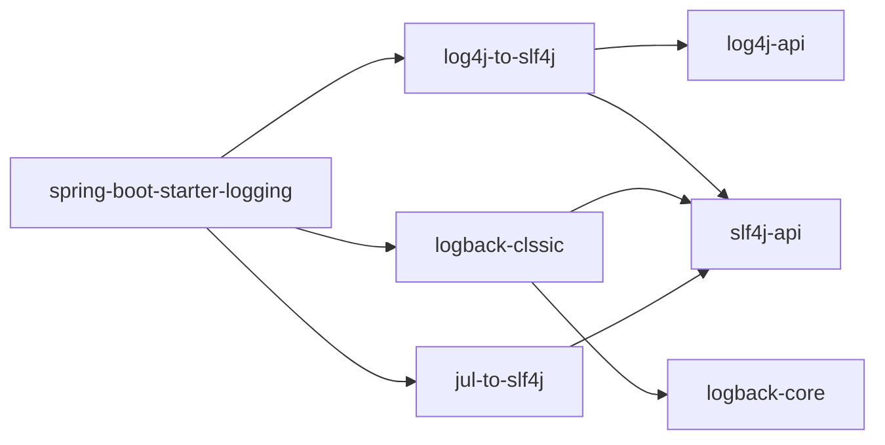

# 日志

## 概述

### 日志框架

JUL（java util logging）、logback、log4j、log4j2

JCL（Jakarta Commons Logging）、slf4j（ Simple Logging Facade for Java）

**日志门面**：JCL、slf4j

**日志实现**：JUL、logback、log4j、log4j2

## JUL

jdk自带框架

### 架构

- Loggers：被称为记录器，应用程序通过获取Logger对象，调用其API来来发布日志信息。Logger
  通常时应用程序访问日志系统的入口程序。
- Appenders：也被称为Handlers，每个Logger都会关联一组Handlers，Logger会将日志交给关联
  Handlers处理，由Handlers负责将日志做记录。Handlers在此是一个抽象，其具体的实现决定了
  日志记录的位置可以是控制台、文件、网络上的其他日志服务或操作系统日志等。
- Layouts：也被称为Formatters，它负责对日志事件中的数据进行转换和格式化。Layouts决定了
  数据在一条日志记录中的最终形式。
- Level：每条日志消息都有一个关联的日志级别。该级别粗略指导了日志消息的重要性和紧迫，我
  可以将Level和Loggers，Appenders做关联以便于我们过滤消息。
- Filters：过滤器，根据需要定制哪些信息会被记录，哪些信息会被放过。

### 入门案例

```java
@Test
public void testQuick() throws Exception {
    // 1.创建日志记录器对象
    Logger logger = Logger.getLogger("com.itheima.log.JULTest");
    // 2.日志记录输出
    logger.info("hello jul");
    logger.log(Level.INFO, "info msg");
    String name = "jack";
    Integer age = 18;
    logger.log(Level.INFO, "用户信息：{0},{1}", new Object[]{name, age});
}
```

### 日志级别

```
* java.util.logging.Level中定义了日志的级别：
	SEVERE（最高值）
    WARNING
    INFO （默认级别）
    CONFIG
    FINE
    FINER
    FINEST（最低值）
* 还有两个特殊的级别：
    OFF，可用来关闭日志记录。
    ALL，启用所有消息的日志记录。
```

默认是info级别

```java
@Test
public void testLogConfig() throws Exception {
    // 1.创建日志记录器对象
    Logger logger = Logger.getLogger("com.itheima.log.JULTest");
    // 一、自定义日志级别
    // a.关闭系统默认配置
    logger.setUseParentHandlers(false);
    // b.创建handler对象 --- 控制台输出
    ConsoleHandler consoleHandler = new ConsoleHandler();
    // c.创建formatter对象
    SimpleFormatter simpleFormatter = new SimpleFormatter();
    // d.进行关联
    consoleHandler.setFormatter(simpleFormatter);
    logger.addHandler(consoleHandler);
    // e.设置日志级别
    logger.setLevel(Level.ALL);
    consoleHandler.setLevel(Level.ALL);
    // 二、输出到日志文件  --- 文件输出
    FileHandler fileHandler = new FileHandler("d:/logs/jul.log");
    fileHandler.setFormatter(simpleFormatter);
    logger.addHandler(fileHandler);
    // 2.日志记录输出
    logger.severe("severe");
    logger.warning("warning");
    logger.info("info");
    logger.config("config");
    logger.fine("fine");
    logger.finer("finer");
    logger.finest("finest");
}
```

### Logger父子关系

JUL中Logger之间存在父子关系，这种父子关系通过树状结构存储，JUL在初始化时会创建一个顶层
RootLogger作为所有Logger父Logger，存储上作为树状结构的根节点。并父子关系通过路径来关联

```java
@Test
public void testLogParent() throws Exception {
    // 日志记录器对象父子关系
    Logger logger1 = Logger.getLogger("com.itheima.log");
    Logger logger2 = Logger.getLogger("com.itheima");
    System.out.println(logger1.getParent() == logger2);	// true
    // 即logger2是logger1的父级
    
    // 所有日志记录器对象的顶级父元素 class为java.util.logging.LogManager$RootLogger，name为""
    System.out.println("logger2 parent:" + logger2.getParent() + "，name：" +
            logger2.getParent().getName());
}
```

### 配置文件

默认配置文件路径$JAVAHOME\jre\lib\logging.properties

```java
@Test
public void testProperties() throws Exception {
    // 读取自定义配置文件
    InputStream in = JULTest.class.getClassLoader().getResourceAsStream("logging.properties");
    // 获取日志管理器对象
    LogManager logManager = LogManager.getLogManager();
    // 通过日志管理器加载配置文件
    logManager.readConfiguration(in);
    // 测试
    Logger logger = Logger.getLogger("com.itheima.log.JULTest");
    logger.info("info");
}
```

```properties
## RootLogger使用的处理器（获取时设置），逗号分割多个处理器
handlers= java.util.logging.ConsoleHandler
# RootLogger日志等级
.level= INFO

## 自定义Logger
com.itheima.handlers= java.util.logging.FileHandler
# 自定义Logger日志等级
com.itheima.level= INFO
# 忽略父日志设置
com.itheima.useParentHandlers=false


## 控制台处理器
# 输出日志级别
java.util.logging.ConsoleHandler.level = INFO
# 输出日志格式
java.util.logging.ConsoleHandler.formatter = java.util.logging.SimpleFormatter

## 文件处理器
# 输出日志级别
java.util.logging.FileHandler.level=INFO
# 输出日志格式
java.util.logging.FileHandler.formatter = java.util.logging.SimpleFormatter
# 输出日志文件路径
java.util.logging.FileHandler.pattern = /java%u.log
# 输出日志文件限制大小（50000字节）
java.util.logging.FileHandler.limit = 50000
# 输出日志文件限制个数
java.util.logging.FileHandler.count = 10
# 输出日志文件 是否是追加
java.util.logging.FileHandler.append=true
```

### 原理

- 初始化LogManager

  - LogManager加载logging.properties配置

  - 添加Logger到LogManager

- 从单例LogManager获取Logger

- 设置级别Level，并指定日志记录LogRecord

- Filter提供了日志级别之外更细粒度的控制

- Handler是用来处理日志输出位置

- Formatter是用来格式化LogRecord的

## Log4J

### 依赖

```xml
<dependency>
    <groupId>log4j</groupId>
    <artifactId>log4j</artifactId>
    <version>1.2.17</version>
</dependency>
```

### 入门案例

```java
@Test
public void testQuick() throws Exception {
    // 初始化系统配置，不需要配置文件
    BasicConfigurator.configure();
    // 创建日志记录器对象
    Logger logger = Logger.getLogger(Log4jTest.class);
    // 日志记录输出
    logger.info("hello log4j");
}
```


### 日志级别

日志级别由高到低共分为6个级别：fatal(致命的)、error、warn、info、debug、trace(堆栈)

```
* 每个Logger都被了一个日志级别（log level），用来控制日志信息的输出。日志级别从高到低分
为：
    fatal 指出每个严重的错误事件将会导致应用程序的退出。
    error 指出虽然发生错误事件，但仍然不影响系统的继续运行。
    warn 表明会出现潜在的错误情形。
    info 一般和在粗粒度级别上，强调应用程序的运行全程。
    debug 一般用于细粒度级别上，对调试应用程序非常有帮助。
    trace 是程序追踪，可以用于输出程序运行中的变量，显示执行的流程。
* 还有两个特殊的级别：
    OFF，可用来关闭日志记录。
    ALL，启用所有消息的日志记录。
```

### 组件

#### Loggers

**记录器**：日志级别、是否输出

- 实例的命名就是类“XX”的full quailied name（类的全限定名），
- Logger的名字大小写敏感，其命名有继承机制：例如：name为org.apache.commons的logger会继承
  name为org.apache的logger。
- Log4J中有一个特殊的logger叫做“root”，他是所有logger的根，也就意味着其他所有的logger都会直接
  或者间接地继承自root。root logger可以用Logger.getRootLogger()方法获取。
- 自log4j 1.2版以来， Logger 类已经取代了Category 类。对于熟悉早期版本的log4j的人来说，
  Logger 类可以被视为Category 类的别名。

```properties
log4j.rootLogger = [ level ] , appenderName1, appenderName2, …
log4j.additivity.org.apache=false：表示Logger不会在父Logger的appender里输出，默认为true。
```

- level ：设定日志记录的最低级别，可设的值有OFF、FATAL、ERROR、WARN、INFO、DEBUG、ALL或者自定义的级别，Log4j建议只使用中间四个级别。

- appenderName**：**就是指定日志信息要输出到哪里。可以同时指定多个输出目的地，用逗号隔开。
   例如：log4j.rootLogger＝INFO,A1,B2,C3


#### Appenders

**输出源**，如控制台（Console）、文件（Files）等，可以根据天数或者文件大小产生新的文件，可以以流的形式发送到其它地方等等。

properties

```properties
log4j.appender.appenderName = className
```

**常使用的类如下：**

- org.apache.log4j.ConsoleAppender（控制台）

- org.apache.log4j.FileAppender（文件）

- org.apache.log4j.DailyRollingFileAppender（每天产生一个日志文件）

- org.apache.log4j.RollingFileAppender（文件大小到达指定尺寸的时候产生一个新的文件）

- org.apache.log4j.JDBCAppender （把日志信息保存到数据库中）

- org.apache.log4j.WriterAppender（将日志信息以流格式发送到任意指定的地方）

  

(1) ConsoleAppender选项

- Threshold=WARN：指定日志信息的最低输出级别，默认为DEBUG。
- ImmediateFlush=true：表示所有消息都会被立即输出，设为false则不输出，默认值是true。
- Target=System.err：默认值是System.out。

(2) FileAppender选项

- Threshold=WARN：指定日志信息的最低输出级别，默认为DEBUG。
- ImmediateFlush=true：表示所有消息都会被立即输出，设为false则不输出，默认值是true。
- Append=false：true表示消息增加到指定文件中，false则将消息覆盖指定的文件内容，默认值是true。
- File=D:/logs/logging.log4j：指定消息输出到logging.log4j文件中。

(3) DailyRollingFileAppender选项

- Threshold=WARN：指定日志信息的最低输出级别，默认为DEBUG。
- ImmediateFlush=true：表示所有消息都会被立即输出，设为false则不输出，默认值是true。
- Append=false：true表示消息增加到指定文件中，false则将消息覆盖指定的文件内容，默认值是true。
- File=D:/logs/logging.log4j：指定当前消息输出到logging.log4j文件中。
- DatePattern='.'yyyy-MM：每月滚动一次日志文件，即每月产生一个新的日志文件。当前月的日志文件名为logging.log4j，前一个月的日志文件名为logging.log4j.yyyy-MM。
   另外，也可以指定按周、天、时、分等来滚动日志文件，对应的格式如下：

1. '.'yyyy-MM：每月
2. '.'yyyy-ww：每周
3. '.'yyyy-MM-dd：每天
4. '.'yyyy-MM-dd-a：每天两次
5. '.'yyyy-MM-dd-HH：每小时
6. '.'yyyy-MM-dd-HH-mm：每分钟

#### Layouts

输出格式

- org.apache.log4j.HTMLLayout（以HTML表格形式布局）
- org.apache.log4j.PatternLayout（可以灵活地指定布局模式）
- org.apache.log4j.SimpleLayout（包含日志信息的级别和信息字符串）
- org.apache.log4j.TTCCLayout（包含日志产生的时间、线程、类别等信息）


 **格式化符号说明：**

```
* log4j 采用类似 C 语言的 printf 函数的打印格式格式化日志信息，具体的占位符及其含义如下：

    %m	输出代码中指定的具体日志信息
    %p	输出优先级，及 DEBUG、INFO 等
    %n	换行符（Windows平台的换行符为 "\n"，Unix 平台为 "\n"）
    %r	输出自应用启动到输出该 log 信息耗费的毫秒数
    %c	输出打印语句所属的类的全名
    %t	输出产生该日志的线程全名
    %d	输出服务器当前时间，默认为 ISO8601，也可以指定格式，如：%d{yyyy年MM月dd日 HH:mm:ss}
    %l	输出日志时间发生的位置，包括类名、线程、及在代码中的行数。如：Test.main(Test.java:10)
    %F	输出日志消息产生时所在的文件名称
    %L	输出代码中的行号
    %%	输出一个 "%" 字符

* 可以在 % 与字符之间加上修饰符来控制最小宽度、最大宽度和文本的对其方式。如：

    %5c 	输出category名称，最小宽度是5，category<5，默认的情况下右对齐
    %-5c	输出category名称，最小宽度是5，category<5，"-"号指定左对齐,会有空格
    %.5c	输出category名称，最大宽度是5，category>5，就会将左边多出的字符截掉，<5不会有空格
    %20.30c category名称<20补空格，并且右对齐，>30字符，就从左边多出的字符截掉，但小于30的话也不会补空格。
```


### 配置文件

```properties
#指定日志的输出级别与输出端
log4j.rootLogger=INFO,Console
# 控制台输出配置
log4j.appender.Console=org.apache.log4j.ConsoleAppender
log4j.appender.Console.layout=org.apache.log4j.PatternLayout
log4j.appender.Console.layout.ConversionPattern=%d [%t] %-5p [%c] - %m%n


# 文件输出配置
log4j.appender.A = org.apache.log4j.DailyRollingFileAppender
#指定日志的输出路径
log4j.appender.A.File = D:/log.txt
log4j.appender.A.Append = true
#使用自定义日志格式化器
log4j.appender.A.layout = org.apache.log4j.PatternLayout
#指定日志的输出格式
log4j.appender.A.layout.ConversionPattern = %-d{yyyy-MM-dd HH:mm:ss} [%t:%r] -[%p] %m%n
#指定日志的文件编码
log4j.appender.A.encoding=UTF-8


#mysql
log4j.appender.logDB=org.apache.log4j.jdbc.JDBCAppender
log4j.appender.logDB.layout=org.apache.log4j.PatternLayout
log4j.appender.logDB.Driver=com.mysql.jdbc.Driver
log4j.appender.logDB.URL=jdbc:mysql://localhost:3306/test
log4j.appender.logDB.User=root
log4j.appender.logDB.Password=root
log4j.appender.logDB.Sql=INSERT INTO log(project_name,create_date,level,category,file_name,thread_name,line,all_category,message) values('itcast','%d{yyyy-MM-dd HH:mm:ss}','%p','%c','%F','%t','%L','%l','%m')
```

```sql
CREATE TABLE `log` (
    `log_id` int(11) NOT NULL AUTO_INCREMENT,
    `project_name` varchar(255) DEFAULT NULL COMMENT '目项名',
    `create_date` varchar(255) DEFAULT NULL COMMENT '创建时间',
    `level` varchar(255) DEFAULT NULL COMMENT '优先级',
    `category` varchar(255) DEFAULT NULL COMMENT '所在类的全名',
    `file_name` varchar(255) DEFAULT NULL COMMENT '输出日志消息产生时所在的文件名称 ',
    `thread_name` varchar(255) DEFAULT NULL COMMENT '日志事件的线程名',
    `line` varchar(255) DEFAULT NULL COMMENT '号行',
    `all_category` varchar(255) DEFAULT NULL COMMENT '日志事件的发生位置',
    `message` varchar(4000) DEFAULT NULL COMMENT '输出代码中指定的消息',
    PRIMARY KEY (`log_id`)
);
```

### 自定义Logger

```properties
# RootLogger配置
log4j.rootLogger = trace,console

# 自定义Logger --- com.itheima、org.apache都是包名，自定义的Logger继承RootLogger
log4j.logger.com.itheima = info,file
log4j.logger.org.apache = error
```

```java
@Test
public void testCustomLogger() throws Exception {
    // 自定义 com.itheima
    Logger logger1 = Logger.getLogger(Log4jTest.class);
    logger1.fatal("fatal"); // 严重错误，一般会造成系统崩溃和终止运行
    logger1.error("error"); // 错误信息，但不会影响系统运行
    logger1.warn("warn"); // 警告信息，可能会发生问题
    logger1.info("info"); // 程序运行信息，数据库的连接、网络、IO操作等
    logger1.debug("debug"); // 调试信息，一般在开发阶段使用，记录程序的变量、参数等
    logger1.trace("trace"); // 追踪信息，记录程序的所有流程信息
    // 自定义 org.apache
    Logger logger2 = Logger.getLogger(Logger.class);
    logger2.fatal("fatal logger2"); // 严重错误，一般会造成系统崩溃和终止运行
    logger2.error("error logger2"); // 错误信息，但不会影响系统运行
    logger2.warn("warn logger2"); // 警告信息，可能会发生问题
    logger2.info("info logger2"); // 程序运行信息，数据库的连接、网络、IO操作等
    logger2.debug("debug logger2"); // 调试信息，一般在开发阶段使用，记录程序的变量、参数等
    logger2.trace("trace logger2"); // 追踪信息，记录程序的所有流程信息
}
```

## JCL

- Jakarta Commons Logging，是Apache提供的一个通用日志API

- 它是为 "所有的Java日志实现"提供一个统一的接口，它自身也提供一个日志的实现，但是功能非常弱
  （SimpleLog）。所以一般不会单独使用它
- 他允许开发人员使用不同的具体日志实现工具: Log4j, Jdk自带的日志（JUL)
- JCL 有两个基本的抽象类：Log(基本记录器)和LogFactory(负责创建Log实例)
- 我们为什么要使用日志门面：
  1. 面向接口开发，不再依赖具体的实现类。减少代码的耦合
  2. 项目通过导入不同的日志实现类，可以灵活的切换日志框架
  3. 统一API，方便开发者学习和使用
  4. 统一配置便于项目日志的管理
- 由于使用其他框架只能修改原码，所以被淘汰

### 依赖

```xml
<dependency>
    <groupId>commons-logging</groupId>
    <artifactId>commons-logging</artifactId>
    <version>1.2</version>
</dependency>
```

### 入门案例

这里并没有引入Log4j的依赖，所以使用的是jdk自带的JUL输出的日志

```java
@Test
public void testQuick() throws Exception {
    // 创建日志对象
    Log log = LogFactory.getLog(JULTest.class);
    // 日志记录输出
    log.info("info");
}
```

### 原理

- 通过LogFactory动态加载Log实现类

- 日志门面支持的日志实现数组 --- 优先级

  ```java
  private static final String[] classesToDiscover = new String[] { "org.apache.commons.logging.impl.Log4JLogger",
          "org.apache.commons.logging.impl.Jdk14Logger",
          "org.apache.commons.logging.impl.Jdk13LumberjackLogger",
          "org.apache.commons.logging.impl.SimpleLog" };
  ```

- 获取具体的日志实现

  ```java
  for (int i = 0; i < classesToDiscover.length && result == null; ++i) {
      result = this.createLogFromClass(classesToDiscover[i], logCategory, true);
  }
  ```

## Slf4j

### 日志门面

- 当我们的系统变的更加复杂的时候，我们的日志就容易发生混乱。

- 随着系统开发的进行，可能会更新不同的日志框架，造成当前系统中存在不同的日志依赖，让我们难以统一的管理和控制。

- 就算我们强制要求所有的模块使用相同的日志框架，系统中也难以避免使用其他类似spring,mybatis等其他的第三方框架，它们依赖于我们规定不同的日志框架，而且他们自身的日志系统就有着不一致性，依然会出来日志体系的混乱。

- 所以我们需要借鉴JDBC的思想，为日志系统也提供一套门面，那么我们就可以面向这些接口规范来开发，避免了直接依赖具体的日志框架。这样我们的系统在日志中，就存在了日志的门面和日志的实现。

日志框架出现的历史顺序：
log4j -->JUL-->JCL--> slf4j --> logback --> log4j2

- 简单日志门面(Simple Logging Facade For Java) SLF4J主要是为了给Java日志访问提供一套标准、规范
  的API框架，
- 其主要意义在于提供接口，具体的实现可以交由其他日志框架，例如log4j和logback等。
- 当然slf4j自己也提供了功能较为简单的实现，但是一般很少用到。
- 对于一般的Java项目而言，日志框架会选择slf4j-api作为门面，配上具体的实现框架（log4j、logback等），中间使用桥接器完成桥接。

### 依赖

```xml
<!--slf4j core 使用slf4j必須添加-->
<dependency>
    <groupId>org.slf4j</groupId>
    <artifactId>slf4j-api</artifactId>
    <version>1.7.27</version>
</dependency>
<!--slf4j 自带的简单日志实现 -->
<dependency>
    <groupId>org.slf4j</groupId>
    <artifactId>slf4j-simple</artifactId>
    <version>1.7.27</version>
</dependency>
```

### 入门案例

```java
public class Slf4jTest {
    // 声明日志对象
    public final static Logger LOGGER = LoggerFactory.getLogger(Slf4jTest.class);

    @Test
    public void testQuick() throws Exception {
        // 打印日志信息
        LOGGER.info("info");
        // 将系统异常信息写入日志
        try {
            int i = 1 / 0;
        } catch (Exception e) {
            LOGGER.error("出现异常：", e);
        }
    }
}
```

### 绑定日志的实现（Binding）

如前所述，SLF4J支持各种日志框架。SLF4J发行版附带了几个称为“SLF4J绑定”的jar文件，每个绑定对应一个受支持的框架。

- 只添加slf4j-api的依赖，没有日志输出的具体实现，不打印日志
- 新日志框架已经实现了slf4j，如logback引入logback-classic，slf4j自带的slf4j-simple引入slf4j-simple
- 而老牌框架没有实现slf4j，需要先绑定适配器，如log4j需要slf4j-reload4j，再引入reload4j
- 添加了slf4j-nop的依赖，是日志的开关，关闭所有日志的打印


**绑定流程**:

- 添加slf4j-api的依赖

- 使用slf4j的API在项目中进行统一的日志记录

- 绑定具体的日志实现框架

  - 绑定已经实现了slf4j的日志框架,直接添加对应依赖

  - 绑定没有实现slf4j的日志框架,先添加日志的适配器,再添加实现类的依赖

- slf4j有且仅有一个日志实现框架的绑定（如果出现多个默认使用第一个依赖日志实现）

**框架切换**

要切换日志框架，只需替换类路径上的slf4j绑定。例如，要从java.util.logging切换到log4j，只需将
slf4j-jdk14-1.7.27.jar替换为slf4j-log4j12-1.7.27.jar即可。

SLF4J不依赖于任何特殊的类装载。实际上，每个SLF4J绑定在编译时都是硬连线的， 以使用一个且只有
一个特定的日志记录框架。例如，slf4j-log4j12-1.7.27.jar绑定在编译时绑定以使用log4j。在您的代码
中，除了slf4j-api-1.7.27.jar之外，您只需将您选择的一个且只有一个绑定放到相应的类路径位置。不要
在类路径上放置多个绑定。

**常用依赖**

```xml
<!--slf4j core 使用slf4j必須添加-->
<dependency>
    <groupId>org.slf4j</groupId>
    <artifactId>slf4j-api</artifactId>
    <version>1.7.27</version>
</dependency>
<!-- log4j-->
<dependency>
    <groupId>org.slf4j</groupId>
    <artifactId>slf4j-log4j12</artifactId>
    <version>1.7.27</version>
</dependency>
<dependency>
    <groupId>log4j</groupId>
    <artifactId>log4j</artifactId>
    <version>1.2.17</version>
</dependency>
<!-- jul -->
<dependency>
    <groupId>org.slf4j</groupId>
    <artifactId>slf4j-jdk14</artifactId>
    <version>1.7.27</version>
</dependency>
<!--jcl -->
<dependency>
    <groupId>org.slf4j</groupId>
    <artifactId>slf4j-jcl</artifactId>
    <version>1.7.27</version>
</dependency>
<!-- nop -->
<dependency>
    <groupId>org.slf4j</groupId>
    <artifactId>slf4j-nop</artifactId>
    <version>1.7.27</version>
</dependency>
```


### 桥接旧的日志框架（Bridging）

通常，您依赖的某些组件依赖于SLF4J以外的日志记录API。您也可以假设这些组件在不久的将来不会切换到SLF4J。为了解决这种情况，SLF4J附带了几个桥接模块，这些模块将对log4j，JCL和java.util.logging API的调用重定向，就好像它们是对SLF4J API一样。


桥接解决的是项目中日志的遗留问题，当系统中存在之前的日志API，可以通过桥接转换到slf4j的实现

- 先去除之前老的日志框架的依赖

- 添加SLF4J提供的桥接组件

- 为项目添加SLF4J的具体实现


**迁移**：
如果我们要使用SLF4J的桥接器，替换原有的日志框架，那么我们需要做的第一件事情，就是删除掉原
有项目中的日志框架的依赖。然后替换成SLF4J提供的桥接器。

```xml
<!-- log4j-->
<dependency>
    <groupId>org.slf4j</groupId>
    <artifactId>log4j-over-slf4j</artifactId>
    <version>1.7.27</version>
</dependency>
<!-- jul -->
<dependency>
    <groupId>org.slf4j</groupId>
    <artifactId>jul-to-slf4j</artifactId>
    <version>1.7.27</version>
</dependency>
<!--jcl -->
<dependency>
    <groupId>org.slf4j</groupId>
    <artifactId>jcl-over-slf4j</artifactId>
    <version>1.7.27</version>
</dependency>
```

**注意问题**：桥接了就不需要再适配，否则会栈溢出（死循环）

- jcl-over-slf4j.jar和 slf4j-jcl.jar不能同时部署。前一个jar文件将导致JCL将日志系统的选择委托给
  SLF4J，后一个jar文件将导致SLF4J将日志系统的选择委托给JCL，从而导致[无限循环](https://www.slf4j.org/codes.html#jclDelegationLoop)。

- log4j-over-slf4j.jar和slf4j-log4j12.jar不能同时出现

- jul-to-slf4j.jar和slf4j-jdk14.jar不能同时出现

- 所有的桥接都只对Logger日志记录器对象有效，如果程序中调用了内部的配置类或者是Appender,Filter等对象，将无法产生效果。

### 原理解析

- SLF4J通过LoggerFactory加载日志具体的实现对象。

- LoggerFactory在初始化的过程中，会通过performInitialization()方法绑定具体的日志实现。

- 在绑定具体实现的时候，通过类加载器，加载org/slf4j/impl/StaticLoggerBinder.class

- 所以，只要是一个日志实现框架，在org.slf4j.impl包中提供一个自己的StaticLoggerBinder类，在其中提供具体日志实现的LoggerFactory就可以被SLF4J所加载


## Logback

Logback是由log4j创始人设计的另一个开源日志组件，性能比log4j要好。

官方网站：https://logback.qos.ch/index.html


Logback主要分为三个模块：

- logback-core：其它两个模块的基础模块
- logback-classic：它是log4j的一个改良版本，同时它完整实现了slf4j API
- logback-access：访问模块与Servlet容器集成提供通过Http来访问日志的功能


后续的日志代码都是通过SLF4J日志门面搭建日志系统，所以在代码是没有区别，主要是通过修改配置文件和pom.xml依赖

### 入门案例

```xml
<dependency>
    <groupId>org.slf4j</groupId>
    <artifactId>slf4j-api</artifactId>
    <version>1.7.25</version>
</dependency>
<dependency>
    <groupId>ch.qos.logback</groupId>
    <artifactId>logback-classic</artifactId>
    <version>1.2.3</version>
</dependency>
```

```java
public class LogbackTest {
    // 声明日志对象
    public final static Logger LOGGER = LoggerFactory.getLogger(LogbackTest.class);

    @Test
    public void testQuick() throws Exception {
        LOGGER.info("info");
    }
}
```

### 组件

logback会依次读取以下类型配置文件：

- logback.groovy
- logback-test.xml
- logback.xml 如果均不存在会采用默认配置

logback组件之间的关系

- Logger:日志的记录器，把它关联到应用的对应的context上后，主要用于存放日志对象，也可以定义日志类型、级别。

- Appender:用于指定日志输出的目的地，目的地可以是控制台、文件、数据库等等。

- Layout:负责把事件转换成字符串，格式化的日志信息的输出。在logback中Layout对象被封装在encoder中。


### 配置文件

- `<property>`：配置属性，name-value（kv结构）

- `<appender>`

  - name：随意，主要是在`<root>`或`<logger>`中引用

  - class

    ```java
    ch.qos.logback.core.ConsoleAppender					// 输出控制台
    ch.qos.logback.core.FileAppender					// 输出文件
    ch.qos.logback.core.rolling.RollingFileAppender		// 拆分、归档、压缩
    ch.qos.logback.classic.AsyncAppender				// 异步
    ```

  - `<file>`：文件地址

  - `<target>`：控制输出流对象 默认 System.out

  - `<encoder>`：日志消息格式配置 class="ch.qos.logback.classic.encoder.PatternLayoutEncoder"

    - `<pattern>`：格式

      ```
      %-5level
      %d{yyyy-MM-dd HH:mm:ss.SSS}日期
      %c类的完整名称
      %M为method
      %L为行号
      %thread线程名称
      %m或者%msg为信息
      %n换行
      ```

  - `<rollingPolicy>`：拆分规则

    -  class="ch.qos.logback.core.rolling.SizeAndTimeBasedRollingPolicy"
    - `<fileNamePattern>`：拆分文件名格式
    - `<maxFileSize>`：按大小拆分

  - `<filter>`：过滤器

    - class="ch.qos.logback.classic.filter.LevelFilter"
    - `<level>`：日志级别
    - `<onMatch>`：超过日志级别的放行，配置为ACCEPT
    - `<onMismatch>`：小于的过滤，配置为DENY

  - `<appender-ref>`：appender引用

- `<root>`、`<logger>`

  - `<appender-ref>`：appender引用

```xml
<?xml version="1.0" encoding="UTF-8"?>
<configuration>

    <!-- 日志输出格式 -->
    <property name="pattern" value="[%-5level] %d{yyyy-MM-dd HH:mm:ss.SSS} %c %M %L [%thread] %m%n"></property>

    <!--定义日志文件保存路径属性-->
    <property name="log_dir" value="/logs"></property>

    <!--控制台日志输出的 appender-->
    <appender name="console" class="ch.qos.logback.core.ConsoleAppender">
        <!--控制输出流对象 默认 System.out 改为 System.err-->
        <target>System.err</target>
        <!--日志消息格式配置-->
        <encoder class="ch.qos.logback.classic.encoder.PatternLayoutEncoder">
            <pattern>${pattern}</pattern>
        </encoder>
    </appender>

    <!--日志文件输出的 appender-->
    <appender name="file" class="ch.qos.logback.core.FileAppender">
        <!--日志文件保存路径-->
        <file>${log_dir}/logback.log</file>
        <!--日志消息格式配置-->
        <encoder class="ch.qos.logback.classic.encoder.PatternLayoutEncoder">
            <pattern>${pattern}</pattern>
        </encoder>
    </appender>

    <!--html 格式日志文件输出 appender-->
    <appender name="htmlFile" class="ch.qos.logback.core.FileAppender">
        <!--日志文件保存路径-->
        <file>${log_dir}/logback.html</file>
        <!--html 消息格式配置-->
        <encoder class="ch.qos.logback.core.encoder.LayoutWrappingEncoder">
            <layout class="ch.qos.logback.classic.html.HTMLLayout">
                <pattern>%-5level%d{yyyy-MM-dd HH:mm:ss.SSS}%c%M%L%thread%m</pattern>
            </layout>
        </encoder>
    </appender>


    <!--日志拆分和归档压缩的 appender 对象-->
    <appender name="rollFile" class="ch.qos.logback.core.rolling.RollingFileAppender">
        <!--日志文件保存路径-->
        <file>${log_dir}/roll_logback.log</file>
        <!--日志消息格式配置-->
        <encoder class="ch.qos.logback.classic.encoder.PatternLayoutEncoder">
            <pattern>${pattern}</pattern>
        </encoder>
        <!--指定拆分规则-->
        <rollingPolicy class="ch.qos.logback.core.rolling.SizeAndTimeBasedRollingPolicy">
            <!--按照时间和压缩格式声明拆分的文件名-->
            <fileNamePattern>${log_dir}/rolling.%d{yyyy-MM-dd}.log%i.gz</fileNamePattern>
            <!--按照文件大小拆分-->
            <maxFileSize>1MB</maxFileSize>
        </rollingPolicy>
        <!--日志级别过滤器-->
        <filter class="ch.qos.logback.classic.filter.LevelFilter">
            <!--日志过滤规则-->
            <level>ERROR</level>
            <onMatch>ACCEPT</onMatch>
            <onMismatch>DENY</onMismatch>
        </filter>
    </appender>

    <!--异步日志-->
    <appender name="async" class="ch.qos.logback.classic.AsyncAppender">
        <!--指定某个具体的 appender-->
        <appender-ref ref="rollFile"/>
    </appender>


    <!--root logger 配置-->
    <root level="ALL">
        <appender-ref ref="console"/>
        <appender-ref ref="async"/>
    </root>

    <!--自定义 looger 对象
        additivity="false" 自定义 logger 对象是否继承 rootLogger
     -->
    <logger name="com.itheima" level="info" additivity="false">
        <appender-ref ref="console"/>
    </logger>
</configuration>
```


### log4j转logback

官方提供的log4j.properties转换成logback.xml
https://logback.qos.ch/translator/

### logback-access

logback-access模块与Servlet容器（如Tomcat和Jetty）集成，以提供HTTP访问日志功能。我们可以使用logback-access模块来替换tomcat的访问日志

- 将logback-access.jar与logback-core.jar复制到$TOMCAT_HOME/lib/目录下

- 修改$TOMCAT_HOME/conf/server.xml中的Host元素中添加：

  ```xml
  <Valve className="ch.qos.logback.access.tomcat.LogbackValve" />
  ```

- logback默认会在$TOMCAT_HOME/conf下查找文件 logback-access.xml

  ```xml
  <?xml version="1.0" encoding="UTF-8"?>
  <configuration>
    <!-- always a good activate OnConsoleStatusListener -->
    <statusListener class="ch.qos.logback.core.status.OnConsoleStatusListener"/> 
    
    <property name="LOG_DIR" value="${catalina.base}/logs"/>
   
    <appender name="FILE" class="ch.qos.logback.core.rolling.RollingFileAppender">
      <file>${LOG_DIR}/access.log</file>
      <rollingPolicy class="ch.qos.logback.core.rolling.TimeBasedRollingPolicy">
        <fileNamePattern>access.%d{yyyy-MM-dd}.log.zip</fileNamePattern>
      </rollingPolicy>
   
      <encoder>
          <!-- 访问日志的格式：logback提供了一些常用的配置 -->
        <pattern>combined</pattern>
      </encoder>
    </appender>
    
    <appender-ref ref="FILE"/>
  </configuration>
  ```

- 官方配置： https://logback.qos.ch/access.html#configuration

## Log4j2

Apache Log4j 2是对Log4j的升级版，参考了logback的一些优秀的设计，并且修复了一些问题，因此带来了一些重大的提升，主要有：

- 异常处理，在logback中，Appender中的异常不会被应用感知到，但是在log4j2中，提供了一些异常处理机制。
- 性能提升， log4j2相较于log4j 和logback都具有很明显的性能提升，后面会有官方测试的数据。
- 自动重载配置，参考了logback的设计，当然会提供自动刷新参数配置，最实用的就是我们在生产上可以动态的修改日志的级别而不需要重启应用。
- 无垃圾机制，log4j2在大部分情况下，都可以使用其设计的一套无垃圾机制，避免频繁的日志收集导致的jvm gc。
- 官网： https://logging.apache.org/log4j/2.x/

### 入门案例

这里我们使用Log4j2门面 + Log4j2实现

```xml
<!-- Log4j2 门面API-->
<dependency>
    <groupId>org.apache.logging.log4j</groupId>
    <artifactId>log4j-api</artifactId>
    <version>2.3</version>
</dependency>
<!-- Log4j2 日志实现 -->
<dependency>
    <groupId>org.apache.logging.log4j</groupId>
    <artifactId>log4j-core</artifactId>
    <version>2.3</version>
</dependency>
```

```java
public class Log4j2Test {
    // 定义日志记录器对象
    public static final Logger LOGGER = LogManager.getLogger(Log4j2Test.class);

    @Test
    public void testQuick() throws Exception {
        LOGGER.fatal("fatal");
        LOGGER.error("error");
        LOGGER.warn("warn");
        LOGGER.info("info");
        LOGGER.debug("debug");
        LOGGER.trace("trace");
    }
}
```

### slf4j + log4j2

目前市面上最主流的日志门面就是SLF4J，虽然Log4j2也是日志门面，因为它的日志实现功能非常强大，性能优越。所以大家一般还是将Log4j2看作是日志的实现，Slf4j + Log4j2应该是未来的大势所趋。

```xml
<!-- Log4j2 门面API-->
<dependency>
    <groupId>org.apache.logging.log4j</groupId>
    <artifactId>log4j-api</artifactId>
    <version>2.11.1</version>
</dependency>
<!-- Log4j2 日志实现 -->
<dependency>
    <groupId>org.apache.logging.log4j</groupId>
    <artifactId>log4j-core</artifactId>
    <version>2.11.1</version>
</dependency>
<!--使用slf4j作为日志的门面,使用log4j2来记录日志 -->
<dependency>
    <groupId>org.slf4j</groupId>
    <artifactId>slf4j-api</artifactId>
    <version>1.7.25</version>
</dependency>
<!--为slf4j绑定日志实现 log4j2的适配器 -->
<dependency>
    <groupId>org.apache.logging.log4j</groupId>
    <artifactId>log4j-slf4j-impl</artifactId>
    <version>2.10.0</version>
</dependency>
```

### 配置

 **`<Configuration>`**

- status：日志框架本身的输出日志级别
- monitorInterval：自动加载配置文件的间隔时间，不低于 5 秒

 **[`<Appenders>`](https://logging.apache.org/log4j/2.x/manual/appenders.html)**：

- `<Console>`：控制台日志打印配置
- `<File>`：最普通的文件日志打印配置
- `<RollingFileAppender>`：增加了缓存和滚动策略的文件日志打印配置
  - name，必填
  - fileName：存储文件名
  - filePattern：文件归档名模式、滚动策略（当文件大小或时间满足一定条件，则写入新的日志文件）其中SimpleDateFormat兼容的日期/时间模式决定滚动时间策略的时间单位%i代表从1开始的整数计数器，%3i可将计数器填充至三位，%03i可用0将计数器填充到3位
  - layout：日志打印格式
- `<RollingRandomAccessFile>`：与RollingFileAppender相似，除了它会被缓存且在内部它使用ByteBuffer + RandomAccessFile而不是BufferedOutputStream。与RollingFileAppender相比，性能提高了20-200％

**`<Loggers>`**

- `<Logger>`

  - name：必填，该项仅打印包含该name的日志信息

  - level：非必填，默认ERROR。日志打印级别，可以配置为TRACE，DEBUG，INFO，WARN，ERROR，ALL或OFF之一
  - additivity：非必填，默认true。该Logger是否附加给Root（此参数详细介绍看`<Root>`）

- `<Root>`

  - Root用来收集所有的`<Logger>`设置的日志打印，每个log4j2的配置都必须有，但可缺省，使用默认的root具有error级别，并且仅附加Console控制台打印

  - 以下配置了`<Root>`并将其打印级别设置为info，因此上面的name为"test"的`<Logger>`的additivity属性必须设置为false，就不会反馈到`<Root>`中；否则"apiLog"的Appender的info级别上的日志，将分别在`<Logger name="test">`和`<Root>`中被打印两次。

    ```xml
    <Loggers>
        <Logger name="test" level="trace" additivity="false">
            <AppenderRef ref="apiLog"/>
        </Logger>
        <Root level="info">
            <AppenderRef ref="apiLog"/>
            <AppenderRef ref="errLog"/>
        </Root>
    </Loggers>
    ```

[`<Filters>`](https://logging.apache.org/log4j/2.x/manual/filters.html)

- Log4j允许在以下四个位置中指定一个过滤器：

  - 在`<configuration>`标签下，与`<Appenders>`、`<Logger>`等标签平级，这些过滤器可以在事件传递到LoggerConfig之前接受或拒绝事件。
  - 在`<Appender>`标签下，这些过滤器可以接受或拒绝特定appender的事件。
  - 在`<Logger>`标签下，这些过滤器可以防止或导致事件由logger处理。
  - 在`<Logger>`标签的`<AppenderRef>`标签下，这些过滤器用于确定Logger是否应将事件路由到Appender

**示例**

log4j2默认加载classpath下的 log4j2.xml 文件中的配置。

```xml
<?xml version="1.0" encoding="UTF-8"?>
<Configuration status="debug" monitorInterval="5">

    <properties>
        <property name="LOG_HOME">/logs</property>
    </properties>

    <!--日志处理-->
    <Appenders>
        <!--控制台输出 appender-->
        <Console name="Console" target="SYSTEM_ERR">
            <PatternLayout pattern="%d{HH:mm:ss.SSS} [%t] [%-5level] %c{36}:%L --- %m%n" />
        </Console>

        <!--日志文件输出 appender-->
        <File name="file" fileName="${LOG_HOME}/myfile.log">
            <PatternLayout pattern="[%d{yyyy-MM-dd HH:mm:ss.SSS}] [%-5level] %l %c{36} - %m%n" />
        </File>

        <!--<Async name="Async">-->
            <!--<AppenderRef ref="file"/>-->
        <!--</Async>-->

        <!--使用随机读写刘的日志文件输出 appender，性能提高-->
        <RandomAccessFile name="accessFile" fileName="${LOG_HOME}/myAcclog.log">
            <PatternLayout pattern="[%d{yyyy-MM-dd HH:mm:ss.SSS}] [%-5level] %l %c{36} - %m%n" />
        </RandomAccessFile>

        <!--按照一定规则拆分的日志文件的 appender-->
        <RollingFile name="rollingFile" fileName="${LOG_HOME}/myrollog.log"
                     filePattern="/logs/$${date:yyyy-MM-dd}/myrollog-%d{yyyy-MM-dd-HH-mm}-%i.log">
            <!--日志级别过滤器-->
            <ThresholdFilter level="debug" onMatch="ACCEPT" onMismatch="DENY" />
            <!--日志消息格式-->
            <PatternLayout pattern="[%d{yyyy-MM-dd HH:mm:ss.SSS}] [%-5level] %l %c{36} - %msg%n" />
            <Policies>
                <!--在系统启动时，出发拆分规则，生产一个新的日志文件-->
                <OnStartupTriggeringPolicy />
                <!--按照文件大小拆分，10MB -->
                <SizeBasedTriggeringPolicy size="10 MB" />
                <!--按照时间节点拆分，规则根据filePattern定义的-->
                <TimeBasedTriggeringPolicy />
            </Policies>
            <!--在同一个目录下，文件的个数限定为 30 个，超过进行覆盖-->
            <DefaultRolloverStrategy max="30" />
        </RollingFile>

    </Appenders>

    <!--logger 定义-->
    <Loggers>


        <!--自定义异步 logger 对象
            includeLocation="false" 关闭日志记录的行号信息
            additivity="false" 不在继承 rootlogger 对象
        -->
        <AsyncLogger name="com.itheima" level="trace" includeLocation="false" additivity="false">
            <AppenderRef ref="Console"/>
        </AsyncLogger>


        <!--使用 rootLogger 配置 日志级别 level="trace"-->
        <Root level="trace">
            <!--指定日志使用的处理器-->
            <AppenderRef ref="Console" />

            <!--使用异步 appender-->
            <AppenderRef ref="Async" />
        </Root>
    </Loggers>
</Configuration>
```

### 异步

log4j2最大的特点就是异步日志，其性能的提升主要也是从异步日志中受益，我们来看看如何使用log4j2的异步日志

Log4j2提供了两种实现日志的方式，一个是通过AsyncAppender，一个是通过AsyncLogger，分别对应前面我们说的Appender组件和Logger组件

```xml
<!--异步日志依赖-->
<dependency>
    <groupId>com.lmax</groupId>
    <artifactId>disruptor</artifactId>
    <version>3.3.4</version>
</dependency>
```


 **AsyncAppender方式**

```xml
<?xml version="1.0" encoding="UTF-8"?>
<!--
    status="warn" 日志框架本身的输出日志级别
    monitorInterval="5" 自动加载配置文件的间隔时间，不低于 5 秒
-->
<Configuration status="debug" monitorInterval="5">

    <!--
        集中配置属性进行管理
        使用时通过:${name}
    -->
    <properties>
        <property name="LOG_HOME">/logs</property>
    </properties>

    <!--日志处理-->
    <Appenders>
        <!--日志文件输出 appender-->
        <File name="file" fileName="${LOG_HOME}/myfile.log">
          <PatternLayout pattern="[%d{yyyy-MM-dd HH:mm:ss.SSS}] [%-5level] %l %c{36} - %m%n" />
        </File>

        <Async name="Async">
            <AppenderRef ref="file"/>
        </Async>
    </Appenders>

    <!--logger 定义-->
    <Loggers>
        <!--使用 rootLogger 配置 日志级别 level="trace"-->
        <Root level="trace">
            <!--使用异步 appender-->
            <AppenderRef ref="Async" />
        </Root>
    </Loggers>
</Configuration>
```

**AsyncLogger方式**

AsyncLogger才是log4j2 的重头戏，也是官方推荐的异步方式。它可以使得调用Logger.log返回的更快。你可以有两种选择：全局异步和混合异步。

- 全局异步：所有的日志都异步的记录，在配置文件上不用做任何改动，只需要添加一个log4j2.component.properties 配置

  ```properties
  Log4jContextSelector=org.apache.logging.log4j.core.async.AsyncLoggerContextSelector
  ```

- 混合异步：可以在应用中同时使用同步日志和异步日志，这使得日志的配置方式更加灵活。

  ```xml
  <?xml version="1.0" encoding="UTF-8"?>
  <Configuration status="debug" monitorInterval="5">
      <properties>
          <property name="LOG_HOME">/logs</property>
      </properties>
  
      <Appenders>
          <File name="file" fileName="${LOG_HOME}/myfile.log">
              <PatternLayout pattern="[%d{yyyy-MM-dd HH:mm:ss.SSS}] [%-5level] %l %c{36} - %m%n" />
          </File>
      </Appenders>
  
      <Loggers>
          <!--自定义异步 logger 对象
              includeLocation="false" 关闭日志记录的行号信息
              additivity="false" 不在继承 rootlogger 对象
          -->
          <AsyncLogger name="com.itheima" level="trace" includeLocation="false" additivity="false">
              <AppenderRef ref="file"/>
          </AsyncLogger>
  
  
          <!--使用 rootLogger 配置 日志级别 level="trace"-->
          <Root level="trace">
              <AppenderRef ref="file"/>
          </Root>
      </Loggers>
  </Configuration>
  ```

  如上配置： com.itheima 日志是异步的，root日志是同步的。

**主要事项**

- 如果使用异步日志，AsyncAppender、AsyncLogger和全局日志，不要同时出现。性能会和AsyncAppender一致，降至最低。

- 设置includeLocation=false ，打印位置信息会急剧降低异步日志的性能，比同步日志还要慢。

### 性能

**吞吐量**

Log4j2最牛的地方在于异步输出日志时的性能表现，Log4j2有三种模式：1）全局使用异步模式；2）部分Logger采用异步模式；3）异步Appender。在前两种模式下，Log4j2的性能较之Log4j和Logback有很大的优势。

**无垃圾记录**

- 垃圾收集暂停是延迟峰值的常见原因，并且对于许多系统而言，花费大量精力来控制这些暂停。
- 许多日志库（包括以前版本的Log4j）在稳态日志记录期间分配临时对象，如日志事件对象，字符串，字符数组，字节数组等。这会对垃圾收集器造成压力并增加GC暂停发生的频率。
- 从版本2.6开始，默认情况下Log4j以“无垃圾”模式运行，其中重用对象和缓冲区，并且尽可能不分配临时对象。还有一个“低垃圾”模式，它不是完全无垃圾，但不使用ThreadLocal字段。
- Log4j 2.6中的无垃圾日志记录部分通过重用ThreadLocal字段中的对象来实现，部分通过在将文本转换为字节时重用缓冲区来实现。
- 有两个单独的系统属性可用于手动控制Log4j用于避免创建临时对象的机制：
  - log4j2.enableThreadlocals - 如果“true”（非Web应用程序的默认值）对象存储在ThreadLocal字段中并重新使用，否则将为每个日志事件创建新对象。
  - log4j2.enableDirectEncoders - 如果将“true”（默认）日志事件转换为文本，则将此文本转换为字节而不创建临时对象。注意： 由于共享缓冲区上的同步，在此模式下多线程应用程序的同步日志记录性能可能更差。如果您的应用程序是多线程的并且日志记录性能很重要，请考虑使用异步记录器。

### 一些说明

#### 压缩与清除

 `<DefaultRolloverStrategy max="10" />`和`filePattern="${LOG.PATH}/%d{yyyy-MM-dd}/error.log.gz" `还会生效吗

> - **归档压缩**：`filePattern`中的`%d{yyyy-MM-dd}`表示每天都会创建一个新的日志文件。当天的日志都写入当天的文件，一旦日期改变，就会创建新的日志文件。被滚动的旧文件会按照`filePattern`的格式被重命名和压缩，这里是以.gz格式压缩。
>
> - **清除策略**：`<DefaultRolloverStrategy max="10" />`表示最多保留10个旧的日志文件。在这个配置下，一旦滚动的日志文件数量超过10个，最旧的文件将被删除。这个数量包括所有的压缩后的旧文件。常用于清除同目录下的filePattern：`filePattern="${LOG.PATH}/error-%d{yyyy-MM-dd}-%i.log"`
>
> 需要注意的是，由于你使用了日期作为文件名的一部分，所以实际上每天都会在新的目录下创建新的日志文件，因此每天的日志文件数量都不会超过1。这意味着`<DefaultRolloverStrategy max="10" />`在这种情况下可能不会起作用，因为每天的日志文件都在各自的目录下，不会有超过10个的情况。你可能需要调整你的`filePattern`，让所有的日志文件都在同一个目录下，或者使用其他的滚动策略来满足你的需求。
>
> - 若要清除目录下的压缩日志
>
>   ```xml
>   <DefaultRolloverStrategy>
>     <Delete basePath="${LOG.PATH}" maxDepth="2">
>         <!--*/匹配一层目录，**/匹配所有层级，匹配方式不因maxDepth的配置而改变-->
>       <IfFileName glob="**/*.gz">
>         <IfLastModified age="30d" />
>       </IfFileName>
>     </Delete>
>   </DefaultRolloverStrategy>
>   ```

## 集成SpringBoot

springboot默认就是使用SLF4J作为日志门面，logback作为日志实现来记录日志

```xml
<dependency>
    <artifactId>spring-boot-starter-logging</artifactId>
    <groupId>org.springframework.boot</groupId>
</dependency>
```

### 依赖关系



总结：
- springboot 底层默认使用logback作为日志实现。

- 使用了SLF4J作为日志门面

- 将JUL也转换成slf4j

- 也可以使用log4j2作为日志门面，但是最终也是通过slf4j调用logback

### 入门案例

**测试**

```java
@SpringBootTest
class SpringbootLogApplicationTests {
    // 记录器
    public static final Logger LOGGER = LoggerFactory.getLogger(SpringbootLogApplicationTests.class);

    @Test
    public void contextLoads() {
        // 打印日志信息
        LOGGER.error("error");
        LOGGER.warn("warn");
        LOGGER.info("info"); // 默认日志级别
        LOGGER.debug("debug");
        LOGGER.trace("trace");
    }
}
```

**配置**

```properties
logging.level.com.itheima=trace
# 在控制台输出的日志的格式 同logback
logging.pattern.console=%d{yyyy-MM-dd} [%thread] [%-5level] %logger{50} - %msg%n
# 指定文件中日志输出的格式
logging.file=D:/logs/springboot.log
logging.pattern.file=%d{yyyy-MM-dd} [%thread] %-5level %logger{50} - %msg%n
```

**指定配置**

给类路径下放上每个日志框架自己的配置文件；SpringBoot就不使用默认配置的了

| 日志框架 | 配置文件                         |
| -------- | -------------------------------- |
| Logback  | logback-spring.xml , logback.xml |
| Log4j2   | log4j2-spring.xml ， log4j2.xml  |
| JUL      | logging.properties               |

logback-spring.xml和logback.xml区别：logback-spring.xml可以配置不同环境

```xml
<encoder class="ch.qos.logback.classic.encoder.PatternLayoutEncoder">
    <springProfile name="dev">
    	<pattern>${pattern}</pattern>
    </springProfile>
    <springProfile name="pro">
    	<pattern>%d{yyyyMMdd:HH:mm:ss.SSS} [%thread] %-5level %msg%n</pattern>
    </springProfile>
</encoder>
```

```properties
spring.profiles.active=dev
```

**切换为log4j2**

```xml
<dependency>
    <groupId>org.springframework.boot</groupId>
    <artifactId>spring-boot-starter-web</artifactId>
    <exclusions>
        <!--排除logback-->
        <exclusion>
            <artifactId>spring-boot-starter-logging</artifactId>
            <groupId>org.springframework.boot</groupId>
        </exclusion>
    </exclusions>
</dependency>
<!-- 添加log4j2 -->
<dependency>
    <groupId>org.springframework.boot</groupId>
    <artifactId>spring-boot-starter-log4j2</artifactId>
</dependency>
```


## logrotate

### 问题

`Console` Appender将日志发送到`System.out`，通常是终端或者在一些情况下如Tomcat服务器，可能是`catalina.out`文件。这意味着`Console` Appender本身不会无限膨胀，但是如果输出被重定向到文件，那么文件可能会随着时间和日志量的增加而变大。

如果你希望定期删除或轮换这些日志，你需要在操作系统层面进行配置，因为Log4j或类似的日志库通常不负责管理`System.out`或`System.err`的输出文件。

在Unix-like系统（比如Linux或Mac OS）中，你可以使用`logrotate`工具来定期轮换和删除日志文件。你可以为`catalina.out`创建一个`logrotate`配置文件，例如：

```
/path/to/catalina.out {
    daily
    rotate 7
    compress
    missingok
    copytruncate
}
```

这个配置将每天轮换`catalina.out`，保留7天的日志，压缩旧的日志文件，并在轮换时不中断正在写入的文件。

注意，Windows没有内置的`logrotate`工具，但有一些第三方工具可以实现相似的功能。

### 概述

Linux 操作系统上切割日志可以通过 `logrotate` 来实现。

相比其他日志切割软件来看，使用 `logrotate` 有以下优点：

- `logrotate` 是Linux操作系统上自带的一款开源的日志切割软件，因此你无需安装
- `logrotate` 自身已经集成进操作系统的定时任务中，因此你无需再配置定时任务
- `logrotate` 自身支持日志压缩

### 配置

**全局配置**

`logrotate` 的全局配置文件为 `/etc/logrotate.conf`

- `include /etc/logrotate.d/`：日志轮转时会加载 `/etc/logrotate.d/` 目录下的所有配置文件

  > 对于一些Linux发行版（如Red Hat或CentOS）的系统中，当使用包管理器（如`yum`或`dnf`）安装一个软件包时，它可能会在`/etc/logrotate.d/`目录下添加一个配置文件，用于管理这个软件的日志文件。
  >
  > *一些帖子中提到的必须与rpm包关联是有问题的*

- `/var/log/btmp` 和 `/var/log/wtmp` 两个日志因为在操作系统中没有对应的 rpm 包，因此被当作"孤儿"日志，配置在 `/etc/logrotate.conf` 全局配置中

```
# see "man logrotate" for details
# rotate log files weekly
weekly

# keep 4 weeks worth of backlogs
rotate 4

# create new (empty) log files after rotating old ones
create

# use date as a suffix of the rotated file
dateext

# uncomment this if you want your log files compressed
#compress

# RPM packages drop log rotation information into this directory
include /etc/logrotate.d

# no packages own wtmp and btmp -- we'll rotate them here
/var/log/wtmp {
    monthly
    create 0664 root utmp
    minsize 1M
    rotate 1
}

/var/log/btmp {
    missingok
    monthly
    create 0600 root utmp
    rotate 1
}

# system-specific logs may be also be configured here.
```

**自定义配置**

Linux 操作上的一些系统服务默认已经配置了日志切割规则，可以通过查看 `/etc/logrotate.d/` 目录下的文件来查看

```bash
[root@server ~]# ls /etc/logrotate.d/
bootlog  chrony  firewalld  jenkins  syslog  wpa_supplicant  yum
```

倘若操作系统上新部署了一项应用程序，或需要对其他的日志文件配置切割规则，你可以自定义 `logrotate` 的配置文件使其生效。这里以 `/var/log/audit/audit.log` 日志为例

```bash
[root@server ~]# cat /etc/logrotate.d/audit

/var/log/audit/*.log {

    missingok           # 日志切割时缺少该日志不会报错
    weekly              # 每周切割一次
    rotate 10           # 切割后最多保留10个文件
    size +100M          # 当前日志容量超过100M时,立即进行日志切割
    compress            # 切割后的日志进行压缩
    dateext             # 切割后的日志以时间'年月日'为后缀
    notifempty          # 日志为空时不进行切割
    create 0600 root root       # 切割时创建一个新日志文件,模式为0600,日志属组为root root

}
```

`logrotate` 提供了一些命令行参数，用来测试并查看配置及运行结果

```bash
# 测试配置文件的语法是否合法
[root@server ~]# logrotate --debug --force /etc/logrotate.d/audit
reading config file /etc/logrotate.d/audit
Allocating hash table for state file, size 15360 B

Handling 1 logs

rotating pattern: /var/log/audit/*.log  forced from command line (10 rotations)
empty log files are not rotated, old logs are removed
considering log /var/log/audit/audit.log
  log needs rotating
rotating log /var/log/audit/audit.log, log->rotateCount is 10
dateext suffix '-20211124'
glob pattern '-[0-9][0-9][0-9][0-9][0-9][0-9][0-9][0-9]'
glob finding old rotated logs failed
fscreate context set to system_u:object_r:auditd_log_t:s0
renaming /var/log/audit/audit.log to /var/log/audit/audit.log-20211124
creating new /var/log/audit/audit.log mode = 0600 uid = 0 gid = 0
compressing log with: /bin/gzip
```

### 参数解析

#### 压缩

- **`compress`：**使用压缩，默认的压缩方式为 `gzip`
- compresscmd：自定义压缩的命令，默认压缩方式为 `gzip`
- uncompresscmd：自定义解压的命令，默认解压工具为 `gunzip`
- compressext：压缩时使用后缀，默认 `gzip` 压缩格式下后缀为 `.gz`
- compressoptions：压缩选项，默认使用 `gzip`；如果使用其他压缩选项，需要设置 `compressoptions` 与之匹配
- delaycompress：延迟压缩，实际压缩生效的时间发生在下一次日志切割之时
- nodelaycompress：不使用延迟压缩，即轮转时压缩（默认配置）
- nocompress：不实用压缩

#### 归档

**归档规则**

- `hourly`：每小时进行一次日志切割
- `daily`：每天进行一次日志切割
- `weekly`：每周进行一次日志切割
- `monthly`：每月进行一次日志切割
- `yealy`：每年进行一次日志切割
- `size`：按日志大小进行切割
- `rotate count`：日志轮转时保存的归档文件数量，超过这个数量的日志文件会被删除
- `start count`：日志轮转时从指定的count开始，例如，`start 9`，则日志轮转后会跳过 `0-8` 生成 `xxx.9` 这样的日志，
- `maxage count`：轮转后的日志超过设定的日期会被删除，只有被轮转的日志才会应用到此规则
- `maxsize size`：设置maxsize后，如果被轮转的日志大小超过设置的 size，则会在设置的轮转时间(例如：weekly)之前进行日志轮转
- `minsize size`：设置minsize后，如果被轮转的日志大小不满足设置的size，即便到了设置的轮转时间也不会触发日志轮转

**归档删除**

- `rotate count`：日志轮转时保存的归档文件数量，超过这个数量的日志文件会被删除

- shred：删除日志时使用 `shred -u(粉碎式删除)` 的方式（默认关闭）
- shredcycles count：删除日志前会先重写覆盖日志文件，达到设定的次数后才进行删除
- noshred：删除日志时使用 `unlink` 的方式删除（还没搞懂这个删除逻辑）

**归档方式**

- copy：轮转时复制完整的日志文件，常用来做当前日志文件的镜像备份。当指定 `copy` 选项时， `create` 选项会失效
- **`copytruncate`：**轮转时复制完整的日志文件并清空原来的日志文件(相当于 `echo > logfile`)，新写入的日志会继续往清空后的日志文件中写入。但在日志 `copy`和  `truncate` 的过程中写入的日志可能会丢失。当指定 `copytruncate` 选项时，`create` 选项会失效
- nocopy：轮转时不会复制原日志文件
- nocopytruncate：轮转时复制原日志文件后不会清空原日志文件的内容
- create：轮转时创建一个新的日志文件，可以设置创建文件的权限、所有者、及属组
- nocreate：轮转时不会创建新的日志文件
- createolddir：轮转时如果指定的目录不存在，则会创建，支持设置目录的权限、所有者和属组
- nocreateolddir：轮转时指定的目录不存在时不会进行创建

**归档路径**

- olddir directory：配置目录后，轮转后的日志会保存在指定的目录下
- noolddir：轮转后的日志保存在日志原有的目录下

#### 日期格式

- dateext：切割后日志的后缀名以 "YYYYMMDD" 为格式
- nodateext：轮转日志时不使用后缀名为日期的格式
- dateformat：自定义日志后缀的时间格式，仅 `%Y %m %d %H %s` 可以被使用。 例如 `dateformat %m/%d/%Y`
- dateyesterday：切割日志时使用昨天的时间而不是今天的时间
- extension：日志文件在轮转后使用指定的 ext 扩展名。如果使用压缩，通常ext还会加上压缩文件的扩展名，通常是 `.gz`。例如，你有一个日志文件名为 `mylog.foo`，你可以通过 `extension ext` 将日志轮转为 `mylog.1.foo.gz` 而不是 `mylog.foo.1.gz`

#### 轮转规则

- ifempty：日志为空时也会按照规则进行轮转
- `notifempty`：日志为空时不进行轮转
- `missingok`：轮转的日志不存在时，继续下一个日志的轮转，不会报错
- nomissingok：轮式时日志不存在，会有报错提示 （默认配置）

#### 邮件配置

- mail address：配置邮件地址后，会将轮转的日志信息发送到邮箱
- nomail：不发送轮转的日志信息到任何邮箱 （默认配置）
- mailfirst：配置邮箱后，轮转后将本次生成的日志文件发送到邮箱
- maillast：配置邮箱后，将上一次轮转的日志文件发送到邮箱 （默认配置）

#### 归档时执行的脚本

- include file_or_directory：轮转前会尝试读取 include 配置的文件或目录，如果配置的是目录，则目录下的所有文件都会被加载到轮转的配置中；但对于文件扩展名以 `taboo` 结尾的文件或配置路径为多个目录、管道等时，加载配置时会被忽略
- prerotate/endscript：日志轮转前会执行自定义的命令(脚本)。通常，轮转的日志的完整路径会作为传入的第一个参数
- postrotate/endscript：日志轮转后会执行自定义的命令(脚本)。通常，轮转的日志的完整路径会作为传入的第一个参数
- firstaction/endscript：执行 `prerotate/endscript` 前且最少一个日志会被轮转时执行该语句，整个模式会作为第一个参数传递给该语句，当语句执行异常时，不会再向下执行
- lastaction/endscript：执行 `postrotate/endscript` 前且最少一个已经被轮转后执行该语句，整个模式会作为第一个参数传递给该语句，当语句执行异常时，仅仅展示错误信息
- preremove/endscript：仅仅当删除轮转过的日志前执行该语句。即将被删除的日志名会作为参数被传递进该语句
- sharedscripts：共享模式。启用共享模式后，当 `prerotate` 和 `postrotate` 语句执行时匹配到多个日志时，`prerotate` 和 `postrotate` 语句仅仅只会执行一次。正常模式下，轮转时匹配到的每个日志文件都会单独执行一次 `prerotate` 和 `postrotate`  语句。
- nosharedscripts：轮转时匹配到多个日志文件时，每个日志文件都会执行一次 `prerotate` 和 `postrotate`  语句。（默认配置）
