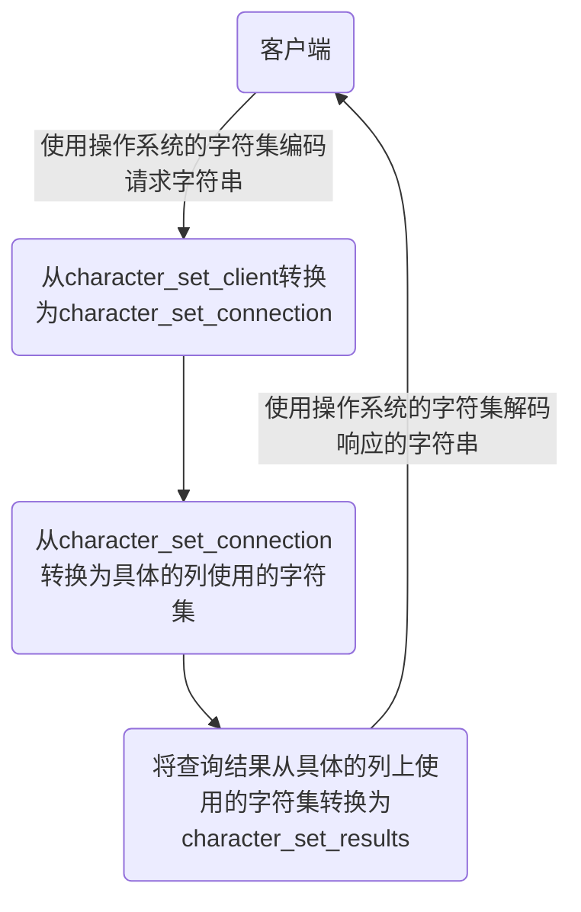

# MySQL

## 1.高级

### 概述

#### 相关概念

- **DB**：数据库（真实的数据）

- **DBMS**：数据库管理系统

- **SQL**：数据库语言

- **RDBMS**：关系型数据库

- **DDL**（Data Definition Languages、数据定义语言），这些语句定义了不同的数据库、表、视图、索引等数据库对象，还可以用来创建、删除、修改数据库和数据表的结构
  - 主要的语句关键字包括 CREATE 、 DROP 、 ALTER 等
- **DML**（Data Manipulation Language、数据操作语言），用于添加、删除、更新和查询数据库记录，并检查数据完整性
  - 主要的语句关键字包括 INSERT 、 DELETE 、 UPDATE 等
- **DQL**（Data Query Language、数据查询语言） -- SELECT 
- **DCL**（Data Control Language、数据控制语言），用于定义数据库、表、字段、用户的访问权限和安全级别
  - 主要的语句关键字包括 GRANT 、 REVOKE 、 COMMIT 、 ROLLBACK 、 SAVEPOINT 等
  -  COMMIT 、 ROLLBACK 称为**TCL** （Transaction Control Language，事务控制语言）

#### 登录与字符集

**导入sql脚本**

```sh
source d:\mysqldb.sql #导入
```

**修改允许远程登陆**

```mysql
use mysql;
select Host,User from user;
update user set host = '%' where user ='root';
flush privileges;
```

> `%`是个 通配符 ，如果Host=192.168.1.%，那么就表示只要是IP地址前缀为“192.168.1.”的客户端都可以连接。如果`Host=%`，表示所有IP都有连接权限。
>
> 注意：在生产环境下不能为了省事将host设置为%，这样做会存在安全问题，具体的设置可以根据生产环境的IP进行设置。

配置新连接报错：错误号码 2058，分析是 mysql 密码加密方法变了

```mysql
ALTER USER 'root'@'%' IDENTIFIED WITH mysql_native_password BY 'abc123';
```

**各级别的字符集**

```mysql
show variables like 'character%';
```

- character_set_server：服务器级别的字符集
- character_set_database：当前数据库的字符集
- character_set_client：服务器解码请求时使用的字符集
- character_set_connection：服务器处理请求时会把请求字符串从character_set_client转为character_set_connection 
- character_set_results：服务器向客户端返回数据时使用的字符集

**小结**

- 如果`创建或修改列`时没有显式的指定字符集和比较规则，则该列`默认用表的`字符集和比较规则
- 如果`创建表时`没有显式的指定字符集和比较规则，则该表`默认用数据库的`字符集和比较规则
- 如果`创建数据库时`没有显式的指定字符集和比较规则，则该数据库`默认用服务器的`字符集和比较规则

**请求到响应过程中字符集的变化**



**目录**

```shell
find / -name mysql
```

- 数据库文件的存放路径

```mysql
show variables like 'datadir'; ## /var/lib/mysql/
```

- 相关命令目录`/usr/bin 和/usr/sbin`
- **配置文件目录**：`/usr/share/mysql-8.0（命令及配置文件），/etc/mysql（如my.cnf）`

#### 表在文件系统中的表示

##### InnoDB存储引擎模式

**1.** **表结构**

为了保存表结构，`InnoDB`在`数据目录`下对应的数据库子目录下创建了一个专门用于`描述表结构的文件`

```
表名.frm
```

**2.** **表中数据和索引**

**① 系统表空间（system tablespace）**

默认情况下，InnoDB会在数据目录下创建一个名为`ibdata1`、大小为`12M`的`自拓展`文件，这个文件就是对应的`系统表空间`在文件系统上的表示

**② 独立表空间(file-per-table tablespace)** 

在MySQL5.6.6以及之后的版本中，InnoDB并不会默认的把各个表的数据存储到系统表空间中，而是为`每一个表建立一个独立表空间`，也就是说我们创建了多少个表，就有多少个独立表空间。使用`独立表空间`来存储表数据的话，会在该表所属数据库对应的子目录下创建一个表示该独立表空间的文件，文件名和表名相同

```
表名.ibd
```

> MySQL8.0中不再单独提供`表名.frm`，而是合并在`表名.ibd`文件中。

**③ 系统表空间与独立表空间的设置**

我们可以自己指定使用`系统表空间`还是`独立表空间`来存储数据，这个功能由启动参数控制

```ini
[server] 
innodb_file_per_table=0 ## 0：代表使用系统表空间； 1：代表使用独立表空间
```

**④ 其他类型的表空间**

随着MySQL的发展，除了上述两种老牌表空间之外，现在还新提出了一些不同类型的表空间，比如通用表空间（general tablespace）、临时表空间（temporary tablespace）等

##### MyISAM存储引擎模式

**1.** **表结构**

在存储表结构方面， MyISAM 和 InnoDB 一样，也是在`数据目录`下对应的数据库子目录下创建了一个专门用于描述表结构的文件

```
表名.frm
```

**2.** **表中数据和索引**

在MyISAM中的索引全部都是`二级索引`，该存储引擎的`数据和索引是分开存放`的。所以在文件系统中也是使用不同的文件来存储数据文件和索引文件，同时表数据都存放在对应的数据库子目录下。

```
test.frm 存储表结构 #MySQL8.0 改为了 b.xxx.sdi
test.MYD 存储数据 (MYData) 
test.MYI 存储索引 (MYIndex
```

### 用户权限管理

#### 用户管理

##### 登录MySQL服务器

启动MySQL服务后，可以通过mysql命令来登录MySQL服务器，命令如下：

```mysql
mysql –h hostname|hostIP –P port –u username –p DatabaseName –e "SQL语句"
```

- `-h参数`后面接主机名或者主机IP，hostname为主机，hostIP为主机IP。 
- `-P参数`后面接MySQL服务的端口，通过该参数连接到指定的端口。MySQL服务的默认端口是3306，不使用该参数时自动连接到3306端口，port为连接的端口号。
- `-u参数`后面接用户名，username为用户名。
- `-p参数`会提示输入密码。
- `DatabaseName参数`指明登录到哪一个数据库中。如果没有该参数，就会直接登录到MySQL数据库中，然后可以使用USE命令来选择数据库。
- `-e参数`后面可以直接加SQL语句。登录MySQL服务器以后即可执行这个SQL语句，然后退出MySQL服务器。

```mysql
mysql -uroot -p -hlocalhost -P3306 mysql -e "select host,user from user"
```

##### 创建用户

```mysql
CREATE USER 用户名 [IDENTIFIED BY '密码'][,用户名 [IDENTIFIED BY '密码']];
```

举例：

```mysql
CREATE USER zhang3 IDENTIFIED BY '123123'; ## 默认host是 %
CREATE USER 'kangshifu'@'localhost' IDENTIFIED BY '123456';
```

##### ****修改用户****

```mysql
UPDATE mysql.user SET USER='li4' WHERE USER='wang5'; 
FLUSH PRIVILEGES;
```

#####  ****删除用户****

- **方式1：使用DROP方式删除（推荐）**

```mysql
DROP USER user[,user]…;
```

举例：

```mysql
DROP USER li4 ; ## 默认删除host为%的用户
DROP USER 'kangshifu'@'localhost';
```

- **方式2：使用DELETE方式删除（不推荐，有残留信息）**

```mysql
DELETE FROM mysql.user WHERE Host=’hostname’ AND User=’username’;
FLUSH PRIVILEGES;
```

#####  设置当前用户密码

**1.** **使用ALTER USER命令来修改当前用户密码**

```mysql
ALTER USER USER() IDENTIFIED BY 'new_password';
```

**2.** **使用SET语句来修改当前用户密码**

```mysql
SET PASSWORD='new_password';
```

#####  修改其它用户密码 

**1.** **使用ALTER语句来修改普通用户的密码**

```mysql
ALTER USER user [IDENTIFIED BY '新密码'] 
[,user[IDENTIFIED BY '新密码']]…;
```

**2.** **使用SET命令来修改普通用户的密码**

```mysql
SET PASSWORD FOR 'username'@'hostname'='new_password';
```

#### 权限管理

#####  权限列表

```mysql
show privileges;
```

- `CREATE和DROP权限`，可以创建新的数据库和表，或删除（移掉）已有的数据库和表。如果将MySQL数据库中的DROP权限授予某用户，用户就可以删除MySQL访问权限保存的数据库。
- `SELECT、INSERT、UPDATE和DELETE权限`允许在一个数据库现有的表上实施操作。
- `SELECT权限`只有在它们真正从一个表中检索行时才被用到。
- `INDEX权限`允许创建或删除索引，INDEX适用于已有的表。如果具有某个表的CREATE权限，就可以在CREATE TABLE语句中包括索引定义。
- `ALTER权限`可以使用ALTER TABLE来更改表的结构和重新命名表。
- `CREATE ROUTINE权限`用来创建保存的程序（函数和程序），`ALTER ROUTINE权限`用来更改和删除保存的程序，`EXECUTE权限`用来执行保存的程序。
- `GRANT权限`允许授权给其他用户，可用于数据库、表和保存的程序。
- `FILE权限`使用户可以使用LOAD DATA INFILE和SELECT ... INTO OUTFILE语句读或写服务器上的文件，任何被授予FILE权限的用户都能读或写MySQL服务器上的任何文件（说明用户可以读任何数据库目录下的文件，因为服务器可以访问这些文件）。

##### 授予权限的原则

权限控制主要是出于安全因素，因此需要遵循以下几个`经验原则`：

1、只授予能`满足需要的最小权限`，防止用户干坏事。比如用户只是需要查询，那就只给select权限就可以了，不要给用户赋予update、insert或者delete权限。

2、创建用户的时候`限制用户的登录主机`，一般是限制成指定IP或者内网IP段。

3、为每个用户`设置满足密码复杂度的密码`。 

4、`定期清理不需要的用户`，回收权限或者删除用户。

#####  授予权限

```mysql
GRANT 权限1,权限2,…权限n ON 数据库名称.表名称 TO 用户名@用户地址 [IDENTIFIED BY ‘密码口令’];
```

- 该权限如果发现没有该用户，则会直接新建一个用户。
- 给li4用户用本地命令行方式，授予atguigudb这个库下的所有表的插删改查的权限。

```mysql
GRANT SELECT,INSERT,DELETE,UPDATE ON atguigudb.* TO li4@localhost;
```

- 授予通过网络方式登录的joe用户 ，对所有库所有表的全部权限，密码设为123。注意这里唯独不包括grant的权限

```mysql
GRANT ALL PRIVILEGES ON *.* TO joe@'%' IDENTIFIED BY '123';
```

#####  查看权限

- 查看当前用户权限

```mysql
SHOW GRANTS; 
## 或 
SHOW GRANTS FOR CURRENT_USER; 
## 或 
SHOW GRANTS FOR CURRENT_USER();
```

- 查看某用户的全局权限

```mysql
SHOW GRANTS FOR 'user'@'主机地址';
```

#####  收回权限

**注意：在将用户账户从user表删除之前，应该收回相应用户的所有权限。**

- 收回权限命令

```mysql
REVOKE 权限1,权限2,…权限n ON 数据库名称.表名称 FROM 用户名@用户地址;
```

- 举例

```mysql
#收回全库全表的所有权限 
REVOKE ALL PRIVILEGES ON *.* FROM joe@'%'; 
#收回mysql库下的所有表的插删改查权限 
REVOKE SELECT,INSERT,UPDATE,DELETE ON mysql.* FROM joe@localhost;
```

- 注意：`须用户重新登录后才能生效` 

####  角色管理

##### 创建角色

```mysql
CREATE ROLE 'role_name'[@'host_name'] [,'role_name'[@'host_name']]...
```

角色名称的命名规则和用户名类似。如果`host_name省略，默认为%`，`role_name不可省略`，不可为空。

##### 给角色赋予权限

```mysql
GRANT privileges ON table_name TO 'role_name'[@'host_name'];
```

上述语句中privileges代表权限的名称，多个权限以逗号隔开。可使用SHOW语句查询权限名称

```mysql
SHOW PRIVILEGES\G
```

##### 查看角色的权限

```mysql
SHOW GRANTS FOR 'role_name';
```

只要你创建了一个角色，系统就会自动给你一个“`USAGE`”权限，意思是`连接登录数据库的权限`。

##### 回收角色的权限

```mysql
REVOKE privileges ON tablename FROM 'rolename';
```

##### 删除角色

```mysql
DROP ROLE role [,role2]...
```

注意，`如果你删除了角色，那么用户也就失去了通过这个角色所获得的所有权限`。

##### 给用户赋予角色

角色创建并授权后，要赋给用户并处于`激活状态`才能发挥作用。

```mysql
GRANT role [,role2,...] TO user [,user2,...];
```

查询当前已激活的角色

```mysql
SELECT CURRENT_ROLE();
```

##### 激活角色

**方式1：使用set default role 命令激活角色**

```mysql
SET DEFAULT ROLE ALL TO 'kangshifu'@'localhost';
```

**方式2：将activate_all_roles_on_login设置为ON**

```mysql
SET GLOBAL activate_all_roles_on_login=ON;
```

这条 SQL 语句的意思是，对`所有角色永久激活`。

##### 撤销用户的角色

```mysql
REVOKE role FROM user;
```

##### 设置强制角色(mandatory role)

方式1：服务启动前设置

```ini
[mysqld] 
mandatory_roles='role1,role2@localhost,r3@%.atguigu.com'
```

方式2：运行时设置

```mysql
SET PERSIST mandatory_roles = 'role1,role2@localhost,r3@%.example.com'; #系统重启后仍然有效
SET GLOBAL mandatory_roles = 'role1,role2@localhost,r3@%.example.com'; #系统重启后失效
```

### 逻辑架构

MySQL是典型的C/S架构，即`Clinet/Server 架构`

不论客户端进程和服务器进程是采用哪种方式进行通信，最后实现的效果是：**客户端进程向服务器进程发送一段文本（SQL语句），服务器进程处理后再向客户端进程发送一段文本（处理结果）**


#### 逻辑架构剖析

Connectors, `客户端连接器` 指的是不同语言中与SQL的交互。MySQL首先是一个网络程序，在TCP之上定义了自己的应用层协议。所以要使用MySQL，我们可以编写代码，跟MySQL Server `建立TCP连接`，之后按照其定义好的协议进行交互。或者比较方便的方法是调用SDK，比如Native C API、JDBC、PHP等各语言MySQL Connecotr,或者通过ODBC。但**通过SDK来访问MySQL，本质上还是在TCP连接上通过MySQL协议跟MySQL进行交互**

**接下来的MySQL Server结构可以分为如下三层：**

1. 连接层：客户端和服务器端建立连接，客户端发送 SQL 至服务器端

2. SQL 层（服务层）：对 SQL 语句进行查询处理；与数据库文件的存储方式无关

3. 存储引擎层：与数据库文件打交道，负责数据的存储和读取


##### 第1层：连接层

系统（客户端）访问`MySQL`服务器前，做的第一件事就是建立`TCP`连接。

经过三次握手建立连接成功后，`MySQL`服务器对`TCP`传输过来的账号密码做身份认证、权限获取。

- 用户名或密码不对，会收到一个Access denied for user错误，客户端程序结束执行
- 用户名密码认证通过，会从权限表查出账号拥有的权限与连接关联，之后的权限判断逻辑，都将依赖于此时读到的权限

`TCP`连接收到请求后，必须要分配给一个线程专门与这个客户端的交互。所以还会有个线程池，去走后面的流程。每一个连接从线程池中获取线程，省去了创建和销毁线程的开销

**连接管理**的职责是**负责认证、管理连接、获取权限信息**

##### 第2层：服务层

- **SQL Interface: SQL接口**

  - 接收用户的SQL命令，并且返回用户需要查询的结果。比如SELECT ... FROM就是调用SQL Interface 
  - MySQL支持DML（数据操作语言）、DDL（数据定义语言）、存储过程、视图、触发器、自定义函数等多种SQL语言接口

- **Parser:** **解析器**

  - 在解析器中对 SQL 语句进行语法分析、语义分析。将SQL语句分解成数据结构，并将这个结构传递到后续步骤，以后SQL语句的传递和处理就是基于这个结构的。如果在分解构成中遇到错误，那么就说明这个SQL语句是不合理的。
  - 在SQL命令传递到解析器的时候会被解析器验证和解析，并为其创建`语法树`，并根据数据字典丰富查询语法树，会`验证该客户端是否具有执行该查询的权限`。创建好语法树后，MySQL还会对SQL查询进行语法上的优化，进行查询重写。

- **Optimizer:** **查询优化器**

  - SQL语句在语法解析之后、查询之前会使用查询优化器确定 SQL 语句的执行路径，生成一个`执行计划`。
  - 这个执行计划表明应该`使用哪些索引`进行查询（全表检索还是使用索引检索），表之间的连接顺序如何，最后会按照执行计划中的步骤调用存储引擎提供的方法来真正的执行查询，并将查询结果返回给用户。
  - 它使用“`选取-投影-连接`”策略进行查询。例如：

  ```mysql
  SELECT id,name FROM student WHERE gender = '女';
  ```

  这个SELECT查询先根据WHERE语句进行`选取`，而不是将表全部查询出来以后再进行gender过滤。 这个SELECT查询先根据id和name进行属性`投影`，而不是将属性全部取出以后再进行过滤，将这两个查询条件`连接`起来生成最终查询结果。

- **Caches & Buffers： 查询缓存组件**

  - MySQL内部维持着一些Cache和Buffer，比如Query Cache用来缓存一条SELECT语句的执行结果，如果能够在其中找到对应的查询结果，那么就不必再进行查询解析、优化和执行的整个过程了，直接将结果反馈给客户端。

  - 这个缓存机制是由一系列小缓存组成的。比如表缓存，记录缓存，key缓存，权限缓存等 。

  - 这个查询缓存可以在`不同客户端之间共享`。 

  - 从MySQL 5.7.20开始，不推荐使用查询缓存，并在`MySQL 8.0中删除`


##### 第3层：引擎层

插件式存储引擎层（ Storage Engines），**真正的负责了MySQL中数据的存储和提取，对物理服务器级别维护的底层数据执行操作**，服务层通过API与存储引擎进行通信

####  SQL执行流程

SQL 语句在 MySQL 中的流程是： SQL语句→查询缓存→解析器→优化器→执行器 。


**MySQL的查询流程：**

**1.** **查询缓存**：Server 如果在查询缓存中发现了这条 SQL 语句，就会直接将结果返回给客户端；如果没有，就进入到解析器阶段。需要说明的是，因为查询缓存往往效率不高，所以在 **MySQL8.0 之后就抛弃了**这个功能。

> 查询缓存是提前把查询结果缓存起来，这样下次不需要执行就可以直接拿到结果。需要说明的是，在MySQL 中的查询缓存，不是缓存查询计划，而是查询对应的结果。这就意味着查询匹配的`鲁棒性大大降低`（鲁棒是Robust的音译，也就是健壮和强壮的意思），只有`相同的查询操作才会命中查询缓存`，它将以SEL开头的查询与哈希表进行比较，如果匹配，则返回上一次查询的结果
>
> 进行匹配时，查询**必须逐字节匹配**，两个查询请求在任何字符上的不同（例如：空格、注释、大小写），都会导致缓存不会命中，因此，MySQL 的 查询缓存命中率不高
>
> - 任何对表的修改都会导致这些表的所有缓存无效
>
> - 查询缓存的另一个大问题是它受到单个互斥锁的保护。在具有多个内核的服务器上，大量查询会导致大量的互斥锁争用
>
> 因此，适用查询缓存的最理想方案是只读，且是检查数百万行后仅返回数行的复杂查询

同时，如果查询请求中包含某些系统函数、用户自定义变量和函数、一些系统表，如 mysql、 information_schema、 performance_schema 数据库中的表，那这个请求就不会被缓存。

**2.** **解析器**（分析器）：在解析器中对 SQL 语句进行语法分析、语义分析


分析器先做“`词法分析`”。你输入的是由多个字符串和空格组成的一条 SQL 语句，MySQL 需要识别出里面的字符串分别是什么，代表什么。 MySQL 从你输入的"select"这个关键字识别出来，这是一个查询语句。它也要把字符串“T”识别成“表名 T”，把字符串“ID”识别成“列 ID”

接着，要做“`语法分析`”。根据词法分析的结果，语法分析器（比如：Bison）会根据语法规则，判断你输入的这个 SQL 语句是否`满足 MySQL 语法`。如果SQL语句正确，则会生成一个语法树


**3.** **优化器**：在优化器中会确定 SQL 语句的执行路径，可以分为`逻辑查询`优化阶段和`物理查询`优化阶段

> 比如，有多个索引的时候，决定使用哪个索引；或者在一个语句有多表关联 (join) 的时候，决定各个表的连接顺序，还有表达式简化、子查询转为连接、外连接转为内连接等

- **逻辑查询优化**就是通过改变SQL语句的内容来使得SQL查询更高效，同时为物理查询优化提供更多的候选执行计划。通常采用的方式是对SQL语句进行`等价变换`，对查询进行`重写`，而查询重写的数学基础就是关系代数。对条件表达式进行等价谓词重写、条件简化，对视图进行重写，对子查询进行优化，对连接语义进行了外连接消除、嵌套连接消除等
- **物理查询优化**是基于关系代数进行的查询重写，而关系代数的每一步都对应着物理计算，这些物理计算往往存在多种算法，因此需要计算各种物理路径的代价，从中选择代价最小的作为执行计划。在这个阶段里，对于单表和多表连接的操作，需要高效地`使用索引`，提升查询效率

**4.** **执行器**：在执行之前需要判断该用户是否`具备权限`。如果没有，就会返回权限错误。如果具备权限，就执行 SQL查询并返回结果。在 MySQL8.0 以下的版本，如果设置了查询缓存，这时会将查询结果进行缓存

#### SQL执行原理

了解查询语句底层执行的过程：`select @profiling` 或者 `show variables like '%profiling'` 查看是否开启计划。开启它可以让MySQL收集在SQL

执行时所使用的资源情况，命令如下：

```mysql
select @@profiling;
show variables like 'profiling';
```

profiling=0 代表关闭，我们需要把 profiling 打开，即设置为 1：

```mysql
set profiling=1;
```

```sql
show profiles; ## 显示最近的几次查询
show profile;	-- 显示执行计划，查看程序的执行步骤
show profile for query 7; -- 查询指定的 Query ID
show profile cpu,block io for query 6; -- 查看cpu、io阻塞等参数情况

-- 除了查看cpu、io阻塞等参数情况，还可以查询下列参数的利用情况
Syntax:
SHOW PROFILE [type [, type] ... ]
	[FOR QUERY n]
	[LIMIT row_count [OFFSET offset]]

type: {
	| ALL -- 显示所有参数的开销信息
	| BLOCK IO -- 显示IO的相关开销
	| CONTEXT SWITCHES -- 上下文切换相关开销
	| CPU -- 显示CPU相关开销信息
	| IPC -- 显示发送和接收相关开销信息
	| MEMORY -- 显示内存相关开销信息
	| PAGE FAULTS -- 显示页面错误相关开销信息
	| SOURCE -- 显示和Source_function,Source_file,Source_line 相关的开销信息
	| SWAPS -- 显示交换次数相关的开销信息
}
```

MySQL5.7中配置文件中开启查询缓存

在 /etc/my.cnf 中新增一行：

```mysql
query_cache_type=1
```

重启mysql服务

```sh
systemctl restart mysqld
```

#### SQL语法顺序

随着Mysql版本的更新换代，其优化器也在不断的升级，优化器会分析不同执行顺序产生的性能消耗不同 而动态调整执行顺序

#### 数据库缓冲池

buffer pool

`InnoDB`存储引擎是以页为单位来管理存储空间的，我们进行的增删改查操作其实本质上都是在访问页面（包括读页面、写页面、创建新页面等操作）。而磁盘 I/O 需要消耗的时间很多，而在内存中进行操作，效率则会高很多，为了能让数据表或者索引中的数据随时被我们所用，DBMS 会申请`占用内存来作为数据缓冲池`，在真正访问页面之前，需要把在磁盘上的页缓存到内存中的`Buffer Pool`之后才可以访问

这样做的好处是可以让磁盘活动最小化，从而`减少与磁盘直接进行 I/O 的时间`。要知道，这种策略对提升 SQL 语句的查询性能来说至关重要。如果索引的数据在缓冲池里，那么访问的成本就会降低很多

[(14条消息) InnoDB缓存模型_躺在家里不干活的博客-CSDN博客](https://blog.csdn.net/weixin_29491885/article/details/104860171)

[深入理解InnoDB -- 架构篇 - 知乎 (zhihu.com)](https://zhuanlan.zhihu.com/p/158978012)

[(14条消息) 一篇文章彻底搞懂MySql之Innodb引擎BufferPool缓存机制（SQL执行的全流程）_大尾巴狼学编程的博客-CSDN博客](https://blog.csdn.net/qq_33522097/article/details/127607385)

[(14条消息) InnoDB Buffer Pool 缓冲池详解_涛声依旧叭的博客-CSDN博客](https://blog.csdn.net/rongtaoup/article/details/127558098)

InnoDB 存储引擎中有一部分数据在内存中，缓冲池占这部分内存的大部分，用来存储各种数据的缓存


**组成**：InnoDB 缓冲池包括了**数据页**、**索引页**、**插入缓冲**、**锁信息**、**自适应 Hash** 和**数据字典信息**等

**缓存原则**

“`位置 * 频次`”这个原则，可以帮我们对 I/O 访问效率进行优化

- 首先，位置决定效率，提供缓冲池就是为了在内存中可以直接访问数据

- 其次，频次决定优先级顺序。因为缓冲池的大小是有限的，比如磁盘有 200G，但是内存只有 16G，缓冲池大小只有 1G，就无法将所有数据都加载到缓冲池里，这时就涉及到优先级顺序，会`优先对使用频次高的热数据进行加载`

**缓冲池的预读特性**

缓冲池的作用就是提升 I/O 效率，而我们进行读取数据的时候存在一个“局部性原理”，也就是说我们使用了一些数据，**大概率还会使用它周围的一些数据**，因此采用“预读”的机制提前加载，可以减少未来可能的磁盘 I/O 操作

**读取流程**

缓冲池管理器会尽量将经常使用的数据保存起来，在数据库进行页面读操作的时候，首先会判断该页面是否在缓冲池中，如果存在就直接读取，如果不存在，就会通过内存或磁盘将页面存放到缓冲池中再进行读取


**更新流程**

对数据库中的记录进行修改的时候，首先会修改缓冲池中页里面的记录信息，然后数据库会`以一定的频率刷新`到磁盘中。注意并不是每次发生更新操作，都会立即进行磁盘回写。缓冲池会采用一种叫做 `checkpoint 的机制` 将数据回写到磁盘上，这样做的好处就是提升了数据库的整体性能

比如，当`缓冲池不够用`时，需要释放掉一些不常用的页，此时就可以强行采用checkpoint的方式，将不常用的脏页回写到磁盘上，然后再从缓存池中将这些页释放掉。这里的脏页 (dirty page) 指的是缓冲池中被修改过的页，与磁盘上的数据页不一致


> 我更新到一半突然发生错误了，想要回滚到更新之前的版本，该怎么办？连数据持久化的保证、事务回滚都做不到还谈什么崩溃恢复？
>
> 答案：**Redo Log** & **Undo Log**

**查看缓冲池的大小**

如果是 MySQL MyISAM 存储引擎，只缓存索引，不缓存数据，对应的键缓存参数`key_buffer_size`

如果你使用的是 InnoDB 存储引擎，可以通过查看 `innodb_buffer_pool_size` 变量来查看缓冲池的大小

```mysql
show variables like 'innodb_buffer_pool_size';
```

**设置缓冲池的大小**

```mysql
set global innodb_buffer_pool_size = 268435456;
```

或者

```ini
[server] 
innodb_buffer_pool_size = 268435456
```

**多个Buffer Pool实例**

```ini
[server] 
innodb_buffer_pool_instances = 2
```

**查看缓冲池的个数**

```mysql
show variables like 'innodb_buffer_pool_instances';
```

每个`Buffer Pool`实例，实际占内存空间，其实使用这个公式算出来的，也就是总共的大小除以实例个数

```
innodb_buffer_pool_size / innodb_buffer_pool_instances
```

不是说 Buffer Pool 实例创建的越多越好，分别管理各个 Buffer Pool 也是需要性能开销的，

InnDB规定：

- 当innodb_buffer_pool_size的值小于1G的时候设置多个实例是无效的，InnoDB会默认把innodb_buffer_pool_instances的值修改为1
- 鼓励在 Buffer Pool 大于等于 1G 的时候设置多个 Buffer Pool 实例

### 存储引擎

#### 查、改 命令

**查看存储引擎**

```mysql
show engines;
## 或
show engines\G
```

**查看默认的存储引擎**

```mysql
show variables like '%storage_engine%'; 
#或
SELECT @@default_storage_engine;
```

**修改默认的存储引擎**

如果在创建表的语句中没有显式指定表的存储引擎的话，那就会默认使用`InnoDB`作为表的存储引擎。

```mysql
SET DEFAULT_STORAGE_ENGINE=MyISAM;
```

或者修改`my.cnf`文件：

```ini
default-storage-engine=MyISAM 
```

```shell
## 重启服务 
systemctl restart mysqld.service
```

**创建表时指定存储引擎**

> 存储引擎是负责对表中的数据进行提取和写入工作的，我们可以为`不同的表设置不同的存储引擎`，也就是说不同的表可以有不同的物理存储结构，不同的提取和写入方式

```mysql
CREATE TABLE 表名(
    建表语句; 
) ENGINE = 存储引擎名称;
```

 **修改表的存储引擎**

```mysql
ALTER TABLE 表名 ENGINE = 存储引擎名称;
```

#### 引擎介绍

 **InnoDB  引擎：具备外键支持功能的事务存储引擎**

- MySQL从3.23.34a开始就包含InnoDB存储引擎。`大于等于5.5之后，默认采用InnoDB引擎`
- InnoDB是MySQL的`默认事务型引擎`，它被设计用来处理大量的短期(short-lived)事务。可以确保事务的完整提交(Commit)和回滚(Rollback)
- 除了增加和查询外，还需要更新、删除操作，那么，应优先选择InnoDB存储引擎，**除非有非常特别的原因需要使用其他的存储引擎，否则应该优先考虑InnoDB引擎**
- 数据文件结构：
  - 表名.frm 存储表结构（MySQL8.0时，合并在表名.ibd中）
  - 表名.ibd 存储数据和索引
- InnoDB是`为处理巨大数据量的最大性能设计`
  - 在以前的版本中，字典数据以元数据文件、非事务表等来存储。现在这些元数据文件被删除了。比如：`.frm`，`.par`，`.trn`，`.isl`，`.db.opt`等都在MySQL8.0中不存在了
- 对比MyISAM的存储引擎，`InnoDB写的处理效率差一些`，并且会占用更多的磁盘空间保存数据和索引
- MyISAM只缓存索引，不缓存真实数据；InnoDB不仅缓存索引还要缓存真实数据，`对内存要求较高`，而且内存大小对性能有决定性的影响

 **MyISAM** **引擎：主要的非事务处理存储引擎**

- MyISAM提供了大量的特性，包括全文索引、压缩、空间函数(GIS)等，但MyISAM`不支持事务、行级锁、外键`，有一个毫无疑问的缺陷就是`崩溃后无法安全恢复`
- `5.5之前默认的存储引擎`
- 优势是**访问的`速度快`**，对事务完整性没有要求或者以SELECT、INSERT为主的应用
- 针对数据统计有额外的常数存储。故而 count(*) 的查询效率很高
- 数据文件结构：
  - 表名.frm 存储表结构
  - 表名.MYD 存储数据 (MYData)
  - 表名.MYI 存储索引 (MYIndex)
- 应用场景：只读应用或者以读为主的业务

**Archive** **引擎：用于数据存档**

**Blackhole** **引擎：丢弃写操作，读操作会返回空内容**

**CSV** **引擎：存储数据时，以逗号分隔各个数据项**

创建CSV表还会创建相应的元文件 ，用于 存储表的状态 和 表中存在的行数 。此文件的名称与表的名称相 同，后缀为 CSM

```
 CREATE TABLE test (i INT NOT NULL, c CHAR(10) NOT NULL) ENGINE = CSV;
 INSERT INTO test VALUES(1,'record one'),(2,'record two');
```

- 其内容使用记事本打开

- 可以被 Microsoft Excel 等电子表格应用程序读取，甚至写入

**Memory** **引擎：置于内存的表**

Memory采用的逻辑介质是内存 ，响应速度很快 ，但是当mysqld守护进程崩溃的时候数据会丢失 。另外，要求存储的数据是数据长度不变的格式，比如，Blob和Text类型的数据不可用(长度不固定的)

- Memory同时 支持哈希（HASH）索引 和 B+树索引 

- Memory表至少比MyISAM表要快一个数量级

- MEMORY 表的大小是受到限制 的。表的大小主要取决于两个参数，分别是 max_rows 和 max_heap_table_size 。其中，max_rows可以在创建表时指定；max_heap_table_size的大小默 认为16MB，可以按需要进行扩大

- 数据文件与索引文件分开存储

- 缺点：其数据易丢失，生命周期短。基于这个缺陷，选择MEMORY存储引擎时需要特别小心

- **使用Memory存储引擎的场景：**

  1. 目标数据比较小 ，而且非常频繁的进行访问 ，在内存中存放数据，如果太大的数据会造成内存溢出 

     > 可以通过参数 max_heap_table_size 控制Memory表的大小，限制Memory表的最大的大小

  2. 如果数据是临时的 ，而且必须立即可用得到，那么就可以放在内存中

  3. 存储在Memory表中的数据如果突然间丢失的话也没有太大的关系 

**Federated** **引擎：访问远程表** 

**Merge引擎：管理多个MyISAM表构成的表集合**

**NDB引擎：MySQL集群专用存储引擎 **

<hr>
**对比**


**存储引擎选择**

> 在选择存储引擎时，应该根据应用系统的特点选择合适的存储引擎。对于复杂的应用系统，还可以根据实际情况选择多种存储引擎进行组合。

**InnoDB:** 是Mysq|的默认存储引擎，**支持事务、外键**。如果应用对事务的完整性有比较高的要求，在并发条件下要求数据的一致性，数据操作除了插入和查询之外，还包含很多的更新、删除操作，那么InnoDB存储引擎是比较合适的选择

**MyISAM:** 如果应用是以读操作和插入操作为主，只有很少的更新和删除操作，并且对事务的完整性、并发性要求不是很高，那么选择这个存储引擎是非常合适的（日志，评论）(**被MongoDB取代**)

**MEMORY:** 将所有数据保存在内存中，**访问速度快，通常用于临时表及缓存**。MEMORY的缺陷就是对表的大小有限制，太大的表无法缓存在内存中，而且无法保障数据的安全性（**被Redis取代**）

### 索引

- MySQL官方对索引的定义为：索引（Index）是帮助MySQL高效获取数据的数据结构

- **索引的本质**：**索引是数据结构**。可以简单理解为“排好序的快速查找数据结构”，满足特定查找算法。 这些数据结构以某种方式指向数据， 这样就可以在这些数据结构的基础上实现 `高级查找算法`

- `索引是在存储引擎中实现的`，因此每种存储引擎的索引不一定完全相同，并且每种存储引擎不一定支持所有索引类型。同时，存储引擎可以定义每个表的 `最大索引数`和 `最大索引长度`。所有存储引擎支持每个表至少16个索引，总索引长度至少为256字节。有些存储引擎支持更多的索引数和更大的索引长度

- 优点

  - 降低 **数据库的IO成本**
  - **唯一索引**，可以保证数据库表中每一行 **数据的唯一性** 
  - **加速表和表之间的连接** 。即，对于有依赖关系的子表和父表联合查询时， 可以提高查询速度
  - 分组和排序查询时，可以显著 **减少查询中分组和排序的时间** ，降低了CPU的消耗

- 索引的代价

  索引是个好东西，可不能乱建，它在空间和时间上都会有消耗：

  * 空间上的代价

    每建立一个索引都要为它建立一棵B+树，每一棵B+树的每一个节点都是一个数据页，一个页默认会 占用 16KB 的存储空间，一棵很大的B+树由许多数据页组成，那就是很大的一片存储空间。

  * 时间上的代价

    每次对表中的数据进行 增、删、改 操作时，都需要去修改各个B+树索引。B+树每层节点都是按照索引列的值 从小到大的顺序排序 而组成了 双向链表 。不论是叶子节点中的记录，还 是内节点中的记录（也就是不论是用户记录还是目录项记录）都是按照索引列的值从小到大的顺序而形成了一个单向链表。而增、删、改操作可能会对节点和记录的排序造成破坏，所以存储引擎需 要额外的时间进行一些记录移位 ，页面分裂 、 页面回收等操作来维护好节点和记录的排序。如果我们建了许多索引，每个索引对应的B+树都要进行相关的维护操作，会给性能拖后腿

  > - 创建索引和维护索引要 **耗费时间** ，并 且随着数据量的增加，所耗费的时间也会增加
  > - 索引需要占 **磁盘空间** ，除了数据表占数据空间之 外，每一个索引还要占一定的物理空间， 存储在磁盘上 ，如果有大量的索引，索引文件就可能比数据文件更快达到最大文件尺寸
  > - 虽然索引大大提高了查询速度，同时却会 **降低更新表的速度** 。当对表 中的数据进行增加、删除和修改的时候，索引也要动态地维护，这样就降低了数据的维护速度

- 特点：提高查询的速度，**降低更新速度，最好是先删除索引，然后插入数据，完成后再创建索引**

- why索引

  - 若`数据分布在硬盘不同的位置上面`，读取时，摆臂需要前后摆动查询数据，非常消耗时间

  - 若`数据顺序摆放`，需要从1到6行按顺序读取，这样就相当于进行了6次IO操作，`依旧非常耗时`

- 分类

  - 从 **功能逻辑** 上说，索引主要有 4 种，分别是**普通索引**、**唯一索引**、**主键索引**、**全文索引**

  - 按照 **物理实现**方式 ，索引可以分为 2 种：**聚簇索引**和**非聚簇索引**

    > 聚簇（**聚集**）和非聚簇（**非聚集**）索引
    >
    > 我们也把非聚集 索引称为**二级索引**或者**辅助索引**
    >
    > 术语"聚簇"表示当前数据行和相邻的键值聚簇的存储在一起

  - 按照 **作用字段**个数 进行划分，分成**单列索引**和**联合索引**

    > **联合索引** --- 同时以多个列的大小作为排序规则

#### 聚集索引与二级索引

##### 聚集索引

- 使用**主键**进行记录和页的排序

  > 聚簇索引对于主键的 `排序查找` 和 `范围查找` 速度非常快 

  - 行按主键 -- 单向链表
  - 用户记录页按主键 -- 双向链表
  - 同层目录记录页按主键 -- 双向链表

- **保存了完整的行数据**（包括隐藏列）

- 聚集索引**必须有,而且只有一个**

- **缺点：**

  * `插入速度严重依赖于插入顺序` ，按照主键的顺序插入是最快的方式，否则将会出现页分裂，严重影响性能

    > 因此，对于InnoDB表，我们一般都会定义一个`自增的ID列为主键`

  * `更新主键的代价很高` ，因为将会导致被更新的行移动

    > 因此，对于InnoDB表，我们一般定义**主键为不可更新**

- **聚集索引选取规则:**InnoDB会自动创建

  1. 如果存在主键，主键索引就是聚集索引
  2. 如果不存在主键，将使用第一个唯一(UNIQUE)索引作为聚集索引
  3. 如果表没有主键，或没有合适的唯一索引， 则InnoDB会自动生成一个rowid作为隐藏的聚集索引

<hr>
##### 二级索引

- 使用**列值**进行记录和页的排序

- 只保存`列值+主键`

  > 减少冗余，不会每棵树都拷贝完整行数据，节省存储空间

- 目录项记录页中不再是`主键+页号`的搭配，而变成了`列值+页号`的搭配

- **回表查询**：通过列值在索引查出主键，在根据聚集索引查完整行数据

  > 一条完整的用户记录需要使用到 `2` 棵B+树！

- 非聚簇索引的存在不影响数据在聚簇索引中的组织，所以一张表**可以有多个非聚簇索引**

- 插入，删除，更新等操作，效率会比聚簇索引高

#### 其他索引

##### 普通、唯一、主键、全文


**普通索引**

> 在创建普通索引时，**不附加任何限制条件**，只是用于提高查询效率。这类索引可以创建在`任何数据类型`中，其值是否唯一和非空，要由字段本身的完整性约束条件决定。建立索引以后，可以通过索引进行查询。例如，在表student的字段name 上建立一个普通索引，查询记录时就可以根据该索引进行查询

**唯一索引**

> 使用**唯一约束**`UNIQUE KEY`可以设置索引为唯一性索引，在创建唯一性索引时，限制该索引的值必须是唯一的，但**允许有空值**。在一张数据表里`可以有多个`唯一索引

**主键索引**

> 主键索引就是一种特殊的唯一性索引，在唯一索引的基础上增加了不为空的约束，也就是`NOTNULL+UNIQUE`,`一张表里最多只有一个主键索引`
>
> why?这是由主键索引的物理实现方式决定的，因为数据存储在文件中只能按照一种顺序进行存储

**全文索引**

> 全文索引(也称全文检索)是目前搜索引擎使用的一种关键技术。它能够利用【分词技术】等多种算法智能分析出文本文字中关键词的频率和重要性，然后按照一定的算法规则智能地筛选出我们想要的搜索结果。全文索引非常适合大型数据集，对于小的数据集，它的用处比较小。
>
> 使用参数`FULLTEXT`可以设置索引为全文索引。在定义索引的列上支持值的全文查找，允许在这些索引列中插入重复值和空值。全文索引只能创建在CHAR、VARCHAR或TEXT类型及其系列类型的字段上，查询数据量较大的字符串类型的字段时，使用全文索引可以提高查询速度。例如，表student的字段information是TEXT类型，该字段包含了很多文字信息。在字段information上建立全文索引后，可以提高查询字段information的速度。
>
> 全文索引典型的有两种类型:自然语言的全文索引和布尔全文索引
>
> - 自然语言搜索引擎将计算每一个文档对象和查询的相关度。这里，相关度是基于匹配的关键词的个数，以及关键词在文档中出现的次数。在整个索引中出现次数越少的词语，匹配时的相关度就越高。相反，非常**常见的单词将不会被搜索**，如果一个词语的在超过50%的记录中都出现了，那么自然语言的搜索将不会搜索这类词语
> - MySQL数据库从3.23.23版开始支持全文索引，但MySQL5.6.4以前只有Myisam支持，5.6.4版本以后innodb才支持，但是官方版本不支持中文分词，需要第三方分词插件。在5.7.6版本，MySQ L内置了ngram全文解析器，用来支持亚洲语种的分词。测试或使用全文索引时，要先看一下自己的MySQL版本、存储引擎和数据类型是否支持全文索引
> - 随着大数据时代的到来，关系型数据库应对全文索引的需求已力不从心，逐渐被solr、**ElasticSearch**等专门的搜索引擎所**替代**

##### 单列、联合

**单列索引**

> 在表中的单个字段上创建索引。单列索引只根据该字段进行索引。单列索引可以是普通索引，也可以是唯一性索引，还可以是全文索引。只要保证该索引只对应一个字段即可。`一个表可以有多个单列索引`

**多列(组合、联合)索引**

> 多列索引是在表的多个字段组合上创建一个索引。该索引指向创建时对应的多个字段，可以通过这几个字段进行查询，但是只有查询条件中使用了这些字段中的第一个字段时才会被使用。例如，在表中的字段id、name和gender上建立一个多列索引idx_id_name_gender，只有在查询条件中使用了字段id时该索引才会被使用。使用组合索引时遵循最左前缀集合

##### 空间索引

> 使用参数SPATIAL可以设置索引为空间索引。空间索引只能建立在空间数据类型上，这样可以提高系统获取空间数据的效率。MySQL中的空间数据类型包括GEOMNETRY、POINT、LINESTRING和POLYGN等。目前只有MylSAM存储引擎支持空间检索，而且索引的字段不能为空值。对于初学者来说，这类索引很少会用到

#### InnoDB数据存储结构


##### 页

- 磁盘与内存交互（I/O操作）基本单位：页

- 不同的数据库管理系统（简称DBMS）的页大小不同。比如在 MySQL 的 InnoDB 存储引擎中，默认页的大小是 `16KB`，我们可以通过下面的命令来进行查看：

  ```mysql
  show variables like '%innodb_page_size%'
  ```

  SQL Server 中页的大小为 `8KB`，而在 Oracle 中我们用术语 "`块`" （Block）来表示 "页"，Oracle 支持的快大小为2KB, 4KB, 8KB, 16KB, 32KB 和 64KB。

- 无论读一行还是多行，都是对行所在的页进行加载

- 物理不相连，通过双向链表关联

##### 页的上层结构

**区**

- 大小：InnoDB中是连续的64个页，1MB

**段**

- 区不必连续

- 分配单位，不同类型的数据库对象，以不同的段存在，创建数据表、索引时，会创建相应的段

  > 如，创建表时，会创建一个表段，创建索引时，会创建一个索引段

**表空间**

- 逻辑容器
- 一个段只能属于一个表空间
- 从管理上分类：系统表空间、用户表空间、撤销表空间、临时表空间

##### 页的内部结构

[mysql高级篇-----第七章 InnoDB数据存储引擎 (052it.cn)](http://www.052it.cn/articles/127)

> 数据页的 `16KB` 大小的存储空间被划分为七个部分，分别是文件头（File Header）、页头（Page Header）、最大最小记录（Infimum + supremum）、用户记录（User Records）、空闲空间（Free Space）、页目录（Page Directory）和文件尾（File Tailer）


**第一部分：File Header (文件头部) 和 File Trailer (文件尾部)**

- File Header（文件头部）（38字节）	

  > **FIL_PAGE_OFFSET**（4字节）
  >
  > 每一个页都有一个单独的页号，InnoDB通过页号可以唯一定位一个页
  >
  > **FIL_PAGE_TYPE**（2字节）：当前页的类型
  >
  > **FIL_PAGE_PREV**（4字节）和**FIL_PAGE_NEXT**（4字节）
  >
  > 分别代表本页的上一个和下一个页的页号，双向链表，保证逻辑上的连续 
  >
  > **FIL_PAGE_SPACE_OR_CHKSUM**（4字节）
  >
  > 代表当前页面的校验和（checksum）
  >
  > 什么是校验和？就是对于一个很长的字节串来说，我们会通过某种算法来计算一个比较短的值来代表这个很长的字节串，这个比较短的值就称为校验和
  >
  > 在比较两个很长的字节串之前，先比较这两个长字节串的校验和，如果校验和都不一样，则两个长字节串肯定是不同的，所以省去了直接比较两个比较长的字节串的时间损耗
  >
  > *文件头部和文件尾部都有这个属性*：FIL_PAGE_SPACE_OR_CHKSUM 作用：InnoDB存储引擎以页为单位把数据加载到内存中处理，如果该页中的数据在内存中被修改了，那么在修改后的某个时间需要把数据同步到磁盘中。但是在同步了一半的时候*断电*了，造成了该页传输的不完整。为了检测一个页是否完整（也就是在同步的时候有没有发生只同步一半的尴尬情况），这时可以通过文件尾的校验和（checksum 值）与文件头的校验和做比对，如果两个值不相等则证明页的传输有问题，需要重新进行传输，否则认为页的传输已经完成。具体的：每当一个页面在内存中修改了，在同步之前就要把它的校验和算出来，因为File Header在页面的前边，所以校验和会被首先同步到磁盘，当完全写完时，校验和也会被写到页的尾部，如果完全同步成功，则页的首部和尾部的校验和应该是一致的。如果写了一半儿断电了，那么在File Header中的校验和就代表着已经修改过的页，而在File Trailer中的校验和代表着原先的页，二者不同则意味着同步中间出了错。这里，校验方式就是采用 *Hash* 算法进行校验
  >
  > **FIL_PAGE_LSN**（8字节）
  >
  > 页面被最后修改时对应的日志序列位置（英文名是：Log Sequence Number）

- File Trailer（文件尾部）（8字节）

  > **FIL_PAGE_SPACE_OR_CHKSUM**（4字节）：这个部分是和File Header中的校验和相对应的
  >
  > **FIL_PAGE_LSN**：这个部分也是为了校验页的完整性的，如果首部和尾部的LSN值校验不成功的话，就说明同步过程出现了问题

**第二部分：User Records (用户记录)、最大最小记录、Free Space (空闲空间)**

- Free Space (空闲空间)

  > 我们自己存储的记录会按照指定的行格式存储到User Records部分。但是在一开始生成页的时候，其实并没有User Records这个部分，每当我们插入一条记录，都会从Free Space部分，也就是尚未使用的存储空间中申请一个记录大小的空间划分到User Records部分，当Free Space部分的空间全部被User Records部分替代掉之后，也就意味着这个页使用完了，如果还有新的记录插入的话，就需要去申请新的页了。

- User Records (用户记录)

  > User Records中的这些记录按照指定的行格式一条一条摆在User Records部分，相互之间形成单链表。 用户记录里的一条条数据如何记录？这里需要讲讲记录行格式的记录头信息

- Infimum + Supremum（最小最大记录）

  > 记录可以比较大小吗？是的，记录可以比大小，对于一条完整的记录来说，比较记录的大小就是比较主键的大小。比方说我们插入的4行记录的主键值分别是：1、2、3、4，这也就意味着这4条记录是从小到大依次递增。 InnoDB规定的最小记录与最大记录这两条记录的构造十分简单，都是由5字节大小的记录头信息和8字节大小的一个固定的部分组成的，如图所示： 这两条记录不是我们自己定义的记录，所以它们并不存放在页的User Records部分，他们被单独放在一个称为Infimum + Supremum的部分，如图所示：  

**第三部分：Page Directory (页目录) 和 Page Header (页面头部)**

- Page Directory（页目录）

  > **页目录分组的个数如何确定？**
  >
  > 为什么最小记录的n_owned值为1，而最大记录的n_owned值为5呢？ InnoDB规定：对于最小记录所在的分组只能有1条记录，最大记录所在的分组拥有的记录条数只能在1~8条之间，剩下的分组中记录的条数范围只能在是 4~8 条之间。 分组是按照下边的步骤进行的：初始情况下一个数据页里只有最小记录和最大记录两条记录，它们分属于两个分组。之后每插入一条记录，都会从页目录中找到主键值比本记录的主键值大并且差值最小的槽，然后把该槽对应的记录的n_owned值加1，表示本组内又添加了一条记录，直到该组中的记录数等于8个。在一个组中的记录数等于8个后再插入一条记录时，会将组中的记录拆分成两个组，一个组中4条记录，另一个5条记录。这个过程会在页目录中新增一个槽来记录这个新增分组中最大的那条记录的偏移量。     
  >
  > **页目录结构下如何快速查找记录？**
  >
  > 现在向page_demo表中添加更多的数据。如下：INSERT INTO page_demo VALUES(5, 500, 'zhou'), (6, 600, 'chen'), (7, 700, 'deng'), (8, 800, 'yang'), (9, 900, 'wang'), (10, 1000, 'zhao'), (11, 1100, 'qian'), (12, 1200, 'feng'), (13, 1300, 'tang'), (14, 1400, 'ding'), (15, 1500, 'jing'), (16, 1600, 'quan');添加了12条记录，现在页里一共有18条记录了（包括最小和最大记录），这些记录被分成了5个组，如图所示：这里只保留了16条记录的记录头信息中的n_owned和next_record属性，省略了各个记录之间的箭头。现在看怎么从这个页目录中查找记录。因为各个槽代表的记录的主键值都是从小到大排序的，所以我们可以使用二分法来进行快速查找。5个槽的编号分别是：0、1、2、3、4，所以初始情况下最低的槽就是low=0，最高的槽就是high=4。比方说我们想找主键值为6的记录，过程是这样的： 1. 计算中间槽的位置：(0+4)/2=2，所以查看槽2对应记录的主键值为8，又因为8 > 6，所以设置high=2，low保持不变。2. 重新计算中间槽的位置：(0+2)/2=1，所以查看槽1对应的主键值为4，又因为4 < 6，所以设置low=1，high保持不变。3. 因为high - low的值为1，所以确定主键值为6的记录在槽2对应的组中。此刻我们需要找到槽2中主键值最小的那条记录，然后沿着单向链表遍历槽2中的记录。但是我们前边又说过，每个槽对应的记录都是该组中主键值最大的记录，这里槽2对应的记录是主键值为8的记录，怎么定位一个组中最小的记录呢？别忘了各个槽都是挨着的，我们可以很轻易的拿到槽1对应的记录（主键值为4），该条记录的下一条记录就是槽2中主键值最小的记录，该记录的主键值为5。所以我们可以从这条主键值为5的记录出发，遍历槽2中的各条记录，直到找到主键值为6的那条记录即可。由于一个组中包含的记录条数只能是1~8条，所以遍历一个组中的记录的代价是很小的。 小结：在一个数据页中查找指定主键值的记录的过程分为两步：1. 通过二分法确定该记录所在的槽，并找到该槽所在分组中主键值最小的那条记录。2. 通过记录的next_record属性遍历该槽所在的组中的各个记录

- Page Header（页面头部）

  > **PAGE_DIRECTION**
  >
  > 假如新插入的一条记录的主键值比上一条记录的主键值大，我们说这条记录的插入方向是右边，反之则是左边。用来表示最后一条记录插入方向的状态就是PAGE_DIRECTION
  >
  > **PAGE_N_DIRECTION**
  >
  > 假设连续几次插入新记录的方向都是一致的，InnoDB会把沿着同一个方向插入记录的条数记下来，这个条数就用PAGE_N_DIRECTION这个状态表示。当然，如果最后一条记录的插入方向改变了的话，这个状态的值会被清零重新统计

#### InnoDB行格式

[mysql高级篇-----第七章 InnoDB数据存储引擎 (052it.cn)](http://www.052it.cn/articles/127)

#### 索引的设计方案

##### 简单的设计方案

###### 准备

以**Compact** 行格式为例

```mysql
mysql> CREATE TABLE index_demo(
-> c1 INT,
-> c2 INT,
-> c3 CHAR(1),
-> PRIMARY KEY(c1)
-> ) ROW_FORMAT = Compact;
```

- record_type ：记录头信息的一项属性，表示记录的类型
  - 0 表示普通记录
  - 1 表示目录项记录
  - 2 表示最小记录
  - 3 表示最大记录
- next_record ：记录头信息的一项属性，表示下一条地址相对于本条记录的地址偏移量，我们用 箭头来表明下一条记录是谁
- 各个列的值 ：这里只记录在 index_demo 表中的三个列，分别是 c1 、 c2 和 c3 
- 其他信息 ：除了上述3种信息以外的所有信息，包括其他隐藏列的值以及记录的额外信息


方便观察，转为竖排，多条记录在页中示意图（**假设每页数据结构最多存放3条**）


###### 第一步

> **条件1**：下一个数据页中用户记录的主键值必须大于上一个页中用户记录的主键值

插入3条，再插入1条

```sql
INSERT INTO index_demo VALUES(1, 4, 'u'), (3, 9, 'd'), (5, 3, 'y');
INSERT INTO index_demo VALUES(4, 4, 'a');
```

> 要保证条件1就要进行记录移动（**假设每页数据结构最多存放3条**）


> 通过 **记录移动** 的操作来始终保证条件1一直成立，这个过程称为 **页分裂**

###### 第二步

> 由于新分配的 **数据页编号可能并不是连续的**。维护上一个页和下一个页的编号而建立了 **链表** 关系
>
> **条件2**：给每个页对应一个目录项，包括两个部分
>
> - **key** 表示页的最小的主键值
> - **page_on** 表示页号


把几个目录项在物理存储器上连续存储（比如：数组），就可以实现根据主键值快速查找某条记录的功能

> 如：查找主键值为 20 的记录，具体查找过程分两步：
>
> 1. 先从目录项中根据 二分法 快速确定出主键值为 20 的记录在 目录项3 中（因为 12 < 20 < 209 ），它对应的页是 页9 。 
> 2. 再根据前边说的在页中查找记录的方式去 页9 中定位具体的记录
>

至此，针对数据页做的简易目录就搞定了。这个目录有一个别名，称为 **索引** 

#####  InnoDB的设计方案

###### 一代页分裂

**目录项纪录**：InnoDB把目录项存单独存放一页，称为目录项纪录


通过**record_type** 属性，区分一条记录是普通的 **用户记录** 还是 **目录项记录** 

* 0：普通的用户记录
* 1：目录项记录
* 2：最小记录
* 3：最大记录

>  **目录项记录** 和普通的 **用户记录** 
>
> 不同点：
>
> * **目录项记录** 的 record_type 值是1，而 **普通用户记录** 的 record_type 值是0
> * 目录项记录只有 **主键值和页的编号** 两个列，而普通的用户记录的列是用户自己定义的，可能包含 **很多列** ，另外还有InnoDB自己添加的隐藏列
> * 了解：记录头信息里还有一个叫 **min_rec_mask** 的属性，只有在存储 **目录项记录** 中主键值最小的记录的 **min_rec_mask** 值为 **1** ，其他记录的 **min_rec_mask** 值都是 **0**
>
> **相同点**：两者用的是一样的数据页，都会为主键值生成 **Page Directory （页目录）**，从而在按照主键值进行查找时可以使用 **二分法** 来加快查询速度

###### 二代页分裂


**分裂后**


**这个数据结构，就是 B+树**

##### MyISAM的设计方案

`InnoDB中索引即数据`，也就是聚簇索引的那棵B+树的叶子节点中已经把所有完整的用户记录都包含了而`MyISAM`的索引方案虽然也使用树形结构，但是却将`索引和数据分开存储`

- 将表中的记录`按照记录的插入顺序`单独存储在一个文件中，称之为`数据文件`

  这个文件并不划分为若干个数据页，有多少记录就往这个文件中塞多少记录

  由于在插入数据的时候并`没有刻意按照主键大小排序`，所以不能在这些数据上使用二分法进行查找

- 把索引信息另外存储到一个称为`索引文件`的另一个文件中

  MyISAM会单独为表的主键创建一个索引，只不过在索引的叶子节点中存储的不是完整的用户记录，而是`主键值＋数据记录地址`的组合

- 在MylISAM中，主键索引和二级索引(Secondary key)在结构上没有任何区别，只是主键索引要求key是唯一的，而二级索引的key可以重复，或者说MylISAM中只有二级索引

- 流程

  - 首先按照B+Tree算法在索引文件中搜索索引，如果指定的Key存在，则取出其data域的值
  - 然后以data域的值为地址，在数据文件中读取相应数据记录

  

- **MyISAM的索引方式都是“非聚簇”的，与InnoDB包含1个聚簇索引是不同的。小结两种引擎中索引的区别：**

  ① 在InnoDB存储引擎中，我们只需要根据主键值对 `聚簇索引` 进行一次查找就能找到对应的记录，而在MyISAM 中却需要进行一次 `回表` 操作，意味着MyISAM中建立的索引相当于全部都是 `二级索引` 

  ② InnoDB的数据文件本身就是索引文件，而MyISAM索引文件和数据文件是 `分离的` ，索引文件仅保存数据记录的地址

  ③ InnoDB的非聚簇索引data域存储相应记录 `主键的值` ，而MyISAM索引记录的是 `地址` 

  换句话说，InnoDB的所有非聚簇索引都引用主键作为data域

  ④ MyISAM的回表操作是十分 `快速` 的，因为是拿着地址偏移量直接到文件中取数据的，反观InnoDB是通过获取主键之后再去聚簇索引里找记录，虽然说也不慢，但还是比不上直接用地址去访问

  ⑤ InnoDB要求表 `必须有主键 （ MyISAM可以没有` ）。如果没有显式指定，则MySQL系统会自动选择一个可以非空且唯一标识数据记录的列作为主键。如果不存在这种列，则MySQL自动为InnoDB表生成一个隐含字段作为主键，这个字段长度为6个字节，类型为长整型

#### 数据结构的选择

磁盘的I/O操作对索引的使用效率至关重要

索引一般非常大，为了减少内存占用，都存储在磁盘上，不可能都加载到内存，只能逐一加载，就要进行多次I/O，数据结构的选择至关重要


**加快查找速度的数据结构，常见的有两类：**

(1) 树，例如平衡二叉搜索树，查询/插入/修改/删除的平均时间复杂度都是 `O(log2N)`;

(2) 哈希，例如HashMap，查询/插入/修改/删除的平均时间复杂度都是 `O(1)`; (key, value)

##### Hash查询

- Hash本身是个函数，又叫散列函数

- Hash算法是通过某种确定的算法（如MD5、SHA1、SHA2、SHA3）将输入转为输出，相同的输入永远得到相同的输出，若输入内容稍有偏差，输出通常是不同的结果

**HashMap**


- 在Hash的方式下，一个元素k位于hash(k)中，即通过Hash函数计算出k的位置，映射到**哈希表**中
- **碰撞** ，在**数据库中**一般**采用 链接法** 来解决
- Hash的检索效率非常高，基本一次检索就能找到数据，而B+树需要自顶向下依次查找，多次访问节点才能找到数据，进行多次I/O，**从效率上Hash比B+树快**

**不用Hash的原因**：

- Hash索引仅能满足 `=` `!=` `IN`查询，如果进行`范围查询，时间复杂度退化为O(n)`，树形的有序性，依然保持O(log2N)
- Hash索引没有顺序，排序时，还需要重新排序
- 对于联合索引，对联合的键合并计算，对单独一个键或几个索引键进行查询
- 等值查询Hash效率更高，但是重复值很多，效率会极低，Hash冲突遍历桶，对行指针进行比较，非常耗时（如性别、年龄）

**Hash索引适用性**

- Memory引擎，**查询临时表**，如字符串，进行hash计算后缩短到几个字节，**等值查询**，且**重复性低**

- Redis的存储核心就是Hash表

- InnoDB提供自适应Hash索引，某数据经常被访问，就会把数据页地址放在Hash表中

  > 采用自适应 Hash 索引目的是方便根据 SQL 的查询条件加速定位到叶子节点，特别是当 B+ 树比较深的时 候，通过自适应 Hash 索引可以明显提高数据的检索效率
  >
  > 
  >
  > 我们可以通过 innodb_adaptive_hash_index 变量来查看是否开启了自适应 Hash，比如：
  >
  > ```mysql
  > show variables like '%adaptive_hash_index';
  > ```
  >

##### 二叉搜索树

- 磁盘的IO次数和索引树的高度是相关的
- 特点
  - 两个子节点
  - 左小右大

- 节点存储的是 `(K, V) 结构`，k是数据，v是指针

- **特殊情况：二叉树的深度可能非常大，退化成链表**

  

- 为了提高查询效率，就需要 减少磁盘IO数 。为了减少磁盘IO的次数，就需要尽量 降低树的高度 ，需要把 原来“瘦高”的树结构变的“矮胖”，树的每层的分叉越多越好

##### 平衡二叉树

- 为**解决二叉树退化成链表**，采用平衡二叉树，又叫**AVL树**（区别于AVL算法）
- 他是一颗空树 或 左右子树的高度差不超过1，子树都是平衡二叉树
- 包括：平衡二叉搜索树、红黑树、树堆、伸展树，时间复杂度是O(log2n)
- 比链表效率高，但是深度还是高，I/O 操作次数多

##### B-Tree

- B 树（ Balance Tree）也就是 `多路平衡查找树`。简写为 B-Tree。它的高度远小于平衡二叉树的高度

- 子节点数称为`度`，最大度称为`阶`

- 一个 M 阶的 B 树（M>2）有以下的特性：

  1. 根节点的儿子数的范围是 [2,M]

  2. 每个中间节点包含 k-1 个关键字和 k 个孩子（**见缝插**），孩子的数量 = 关键字的数量 +1，k 的取值范围为 [ceil(M/2), M]

     > 

  3. 叶子节点包括 k-1 个关键字（叶子节点没有孩子），k 的取值范围为 [ceil(M/2), M]。 

  4. 假设中间节点节点的关键字为：Key[1], Key[2], …, Key[k-1]，且关键字按照升序排序，即 Key[i]<Key[i+1]。此时 k-1 个关键字相当于划分了 k 个范围，也就是对应着 k 个指针，即为：P[1], P[2], …, P[k]，其中 P[1] 指向关键字小于 Key[1] 的子树，P[i] 指向关键字属于 (Key[i-1], Key[i]) 的子树，P[k] 指向关键字大于 Key[k-1] 的子树。

  5. 所有叶子节点位于同一层。


- 插入删除自动调整保持平衡
- 关键字分布在整棵树，叶子节点、非叶子节点都存放数据（搜索可能非叶子节点结束），这样导致一**页中存储的键值减少**，**指针跟着减少**，要同样保存大量数据，**只能增加树的高度**，导致性能降低
- 性能等价于关键字全集内做一次二分查找

##### B+Tree

- **B+ 树和 B 树的差异在于以下几点：**

  1. 有 k 个孩子的节点就有 k 个关键字。也就是孩子数量 = 关键字数，而 B 树中，孩子数量 = 关键字数 +1

     > 

  2. 非叶子节点的关键字也会同时存在在子节点中，并且是在子节点中所有关键字的最大（或最 小）

  3. 非叶子节点仅用于索引，不保存数据记录，跟记录有关的信息都放在叶子节点中。而 B 树中， 非 叶子节点既保存索引，也保存数据记录 

     - **B+树查询效率更稳定**：统一到叶子节点查数据

     - **B+ 树的查询效率更高**：B+树比B树更矮胖(阶数更大， 深度更低)

       > 中间节点的页不存放数据，节省了空间，可以存放更多指针，会变胖

     - **在查询范围上，B+ 树的效率也比B树高**。这是因为所有关键字都出现在B+树的叶子节点中，叶子节点之间会有指针，数据又是递增的，这使得我们范围查找可以通过指针连接查找。而在B树中则需要通过中序遍历才能完成查询范围的查找，效率要低很多

  4. 所有关键字都在叶子节点出现，叶子节点构成一个**有序链表**，而且叶子节点本身按照关键字的大小从小到大顺序链接

- **MySql优化了B+Tree树**

  Mysql索引数据结构对经典的B+Tree进行了优化。在原B+树的基础上，增加一个指向相邻叶子节点的链表指针，就形成了带有顺序指针的B+Tree，**提高区间访问的性能（范围查找）**。（**循环双向链表**）

  > 

- **根页面位置万年不动**

  实际上B+树的形成过程是这样的：

  * 每当为某个表创建一个B+树索引（聚簇索引不是人为创建的，默认就有）的时候，都会为这个索引创建一个 `根结点` 页面。最开始表中没有数据的时候，每个B+树索引对应的 `根结点` 中即没有用户记录，也没有目录项记录
  * 随后向表中插入用户记录时，先把用户记录存储到这个`根节点` 中
  * 当根节点中的可用 `空间用完时` 继续插入记录，此时会将根节点中的所有记录复制到一个新分配的页，比如 `页a` 中，然后对这个新页进行 `页分裂` 的操作，得到另一个新页，比如`页b` ，而 **根节点便升级为目录项记录页**

  一个B+树索引的根节点自诞生之日起，便不会再移动。这样只要我们对某个表建议一个索引，那么它的根节点的页号便会被记录到某个地方。然后凡是 `InnoDB` 存储引擎需要用到这个索引的时候，都会从哪个固定的地方取出根节点的页号，从而来访问这个索引

  <hr>

- **中间节点中目录项记录的唯一性**

  我们知道B+树索引的内节点中目录项记录的内容是 `索引列 + 页号` 的搭配，但是这个搭配对于二级索引来说有点不严谨

  

  此树基础上增加一行数据`9`、`1`、`c`，插入流程：

  - 在页3中，比较c2列的列值，都是1，放在页3还是页5呢

  根据索引列值无法确定页号，故，目录项记录的内容应该是 `索引列 + 主键 + 页号` 的搭配

  - 在页3中，比较c2列的列值，都是1
  - 比较主键 9>7，放在页5

  

  <hr>

- **一个页面最少存储 2 条记录**

  一个B+树只需要很少的层级就可以轻松存储数亿条记录，查询速度相当不错！这是因为B+树本质上就是一个大的多层级目录，每经过一个目录时都会过滤掉许多无效的子目录，直到最后访问到存储真实数据的目录。那如果一个大的目录中只存放一个子目录是个啥效果呢？那就是目录层级非常非常多，而且最后的那个存放真实数据的目录中只存放一条数据。所以 **InnoDB 的一个数据页至少可以存放两条记录**

  **页分裂时，取中间值**

  <hr>

- **B+树的存储能力如何？为何说一般查找行记录，最多只需1~3次磁盘IO**

  > InnoDB存储弓|擎中页的大小为16KB, 一般表的主键类型为INT (占用4个字节)或BIGINT (占用8个字节)，指针类型也一般为4或8个字节，也就是说一个页(B+Tree 中的一个节点)中大概存储
  > 16KB/(8B+8B)=1K个键值(因为是估值，为方便计算，这里的K取值为10^3。也就是说一个深度为3的B+Tree索引可以维护10^3 * 10^3 * 10^3 = 10亿条记录。(这里假定一个数据页也存储10^3条行记录数据 了)实际情况中每个节点可能不能填充满，因此在数据库中，B+Tree 的高度一般都在2~4层。MySQL 的InnoDB存储引擎在设计时是将根节点常驻内存的，也就是说查找某一键值的行记录时最多只需要 1~3次磁盘1/0操作

- **Hash 索引与 B+ 树索引的区别**

  > 我们之前讲到过B+树索引的结构，Hash 索引结构和B+树的不同，因此在索引使用上也会有差别
  > 1、Hash索引不能进行范围查询，而B+树可以。这是因为Hash索引指向的数据是无序的，而B+树的叶子节点是个有序的链表
  > 2、Hash 索引不支持联合索引的最左侧原则(即联合索引的部分索引无法使用)，而B+树可以。对于联合索引来说，Hash 索引在计算Hash值的时候是将索引键合并后再一起计算Hash值，所以不会针对每个索引单独计算Hash值。因此如果用到联合索引的一个或者几个索引时，联合索引无法被利用
  > 3、Hash 索引不支持ORDER BY排序，因为Hash索引指向的数据是无序的，因此无法起到排序优化的作用，而B+树索引数据是有序的，可以起到对该字段ORDER BY排序优化的作用。同理，我们也无法用Hash索引进行模糊查询，而B+树使用LIKE进行模糊查询的时候，LIKE 后面后模糊查询(比如%结尾)的话就可以起到优化作用
  > 4、innodb不支持哈希索引

##### R-Tree

- R-Tree在MySQL很少使用，仅支持 geometry数据类型 

- 支持该类型的存储引擎只有myisam、bdb、 innodb、ndb、archive几种

> 举个R树在现实领域中能够解决的例子：查找20英里以内所有的餐厅
>
> - 如果 没有R树你会怎么解决？一般情况下我们会把餐厅的坐标(x,y)分为两个字段存放在数据库中，一个字段记 录经度，另一个字段记录纬度。这样的话我们就需要遍历所有的餐厅获取其位置信息，然后计算是否满足要求。如果一个地区有100家餐厅的话，我们就要进行100次位置计算操作了
> - 如果应用到谷歌、百度 地图这种超大数据库中，这种方法便必定不可行了。R树就很好的解决了这种高维空间搜索问题 。它把**B 树的思想**很好的**扩展到了多维空间**，采用了**B树分割空间的思想**，并在添加、删除操作时采用合并、分解结点的方法，保证树的平衡性。因此，**R树就是一棵用来存储高维数据的平衡树** 。相对于B-Tree，R-Tree 的**优势在于范围查找**

##### 存储引擎的支持

在MySQL中，支持hash索引的是Memory引擎，而InnoDB中 具有自适应hash功能，hash索引是存储引擎根据B+Tree索引在指定条件下自动构建的

为什么InnoDB存储引擎选择使用B+tree索引结构?

1. 相对于**二叉树**，层级更少，搜索效率高，而且二叉树会**退化为链表**
2. 对于**B-tree**,无论是叶子节点还是非叶子节点，都会保存数据，这样导致一**页中存储的键值减少**，**指针跟着减少**，要同样保存大量数据，**只能增加树的高度**，导致性能降低
3. 相对Hash索引，B+tree支持范围匹配及排序操作

| 索引           | InnoDB          | MylSAM   | Memory   |
| -------------- | --------------- | -------- | -------- |
| **B+tree索引** | 支持            | 支持     | 支持     |
| Hash索引       | 不支持          | 不支持   | **支持** |
| R-tree索引     | 不支持          | **支持** | 不支持   |
| Full-text      | 5.6版本之后支持 | 支持     | 不支持   |

#### 索引的创建

##### 创建使用

 **创建表的时创建索引**

- 在声明有主键约束、唯一性约束、外键约束的字段上，会自动的添加相关的索引

- 显示创建

  ```sql
  CREATE TABLE table_name [col_name data_type] 
  [UNIQUE | FULLTEXT | SPATIAL] [INDEX | KEY] [index_name] (col_name [length]) [ASC | DESC]
  -- 创建普通索引
  CREATE TABLE book( 
  	book_id INT , 
  	book_name VARCHAR(100), 
  	authors VARCHAR(100), 
  	info VARCHAR(100) , 
  	comment VARCHAR(100), 
  	year_publication YEAR, 
  	INDEX(year_publication) 
  );
  -- 创建唯一索引
  CREATE TABLE test1( 
  	id INT NOT NULL, 
  	name varchar(30) NOT NULL, 
  	UNIQUE INDEX uk_idx_id(id) 
  );
  ```
  
  - `UNIQUE` 、 `FULLTEXT` 和 `SPATIAL` 为可选参数，分别表示唯一索引、全文索引和空间索引
  - `INDEX` 与 `KEY` 为同义词，两者的作用相同，用来指定创建索引
  - `index_name` 指定索引的名称，为可选参数，如果不指定，默认col_name为索引名
  - `col_name` 为需要创建索引的字段列，该列必须从数据表中定义的多个列中选择
  - `length` 为可选参数，表示索引的长度，只有字符串类型的字段才能指定索引长度
  - `ASC` 或 `DESC` 指定升序或者降序的索引值存储

**单独创建索引**

```sql
ALTER TABLE table_name ADD [UNIQUE | FULLTEXT | SPATIAL] [INDEX | KEY] [index_name]
 (col_name[length],...) [ASC | DESC]

CREATE [UNIQUE | FULLTEXT | SPATIAL] INDEX index_name ON table_name 
(col_name[length],...) [ASC | DESC]
```

**查看索引**

```sql
SHOW INDEX FROM table_name \G
```

**删除索引**

```sql
DROP INDEX index_name ON table_name;

ALTER TABLE table_name DROP INDEX index_name;
```

**全文索引使用说明**

```sql
-- 创建全文索引
CREATE TABLE `papers` ( 
	`id` int(10) unsigned NOT NULL AUTO_INCREMENT, 
	`title` varchar(200) DEFAULT NULL, 
	`content` text, 
	PRIMARY KEY (`id`), 
	FULLTEXT KEY `title` (`title`,`content`) 
) ENGINE=MyISAM DEFAULT CHARSET=utf8;
```

全文索引用match+against方式查询：

```mysql
SELECT * FROM papers WHERE MATCH(title,content) AGAINST (‘查询字符串’);
```

明显的提高查询效率

- 使用全文索引前，搞清楚版本支持情况
- 全文索引比 like + % 快 N 倍，但是可能存在精度问题
- 如果需要全文索引的是大量数据，建议先添加数据，再创建索引

##### MySQL8.0新特性

**支持降序索引**

降序索引以降序存储键值。虽然在语法上，从MySQL 4版本开始就已经支持降序索引的语法了，但实际上DESC定义是被忽略的，直到MySQL 8.x版本才开始真正支持降序索引 (仅限于InnoDBc存储引擎)。

MySQL在8.0版本之前创建的仍然是升序索引，使用时进行反向扫描，这大大降低了数据库的效率。在某些场景下，降序索引意义重大。例如，如果一个查询，需要对多个列进行排序，且顺序要求不一致，那么使用降序索引将会避免数据库使用额外的文件排序操作，从而提高性能。

举例：分别在MySQL 5.7版本和MySQL 8.0版本中创建数据表ts1，结果如下：

```mysql
CREATE TABLE ts1(a int,b int,index idx_a_b(a,b desc));
```

在MySQL 5.7与8.0数据表结构对比


**隐藏索引**

在MySQL 5.7版本及之前，只能通过显式的方式删除索引。此时，如果发现删除索引后出现错误，又只能通过显式创建索引的方式将删除的索引创建回来。如果数据表中的数据量非常大，或者数据表本身比较大，这种操作就会消耗系统过多的资源，操作成本非常高，即，**误删重设索引的成本非常大**

从MySQL 8.x开始支持 隐藏索引（invisible indexes） ，**只需要将待删除的索引设置为隐藏索引**，使 查询优化器不再使用这个索引（即使使用force index（强制使用索引），优化器也不会使用该索引）， 确认将索引设置为隐藏索引后系统不受任何响应，就可以彻底删除索引。 这种通过先将索引设置为隐藏索引，再删除索引的方式就是**软删除**

同时，如果你想验证某个索引删除之后的 `查询性能影响`，就可以暂时先隐藏该索引。

> 注意：
>
> **主键不能被设置为隐藏索引**。当表中没有显式主键时，表中第一个**唯一非空索引会成为隐式主键**，也不能设置为隐藏索引

索引默认是可见的，在使用CREATE TABLE, CREATE INDEX 或者 ALTER TABLE 等语句时可以通过 `VISIBLE` （可见）或者 `INVISIBLE` （不可见）关键词设置索引的可见性

**1. 创建表时直接创建**

在MySQL中创建隐藏索引通过SQL语句INVISIBLE来实现，其语法形式如下：

```mysql
CREATE TABLE table_name(
propname1 type1[CONSTRAINT1],
propname2 type2[CONSTRAINT2],
……
propnamen typen,
INDEX [index_name](propname1 [(length)]) INVISIBLE
);
```

上述语句比普通索引多了一个关键字INVISIBLE，用来标记索引为不可见索引。

**2. 在已经存在的表上创建**

可以为已经存在的表设置隐藏索引，其语法形式如下：

```mysql
CREATE INDEX index_name
ON tablename(propname[(length)]) INVISIBLE;
```

**3. 通过ALTER TABLE语句创建**

语法形式如下：

```mysql
ALTER TABLE table_name
ADD INDEX index_name (propname [(length)]) INVISIBLE;
```

**4. 切换索引可见状态**

已存在的索引可通过如下语句切换可见状态：

```mysql
ALTER TABLE table_name ALTER INDEX index_name INVISIBLE; #切换成隐藏索引
ALTER TABLE table_name ALTER INDEX index_name VISIBLE; #切换成非隐藏索引
```

如果将index_cname索引切换成可见状态，通过explain查看执行计划，发现优化器选择了index_cname索引

> 注意 当索引被隐藏时，它的内容仍然是和正常索引一样实时更新的。如果一个索引需要长期被隐藏，那么可以将其删除，因为索引的存在会影响插入、更新和删除的性能。

通过设置隐藏索引的可见性可以查看索引对调优的帮助。

**5. 使隐藏索引对查询优化器可见**

在MySQL 8.x版本中，为索引提供了一种新的测试方式，可以通过查询优化器的一个开关 (use_invisible_indexes) 来打开某个设置，使隐藏索引对查询优化器可见。如果use_invisible_indexes 设置为off (默认)，优化器会忽略隐藏索引。如果设置为on，即使隐藏索引不可见，优化器在生成执行计 划时仍会考虑使用隐藏索引。

（1）在MySQL命令行执行如下命令查看查询优化器的开关设置。

```mysql
mysql> select @@optimizer_switch \G
```

在输出的结果信息中找到如下属性配置。

```mysql
use_invisible_indexes=off
```

此属性配置值为off，说明隐藏索引默认对查询优化器不可见。

（2）使隐藏索引对查询优化器可见，需要在MySQL命令行执行如下命令：

```mysql
mysql> set session optimizer_switch="use_invisible_indexes=on";
Query OK, 0 rows affected (0.00 sec)
```

SQL语句执行成功，再次查看查询优化器的开关设置。

```mysql
mysql> select @@optimizer_switch \G
*************************** 1. row ***************************
@@optimizer_switch:
index_merge=on,index_merge_union=on,index_merge_sort_union=on,index_merge_
intersection=on,engine_condition_pushdown=on,index_condition_pushdown=on,mrr=on,mrr_co
st_based=on,block_nested_loop=on,batched_key_access=off,materialization=on,semijoin=on
,loosescan=on,firstmatch=on,duplicateweedout=on,subquery_materialization_cost_based=on
,use_index_extensions=on,condition_fanout_filter=on,derived_merge=on,use_invisible_ind
exes=on,skip_scan=on,hash_join=on
1 row in set (0.00 sec)
```

此时，在输出结果中可以看到如下属性配置。

```mysql
use_invisible_indexes=on
```

use_invisible_indexes属性的值为on，说明此时隐藏索引对查询优化器可见。

（3）使用EXPLAIN查看以字段invisible_column作为查询条件时的索引使用情况。

```mysql
explain select * from classes where cname = '高一2班';
```

查询优化器会使用隐藏索引来查询数据。

（4）如果需要使隐藏索引对查询优化器不可见，则只需要执行如下命令即可。

```mysql
mysql> set session optimizer_switch="use_invisible_indexes=off";
Query OK, 0 rows affected (0.00 sec)
```

再次查看查询优化器的开关设置。

```mysql
mysql> select @@optimizer_switch \G
```

此时，use_invisible_indexes属性的值已经被设置为“off”。

#### 索引的设计原则

##### 适用性

- 字段的数值有**唯一性的限制**

  业务上具有唯一特性的字段，即使是组合字段，也必须建成`唯一索引`。（来源：Alibaba） 说明：不要以为唯一索引影响了 insert 速度，这个速度损耗可以忽略，但提高查找速度是明显的

- 频繁作为 **WHERE 查询条件的字段**

  某个字段在SELECT语句的 WHERE 条件中经常被使用到，那么就需要给这个字段创建索引了。尤其是在 数据量大的情况下，创建普通索引就可以大幅提升数据查询的效率

- 经常 **GROUP BY 和 ORDER BY 的列**

  索引就是让数据按照某种顺序进行存储或检索，因此当我们使用 GROUP BY 对数据进行分组查询，或者使用 ORDER BY 对数据进行排序的时候，就需要对分组或者排序的字段进行索引 。如果待排序的列有多个，那么可以在这些列上建立组合索引 

-  UPDATE、DELETE 的 **WHERE 条件列**

  对数据按照某个条件进行查询后再进行 UPDATE 或 DELETE 的操作，如果对 WHERE 字段创建了索引，就能大幅提升效率。原理是因为我们需要先根据 WHERE 条件列检索出来这条记录，然后再对它进行更新或删除。`如果进行更新的时候，更新的字段是非索引字段，提升的效率会更明显，这是因为非索引字段更新不需要对索引进行维护`。

- **DISTINCT 字段**需要创建索引

  需要对某个字段进行去重，使用 DISTINCT，那么对这个字段创建索引，也会提升查询效率

  同时显示出来的 student_id 还是按照递增的顺序进行展示的。这是因为索引会对数据按照某种顺序进行排序，所以在去重的时候也会快很多

- **多表 JOIN 连接操作时，创建索引注意事项**

  首先， `连接表的数量尽量不要超过 3 张` ，因为每增加一张表就相当于增加了一次嵌套的循环，数量级增长会非常快，严重影响查询的效率

  其次， `对 WHERE 条件创建索引` ，因为 WHERE 才是对数据条件的过滤。如果在数据量非常大的情况下， 没有 WHERE 条件过滤是非常可怕的

  最后， `对用于连接的字段创建索引` ，并且该字段在多张表中的`类型必须一致`

- **使用列的类型小的创建索引**

  我们这里所说的`类型大小`指的就是该类型表示的`数据范围的大小`。

  我们在定义表结构的时候要显式的指定列的类型，以整数类型为例，有TINYINT、MEDIUMINT、INT、BIGINT等，它们占用的存储空间依次递增，能表示的整数范围当然也是依次递增。如果我们想要对某个整数列建立索引的话，在表示的整数范围允许的情况下，`尽量让索引列使用较小的类型`，比如我们能使用INT就不要使用BIGINT，能使用MEDIUMINT 就不要使用INT。这是因为:

  - 数据类型越小，在查询时进行的比较操作越快
  - 数据类型越小，索引占用的存储空间就越少，在一个数据页内就可以放下更多的记录，从而减少磁盘Ⅰ/O带来的性能损耗，也就意味着可以把更多的数据页缓存在内存中，从而加快读写效率

  这个建议对于表的`主键更加适用`，因为`聚集索引和二级索引都存储了主键值`

- **使用字符串前缀创建索引**

  假设我们的字符串很长，那存储一个字符串就需要占用很大的存储空间。在我们需要为这个字符串列建立索引时，那就意味着在对应的B+树中有这么两个问题:

  - `创建长串的索引非常耗时，且占用空间`
  - `长串比较，非常耗时`

  我们可以通过截取字段的前面一部分内容建立索引，这个就叫`前缀索引`。这样在查找记录时虽然不能精确的定位到记录的位置，但是能定位到相应前缀所在的位置，然后根据前缀相同的记录的主键值回表查询完整的字符串值。既节约空间，又减少了字符串的比较时间，还大体能解决排序的问题

  例如，TEXT和BLOG类型的字段，进行全文检索会很浪费时间，如果只检索字段前面的若干字符，这样可以提高检索速度

  - 截取多少呢?怎么计算不同的长度的选择性

    ```mysql
    -- 完整字段的选择度
    select count(distinct address) / count(*) from shop
    -- 计算选择性的公式
    count(distinct left(列名, 索引长度))/count(*)
    -- 如
    select
    count(distinct left(address,15)) / count(*) as sub11, -- 截取前15个字符的选择度
    count(distinct left(address,20)) / count(*) as sub12, -- 截取前20个字符的选择度
    count(distinct left(address,25)) / count(*) as sub13 -- 截取前25个字符的选择度
    from shop;
    ```

    > 越接近于1越好，说明越有区分度

    **引申另一个问题：索引列前缀对排序的影响**

    如果使用了`前缀索引`，比方说前边只把address列的前12个字符放到了二级索引中，排序查询就有点尴尬了：因为二级索引中不包含完整的列信息，所以无法对前12个字符相同，后边的字符不同的记录进行排序，也就是使用索引列前缀的方式 `不支持索引排序` ，只能使用文件排序

    > **拓展：Alibaba《Java开发手册》**
    >
    > 【 强制 】在 varchar 字段上建立索引时，必须指定索引长度，没必要对全字段建立索引，根据实际文本区分度决定索引长度 
    >
    > 说明：索引的长度与区分度是一对矛盾体，一般对字符串类型数据，长度为 20 的索引，区分度会高达 90% 以上 ，可以使用 count(distinct left(列名, 索引长度))/count(*)的区分度来确定

- **区分度高(散列性高)的列适合作为索引**

  `列的基数` 指的是某一列中`不重复数据的个数`，比方说某个列包含值 2, 5, 8, 2, 5, 8, 2, 5, 8，虽然有9条记录，但该列的基数却是3。也就是说在记录行数一定的情况下，列的基数越大，该列中的值越分散；列的基数越小，该列中的值越集中。这个列的基数指标非常重要，直接影响我们是否能有效的利用索引。最好为列的基数大的列简历索引，为基数太小的列的简历索引效果可能不好。

  可以使用公式`select count(distinct a) / count(*) from t1`计算区分度，越接近1越好，一般`超过33%就算比较高效的索引了`

  扩展：联合索引把区分度高(散列性高)的列放在前面 -- **最左前缀原则**

- **使用最频繁的列放到联合索引的左侧**

  这样也可以较少的建立一些索引。同时，由于"**最左前缀原则**"，可以增加联合索引的使用率

- **在多个字段都要创建索引的情况下，联合索引优于单值索引**

##### 索引个数

在实际工作中，我们也需要注意平衡，索引的数目不是越多越好。我们需要限制每张表上的索引数量，建议单张表索引数量`不超过6个`。原因:

- 每个索引都需要占用磁盘空间，索引越多，需要的磁盘空间就越大。
- 索引会影响INSERT、DELETE、UPDATE等语句的性能，因为表中的数据更改的同时，索引也会进行调整和更新，会造成负担
- 优化器在选择如何优化查询时，会根据统一信息，对每一个可以用到的索引来进行评估，以生成出一个最好的执行计划，如果同时有很多个索引都可以用于查询，会增加MysQL优化器生成执行计划时间，降低查询性能

##### 不适用性

- 在**where中不用**的字段，不要设置索引

  WHERE条件（(包括GROUP BY、ORDER BY)里用不到的字段不需要创建索引，索引的价值是快速定位，如果起不到定位的字段通常是不需要创建索引的

- **数据量小的表**最好不要使用索引

  如果表记录太少，比如少于1000个，是不需要创建索引的。表记录太少，是否创建索引对查询效率的影响并不大。甚至说，查询花费的时间可能比遍历索引的时间还要短，索引可能不会产生优化效果

- 有**大量重复数据的列**上不要建立索引

  在条件表达式中经常用到的不同值较多的列上建立索引，但字段中如果有大量重复数据，也不用创建索引。比如在学生表的“性别"字段上只有“男"与“女"两个不同值，因此无须建立索引。如果建立索引，不但不会提高查询效率，反而会严重降低数据更新速度

- 避免对**经常更新的表**创建过多的索引

  第一层含义︰频繁更新的字段不一定要创建索引。因为更新数据的时候，也需要更新索引，如果索引太多，在更新索引的时候也会造成负担，从而影响效率

  第二层含义:避免对经常更新的表创建过多的索引，并且索引中的列尽可能少。此时，虽然提高了查询速度同时却会降低更新表的速度

- 不建议用**无序的值**作为索引

  例如`身份证`、`UUID`(在索引比较时需要转为ASCII，并且插入时可能造成页分裂)、`MD5`、`HASH`、`无序长字符串`等

-  **删除不再使用或者很少使用的索引**

  表中的数据被大量更新，或者数据的使用方式被改变后，原有的一些索引可能不再需要。数据库管理员应当定期找出这些索引，将它们删除，从而减少索引对更新操作的影

- **不要定义冗余或重复的索引**

  **① 冗余索引**: 如idx_name_birthday_phone_number 索引就可以对 name 列进行快速搜索，再创建一个专门针对 name 列的索引就算是一个 冗余索引 ，维护这个索引只会增加维护的成本，并不会对搜索有什么好处

  **② 重复索引**：col1 既是主键、又给它定义为一个唯一索引，还给它定义了一个普通索引，可是主键本身就会生成聚簇索引，所以定义的唯一索引和普通索引是重复的，这种情况要避免

### 性能分析工具

#### 优化步骤

整个流程划分成了 `观察（Show status）` 和 `行动（Action）` 两个部分。字母 S 的部分代表观察（会使
用相应的分析工具），字母 A 代表的部分是行动（对应分析可以采取的行动）


我们可以通过观察了解数据库整体的运行状态，通过性能分析工具可以让我们了解执行慢的SQL都有哪些，查看具体的SQL执行计划，甚至是sQL执行中的每一步的成本代价，这样才能定位问题所在，找到了问题，再采取相应的行动。

**详细解释一下这张图:**

首先在S1部分，我们需要观察服务器的状态是否存在周期性的波动。如果`存在周期性波动`，有可能是周期性节点的原因，比如双十一、促销活动等。这样的话，我们可以通过A1这一步骤解决，也就是加缓存，或者更改缓存失效策略。

如果缓存策略没有解决，或者不是周期性波动的原因，我们就需要进一步`分析查询延迟和卡顿的原因`。接下来进入S2这一步，我们需要`开启慢查询`。慢查询可以帮我们定位执行慢的SQL语句。我们可以通过设置`long_query_time`参数定义“慢”的阈值，如果SQL执行时间超过了`long_query_time`，则会认为是慢查询。当收集上来这些慢查询之后，我们就可以通过分析工具对慢查询日志进行分析

在S3这一步骤中，我们就知道了执行慢的SQL，这样就可以针对性地用`EXPLAIN`查看对应SQL语句的执行计划，或者使用`show profile`查看SQL中每一个步骤的时间成本。这样我们就可以了解SQL查询慢是因为执行时间长，还是等待时间长。

如果是SQL等待时间长，我们进入A2步骤。在这一步骤中，我们可以`调优服务器的参数`，比如适当增加数据库缓冲池等。如果是SQL执行时间长，就进入A3步骤，这一步中我们需要考虑是索引设计的问题?还是查询关联的数据表过多?还是因为数据表的字段设计问题导致了这一现象。然后在这些维度上进行对应的调整。

如果A2和A3都不能解决问题，我们需要考虑数据库自身的SQL查询性能是否已经达到了瓶颈，如果确认没有达到性能瓶颈，就需要重新检查，重复以上的步骤。如果已经达到了`性能瓶颈`，进入A4阶段，需要考虑`增加服务器`，采用读写分离的架构，或者考虑对数据库进行`分库分表`，比如垂直分库、垂直分表和水平分表等。

以上就是数据库调优的流程思路。如果我们发现执行SQL时存在不规则延迟或卡顿的时候，就可以采用分析工具帮我们定位有问题的SQL，这三种分析工具你可以理解是SQL调优的三个步骤:`慢查询、` `EXPLAIN`和 `SHOWPROFILING`

#### 查看系统性能参数 

在MySQL中，可以使用`SHOW STATUS`语句查询一些MySQL数据库服务器的`性能参数`、`执行频率`

SHOW STATUS语句语法如下：

```mysql
SHOW [GLOBAL|SESSION] STATUS LIKE'参数';
```

一些常用的性能参数如下： 

- Connections：连接MySQL服务器的次数。 
- Uptime：MySQL服务器的上线时间。
- Slow_queries：慢查询的次数。 
  - 默认十秒以上

- Innodb_rows_read：Select查询返回的行数
- Innodb_rows_inserted：执行INSERT操作插入的行数 
- Innodb_rows_updated：执行UPDATE操作更新的行数 
- Innodb_rows_deleted：执行DELETE操作删除的行数 
- Com_select：查询操作的次数。 
- Com_insert：插入操作的次数。对于批量插入的 INSERT 操作，只累加一次。 
- Com_update：更新操作的次数。 
- Com_delete：删除操作的次数。

例如：

```mysql
## 慢查询次数
show status like 'Slow_queries'; 
```

慢查询次数参数可以结合慢查询日志找出慢查询语句，然后针对慢查询语句进行`表结构优化`或者`查询语句优化`。再比如，如下的指令可以查看相关的指令情况:

```mysql
show status like 'Innodb_rows_%';
```

#### 统计SQL的查询成本

一条SQL查询语句在执行前需要确定查询执行计划，如果存在多种执行计划的话，MySQL会计算每个执行计划所需要的成本，从中选择`成本最小`的一个作为最终执行的执行计划。

如果我们想要查看某条SQL语句的查询成本，可以在执行完这条SQL语句之后，通过查看当前会话中的
`last_query_cost`变量值来得到当前查询的成本。它通常也是我们`评价一个查询的执行效率`的一个常用指标。这个查询成本对应的是`SQL语句所需要读取的页的数量`。

我们依然使用第8章的 student_info 表为例：

```mysql
CREATE TABLE `student_info` (
`id` INT(11) NOT NULL AUTO_INCREMENT,
`student_id` INT NOT NULL ,
`name` VARCHAR(20) DEFAULT NULL, `course_id` INT NOT NULL ,
`class_id` INT(11) DEFAULT NULL,
`create_time` DATETIME DEFAULT CURRENT_TIMESTAMP ON UPDATE CURRENT_TIMESTAMP,
PRIMARY KEY (`id`)
) ENGINE=INNODB AUTO_INCREMENT=1 DEFAULT CHARSET=utf8;
```


如果我们想要查询 id=900001 的记录，然后看下查询成本，我们可以直接在聚簇索引上进行查找：

```mysql
SELECT student_id, class_id, NAME, create_time FROM student_info WHERE id = 900001 ;
```

运行结果（1条记录，运行时间为 `0.042s`）

然后再看下查询优化器的成本，实际上我们只需要检索一个页即可：

```mysql
mysql> SHOW STATUS LIKE 'last_query_cost';
+-----------------+----------+
| Variable_name | Value |
+-----------------+----------+
| Last_query_cost | 1.000000 |
+-----------------+----------+
```

如果我们想要查询 id 在 900001 到 9000100 之间的学生记录呢？  

```mysql
SELECT student_id, class_id, NAME, create_time FROM student_info
WHERE id BETWEEN 900001 AND 900100;
```

运行结果（100 条记录，运行时间为 `0.046s` ）  

然后再看下查询优化器的成本，这时我们大概需要进行 20 个页的查询。

```mysql
mysql> SHOW STATUS LIKE 'last_query_cost';
+-----------------+-----------+
| Variable_name   |   Value   |
+-----------------+-----------+
| Last_query_cost | 21.134453 |
+-----------------+-----------+
```

你能看到页的数量是刚才的 20 倍，但是查询的效率并没有明显的变化，实际上这两个 SQL 查询的时间基本上一样，就是因为采用了顺序读取的方式将页面一次性加载到缓冲池中，然后再进行查找。虽然`页数量（last_query_cost）增加了不少`，但是通过缓冲池的机制，`并没有增加多少查询时间`。

**使用场景：**它对于比较开销是非常有用的，特别是我们有好几种查询方式可选的时候。

> SQL查询是一个动态的过程，从页加载的角度来看，我们可以得到以下两点结论:
>
> 1. `位置决定效率`。如果页就在数据库`缓冲池`中，那么效率是最高的，否则还需要从`磁盘`中进行
>    读取，当然针对单个页的读取来说，如果页存在于内存中，会比在磁盘中读取效率高很多。
>
> 2. `批量决定效率`。如果我们从磁盘中对单一页进行随机读，那么效率是很低的(差不多10ms)，而采用顺
>    序读取的方式，批量对页进行读取，平均一页的读取效率就会提升很多，甚至要快于单个页面在内存中的随机读取。
>
> 所以说，遇到/O并不用担心，方法找对了，效率还是很高的。我们首先要考虑数据存放的位置，如果是经常使用的数据就要尽量放到`缓冲池`中，其次我们可以充分利用磁盘的吞吐能力，一次性批量读取数据，这样单个页的读取效率也就得到了提升。

#### 定位执行慢的 SQL

MySQL的慢查询日志，用来记录在MySQL中`响应时间超过阀值`的语句，具体指运行时间超过`long_query_time`值的SQL，则会被记录到慢查询日志中。long_query_time的默认值为`10`，意思是运行10秒以上(不含10秒)的语句，认为是超出了我们的最大忍耐时间值。|

它的主要作用是，帮助我们发现那些执行时间特别长的SQL查询，并且有针对性地进行优化，从而提高系统的整体效率。当我们的数据库服务器发生阻塞、运行变慢的时候，检查一下慢查询日志，找到那些慢查询，对解决问题很有帮助。比如一条sq|执行超过5秒钟，我们就算慢SQL，希望能收集超过5秒的sql，结合explain进行全面分析。

默认情况下，MySQL数据库`没有开启慢查询日志`，需要我们手动来设置这个参数。**如果不是调优需要的话，一般不建议启动该参数**，因为开启慢查询日志会或多或少带来一定的性能影响

慢查询日志支持将日志记录写入文件

##### 开启慢查询日志  

**1.开启slow_query_log**

```mysql
mysql > show variables like '%slow_query_log%';
mysql > set global slow_query_log='ON';
```

然后我们再来查看下慢查询日志是否开启，以及慢查询日志文件的位置：

你能看到这时慢查询分析已经开启，文件保存在 `/var/lib/mysql/atguigu02-slow.log` 文件中


**2. 修改long_query_time阈值**

接下来我们来看下慢查询的时间阈值设置，使用如下命令：

```mysql
mysql > show variables like '%long_query_time%';
```


```mysql
## 测试发现：设置global的方式对当前session的long_query_time失效。对新连接的客户端有效。所以可以一并执行下述语句
mysql> set global long_query_time = 1 ;
mysql> show global variables like '%long_query_time%';

## 即更改global 也更改了session变量
mysql> set long_query_time=1;
mysql> show variables like '%long_query_time%';  
```


**补充:配置文件中一并设置参数**

如下的方式相较于前面的命令行方式，可以看作是永久设置的方式。

修改`my.cnf` 文件，`[mysqld]下`增加或修改参数`long_query_time`、`slow_query_log`和`slow_query_log_file`后，然后重启MySQL服务器。|

```properties
[mysqld]
slow_query_log=ON #开启慢查询日志的开关
slow_query_log_file=/var/lib/mysql/my-slow.log #慢查询日志的目录和文件名信息
long_query_time=3 #设置慢查询的阈值为3秒，超出此设定值的SQL即被记录到慢查询日志
log_output=FILE
```

如果不指定存储路径，慢查询日志将默认存储到MySQL数据库的数据文件夹下。如果不指定文件名，默认文件名为hostname-slow.log。

**3. 查看慢查询数目**

```mysql
SHOW GLOBAL STATUS LIKE '%Slow_queries%';
```

##### 测试分析

```sql
-- 测试的查询语句
SELECT * FROM student WHERE stuno = 3455655;
SELECT * FROM student WHERE name = 'oQmLUr';
-- 若达到了秒的数量级，说明目前查询效率是比较低
-- 分析
-- 查看慢查询次数
show status like 'slow_queries';
```

> **补充说明:**
>
> 除了上述变量，控制慢查询日志的还有一个系统变量: min_examined_row_limit。这个变量的意思是，查询`扫描过的最少记录数`。这个变量和查询执行时间，共同组成了判别一个查询是否是慢查询的条件。如果查询扫描过的记录数大于等于这个变量的值，并且查询执行时间超过long_query_time的值，那么，这个查询就被记录到慢查询日志中; 反之，则不被记录到慢查询日志中。
>
> ```mysql
> mysql> show variables like 'min%';
> +------------------------+-------+
> | Variable_name          | Value |
> +------------------------+-------+
> | min_examined_row_limit | 0     |
> +------------------------+-------+
> 1 row in set (0.00 sec)
> ```
>
> 你也可以根据需要，通过修改“my.ini"文件，来修改"min_examined_row_limit”的值

##### mysqldumpslow

在生产环境中，如果要手工分析日志，查找、分析SQL，显然是个体力活，MySQL提供了日志分析工具`mysqldumpslow` 。

查看mysqldumpslow的帮助信息  

```mysql	
mysqldumpslow --help
```


mysqldumpslow 命令的具体参数如下：

- -a: 不将数字抽象成N，字符串抽象成S
- **-s: 是表示按照何种方式排序：**
  - c: 访问次数
  - l: 锁定时间
  - r: 返回记录
  - **t: 查询时间**
  - al:平均锁定时间
  - ar:平均返回记录数
  - at:平均查询时间 （默认方式）
  - ac:平均查询次数
- **-t: 即为返回前面多少条的数据；**  
- **-g: 后边搭配一个正则匹配模式，大小写不敏感的**  

举例：我们想要按照查询时间排序，查看前五条 SQL 语句，这样写即可：  


```mysql	
mysqldumpslow -s t -t 5 /var/lib/mysql/atguigu01-slow.log
```


```mysql	
[root@bogon ~]## mysqldumpslow -a -s t -t 5 /var/lib/mysql/mysqlvm2-slow.log

Reading mysql slow query log from /var/lib/mysql/atguigu01-slow.log
Count: 1 Time=2.39s (2s) Lock=0.00s (0s) Rows=13.0 (13), root[root]@localhost
	SELECT * FROM student WHERE name = 'S'

Count: 1 Time=2.09s (2s) Lock=0.00s (0s) Rows=2.0 (2), root[root]@localhost
	SELECT * FROM student WHERE stuno = N
	
Died at /usr/bin/mysqldumpslow line 162, <> chunk 2.
```

**工作常用参考：**

```mysql
#得到返回记录集最多的10个SQL
mysqldumpslow -s r -t 10 /var/lib/mysql/atguigu-slow.log

#得到访问次数最多的10个SQL
mysqldumpslow -s c -t 10 /var/lib/mysql/atguigu-slow.log

#得到按照时间排序的前10条里面含有左连接的查询语句
mysqldumpslow -s t -t 10 -g "left join" /var/lib/mysql/atguigu-slow.log

#另外建议在使用这些命令时结合 | 和more 使用 ，否则有可能出现爆屏情况
mysqldumpslow -s r -t 10 /var/lib/mysql/atguigu-slow.log | more
```

##### 关闭慢查询日志  

**除了调优需要开，正常还是不要开了**

MySQL服务器停止慢查询日志功能有两种方法：

**方式1：永久性方式**

```mysql
[mysqld]
slow_query_log=OFF
```

或者，把slow_query_log一项注释掉 或 删除

```mysql
mysqld]
#slow_query_log =OFF
```


重启MySQL服务，执行如下语句查询慢日志功能。

```mysql
SHOW VARIABLES LIKE '%slow%'; #查询慢查询日志所在目录
SHOW VARIABLES LIKE '%long_query_time%'; #查询超时时长
```


**方式2：临时性方式**  

使用SET语句来设置。 （1）停止MySQL慢查询日志功能，具体SQL语句如下。  

```mysql
SET GLOBAL slow_query_log=off;
```


（2）**重启MySQL服务**，使用SHOW语句查询慢查询日志功能信息，具体SQL语句如下

```mysql
SHOW VARIABLES LIKE '%slow%';
#以及
SHOW VARIABLES LIKE '%long_query_time%';
```

##### 删除慢查询日志

```mysql
mysql> show variables like '%slow_query_log%';
+---------------------+----------------------------+
| Variable_name       | Value                      |
+---------------------+----------------------------+
| slow_query_log      | ON                         |
| slow_query_log_file | /var/lib/mysql/my-slow.log |
+---------------------+----------------------------+
2 rows in set (0.07 se
```


从执行结果可以看出，慢查询日志的目录默认为MySQL的数据目录，在该目录下`手动删除慢查询日志文件`即可。使用命令`mysqladmin flush-logs` 来重新生成查询日志文件，具体命令如下，执行完毕会在数据目录下重新生成慢查询日志文件。

```mysql
## 不使用这个命令，没办法自己创建
mysqladmin -uroot -p flush-logs slow 

### 这个命令可以重置其他日志 例如undo日志
```


> 慢查询日志都是使用mysqladmin flush-logs命令来删除重建的。使用时-定要注意，一旦执行了这个命令，慢
> 查询日志都只存在新的日志文件中，如果需要旧的查询日志，就必须事先备份。


#### 查看 SQL 执行成本

Show Profile是MySQL提供的可以用来分析当前会话中SQL都做了什么、执行的资源消耗情况的工具，可用于sql调优的测量。`默认情况下处于关闭状态`，并保存最近15次的运行结果。

我们可以在会话级别开启这个功能

```mysql
mysql> show variables like 'profiling';
+---------------+-------+
| Variable_name | Value |
+---------------+-------+
| profiling     | OFF   |
+---------------+-------+
1 row in set (0.34 sec)
```

通过设置 `profiling='ON’` 来开启 show profile：  

```mysql
mysql> set profiling = 'ON';
```

然后执行相关的查询语句。接着看下当前会话都有哪些 profiles，使用下面这条命令：  

```mysql
mysql> show profiles;
+----------+------------+-------------------------------------+
| Query_ID | Duration   | Query                               |
+----------+------------+-------------------------------------+
|        1 | 0.13515975 | show variables like 'profiling'     |
|        2 | 0.06386950 | select * from student_info limit 10 |
+----------+------------+-------------------------------------+
2 rows in set, 1 warning (0.01 sec)
```

你能看到当前会话一共有 2 个查询。如果我们想要查看最近一次查询的开销，可以使用：

```mysql
mysql> show profile;
+--------------------------------+----------+
| Status                         | Duration |
+--------------------------------+----------+
| starting                       | 0.029330 |
| Executing hook on transaction  | 0.001174 |
| starting                       | 0.002804 |
| checking permissions           | 0.002918 |
| Opening tables                 | 0.009026 |
| init                           | 0.001605 |
| System lock                    | 0.000503 |
| optimizing                     | 0.000013 |
| statistics                     | 0.007651 |
| preparing                      | 0.000084 |
| executing                      | 0.005307 |
| end                            | 0.000017 |
| query end                      | 0.000178 |
| waiting for handler commit     | 0.000028 |
| closing tables                 | 0.001087 |
| freeing items                  | 0.000399 |
| cleaning up                    | 0.001748 |
+--------------------------------+----------+
17 rows in set, 1 warning (0.04 sec)
```


我们也可以查看指定的Query lD的开销，比如`show profile for query 2`查询结果是一样的。在SHOW PROFILE中我们可以查看不同部分的开销，比如cpu、block.io等:

```mysql
mysql> show profile cpu,block io for query 2;
+------------------------------+--------+----------+------------+-------------+
| Status                       |Duration| CPU_user |Block_ops_in|Block_ops_out|
+------------------------------+--------+----------+------------+-------------+
| starting                     |0.029330| 0.017180 |       49712|            0|
| Executing hook on transaction|0.001174| 0.001079 |        3624|            0|
| starting                     |0.002804| 0.002169 |        4728|            0|
| checking permissions         |0.002918| 0.002437 |        8168|            0|
| Opening tables               |0.009026| 0.005841 |       14120|            0|
| init                         |0.001605| 0.000392 |          80|            0|
| System lock                  |0.000503| 0.000130 |          24|            0|
| optimizing                   |0.000013| 0.000010 |           0|            0|
| statistics                   |0.007651| 0.003072 |        4160|            0|
| preparing                    |0.000084| 0.000071 |           0|            0|
| executing                    |0.005307| 0.001609 |         568|            0|
| end                          |0.000017| 0.000011 |           0|            0|
| query end                    |0.000178| 0.000047 |           8|            0|
| waiting for handler commit   |0.000028| 0.000025 |           0|            0|
| closing tables               |0.001087| 0.000279 |          56|            0|
| freeing items                |0.000399| 0.000259 |           8|            0|
| cleaning up                  |0.001748| 0.000381 |          56|            0|
+------------------------------+--------+----------+------------+-------------+
17 rows in set, 1 warning (0.01 sec)
```

> 如果是executing比较长就可能是代码哪里没写好，使用explain 继续查询问题

**show profile的常用查询参数：**

① ALL：显示所有的开销信息。 

② BLOCK IO：显示块IO开销。 

③ CONTEXT SWITCHES：上下文切换开销。 

④ CPU：显示CPU开销信息。 

⑤ IPC：显示发送和接收开销信息。 

⑥ MEMORY：显示内存开销信息。 

⑦ PAGE FAULTS：显示页面错误开销信息。 

⑧ SOURCE：显示和Source_function，Source_file，Source_line相关的开销信息。 

⑨ SWAPS：显示交换次数开销信息。  

**日常开发需注意的结论:**

1. `converting HEAP to MyISAM`: 查询结果太大，内存不够，数据往磁盘上搬了。
2. `creating tmp table:` 创建临时表。先拷贝数据到临时表，用完后再删除临时表。
3. `Copying to tmp table on disk`:把内存中临时表复制到磁盘上，警惕!
4. `locked` 。
   如果在show profile诊断结果中出现了以上4条结果中的任何一条，则sql语句需要优化。

**注意:**SHOW PROFILE命令将被弃用，我们可以从information_schema中的profiling数据表进行查看

#### 分析查询语句

##### 概述

**定位了查询慢的SQL之后，我们就可以使用EXPLAIN或DESCRIBE工具做针对性的分析查询语句。**DESCRIBE语句的使用方法与EXPLAIN语句是一样的，并且分析结果也是一样的。

MySQL中有专门负责优化SELECT语句的优化器模块，主要功能: 通过计算分析系统中收集到的统计信息，为客户端请求的Query提供它认为最优的`执行计划`（他认为最优的数据检索方式，但不见得是DBA认为是最优的，这部分最耗费时间)。

这个执行计划展示了接下来具体执行查询的方式，比如多表连接的顺序是什么，对于每个表采用什么访问方法来具体执行查询等等。MySQL为我们提供了`EXPLAIN`语句来帮助我们查看某个查询语句的具体执行计划，大家看懂`EXPLAIN`语句的各个输出项，可以有针对性的提升我们查询语句的性能。

**1.能做什么?**

- 表的读取顺序
- 数据读取操作的操作类型。
- 哪些索引可以使用
- **哪些索引被实际使用**
- 表之间的引用
- **每张表有多少行被优化器查询**

官网介绍

https://dev.mysql.com/doc/refman/5.7/en/explain-output.html
https://dev.mysql.com/doc/refman/8.0/en/explain-output.html  

**版本情况**

- MySQL 5.6.3以前只能 EXPLAIN SELECT ；MYSQL 5.6.3以后就可以 `EXPLAIN` `SELECT`，`UPDATE`，`DELETE`

- 在5.7以前的版本中，想要显示 `partitions` 需要使用 `explain partitions` 命令；想要显示`filtered` 需要使用 `explain extended` 命令。在5.7版本后，默认explain直接显示partitions和filtered中的信息

  


##### 基本语法

EXPLAIN 或 DESCRIBE语句的语法形式如下：

```mysql
EXPLAIN SELECT select_options
## 或者 两个是一样的
DESCRIBE SELECT select_options
```


如果我们想看看某个查询的执行计划的话，可以在具体的查询语句前边加一个 `EXPLAIN` ，就像这样：

```mysql
mysql> EXPLAIN SELECT 1;
```


`EXPLAIN` 语句输出的各个列的作用如下  

| 列名          | 描述                                                    |
| ------------- | ------------------------------------------------------- |
| id            | 在一个大的查询语句中每个SELECT关键字都对应一个 唯一的id |
| select_type   | SELECT关键字对应的那个查询的类型                        |
| table         | 表名                                                    |
| partitions    | 匹配的分区信息                                          |
| **type**      | **针对单表的访问方法**（重要）                          |
| possible_keys | 可能用到的索引                                          |
| **key**       | **实际上使用的索引**                                    |
| **key_len**   | **实际使用到的索引长度**                                |
| ref           | 当使用索引列等值查询时，与索引列进行等值匹配的对象信息  |
| **rows**      | **预估的需要读取的记录条数**                            |
| filtered      | 某个表经过搜索条件过滤后剩余记录条数的百分比            |
| Extra         | 一些额外的信息                                          |

##### 数据准备  

**1.建表**

```mysql
CREATE TABLE s1 (
	id INT AUTO_INCREMENT,
	key1 VARCHAR(100), 
	key2 INT, 
	key3 VARCHAR(100), 
	key_part1 VARCHAR(100),
	key_part2 VARCHAR(100),
	key_part3 VARCHAR(100),
	common_field VARCHAR(100),
	PRIMARY KEY (id),
	INDEX idx_key1 (key1),
	UNIQUE INDEX idx_key2 (key2),
	INDEX idx_key3 (key3),
	INDEX idx_key_part(key_part1, key_part2, key_part3)
) ENGINE=INNODB CHARSET=utf8;
```


```mysql
CREATE TABLE s2 (
    id INT AUTO_INCREMENT,
    key1 VARCHAR(100),
    key2 INT,
    key3 VARCHAR(100),
    key_part1 VARCHAR(100),
    key_part2 VARCHAR(100),
    key_part3 VARCHAR(100),
    common_field VARCHAR(100),
    PRIMARY KEY (id),
    INDEX idx_key1 (key1),
    UNIQUE INDEX idx_key2 (key2),
    INDEX idx_key3 (key3),
	INDEX idx_key_part(key_part1, key_part2, key_part3)
) ENGINE=INNODB CHARSET=utf8;
```


**2. 设置参数 log_bin_trust_function_creators**

创建函数，假如报错，需开启如下命令：允许创建函数设置：

```mysql
set global log_bin_trust_function_creators=1; ## 不加global只是当前窗口有效。
```

**3. 创建函数**

```mysql
DELIMITER //
CREATE FUNCTION rand_string1 ( n INT ) 
	RETURNS VARCHAR ( 255 ) #该函数会返回一个字符串
BEGIN
	DECLARE
		chars_str VARCHAR ( 100 ) DEFAULT 'abcdefghijklmnopqrstuvwxyzABCDEFJHIJKLMNOPQRSTUVWXYZ';
	DECLARE
		return_str VARCHAR ( 255 ) DEFAULT '';
	DECLARE
		i INT DEFAULT 0;
	WHILE
			i < n DO
			
			SET return_str = CONCAT(
				return_str,
			SUBSTRING( chars_str, FLOOR( 1+RAND ()* 52 ), 1 ));
		
		SET i = i + 1;
		
	END WHILE;
	RETURN return_str;
	
END // 
DELIMITER ;
```


**4. 创建存储过程**

创建往s1表中插入数据的存储过程：  

```mysql
DELIMITER //
CREATE PROCEDURE insert_s1 (IN min_num INT (10),IN max_num INT (10))
BEGIN
    DECLARE i INT DEFAULT 0;
    SET autocommit = 0;
    REPEAT
    SET i = i + 1;
    INSERT INTO s1 VALUES(
    (min_num + i),
    rand_string1(6),
    (min_num + 30 * i + 5),
    rand_string1(6),
    rand_string1(10),
    rand_string1(5),
    rand_string1(10),
    rand_string1(10));
    UNTIL i = max_num
    END REPEAT;
    COMMIT;
END //
DELIMITER ;
```

创建往s2表中插入数据的存储过程：  


```mysql
DELIMITER //
CREATE PROCEDURE insert_s2 (IN min_num INT ( 10 ),IN max_num INT ( 10 )) 
BEGIN
	DECLARE i INT DEFAULT 0;
	SET autocommit = 0;
	REPEAT
 	SET i = i + 1;
		INSERT INTO s2 VALUES(
				( min_num + i ),
				rand_string1 ( 6 ),
				( min_num + 30 * i + 5 ),
				rand_string1 ( 6 ),
				rand_string1 ( 10 ),
				rand_string1 ( 5 ),
				rand_string1 ( 10 ),
				rand_string1 ( 10 ));
		UNTIL i = max_num 
	END REPEAT;
	COMMIT;
	
END // 
DELIMITER ;
```


**5. 调用存储过程**

s1表数据的添加：加入1万条记录：

```mysql
CALL insert_s1(10001,10000); ## id 10002~20001
```

s2表数据的添加：加入1万条记录：

```mysql
CALL insert_s2(10001,10000);## id 10002~20001
```

##### EXPLAIN各列作用

为了让大家有比较好的体验，我们调整了下 `EXPLAIN` 输出列的顺序

###### table、id

- **table**：表名

  不论我们的查询语句有多复杂，里边儿 `包含了多少个表` ，到最后也是需要对每个表进行 `单表访问` 的，所以MySQL规定**EXPLAIN语句输出的每条记录都对应着某个单表的访问方法**，该条记录的table列代表着该表的表名（有时不是真实的表名字，可能是简称） 

  Join语句，驱动表在前，被驱动表在后，用到多少个表，就会有多少条记录

- **id**：正常来说一个select 一个id ，也有例外的可能，查询优化器做了优化

  **查询优化器优化**

  ```mysql
  ######查询优化器可能对涉及子查询的查询语句进行重写,转变为多表查询的操作########
  EXPLAIN SELECT * FROM s1 WHERE key1 IN (SELECT key2 FROM s2 WHERE common_field = 'a');
  ```

  id 只有一个，原因是查询优化器做了优化

  

  **Union去重**

  原本想的1个select 一个 id , 预计两个

  ```mysql
   #Union去重
  ## union 去重，union all 不去重
  EXPLAIN SELECT * FROM s1 UNION SELECT * FROM s2;
  EXPLAIN SELECT * FROM s1 UNION ALL SELECT * FROM s2;
  ```

  

  

  **小结:**  

  - id如果相同，可以认为是一组，从上往下顺序执行
  - 在所有组中，id值越大，优先级越高，越先执行
  - 关注点：id号每个号码，表示一趟独立的查询, 一个sql的查询趟数越少越好 

###### select_type  

一条大的查询语句里边可以包含若干个SELECT关键字，`每个SELECT关键字代表着一个小的查询语句`，而每个SELECT关键字的FROM子句中都可以包含若干张表(这些表用来做连接查询)，`每一张表都对应着执行计划输出中的一条记录`，对于在同一个SELECT关键字中的表来说，它们的id值是相同的。

MySQL为每一个SELECT关键字代表的小查询都定义了一个称之为`select_type`的属性，意思是我们只要知道了某个小查询的`select_type属性`，就知道了这个`小查询在整个大查询中扮演的角色`

- **SIMPLE**：不包含`UNION`或者`子查询`的查询

  ```mysql
   ## 查询语句中不包含`UNION`或者子查询的查询都算作是`SIMPLE`类型
   EXPLAIN SELECT * FROM s1;
   
    #连接查询也算是`SIMPLE`类型
   EXPLAIN SELECT * FROM s1 INNER JOIN s2;
  ```

- PRIMARY 与 UNION与 UNION RESULT：包含`UNION`或者`UNION ALL`或者`子查询`的查询

  - `最左边的那个查询`的select_type值就是**PRIMARY**
  - `除了最左边的`那个小查询以外，其余的小查询的select_type值就是**UNION**

  - **UNION RESULT**：使用临时表来完成`UNION`查询的去重工作，针对该临时表完成的查询

- **SUBQUERY**：同时满足以下条件

  - 包含子查询的查询语句
  - 不能够转为对应的`semi-join`的形式
  - 该子查询是`不相关子查询`
  - 查询优化器决定采用将该子查询物化的方案来执行该子查询
  - 该`子查询的第一个SELECT 关键字`代表的那个查询就是 `SUBQUERY`

  ```mysql
   EXPLAIN SELECT * FROM s1 WHERE key1 IN (SELECT key1 FROM s2) OR key3 = 'a';
  ```

  

- **DEPENDENT SUBQUERY**

  - 包含子查询的查询语句
  - 不能够转为对应的semi-join的形式
  - 该子查询是`相关子查询`
  - 查询优化器决定采用将该子查询物化的方案来执行该子查询
  - 该子查询的第一个SELECT 关键字代表的那个查询就是 `DEPENDENT  SUBQUERY`

  ```mysql
  EXPLAIN SELECT * FROM s1 
  WHERE key1 IN (SELECT key1 FROM s2 WHERE s1.key2 = s2.key2) OR key3 = 'a';
  #注意的是，select_type为`DEPENDENT SUBQUERY`的查询可能会被执行多次。
  ```

  

- **DEPENDENT UNION**

  - 包含`UNION`或者`UNION ALL`的大查询
  - 各个小查询都依赖于外层查询
  - 除了最左边的那个小查询之外，其余的小查询就是`DEPENDENT UNION`

  ```mysql
  EXPLAIN SELECT * FROM s1 
  WHERE key1 IN (SELECT key1 FROM s2 WHERE key1 = 'a' UNION SELECT key1 FROM s1 WHERE key1 = 'b');
  ## 这里优化器会重构成exist
  ```

  

- **DERIVED**：包含`派生表`的查询，该派生表对应的子查询就是`DERIVED`

  derived : 衍生，派生

  ```mysql
   #对于包含`派生表`的查询，该派生表对应的子查询的`select_type`就是`DERIVED`
   EXPLAIN SELECT * 
   FROM (SELECT key1, COUNT(*) AS c FROM s1 GROUP BY key1) AS derived_s1 WHERE c > 1;
  ```

  

- **MATERIALIZED**

  materialized: 英 [məˈtɪəri:əˌlaɪzd] 具体化

  - 包含子查询的语句
  - 查询优化器选择将子查询物化之后与外层查询进行连接查询
  - 子查询对应的`select_type`属性就是`MATERIALIZED`

  ```mysql
  EXPLAIN SELECT * FROM s1 WHERE key1 IN (SELECT key1 FROM s2); 
  #子查询被转为了物化表 
  ```

  

- **UNCACHEABLE SUBQUERY**

  uncacheable 

- **UNCACHEABLE UNION**

- **partitions** (分隔)

  - 代表`分区表中的命中情况`，非分区表，该项为NULL。一般情况下我们的查询语句的执行计划的partitions列的值都是NULL。
  - https://dev.mysql.com/doc/refman/5.7/en/alter-table-partition-operations.html 

  ```mysql
  -- 创建分区表，
  -- 按照id分区，id<100 p0分区，其他p1分区
  CREATE TABLE user_partitions (
      id INT auto_increment,
      NAME VARCHAR(12),PRIMARY KEY(id))
      PARTITION BY RANGE(id)(
      PARTITION p0 VALUES less than(100),
      PARTITION p1 VALUES less than MAXVALUE
  );
  ```

  

  ```mysql
  DESC SELECT * FROM user_partitions WHERE id>200;
  ```

  查询id大于200（200>100，p1分区）的记录，查看执行计划，partitions是p1，符合分区规则

  

###### type ☆

执行计划的一条记录就代表着MySQL对某个表的`执行查询时的访问方法`，又称"访问类型”，其中的`type`列就表明了这个访问方法是啥，是较为重要的一个指标。比如，看到`type`列的值是`ref`，表明MySQL即将使用`ref`访问方法来执行对`s1`表的查询

完整的访问方法如下： `system` ， `const` ， `eq_ref` ， `ref` ， `fulltext` ， `ref_or_null` ，`index_merge` ， `unique_subquery` ， `index_subquery` ， `range` ， `index` ， `ALL` 

- **system**：表中`只有一条记录`并且该表使用的`存储引擎`的`统计数据是精确的`，比如`MyISAM、Memory`

  ```mysql
  CREATE TABLE t(i int) Engine=MyISAM;
  
  INSERT INTO t VALUES(1);
  ```

  ```mysql
  EXPLAIN SELECT * FROM t;
  +----+-------------+-------+------------+--------+
  | id | select_type | table | partitions | type   |
  +----+-------------+-------+------------+--------+
  |  1 | SIMPLE      | t     | NULL       | system |
  +----+-------------+-------+------------+--------+
  ```

  > 如果是 innodb 会变成ALL ， 因为innodb系统不会存条数字段。MyISAM会存储这么一个字段

- **const**：当我们根据`主键`或者`唯一二级索引列`与常数进行`等值匹配`时

  ```mysql
  EXPLAIN SELECT * FROM s1 WHERE id = 10005;
  EXPLAIN SELECT * FROM s1 WHERE key2 = '10066';
  ```

- **eq_ref**

  - 连接查询

  - 被驱动表通过`主键`或者`唯一二级索引列等值匹配`

    若联合索引，所有的索引列都必须进行等值比较

  - 对该被驱动表的访问方法就是`eq_ref`

  ```mysql
  EXPLAIN SELECT * FROM s1 INNER JOIN s2 ON s1.id = s2.id;
  ```

  ```mysql
  mysql>  EXPLAIN SELECT * FROM s1 INNER JOIN s2 ON s1.id = s2.id;
  +----+------------+------+--------+---------+---------+------------------+------+
  | id | select_type| table| type   | key     | key_len | ref              | rows |
  +----+------------+------+--------+---------+---------+------------------+------+
  |  1 | SIMPLE     | s1   | ALL    | NULL    | NULL    | NULL             | 9895 |
  |  1 | SIMPLE     | s2   | eq_ref | PRIMARY | 4       | atguigudb1.s1.id |    1 |
  +----+------------+------+--------+---------+---------+------------------+------+
  2 rows in set, 1 warning (0.00 sec)
  ```

  从执行计划的结果中可以看出，MySQL打算将s2作为被驱动表，s1作为驱动表，s2的访问
  方法是 `eq_ref` ，表明在访问s2表的时候可以 `通过主键的等值匹配` 来进行访问

- **ref**：通过`普通的二级索引列`与常量进行`等值匹配`来查询某个表

  ```mysql
  mysql>  EXPLAIN SELECT * FROM s1 WHERE key1 = 'a';
  +----+-------+------+---------------+----------+---------+
  | id | table | type | possible_keys | key      | key_len |
  +----+-------+------+---------------+----------+---------+
  |  1 | s1    | ref  | idx_key1      | idx_key1 | 303     |
  +----+-------+------+---------------+----------+---------+
  1 row in set, 1 warning (0.00 sec)
  ```

  > 等值匹配的类型相同才可以走索引
  >
  > ```mysql
  > EXPLAIN SELECT * FROM s1 WHERE key2 = 10066;
  > ## 这个是不会走索引的 因为key2 是字符串
  > ## 类型不一样，mysql会加函数，进行隐式转换，一旦加上函数，就不会走索引了
  > ```

- **fulltext**：全文索引

- **ref_or_null**： 普通二级索引进行等值匹配查询，该索引列的`值也可以是NULL`值

  ```mysql
  EXPLAIN SELECT * FROM s1 WHERE key1 = 'a' OR key1 IS NULL;
  ```

- **index_merge**

  - 单表访问方法时在某些场景下可以使用`Intersection`、`Union`、`Sort-Union`这三种索引合并的方式来执行查询

  ```mysql
  mysql>  EXPLAIN SELECT * FROM s1 WHERE key1 = 'a' OR key3 = 'a';
  +---+-------+------------+-------------------+--------+------------+
  | id| table | type       | key               | key_len| Extra
  +---+-------+------------+-------------------+--------+------------+
  |  1| s1    | index_merge| idx_key1,idx_key3 | 303,303| Using union(idx_key1,idx_key3)|
  +---+-------+------------+-------------------+--------+------------+
  1 row in set, 1 warning (0.01 sec)
  ```

  可以看出，MySQL 打算使用`索引合并`的方式来执行对 s1表的查询

- **unique_subquery**

  - 包含`IN`子查询的查询语句
  - 查询优化器决定将`IN`子查询转换为`EXISTS`子查询
  - 子查询可以使用到主键进行等值匹配

  ```mysql
  EXPLAIN SELECT * FROM s1 
  WHERE key2 IN (SELECT id FROM s2 WHERE s1.key1 = s2.key1) OR key3 = 'a';
  ```


- **index_subquery**

  ```mysql
  EXPLAIN SELECT * FROM s1 WHERE common_field IN (SELECT key3 FROM s2 where
  s1.key1 = s2.key1) OR key3 = 'a';
  ```


- **range**：使用索引获取某些`范围区间`的记录

  ```mysql
  EXPLAIN SELECT * FROM s1 WHERE key1 IN ('a', 'b', 'c');
  #同上
  EXPLAIN SELECT * FROM s1 WHERE key1 > 'a' AND key1 < 'b';
  ```


- **index**：使用索引覆盖，但需要扫描全部的索引记录

  ```mysql
  EXPLAIN SELECT key_part2 FROM s1 WHERE key_part3 = 'a';
  ```

  > 索引覆盖，`INDEX idx_key_part(key_part1, key_part2, key_part3）` 这3个构成一个复合索引，key_part3 在复合索引里面，查询的字段也在索引里面，干脆就直接遍历索引查出数据
  >
  > 思考： 好处，索引存的数据少，数据少页就少，这样可以减少io

- **ALL**

  ```sql
  EXPLAIN SELECT * FROM s1;
  ```

> *一般来说，这些访问方法中除了`All`这个访问方法外，其余的访问方法都能用到索引，除了`index_merge`访问方法外，其余的访问方法都最多只能用到一个索引*
>
> **结果值从最好到最坏依次是：**
>
> <font color='blue'>system > const > eq_ref > ref ></font>
>
> <font color='red'>fulltext > ref_or_null > index_merge >unique_subquery > index_subquery > range > </font>
>
> <font color='green'>index > ALL </font>
>
> **SQL 性能优化的目标：至少要达到 range 级别，要求是 ref 级别，最好是 const级别。（阿里巴巴
> 开发手册要求）**  

######  possible_keys、key

`possible_keys`列表示在某个查询语句中，对某个表执行`单表查询时可能用`到的索引有哪些

一般查询涉及到的字段上若存在索引，则该索引将被列出，但不一定被查询使用，经过查询优化器计算使用不同索引的成本后，用key

`key`列表示`实际用到`的索引有哪些，如果为NULL，则没有使用索引

> 索引只能用一个。所以他要选一个出来用。查看上面 `index_merge  ` 的话  会走索引合并

###### key_len ☆

-  key_len：实际使用到的索引长度(即：字节数)

-  key_len越小，索引效果越好，短一点效率更高
-  **但是在联合索引里面，命中一次key_len加一次长度。越长代表精度越高，效果越好**


```mysql
EXPLAIN SELECT * FROM s1 WHERE id = 10005;
### 结果key_len =4

mysql> EXPLAIN SELECT * FROM s1 WHERE key2 = 10126;
### 结果key_len = 5
-- key2 是int 类型 unique 索引。因为还可能有一个null值，所以 null占一个字段。4+1 = 5

mysql> EXPLAIN SELECT * FROM s1 WHERE key1 = 'a';
### 结果key_len = 303 
--  `idx_key_part(key_part1, key_part2, key_part3）` 是3个100的字段合起来的。每一个字段可以为空，所以是101*3 = 303

mysql> EXPLAIN SELECT * FROM s1 WHERE key_part1 = 'a' AND key_part2 = 'b';
-- 结果key_606，这里命中了两次联合索引，精度更高，效果更好
```

**key_len的长度计算公式：**  


```mysql
varchar(10)变长字段且允许NULL = 10 * (utf8=3,gbk=2,latin1=1)+1(NULL)+2(变长字段)
char(10)固定字段且不允许NULL = 10 * (utf8=3,gbk=2,latin1=1)
```

###### ref

当使用索引列等值查询时（类型是ref 或 eq_ref），与索引列进行等值匹配的对象信息

- 类型是type =ref，与const（常量）比较


```mysql
## 8. ref：
#比如只是一个常数或者是某个列。
 
mysql> EXPLAIN SELECT * FROM s1 WHERE key1 = 'a';
+----+-------------+------+------+---------------+----------+---------+-------+
| id | select_type | table| type | possible_keys | key      | key_len | ref   |
+----+-------------+------+------+---------------+----------+---------+-------+
|  1 | SIMPLE      | s1   | ref  | idx_key1      | idx_key1 | 303     | const |
+----+-------------+------+------+---------------+----------+---------+-------+
```

- 类型是type =eq_ref ， 与 atguigudb1.s1.id   比较


```mysql
mysql> EXPLAIN SELECT * FROM s1 INNER JOIN s2 ON s1.id = s2.id;
+---+------+--------+---------------+--------+------------------+-----
| id| table| type   | possible_keys | key    | ref              | rows
+---+------+--------+---------------+--------+------------------+-----
|  1| s1   | ALL    | PRIMARY       | NULL   | NULL             | 9895
|  1| s2   | eq_ref | PRIMARY       | PRIMARY| atguigudb1.s1.id |    1
+---+------+--------+---------------+--------+------------------+-----
```

- 类型是type =ref，与一个方法比较`func`


```mysql
mysql> EXPLAIN SELECT * FROM s1 INNER JOIN s2 ON s2.key1 = UPPER(s1.key1);                         
+----+------+------+---------------+----------+---------+------+------+----------------------+
| id | table| type | possible_keys | key      | key_len | ref  | rows |Extra                 |
+----+------+------+---------------+----------+---------+------+------+----------------------+
|  1 | s1   | ALL  | NULL          | NULL     | NULL    | NULL | 9895 |NULL                  |
|  1 | s2   | ref  | idx_key1      | idx_key1 | 303     | func |    1 |Using index condition |
+----+------+------+---------------+----------+---------+------+------+----------------------+
```

###### rows ☆

- 预估的需要读取的记录条数

- rows 值越小，代表，数据越有可能在一个页里面，这样io就会更小
- 通常与filtered 一起使用

######  filtered

- **越大越好**

- filtered 的值指返回结果的行占需要读到的行(rows 列的值)的百分比

- 如果使用的是索引执行的单表扫描，那么计算时需要估计出满足除使用到对应索引的搜索条件外的其他搜索条件的记录有多少条

```mysql
 EXPLAIN SELECT * FROM s1 WHERE key1 > 'z' AND common_field = 'a';
```


**对于单表查询来说，这个filtered列的值没什么意义**，我们`更关注在连接查询中驱动表对应的执行计划记录的filtered值`，它决定了被驱动表要执行的次数(即：**rows * filtered**)

###### Extra ☆

顾名思义，`Extra`列是用来说明一些额外信息的，包含不适合在其他列中显示但十分重要的额外信息。我们可以通过这些额外信息来`更准确的理解MySQL到底将如何执行给定的查询语句`。MySQL提供的额外信息有好几十个

- **No tables used**：当查询语句的没有FROM子句时

  ```sql
  mysql> EXPLAIN SELECT 1;	
  ```

- **Impossible WHERE**：查询语句的`WHERE`子句永远为`FALSE`时

  ```sql
  mysql> EXPLAIN SELECT * FROM s1 WHERE 1 != 1;
  ```

- **Using where**

  当我们使用`全表扫描`来执行对某个表的查询，并且该语句的`WHERE`子句中有针对该表的搜索条件

  ```sql
  EXPLAIN SELECT * FROM s1 WHERE common_field = 'a';
  ```

  有除了该索引包含的列之外的其他搜索条件时，也会是这个提示

  ```mysql
  explain SELECT * FROM s1 WHERE key1 = 'fUhcQU' and  common_field = 'uDHCOnalcF';
  ```


- **No matching min / max row**

   当查询列表处有`MIN`或者`MAX`聚合函数，但是并没有符合`WHERE`子句中的搜索条件的记录时

  ```mysql
   ## 数据库不存在 QLjKYOx
   EXPLAIN SELECT MIN(key1) FROM s1 WHERE key1 = 'QLjKYOx';
  ```

  

  ```mysql
   ## 数据库存在 QLjKYO
   EXPLAIN SELECT MIN(key1) FROM s1 WHERE key1 = 'QLjKYO';
  ```

  

- **Using index**

  查询列表以及搜索条件中`只包含属于某个索引的列`，也就是使用`覆盖索引`的情况下,`不需要回表`操作

  ```mysql
  EXPLAIN SELECT key1 FROM s1 WHERE key1 = 'a';
  ```


- **Using index condition**

  有些搜索条件中虽然出现了索引列，但却不能使用到索引，**将要使用索引条件下推**

  ```mysql
  EXPLAIN SELECT * FROM s1 WHERE key1 > 'z' AND key1 LIKE '%a';
  ```
  
  
  
  > 其中的`key1 > 'z'`可以使用到索引，但是`key1 LIKE '%a '`却无法使用到索引，在**以前版本**的MySQL中，是按照下边步骤来执行这个查询的:
  >
  > - 先根据key1 > 'z'这个条件，从二级索引`idx_key1`中获取到对应的二级索引记录。
  > - 根据上一步骤得到的二级索引记录中的主键值进行回表，找到完整的用户记录再检测该记录是否符合`key1 LIKE '%a'`这个条件，将符合条件的记录加入到最后的结果集。
  >
  > 但是虽然`key1 LIKE ‘%a'`不能组成范围区间参与`range`访问方法的执行，但这个条件毕竟只涉及到了`key1`列，所以MySQL把上边的步骤**改进**了一下:
  >
  > - 先根据`key1 > 'z'`这个条件，定位到二级索引`idx_key1`中对应的二级索引记录。
  >
  > - 对于指定的二级索引记录，先不着急回表，而是先检测一下该记录是否满足`key1 LIKE ‘%a'`这个条件，如果这个条件不满足，则该二级索引记录压根儿就没必要回表。
  >
  > - 对于满足`key1 LIKE '%a'`这个条件的二级索引记录执行回表操作。
  >
  
  我们说`回表操作其实是一个随机IO`，比较耗时，所以上述修改虽然只改进了一点点，但是可以省去好多回表操作的成本。MySQL把他们的这个改进称之为**索引条件下推**(英文名: Index Condition Pushdown )
  
- **Using join buffer (Block Nested Loop)**

  没有索引的字段进行表关联

  在连接查询执行过程中，当被驱动表不能有效的利用索引加快访问速度，MySQL一般会为其分配一块名叫`join buffer`的内存块来加快查询速度，也就是我们所讲的`基于块的嵌套循环算法`

  ```mysql
  mysql> EXPLAIN SELECT * FROM s1 INNER JOIN s2 ON s1.common_field = s2.common_field;
  ```

  

- **Not exists**

  当我们使用左（外）连接时，如果`WHERE`子句中包含要求被驱动表的某个列等于`NULL`值的搜索条件，而且那个列又是不允许存储`NULL`值的

  ```mysql
  EXPLAIN SELECT * FROM s1 LEFT JOIN s2 ON s1.key1 = s2.key1 WHERE s2.id IS NULL;
  ```

  

- **Using intersect(...) 、 Using union(...) 和 Using sort_union(...)**

  - 如果执行计划的`Extra`列出现了`Using intersect(...)`提示，说明准备使用`Intersect`索引

  - 合并的方式执行查询，括号中的`...`表示需要进行索引合并的索引名称；

  - 如果出现了`Using union(...)`提示，说明准备使用`Union`索引合并的方式执行查询；

  - 出现了`Using sort_union(...)`提示，说明准备使用`Sort-Union`索引合并的方式执行查询。

    ```mysql
     EXPLAIN SELECT * FROM s1 WHERE key1 = 'a' OR key3 = 'a';
    ```

  

- **Zero limit**

- **Using filesort**

  使用文件排序的方式执行查询

  > 有一些情况下对结果集中的记录进行排序是可以使用到索引的，如查询语句可以利用索引直接取key1列的10条记录，然后再进行回表操作就好了。但是很多情况下`排序操作无法使用到索引`，只能在内存中(记录较少的时候）或者磁盘中(记录较多的时候）进行排序，MySQL把这种`在内存中或者磁盘上进行排序`的方式统称为`文件排序`（英文名: `filesort`)
  >

  ```mysql
  EXPLAIN SELECT * FROM s1 ORDER BY common_field LIMIT 10;
  ```

- **Using temporary** 

  使用到了内部的临时表

  执行计划中出现`Using temporary`并不是一个好的征兆，因为建立与维护临时表要付出很大成本，所以我们`最好能使用索引来替代掉使用临时表`。比如：扫描指定的索引idx_key1即可

  > 在许多查询的执行过程中，MySQL可能会借助临时表来完成一些功能，比如去重、排序之类的，比如我们在执行许多包含`DISTINCT`、`GROUP BY`、`UNION`等子句的查询过程中，如果不能有效利用索引来完成查询，MySQL很有可能寻求通过建立内部的临时表来执行查询
  >

  ```mysql
  EXPLAIN SELECT DISTINCT common_field FROM s1;
  ```

  ```mysql
  EXPLAIN SELECT key1, COUNT(*) AS amount FROM s1 GROUP BY key1;
  ```


##### EXPLAIN的问题

- EXPLAIN不考虑各种Cache
- EXPLAIN不能显示MySQL在执行查询时所作的优化工作
- EXPLAIN不会告诉你关于触发器、存储过程的信息或用户自定义函数对查询的影响情况
- 部分统计信息是估算的，并非精确值  

##### EXPLAIN输出格式

EXPLAIN可以输出四种格式： `传统格式` ， `JSON格式` ， `TREE格式` 以及 `可视化输出` 

**传统格式**

传统格式简单明了，输出是一个表格形式，概要说明查询计划。

```mysql
mysql> EXPLAIN SELECT s1.key1, s2.key1 FROM s1 LEFT JOIN s2 ON s1.key1 = s2.key1 WHERE
s2.common_field IS NOT NULL;  
+----+-------------+-------+------------+------+---------------+-------
| id | select_type | table | partitions | type | possible_keys | key   
+----+-------------+-------+------------+------+---------------+-------
|  1 | SIMPLE      | s2    | NULL       | ALL  | idx_key1      | NULL  
|  1 | SIMPLE      | s1    | NULL       | ref  | idx_key1      | idx_ke
+----+-------------+-------+------------+------+---------------+-------
2 rows in set, 1 warning (0.00 sec)
```

**JSON格式**

第1种格式中介绍的`EXPLAIN`语句输出中缺少了一个衡量执行计划好坏的重要属性——`成本`。而JSON格式是四种格式里面输出信息`最详尽的格式`，里面包含了执行的成本信息。

- JSON格式：在EXPLAIN单词和真正的查询语句中间加上 `FORMAT=JSON` 。

  ```mysql
  EXPLAIN FORMAT=JSON SELECT ....  
  ```

- EXPLAIN的Column与JSON的对应关系:(来源于MySQL 5.7文档)

  

这样我们就可以得到一个json格式的执行计划，里面包含该计划花费的成本，比如这样:

```sql
mysql> EXPLAIN FORMAT=JSON SELECT * FROM s1 INNER JOIN s2 ON s1.key1 = s2.key2 WHERE s1.common_field = 'a' \G
*************************** 1. row ***************************
EXPLAIN: {...}
1 row in set, 2 warnings (0.01 sec)
```


`s1` 表是驱动表, `s2` 表是被驱动表

```json
// s1 表的 "cost_info" 
"cost_info": {
    "read_cost": "914.80", 		//IO 成本,检测 rows × (1 - filter) 条记录的 CPU 成本  
    "eval_cost": "98.95",		//检测 rows × filter 条记录的成本
    "prefix_cost": "1013.75",	//单独查询 s1 表的成本,read_cost + eval_cost
    "data_read_per_join": "1M"	//查询中需要读取的数据量
}  

// s2 表的 "cost_info" 
"cost_info": {
    "read_cost": "247.38",		//访问多次 `s2` 表后累加起来的值
    "eval_cost": "98.95",		//访问多次 `s2` 表后累加起来的值
    "prefix_cost": "1360.08",	//整个连接查询预计的成本，也就是单次查询 `s1` 表和多次查询 `s2` 表后的成本的和,247.38 + 98.95 + 1013.75 = 1360.08
    "data_read_per_join": "1M"
}
```

**TREE格式**

TREE格式是8.0.16版本之后引入的新格式，主要根据查询的 `各个部分之间的关系` 和 `各部分的执行顺序` 来描
述如何查询  

```mysql
mysql> EXPLAIN FORMAT=tree SELECT * FROM s1 INNER JOIN s2 ON s1.key1 = s2.key2 WHERE s1.common_field = 'a'\G
*************************** 1. row ***************************
EXPLAIN: -> Nested loop inner join  (cost=1360.08 rows=990)
    -> Filter: ((s1.common_field = 'a') and (s1.key1 is not null))  (cost=1013.75 rows=990)
        -> Table scan on s1  (cost=1013.75 rows=9895)
    -> Single-row index lookup on s2 using idx_key2 (key2=s1.key1), with index condition: (cast(s1.key1 as double) = cast(s2.key2 as double))  (cost=0.25 rows=1)

1 row in set, 1 warning (0.00 sec)
```

**可视化输出**

可视化输出，可以通过MySQL Workbench可视化查看MySQL的执行计划。通过点击Workbench的放大镜图标，即可生成可视化的查询计划


上图按从左到右的连接顺序显示表。红色框表示 `全表扫描` ，而绿色框表示使用 `索引查找` 。对于每个表， 显示使用的索引。每个表格的框上方是每个表访问所发现的行数的估计值以及访问该表的成本

##### SHOW WARNINGS

在我们使用`EXPLAIN`语句查看了某个查询的执行计划后，紧接着还可以使用`SHOW WARNINGS`语句查看与这个查询的执行计划有关的一些扩展信息，比如这样

```mysql
mysql> EXPLAIN SELECT s1.key1, s2.key1 FROM s1 LEFT JOIN s2 ON s1.key1 = s2.key1 WHERE
s2.common_field IS NOT NULL;
```

```mysql
mysql> SHOW WARNINGS\G
*************************** 1. row ***************************
  Level: Note
   Code: 1003
Message: /* select#1 */ select `atguigudb1`.`s1`.`key1` AS `key1`,`atguigudb1`.`s2`.`key1` AS `key1` from `atguigudb1`.`s1` join `atguigudb1`.`s2` where ((`atguigudb1`.`s1`.`key1` = `atguigudb1`.`s2`.`key1`) and (`atguigudb1`.`s2`.`common_field` is not null))
1 row in set (0.00 sec)
```

SHOW WARNINGS展示出来的信息有三个字段，分别是`Level`、`Code`、`Message`。我们最常见的
就是Code为1003的信息，当Code值为1003时,Message字段展示的信息类似于`查询优化器`将我们的查询语句**重写后的语句**。比如我们上边的查询本来是一个左(外)连接查询，但是有一个s2.common_field IS NOT NULL的条件，这就会导致查询优化器把左(外）连接查询优化为内连接查询，从 `SHOW WARNINGS`的`Message`字段也可以看出来，原本的LEFT JOIN已经变成了JOIN(内连接)

`Message`字段展示的信息并**不是标准的查询语句**，在很多情况下并**不能直接运行**，它只能作为帮助我们理解MySQL将如何执行查询语句的一个参考依据而已

#### 分析优化器执行计划

**OPTIMIZER_TRACE**是MySQL 5.6引入的一项跟踪功能，它可以跟踪优化器做出的各种决策(比如访问表的方法、各种开销计算、各种转换等)，并将跟踪结果记录到`INFORMATION_SCHEMA.OPTIMIZER_TRACE`表中。

此功能**默认关闭**。开启**trace**，并设置格式为JSON，同时设置trace最大能够使用的内存大小，避免解析过程中因为默认内存过小而不能够完整展示

```mysql
SET optimizer_trace="enabled=on",end_markers_in_json=on;
set optimizer_trace_max_mem_size=1000000;
```

开启后，可分析如下语句：

- SELECT
- INSERT
- REPLACE  
- UPDATE
- DELETE
- EXPLAIN
- SET
- DECLARE
- CASE
- IF
- RETURN
- CALL  


测试：执行如下SQL语句

```mysql
select * from student where id < 10;
```

最后， 查询 information_schema.optimizer_trace 就可以知道MySQL是如何执行SQL的 

```mysql
mysql> select * from information_schema.optimizer_trace\G
*************************** 1. row ***************************
## //第1部分：查询语句
QUERY: select * from student where id < 10
## //第2部分：QUERY字段对应语句的跟踪信息
TRACE: {
  "steps": [
    {
      "join_preparation": { 			/* 预备工作 */
        "select#": 1,
        "steps": [
          {
            "expanded_query": "/* select#1 */ select `student`.`id` AS `id`,`student`.`stuno` AS `stuno`,`student`.`name` AS `name`,`student`.`age` AS `age`,`student`.`classId` AS `classId` from `student` where (`student`.`id` < 10)"
          }
        ] 								/* steps */
      } 								/* join_preparation */
    },
    {
      "join_optimization": {			/*进行优化*/
        "select#": 1,
        "steps": [
          {
            "condition_processing": {	/*条件处理*/
              "condition": "WHERE",
              "original_condition": "(`student`.`id` < 10)",
              "steps": [
                {
                  "transformation": "equality_propagation",
                  "resulting_condition": "(`student`.`id` < 10)"
                },
                {
                  "transformation": "constant_propagation",
                  "resulting_condition": "(`student`.`id` < 10)"
                },
                {
                  "transformation": "trivial_condition_removal",
                  "resulting_condition": "(`student`.`id` < 10)"
                }
              ] 								/* steps */
            } 									/* condition_processing */
          },
          {
            "substitute_generated_columns": {	/*替换生成的列*/
            } 									/* substitute_generated_columns */
          },
          {
            "table_dependencies": [   			/* 表的依赖关系*/
              {
                "table": "`student`",
                "row_may_be_null": false,
                "map_bit": 0,
                "depends_on_map_bits": [
                ] 								/* depends_on_map_bits */
              }
            ] 									/* table_dependencies */
          },
          {
            "ref_optimizer_key_uses": [ 		/* 使用键*/
            ] 									/* ref_optimizer_key_uses */
          },
          {
            "rows_estimation": [ 				/*行判断*/
              {
                "table": "`student`",
                "range_analysis": {
                  "table_scan": {
                    "rows": 3945207,
                    "cost": 404306
                  } 							/* table_scan */,/*表扫描*/
                  "potential_range_indexes": [
                    {
                      "index": "PRIMARY",
                      "usable": true,
                      "key_parts": [
                        "id"
                      ] 						/* key_parts */
                    }
                  ], 							/* potential_range_indexes */
                  "setup_range_conditions": [ 
                  ] 							/* 设置条件范围 */,
                  "group_index_range": {
                    "chosen": false,
                    "cause": "not_group_by_or_distinct"
                  } 							/* group_index_range */,
                  "skip_scan_range": {
                    "potential_skip_scan_indexes": [
                      {
                        "index": "PRIMARY",
                        "usable": false,
                        "cause": "query_references_nonkey_column"
                      }
                    ] 							/* potential_skip_scan_indexes */
                  } 							/* skip_scan_range */,
                  "analyzing_range_alternatives": {		/*分析范围选项*/
                    "range_scan_alternatives": [
                      {
                        "index": "PRIMARY",
                        "ranges": [
                          "id < 10"
                        ] /* ranges */,
                        "index_dives_for_eq_ranges": true,
                        "rowid_ordered": true,
                        "using_mrr": false,
                        "index_only": false,
                        "in_memory": 0.159895,
                        "rows": 9,
                        "cost": 1.79883,
                        "chosen": true
                      }
                    ], 							/* range_scan_alternatives */
                    "analyzing_roworder_intersect": {
                      "usable": false,
                      "cause": "too_few_roworder_scans"
                    } 							/* analyzing_roworder_intersect */
                  }, 							/* analyzing_range_alternatives */
                  "chosen_range_access_summary": {		/*选择范围访问摘要*/
                    "range_access_plan": {
                      "type": "range_scan",
                      "index": "PRIMARY",
                      "rows": 9,
                      "ranges": [
                        "id < 10"
                      ] 						/* ranges */
                    }, 							/* range_access_plan */
                    "rows_for_plan": 9,
                    "cost_for_plan": 1.79883,
                    "chosen": true
                  } 							/* chosen_range_access_summary */
                } 								/* range_analysis */
              }
            ] 									/* rows_estimation */
          },
          {
            "considered_execution_plans": [		/*考虑执行计划*/
              {
                "plan_prefix": [
                ] 								/* plan_prefix */,
                "table": "`student`",
                "best_access_path": {			/*最佳访问路径*/
                  "considered_access_paths": [
                    {
                      "rows_to_scan": 9,
                      "access_type": "range",
                      "range_details": {
                        "used_index": "PRIMARY"
                      } /* range_details */,
                      "resulting_rows": 9,
                      "cost": 2.69883,
                      "chosen": true
                    }
                  ] 							/* considered_access_paths */
                } 								/* best_access_path */,
                "condition_filtering_pct": 100, /*行过滤百分比*/
                "rows_for_plan": 9,
                "cost_for_plan": 2.69883,
                "chosen": true
              }
            ] 									/* considered_execution_plans */
          },
          {
            "attaching_conditions_to_tables": { 	/*将条件附加到表上*/
              "original_condition": "(`student`.`id` < 10)",
              "attached_conditions_computation": [
              ] 							/* attached_conditions_computation */,
              "attached_conditions_summary": [ 		/*附加条件概要*/
                {
                  "table": "`student`",
                  "attached": "(`student`.`id` < 10)"
                }
              ] 								/* attached_conditions_summary */
            } 									/* attaching_conditions_to_tables */
          },
          {
            "finalizing_table_conditions": [
              {
                "table": "`student`",
                "original_table_condition": "(`student`.`id` < 10)",
                "final_table_condition   ": "(`student`.`id` < 10)"
              }
            ] 									/* finalizing_table_conditions */
          },
          {
            "refine_plan": [ 					/*精简计划*/
              {
                "table": "`student`"
              }
            ] /* refine_plan */
          }
        ] 										/* steps */
      } 										/* join_optimization */
    },
    {
      "join_execution": {  						/*执行*/
        "select#": 1,
        "steps": [
        ] 										/* steps */
      } 										/* join_execution */
    }
  ]												/* steps */
}
/
/*第3部分：跟踪信息过长时，被截断的跟踪信息的字节数。*/
MISSING_BYTES_BEYOND_MAX_MEM_SIZE: 0 /*丢失的超出最大容量的字节*/
/*第4部分：执行跟踪语句的用户是否有查看对象的权限。当不具有权限时，该列信息为1且TRACE字段为空，一般在
调用带有SQL SECURITY DEFINER的视图或者是存储过程的情况下，会出现此问题。*/
INSUFFICIENT_PRIVILEGES: 0 						/*缺失权限*/
1 row in set (0.01 sec)
```

#### 监控分析视图

- 性能监控和问题诊断一般从performance_schema去获取想要的数据

- 在mysql5.7.7种新增sys schema，将performance_schema和information_schema中的数据以更容易理解的方式归纳总结为`视图`，目的是为了`降低查询performance_schema的复杂度`，让DBA能快速定位问题

##### Sys schema摘要

**1. 主机相关**：以host_summary开头，主要汇总了IO延迟的信息。

**2. Innodb相关**：以innodb开头，汇总了innodb buffer信息和事务等待innodb锁的信息。

**3. I/o相关**：以io开头，汇总了等待I/O、I/O使用量情况。

**4.内存使用情况**：以memory开头，从主机、线程、事件等角度展示内存的使用情况

 **5.连接与会话信息**：processlist和session相关视图，总结了会话相关信息。

**6. 表相关**：以schema_table开头的视图，展示了表的统计信息。

**7. 索引信息**：统计了索引的使用情况，包含冗余索引和未使用的索引情况。

**8.语句相关**：以statement开头，包含执行全表扫描、使用临时表、排序等的语句信息。

**9. 用户相关**：以user开头的视图，统计了用户使用的文件I/O、执行语句统计信息。

**10.等待事件相关信息**：以wait开头，展示等待事件的延迟情况。

##### 使用场景

**索引情况**  

```mysql
#1. 查询冗余索引
select * from sys.schema_redundant_indexes;
#2. 查询未使用过的索引
select * from sys.schema_unused_indexes;
#3. 查询索引的使用情况
select index_name,rows_selected,rows_inserted,rows_updated,rows_deleted
from sys.schema_index_statistics where table_schema='dbname' ;
```

**表相关**  

```mysql
## 1. 查询表的访问量
select table_schema,table_name,sum(io_read_requests+io_write_requests) as io from
sys.schema_table_statistics group by table_schema,table_name order by io desc;
## 2. 查询占用bufferpool较多的表
select object_schema,object_name,allocated,data
from sys.innodb_buffer_stats_by_table order by allocated limit 10;
## 3. 查看表的全表扫描情况
select * from sys.statements_with_full_table_scans where db='dbname';
```

**语句相关**

```mysql
#1. 监控SQL执行的频率
select db,exec_count,query from sys.statement_analysis
order by exec_count desc;
#2. 监控使用了排序的SQL
select db,exec_count,first_seen,last_seen,query
from sys.statements_with_sorting limit 1;
#3. 监控使用了临时表或者磁盘临时表的SQL
select db,exec_count,tmp_tables,tmp_disk_tables,query
from sys.statement_analysis where tmp_tables>0 or tmp_disk_tables >0
order by (tmp_tables+tmp_disk_tables) desc;
```

**IO 相关**

```mysql
#1. 查看消耗磁盘IO的文件
select file,avg_read,avg_write,avg_read+avg_write as avg_io
from sys.io_global_by_file_by_bytes order by avg_read limit 10;
```

**Innodb 相关**

```mysql
#1. 行锁阻塞情况
select * from sys.innodb_lock_waits;
```

> 风险提示:
>
> 通过sys库去查询时，MySQL会消耗大量资源去收集相关信息，严重的可能会导致业务请求被阻塞，从而引起故障。建议生产上`不要频繁`的去查询sys或者performance_schema、information_schema来完成监控、巡检等工作

### 优化

都有哪些维度可以进行数据库调优?简言之:

- 索引失效、没有充分利用到索引——索引建立
- 关联查询太多JOIN (设计缺陷或不得已的需求)------SQL优化
- 服务器调优及各个参数设置(缓冲、线程数等)--------调整my.cnf
- 数据过多-------分库分表

SQL查询优化的技术可以分成`物理查询优化`和`逻辑查询优化`两大块

- 物理查询优化是通过`索引`和`表连接方式`等技术来进行优化，这里重点需要掌握索引的使用
- 逻辑查询优化就是通过SQL`等价变换`提升查询效率

准备 --- 学员表 插 50万 条， 班级表 插 1万 条。

```sql
CREATE TABLE `class` (
`id` INT(11) NOT NULL AUTO_INCREMENT,
`className` VARCHAR(30) DEFAULT NULL,
`address` VARCHAR(40) DEFAULT NULL,
`monitor` INT NULL ,
PRIMARY KEY (`id`)
) ENGINE=INNODB AUTO_INCREMENT=1 DEFAULT CHARSET=utf8;

CREATE TABLE `student` (
`id` INT(11) NOT NULL AUTO_INCREMENT,
`stuno` INT NOT NULL ,
`name` VARCHAR(20) DEFAULT NULL,
`age` INT(3) DEFAULT NULL,
`classId` INT(11) DEFAULT NULL,
PRIMARY KEY (`id`)
#CONSTRAINT `fk_class_id` FOREIGN KEY (`classId`) REFERENCES `t_class` (`id`)
) ENGINE=INNODB AUTO_INCREMENT=1 DEFAULT CHARSET=utf8;
```

#### 索引失效优化

大多数情况下都（默认）采用`B+树`来构建索引。只是空间列类型的索引使用`R-树`，并且MEMORY表还支持`hash索引`

其实，用不用索引，最终都是优化器说了算。优化器是基于什么的优化器?基于`cost开销(CostBaseOptimizer)`，它不是基于`规则(Rule-BasedOptimizer)`，也不是基于`语义`。怎么样开销小就怎么来。另外，**SQL语句是否使用索引，跟数据库版本、数据量、数据选择度都有关系。**开销不只是基于时间

##### 没有索引

系统中经常出现的sql语句如下：

```mysql
EXPLAIN SELECT SQL_NO_CACHE * FROM student WHERE age=30;
EXPLAIN SELECT SQL_NO_CACHE * FROM student WHERE age=30 AND classId=4;
EXPLAIN SELECT SQL_NO_CACHE * FROM student WHERE age=30 AND classId=4 AND name = 'abcd';
```

建立索引前执行：（关注执行时间）

```mysql
mysql> SELECT SQL_NO_CACHE * FROM student WHERE age=30 AND classId=4 AND name = 'abcd';
Empty set, 1 warning (0.28 sec)
```

**创建全值匹配的索引**

```mysql
CREATE INDEX idx_age ON student(age);
CREATE INDEX idx_age_classid ON student(age,classId);
CREATE INDEX idx_age_classid_name ON student(age,classId,name);
```

建立索引后执行：

```mysql
mysql> SELECT SQL_NO_CACHE * FROM student WHERE age=30 AND classId=4 AND name = 'abcd';
Empty set, 1 warning (0.01 sec)
```

#####  最佳左前缀法则

在MySQL建立联合索引时会遵守最佳左前缀原则，在检索数据时从联合索引的最左边开始匹配

举例1：--- 走idx_age_classid_name   使用了Using index condition  key_len只用到age

```mysql
EXPLAIN SELECT SQL_NO_CACHE * FROM student WHERE student.age=30 AND student.name = 'abcd';
```

举例2： --- 完全没有使用上索引

```mysql
EXPLAIN SELECT SQL_NO_CACHE * FROM student WHERE student.classId=1 AND student.name = 'abcd';
```

举例3： --- 完全没有使用上索引

```mysql
EXPLAIN SELECT SQL_NO_CACHE * FROM student WHERE student.classId=4 AND student.age=30 AND student.name = 'abcd';
```

如果索引了多列，要遵守最左前缀法则。指的是查询从索引的**最左前列开始**并且**不跳**过索引中的列

**结论:**MySQL可以为多个字段创建索引，一个索引可以包括16个字段。对于多列索引，**过滤条件要使用索引必须按照索引建立时的顺序，依次满足，一旦跳过某个字段，索引后面的字段都无法被使用。**如果查询条件中没有使用这些字段中第1个字段时，多列(或联合）索引不会被使用。

> **拓展：Alibaba《Java开发手册》**
>
> 索引文件具有 B-Tree 的最左前缀匹配特性，如果左边的值未确定，那么无法使用此索引 

##### 主键插入顺序

对于一个使用`InnoDB`存储引擎的表来说，表中的数据实际上都是存储在`聚簇索引`的叶子节点的。而记录又是存储在数据页中的，数据页和记录又是按照记录`主键值从小到大`的顺序进行排序，所以如果我们`插入`的记录的`主键值是依次增大`的话，那我们每插满一个数据页就换到下一个数据页继续插，而如果我们插入的主键值忽大忽小的话，就比较麻烦了，假设某个数据页存储的记录已经满了，它存储的主键值在`1~100`之间，如果此时再插入一条主键值为 `9` 的记录，可这个数据页已经满了，再插进来咋办呢？我们需要把当前 `页面分裂` 成两个页面，把本页中的一些记录移动到新创建的这个页中。页面分裂和记录移位意味着什么？意味着： `性能损耗 ！`所以如果我们想尽量避免这样无谓的性能损耗，最好让插入的记录的 `主键值依次递增` ，这样就不会发生这样的性能损耗了。所以我们建议：让主键具有 `AUTO_INCREMENT` ，让存储引擎自己为表生成主键，而不是我们手动插入

我们自定义的**主键**列 `id` 拥有 `AUTO_INCREMENT` 属性，在插入记录时存储引擎会自动为我们填入**自增**的主键值。这样的主键占用空间小，顺序写入，减少页分裂

##### 计算、函数、类型转换

```sql
EXPLAIN SELECT SQL_NO_CACHE * FROM student WHERE student.name LIKE 'abc%';

EXPLAIN SELECT SQL_NO_CACHE * FROM student WHERE LEFT(student.name,3) = 'abc';
## 函数导致索引失效（type为“ALL”，表示没有使用到索引） 
```

```sql
CREATE INDEX idx_sno ON student(stuno);

EXPLAIN SELECT SQL_NO_CACHE id, stuno, NAME FROM student WHERE stuno+1 = 900001;
## 计算导致索引失效
```

```sql
EXPLAIN SELECT SQL_NO_CACHE * FROM student WHERE name='123';

EXPLAIN SELECT SQL_NO_CACHE * FROM student WHERE name=123;
## 类型转换导致索引失效
```

##### 范围条件

范围条件（(<) (<=) (>) (>=) 和 between）右边的列索引失效  （条件所在的列索引生效）

```sql
EXPLAIN SELECT SQL_NO_CACHE * FROM student WHERE student.age=30 AND student.classId>20 AND student.name = 'abc' ;
## 只用到了age、classId两个索引，范围条件右边的列索引失效  
```

调整索引：把确定的索引放在前面

调整语句：将范围查询条件放最后

即，**范围的条件，都放在索引和语句的最后**

> 应用开发中范围查询，例如：金额查询，日期查询往往都是范围查询。应将查询条件放置where语句最后。（创建的联合索引中，务必把范围涉及到的字段写在最后）

##### 不

IS NULL: 索引失效

**不等于：索引失效**，没有办法

**IS NOT NULL: 索引失效**

**NOT LIKE：索引失效**

> 结论：最好在设计数据库的时候就将字段**设置为 NOT NULL 约束**，**并设置默认值**，比如你可以将 INT 类型的字段，默认值设置为0。将字符类型的默认值设置为空字符串('')
>

##### like以通配符%开头

**只有'%'不在第一个位置，索引才会起作用**

> 拓展：Alibaba《Java开发手册》 
>
> 【强制】页面搜索严禁左模糊或者全模糊，如果需要请**走搜索引擎来解决**

##### OR 前后存在非索引的列

**OR前后的两个条件中的列都是索引时，查询中才使用索引**

因为OR的含义就是两个只要满足一个即可，因此`只有一个条件列进行了索引是没有意义的`，只要有条件列没有进行索引，就会进行`全表扫描`，因此所以的条件列也会失效

```sql
#使用到索引
EXPLAIN SELECT SQL_NO_CACHE * FROM student WHERE age = 10 OR name = 'Abel';
```

因为age字段和name字段上都有索引，所以查询中使用了索引。你能看到这里使用到了`index_merge`，简单来说index_merge就是对age和name分别进行了扫描，然后将这两个结果集进行了合并。这样做的好处就是`避免了全表扫描`

##### 字符集转换

**统一使用utf8mb4**( 5.5.3版本以上支持)兼容性更好，统一字符集可以避免由于字符集转换产生的乱码。不 同的 `字符集` 进行比较前需要进行 `转换` 会造成索引失效

##### 练习及一般性建议

**练习：**假设：index(a,b,c)


**一般性建议**

* 对于单列索引，尽量选择针对当前query过滤性更好的索引
* 在选择组合索引的时候，当前query中过滤性最好的字段在索引字段顺序中，位置越靠前越好
* 在选择组合索引的时候，尽量选择能够当前query中where子句中更多的索引
* 在选择组合索引的时候，如果某个字段可能出现范围查询时，尽量把这个字段放在索引次序的最后面

**总之，书写SQL语句时，尽量避免造成索引失效的情况**

#### 关联查询优化

##### 采用左外连接

```sql
EXPLAIN SELECT SQL_NO_CACHE * FROM `type` LEFT JOIN book ON type.card = book.card;
-- type 有All
-- 被驱动表添加索引优化
ALTER TABLE book ADD INDEX Y ( card); #【被驱动表】，可以避免全表扫描
EXPLAIN SELECT SQL_NO_CACHE * FROM `type` LEFT JOIN book ON type.card = book.card;
-- 右边的type 变为了 ref，rows 也变成了优化比较明显
-- 驱动表添加索引优化
ALTER TABLE `type` ADD INDEX X (card); #【驱动表】，无法避免全表扫描
EXPLAIN SELECT SQL_NO_CACHE * FROM `type` LEFT JOIN book ON type.card = book.card;
-- 左边的type 变成了 index，使用索引覆盖，但需要扫描全部的索引记录
```

这是由左连接特性决定的。LEFT JOIN 条件用于确定如何从右表搜索行，左边一定都有，所以 **被驱动表一定要创建索引** 

##### 采用内连接

**MySQL自动选择驱动表**

```mysql
EXPLAIN SELECT SQL_NO_CACHE * FROM type INNER JOIN book ON type.card=book.card;
-- 被驱动表添加索引优化
ALTER TABLE book ADD INDEX Y (card);
EXPLAIN SELECT SQL_NO_CACHE * FROM type INNER JOIN book ON type.card=book.card;
-- book表的type 变为了 ref，rows 也变成了优化比较明显
-- 驱动表添加索引优化
ALTER TABLE type ADD INDEX X (card);
EXPLAIN SELECT SQL_NO_CACHE * FROM type INNER JOIN book ON type.card=book.card;
-- type表的type 变成了 ref，book表的type变成了index
-- 在book表中插入大量数据 略
EXPLAIN SELECT SQL_NO_CACHE * FROM type INNER JOIN book ON type.card=book.card;
-- 互换了
```

**结论：**

- `内连接` 主被驱动表是由优化器决定的。优化器认为哪个成本比较小，就采用哪种作为驱动表。

- 如果两张表只有一个有索引，那有**索引的表**作为**被驱动表**
  - 原因：驱动表要全查出来。有没有索引你都得全查出来。
- 两个索引都存在的情况下， **数据量大**的作为**被驱动表**（**小表驱动大表**）
  - 原因：驱动表要全部查出来，而大表可以通过索引加快查找

#####  join语句原理

join方式连接多个表，本质就是各个表之间数据的循环匹配。MySQL5.5版本之前，MySQL只支持一种表间关联方式，就是嵌套循环(Nested Loop Join)。如果关联表的数据量很大，则join关联的执行时间会很长。在MySQL5.5以后的版本中，MySQL通过引入BNLJ算法来优化嵌套执行。

**驱动表和被驱动表**

驱动表就是主表，被驱动表就是从表、非驱动表

* 对于**内连接**来说：

```mysql
SELECT * FROM A JOIN B ON ...
```

A一定是驱动表吗？不一定，优化器会根据你查询语句做优化，决定先查哪张表。**先查询的那张表就是驱动表，反之就是被驱动表**。通过explain关键字可以查看。

* 对于外连接来说：

```mysql
SELECT * FROM A LEFT JOIN B ON ...
## 或
SELECT * FROM B RIGHT JOIN A ON ... 
```

通常，大家会认为A就是驱动表，B就是被驱动表。但也未必。测试如下：

```mysql
CREATE TABLE a(f1 INT, f2 INT, INDEX(f1)) ENGINE=INNODB;
CREATE TABLE b(f1 INT, f2 INT) ENGINE=INNODB;

INSERT INTO a VALUES(1,1),(2,2),(3,3),(4,4),(5,5),(6,6);
INSERT INTO b VALUES(3,3),(4,4),(5,5),(6,6),(7,7),(8,8);

SELECT * FROM b;

## 测试1
EXPLAIN SELECT * FROM a LEFT JOIN b ON(a.f1=b.f1) WHERE (a.f2=b.f2);

## 测试2
EXPLAIN SELECT * FROM a LEFT JOIN b ON(a.f1=b.f1) AND (a.f2=b.f2);
```

测试1结果

得出这种结论太不可思议了，跟上一个show warnings 看看：


测试2结果

    
继续show warnings \G
    


**Simple Nested-Loop Join(简单嵌套循环连接)**

算法相当简单，从表A中取出一条数据1，遍历表B，将匹配到的数据放到result..以此类推，驱动表A中的每一条记录与被驱动表B的记录进行判断:


这个例子是在没有索引的情况，做了全表扫描

可以看到这种方式效率是非常低的，以上述表A数据100条，表B数据1000条计算，则A*B=10万次。开销统计如下:


当然mysql肯定不会这么粗暴的去进行表的连接，所以就出现了后面的两种对Nested-Loop Join优化算法

**Index Nested-Loop Join(索引嵌套循环连接)**

Index Nested-Loop Join其优化的思路主要是为了`减少内层表数据的匹配次数`，所以要求被驱动表上必须`有索引`才行。通过外层表匹配条件直接与内层表索引进行匹配，避免和内层表的每条记录去进行比较，这样极大的减少了对内层表的匹配次数


驱动表中的每条记录通过被驱动表的索引进行访问，因为索引查询的成本是比较固定的，故mysql优化器都倾向于使用记录数少的表作为驱动表（外表）


如果被驱动表加索引，效率是非常高的，但如果索引不是主键索引，所以还得进行一次回表查询。相比，被驱动表的索引是主键索引，效率会更高

**Block Nested-Loop Join（块嵌套循环连接）**

如果存在索引，那么会使用index的方式进行join，如果join的列没有索引，被驱动表要扫描的次数太多了。每次访问被驱动表，其表中的记录都会被加载到内存中，然后再从驱动表中取一条与其匹配，匹配结束后清除内存，然后再从驱动表中加载一条记录，然后把被驱动表的记录在加载到内存匹配这样周而复始，大大增加了I0的次数。为了减少被驱动表的Io次数，就出现了Block Nested-Loop Join的方式

不再是逐条获取驱动表的数据，而是一块一块的获取，引入了`join buffer缓冲区`，将`驱动表join`相关的部分数据列(大小受join buffer的限制)缓存到join buffer中，然后全表扫描被驱动表的每—条记录—次性和**join buffer**中的所有驱动表记录进行匹配（`内存中操作`)，将简单嵌套循环中的多次比较合并成一次，降低了被驱动表的访问频率

> 注意：
>
> 这里缓存的不只是关联表的列，select后面的列也会缓存起来。**（存的是驱动表）**
>
> 在一个有N个join关联的sql中会分配N-1个join buffer。所以查询的时候尽量减少不必要的字段，可以让join buffer中可以存放更多的列。


参数设置：

- block_nested_loop

  通过`show variables like '%optimizer_switch%'`查看`block_nested_loop`状态。默认开启

- join_buffer_size

  驱动表能不能一次加载完，要看join buffer能不能存储所有的数据，默认情况下`join_buffer_size=256k`

  ```mysql
  mysql> show variables like '%join_buffer%';
  +------------------+--------+
  | Variable_name    | Value  |
  +------------------+--------+
  | join_buffer_size | 262144 |
  +------------------+--------+
  1 row in set (0.00 sec)
  ```

  join_buffer_size的最大值在32位系统可以申请4G，而在64位操做系统下可以申请大于4G的Join Buffer空间(64位Windows除外，其大值会被截断为4GB并发出警告)

**Join小结**

1、**整体效率比较:INLJ > BNLJ > SNLJ**

2、永远用小结果集驱动大结果集(其本质就是减少外层循环的数据数量)(小的度量单位指的是表行数每行大小)

```mysql
## straight_join 不然优化器优化谁是驱动表  驱动表 straight_join 被驱动表
## 这个例子是说t2 的列比较多，，相同的join buffer 加的会比较少。所以不适合用t2 作为 ！！驱动表
select t1.b,t2.* from t1 straight_join t2 on (t1.b=t2.b) where t2.id<=180;#推荐
select t1.b,t2.* from t2 straight_join t1 on (t1.b=t2.b) where t2.id<=100;#不推荐
```

3、为被驱动表匹配的条件增加索引(减少内层表的循环匹配次数)

4、增大join buffer size的大小(一次缓存的数据越多，那么内层包的扫表次数就越少)

5、减少`驱动表`不必要的字段查询（字段越少，join buffer 所缓存的数据就越多)

6、在决定哪个表做驱动表的时候，应该是两个表按照各自的条件过滤，过滤完成之后，计算参与join的各个字段的总数据量，数据量小的那个表，就是“小表”，应该作为驱动表。 

**Hash Join**

从MySQL的8.0.20版本开始将废弃BNLJ，因为从MySQL8.0.18版本开始就加入了hash join默认都会使用hash join


- Nested Loop:
  对于被连接的数据子集较小的情况，Nested Loop是个较好的选择。

- Hash Join是做`大数据集连接`时的常用方式，优化器使用两个表中较小(相对较小)的表利用Join Key在内存中建立`散列表`，然后扫描较大的表并探测散列表，找出与Hash表匹配的行。

  - 这种方式适用于较小的表完全可以放于内存中的情况，这样总成本就是访问两个表的成本之和。
  - 在表很大的情况下并不能完全放入内存，这时优化器会将它分割成`若干不同的分区`，不能放入内存的部分就把该分区写入磁盘的临时段，此时要求有较大的临时段从而尽量提高I/O的性能。

  - 它能够很好的工作于没有索引的大表和并行查询的环境中，并提供最好的性能。大多数人都说它是Join的重型升降机。Hash Join只能应用于等值连接(如WHERE A.COL1=B.COL2)，这是由Hash的特点决定的

  

##### 总结

- 保证被驱动表的JOIN字段已经创建了索引
- 需要JOIN 的字段，数据类型保持绝对一致。
- LEFT JOIN 时，选择小表作为驱动表， `大表作为被驱动表` 。减少外层循环的次数。
- INNER JOIN 时，MySQL会自动将 `小结果集的表选为驱动表` 。选择相信MySQL优化策略。
- 能够直接多表关联的尽量直接关联，不用子查询。(减少查询的趟数)
- 不建议使用子查询，建议将子查询SQL拆开结合程序多次查询，或使用 JOIN 来代替子查询。
- 衍生表建不了索引 

#### 子查询优化

MySQL从4.1版本开始支持子查询，使用子查询可以进行SELECT语句的嵌套查询，即一个SELECT查询的结 果作为另一个SELECT语句的条件。 `子查询可以一次性完成很多逻辑上需要多个步骤才能完成的SQL操作` 。

**子查询是 MySQL 的一项重要的功能，可以帮助我们通过一个 SQL 语句实现比较复杂的查询。但是，子 查询的执行效率不高。**原因：

① 执行子查询时，MySQL需要为内层查询语句的查询结果 建立一个临时表 ，然后外层查询语句从临时表 中查询记录。查询完毕后，再 撤销这些临时表 。这样会消耗过多的CPU和IO资源，产生大量的慢查询。

② 子查询的结果集存储的临时表，不论是内存临时表还是磁盘临时表都 不会存在索引 ，所以查询性能会 受到一定的影响。

③ 对于返回结果集比较大的子查询，其对查询性能的影响也就越大。

**在MySQL中，可以使用连接（JOIN）查询来替代子查询。**连接查询 `不需要建立临时表` ，其 `速度比子查询` 要快 ，如果查询中使用索引的话，性能就会更好

> 结论: 尽量不要使用NOT IN或者NOT EXISTS，用LEFT JOIN … ON … WHERE … IS NULL替代

#### 排序优化

**问题**：在 WHERE 条件字段上加索引，但是为什么在 ORDER BY 字段上还要加索引呢？

**回答：**

在MySQL中，支持两种排序方式，分别是 `FileSort` 和 `Index` 排序。

* Index 排序中，索引可以保证数据的有序性，不需要再进行排序，`效率更高`。
* FileSort 排序则一般在 `内存中` 进行排序，占用`CPU较多`。如果待排结果较大，会产生临时文件 I/O 到磁盘进行排序的情况，效率较低。

**优化建议：**

1. SQL 中，可以在 WHERE 子句和 ORDER BY 子句中使用索引，目的是在 WHERE 子句中 `避免全表扫描` ，在 ORDER BY 子句 `避免使用 FileSort 排序` 。当然，某些情况下全表扫描，或者 FileSort 排序不一定比索引慢。但总的来说，我们还是要避免，以提高查询效率。 
2. 尽量使用 Index 完成 ORDER BY 排序。如果 WHERE 和 ORDER BY 后面是相同的列就使用单索引列； 如果不同就使用联合索引。 
3. 无法使用 Index 时，需要对 FileSort 方式进行调优

##### 测试

以下是否能使用到索引，能否去掉`using filesort`

***过程一:***

```mysql
EXPLAIN SELECT SQL_NO_CACHE * FROM student ORDER BY age,classid;

EXPLAIN SELECT SQL_NO_CACHE * FROM student ORDER BY age,classid limit 10;
```


***过程二: order by时不limit，索引失效***

```mysql
#创建索引
CREATE INDEX idx_age_classid_name ON student (age,classid, NAME);
#不限制,索引失效
EXPLAIN SELECT SQL_NO_CACHE * FROM student ORDER BY age ,classid ;
```


**这里优化器觉得，还需要回表。会费时间更大，不走索引**

使用覆盖索引试试看


**使用覆盖索引，不用回表，优化器觉得走索引快。就使用了索引**

增加limit 条件


**增加limit 减少回表的数量，优化器觉得走索引快，会使用索引**

***过程三: order by时顺序错误，索引失效***

```mysql
CREATE INDEX idx_age_classid_stuno ON student (age,classid,stuno) ;

#以下哪些索引失效?

## 不会走，最左前缀原则
EXPLAIN SELECT* FROM student ORDER BY classid LIMIT 10;

## 不会走，最左前缀原则
EXPLAIN SELECT* FROM student ORDER BY classid,NAME LIMIT 10;

## 走
EXPLAIN SELECT* FROM student ORDER BY age,classid, stuno LIMIT 10;
## 走
EXPLAIN SELECT *FROM student ORDER BY age,classid LIMIT 10;
## 走
EXPLAIN SELECT * FROM student ORDER BY age LIMIT 10;

```

***过程四: order by时规则不一致,索引失效（顺序错，不索引; 方向反，不索引)***

```mysql
## age desc 方向反 索引失效
EXPLAIN SELECT * FROM student ORDER BY age DESC, classid ASC LIMIT 10;

## 没有最左前缀 索引失效
EXPLAIN SELECT * FROM student ORDER BY classid DESC, NAME DESC LIMIT 10;

## age asc 没问题 classid desc 降序， 优化器认为，文件排序比较快索引失效
## 方向反了不走索引
EXPLAIN SELECT * FROM student ORDER BY age ASC, classid DESC LIMIT 10;

## Backward index scan 走索引了，，倒着走索引
EXPLAIN SELECT * FROM student ORDER BY age DESC, classid DESC LIMIT 10; 
```

***过程五:无过滤,不索引***

```mysql
## 使用索引
EXPLAIN SELECT * FROM student WHERE age=45 ORDER BY classid;
## 使用索引
EXPLAIN SELECT * FROM student WHERE age=45 ORDER BY classid , name;
## 索引失效，Using where，Using filesort
EXPLAIN SELECT *FROM student WHERE classid=45 order by age;
## 使用索引，Using where
EXPLAIN SELECT * FROM student WHERE classid=45 order by age limit 10;
```

**小结**

```mysql
INDEX a_b_c(a,b,c)
order by 能使用索引最左前缀
- ORDER BY a
- ORDER BY a,b
- ORDER BY a,b,c
- ORDER BY a DESC,b DESC,c DESC

## 如果WHERE使用索引的最左前缀定义为常量，则order by 能使用索引
- WHERE a = const ORDER BY b,c
- WHERE a = const AND b = const ORDER BY c
- WHERE a = const ORDER BY b,c
- WHERE a = const AND b > const ORDER BY b,c

## 不能使用索引进行排序
- ORDER BY a ASC,b DESC,c DESC /* 排序不一致 */
- WHERE g = const ORDER BY b,c /*丢失a索引*/
- WHERE a = const ORDER BY c /*丢失b索引*/
- WHERE a = const ORDER BY a,d /*d不是索引的一部分*/
- WHERE a in (...) ORDER BY b,c /*对于排序来说，多个相等条件也是范围查询*/
```

##### 案例

**场景:查询年龄为30岁的，且学生编号小于101000的学生，按用户名称排序**

```mysql
## type 是 ALL，即最坏的情况，Extra 是Using where，Using filesort
EXPLAIN SELECT SQL_NO_CACHE * FROM student WHERE age = 30 AND stuno <101000 ORDER BY NAME;

SELECT SQL_NO_CACHE * FROM student WHERE age = 30 AND stuno <101000 ORDER BY NAME;
+---------+--------+--------+------+---------+
| id      | stuno  |  name  | age  | classId |
+---------+--------+--------+------+---------+
| 922     | 100923 | elTLXD | 30   | 249     |
| 3723263 | 100412 | hKcjLb | 30   | 59      |
| 3724152 | 100827 | iHLJmh | 30   | 387     |
| 3724030 | 100776 | LgxWoD | 30   | 253     |
| 30      | 100031 | LZMOIa | 30   | 97      |
| 3722887 | 100237 | QzbJdx | 30   | 440     |
| 609     | 100610 | vbRimN | 30   | 481     |
| 139     | 100140 | ZqFbuR | 30   | 351     |
+---------+--------+--------+------+---------+
8 rows in set, 1 warning (3.16 sec)
```

**方案一:为了去掉filesort我们可以把索引建成**

```mysql
## 创建新索引
CREATE INDEX idx_age_name ON student(age , NAME);
## 优化掉了 using filesort
EXPLAIN SELECT SQL_NO_CACHE * FROM student WHERE age = 30 AND stuno <101000 ORDER BY NAME;
```

**方案二:尽量让where的过滤条件和排序使用上索引**

```mysql
## 创建新索引
create index idx_age_stuno_name on student(age,stuno,name);
## 有Using filesort，因为stuno是一个范围过滤，索引后面的字段不会在使用索引，但是速度反而更快了
EXPLAIN SELECT SQL_NO_CACHE * FROM student WHERE age = 30 AND stuno <101000 ORDER BY NAME;
```

> **原因**:
>
> 所有的排序都是在条件过滤之后才执行的。所以，如果条件过滤掉大部分数据的话，剩下几百几千条数据进行排序其实并不是很消耗性能，即使索引优化了排序，但实际提升性能很有限。相对的stuno<101000这个条件，如果没有用到索引的话，要对几万条的数据进行扫描，这是非常消耗性能的，所以索引放在这个字段上性价比最高，是最优选择
>
> **结论**:
> 1．两个索引同时存在，mysql自动选择最优的方案。(对于这个例子mysql选择idx_age_stuno_name)。但是，随着数据量的变化，选择的索引也会随之变化的
>
> 2.**当【范围条件】和【group by或者order by】的字段出现二选一时，优先观察条件字段的过滤数量，如果过滤的数据足够多，而需要排序的数据并不多时，优先把索引放在范围字段上**

##### filesort算法:双路排序和单路排序

排序的字段若如果不在索引列上，则`filesort`会有两种算法: **双路排序**和**单路排序**

**双路排序（慢)**

- `MySQL 4.1之前是使用双路排序`，字面意思就是两次扫描磁盘，最终得到数据，读取行指针和order by列，对他们进行排序，然后扫描已经排序好的列表，按照列表中的值重新从列表中读取对应的数据输出
- 从磁盘取排序字段，在buffer进行排序，再从磁盘取其他字段。

取一批数据，要对磁盘进行两次扫描，众所周知，lo是很耗时的，所以在mysql4.1之后，出现了第二种改进的算法，就是单路排序。

**单路排序（快)**

从磁盘读取查询需要的所有列,按照order by列在buffer对它们进行排序,然后扫描排序后的列表进行输出,它的效率更快一些,避免了第二次读取数据。并且把随机10变成了顺序IO,但是它会使用更多的空间,因为它把每一行都保存在内存中了。

**结论及引申出的问题**

- 由于单路是后出的，总体而言好过双路
- 但是用单路有问题
  - 在sort_buffer中，单路比多路要`多占用更多空间`，因为单路是把所有字段都取出,所以有可能取出的数据的总大小超出了`sort_buffer`的容量，导致每次只能取`sort_buffer`容量大小的数据，进行排序〈创建tmp文件，多路合并)，排完再取sort_buffer容量大小，再排......从而多次I/O。
  - 单路本来想省一次I/o操作，`反而导致了大量的I/0操作`，反而得不偿失。

**优化策略**

**1.尝试提高sort_buffer_size**

- 不管用哪种算法，提高这个参数都会提高效率，要根据系统的能力去提高，因为这个参数是针对每个进程(connection)的1M-8M之间调整。MySQL5.7，InnoDB存储引擎默认值是1048576字节，1MB。

  ```mysql
  mysql> SHOW VARIABLES LIKE '%sort_buffer_size%';
  +-------------------------+---------+
  | Variable_name           | Value   |
  +-------------------------+---------+
  | innodb_sort_buffer_size | 1048576 |
  | myisam_sort_buffer_size | 8388608 |
  | sort_buffer_size        | 262144  |
  +-------------------------+---------+
  3 rows in set (0.00 sec)
  ```

**2.尝试提高max_length_for_sort_data**

- 提高这个参数，会增加用改进算法的概率（默认1024字节）

  ```mysql
  mysql> show VARIABLES LIKE '%max_length_for_sort_data%';
  +--------------------------+-------+
  | Variable_name            | Value |
  +--------------------------+-------+
  | max_length_for_sort_data | 4096  |
  +--------------------------+-------+
  1 row in set (0.00 sec)
  ```

- 但是如果设的太高，数据总容量超出`sort_buffer_size`的概率就增大，明显症状是高的磁盘I/o活动和低的处理器使用率。如果需要返回的列的总长度大于`max_length_for_sort_data`使用`双路算法`，否则使用单路算法。1024-8192字节之间调整

**3. Order by时select是一个大忌。最好只Query需要的字段**

原因:

- 当Query的字段大小总和小于`max_length_for_sort_data`，而且排序字段不是TEXT|BLOB类型时，会用改进后的算法――单路排序，否则用老算法――多路排序。
- 两种算法的数据都有可能超出sort_buffer_size的容量，超出之后，会创建tmp文件进行合并排序，导致多次I/o，但是用单路排序算法的风险会更大一些，所以要提高`sort_buffer_size`。

#### GROUP BY优化

* group by 使用索引的原则几乎跟order by一致 ，group by 即使没有过滤条件用到索引，也可以直接使用索引。 
* group by 先排序再分组，遵照索引建的最佳左前缀法则 
* 当无法使用索引列，增大 max_length_for_sort_data 和 sort_buffer_size 参数的设置 
* where效率高于having，能写在where限定的条件就不要写在having中了 
* 减少使用order by，和业务沟通能不排序就不排序，或将排序放到程序端去做。Order by、group by、distinct这些语句较为耗费CPU，数据库的CPU资源是极其宝贵的。 
* 包含了order by、group by、distinct这些查询的语句，where条件过滤出来的结果集请保持在1000行 以内，否则SQL会很慢

#### 优化分页查询

一般分页查询时，通过创建覆盖索引能够比较好地提高性能。一个常见又非常头疼的问题就是limit 2000000,10，此时需要MySQL排序前2000010记录，仅仅返回2000000 - 2000010的记录，其他记录丢弃，查询排序的代价非常大。

```mysql
EXPLAIN SELECT * FROM student LIMIT 2088800,10;
```

**优化思路一**
在索引上完成排序分页操作，最后根据主键关联回原表查询所需要的其他列内容。

```mysql
EXPLAIN SELECT * FROM student t, ( SELECT id FROM student ORDER BY id LIMIT 2000000,10) a WHERE t.id = a.id;
```


**优化思路二**(几乎没法用)

该方案适用于主键自增的表，可以把Limit查询转换成某个位置的查询。

```mysql
EXPLAIN SELECT * FROM student WHERE id > 2080880 LIMIT 10;
```


> 不靠谱，生产中id可能会删除，查询的条件也不可能这么简单

#### 优先考虑覆盖索引


**理解方式一**：索引是高效找到行的一个方法，但是一般数据库也能使用索引找到一个列的数据，因此它不必读取整个行。毕竟索引叶子节点存储了它们索引的数据；当能通过读取索引就可以得到想要的数据，那就不需要读取行了。**一个索引包含了满足查询结果的数据就叫做覆盖索引**

**理解方式二：**非聚簇复合索引的一种形式，它包括在查询里的SELECT、JOIN和WHERE子句用到的所有列
（即建索引的字段正好是覆盖查询条件中所涉及的字段）

简单说就是， `索引列+主键` 包含 `SELECT 到 FROM之间查询的列` 


举例一:覆盖索引长什么样子。 `索引列+主键`

```mysql
CREATE INDEX idx_age_name ON student(age, NAME);
-- 未用到
EXPLAIN SELECT * FROM student WHERE age <>20;
-- 覆盖索引
EXPLAIN SELECT id, age , NAME FROM student WHERE age <> 28;
-- 未用到
EXPLAIN SELECT id, age , NAME,classid FROM student WHERE age <> 28;
```

举例二：

```mysql
-- 未用到
EXPLAIN SELECT * FROM student WHERE NAME LIKE '%abc';
-- 创建索引
CREATE INDEX idx_age_name ON student (age , NAME);
-- 覆盖索引
EXPLAIN SELECT id, age ,NAME FROM student WHERE NAME LIKE '%abc ';
## 索引覆盖失效
EXPLAIN SELECT id, age ,NAME,classid FROM student WHERE NAME LIKE '%abc ';
```

> 之前有说过，不等于与左模糊会导致索引失效。但是这里为什么又用上了呢？原因是优化器发现，数据已经都在索引了。直接遍历索引就可以返回数据。而遍历索引，肯定是比遍历全表数据量少
>


**好处：**

- **避免Innodb表进行索引的二次查询（回表）**

  > Innodb是以聚集索引的顺序来存储的，对于Innodb来说，二级索引在叶子节点中所保存的是行的主键信息，如果是用二级索引查询数据，在查找到相应的键值后，还需通过主键进行二次查询才能获取我们真实所需要的数据。
  >
  > 在覆盖索引中，二级索引的键值中可以获取所要的数据，`避免了对主键的二次查询，减少了IO操作`，提升了查询效率

- **可以把随机IO变成顺序IO加快查询效率**

  > 由于覆盖索引是按键值的顺序存储的，对于I0密集型的范围查找来说，对比随机从磁盘读取每一行的数据IO要少的多，因此利用覆盖索引在访问时也可以把磁盘的`随机读取的IO`转变成索引查找的`顺序IO`

- **数据在索引里面数据量少更紧凑**

  > 索引肯定是比原来的数据，数据量少。这样就可以减少IO

**由于覆盖索引可以减少树的搜索次数，显著提升查询性能，所以使用覆盖索引是一个常用的性能优化手段。**

**弊端：**

`索引字段的维护` 总是有代价的。因此，在建立冗余索引来支持覆盖索引时就需要权衡考虑了。这是业务
DBA，或者称为业务数据架构师的工作

#### 字符串索引

**前缀索引**

```sql
-- 默认索引包含完整字符串
mysql> alter table teacher add index index1(email);
-- 指定前缀长度
mysql> alter table teacher add index index2(email(6))
```

**如果使用的是index1**（即email整个字符串的索引结构），执行顺序是这样的：

1. 从index1索引树找到满足索引值是’ zhangssxyz@xxx.com ’的这条记录，取得对应主键的值；
2. 到主键上查到主键值是ID2的行，判断email的值是正确的，将这行记录加入结果集；
3. 取index1索引树上刚刚查到的位置的下一条记录，发现已经不满足email=' zhangssxyz@xxx.com ’的
   条件了，循环结束。

这个过程中，只需要去主键索引取一次数据，所以系统认为只扫描了一行。

**如果使用的是index2**（即email(6)索引结构），执行顺序是这样的：

1. 从index2索引树找到满足索引值是’zhangs’的记录，找到的第一个是ID1；
2. 到主键上查到主键值是ID1的行，判断出email的值不是’ zhangssxyz@xxx.com ’，这行记录丢弃；
3. 取index2上刚刚查到的位置的下一条记录，发现仍然是’zhangs’，取出ID2，再到ID索引上取整行然
   后判断，这次值对了，将这行记录加入结果集；
4. 重复上一步，直到在idxe2上取到的值不是’zhangs’时，循环结束。

> **前缀索引，定义好长度，就可以做到既节省空间，又不用额外增加太多的查询成本**
>
> 区分度越高越好
>
> **前缀索引与覆盖索引互斥**

#### 索引条件下推

Index Condition Pushdown(ICP)是MySQL 5.6中新特性，是一种在存储引擎层使用索引过滤数据的一种优化方式。

- 如果没有ICP，存储引擎会遍历索引以定位基表中的行，并将它们返回给MySQL服务器，由MySQL服务器评估`WHERE`后面的条件是否保留行。
- 启用ICP后，如果部分`WHERE`条件可以仅使用索引中的列进行筛选，则MySQL服务器会把这部分`WHERE`条件放到存储引擎筛选。然后，存储引擎通过使用索引条目来筛选数据，并且只有在满足这一条件时才从表中读取行
  - 好处:  ICP可以减少存储引擎必须访问基表的次数和MySQL服务器必须访问存储引擎的次数。
  - 但是，ICP的`加速效果`取决于在存储引擎内通过`ICP筛选`掉的数据的比例。

> `WHERE`后的过滤条件
>
> - 先用到了索引列
> - 后面的过滤条件也用到了索引列（可以是同一个单列索引，也可以是联合索引），但是无法使用索引（%、不、范围等导致的索引失效）
>
> **优化前**，索引失效时，回表，返回的数据再进行过滤
>
> **优化后**，索引失效时，可接过滤，再回表
>
> ```sql
> SELECT * FROM s1 WHERE key1 > 'z'  -- 用到了索引列
> 	AND key1 LIKE '%a';			-- 也用到了索引列，但是索引失效
> ```

 **ICP的开启/关闭**

- **默认启用**。可以通过设置系统变量`optimizer_switch`控制:`index_condition_pushdown`

  ```mysql
  #打开索引下推
  SET optimizer_switch = 'index_condition_pushdown=off ' ;
  #关闭索引下推
  SET optimizer_switch = 'index_condition_pushdown=on ' ;
  ```

- 当使用索引条件下推时，`EXPLAIN`语句输出结果中Extra列内容显示为`Using index condition` 

**案例**

```sql
-- 联合索引zip_last_first (zipcode，lastname，firstname)
SELECT *FROM people
WHERE zipcode= '000001'
AND lastname LIKE '%张%'		-- 使用了索引条件下推
AND address LIKE '%北京市%';	-- 非索引列
```

执行查看SQL的查询计划，显示了`Using index condition`。另外，`Using where`表示条件中包含需要过滤的非索引列的数据，即address LIKE '%北京市%'这个条件并不是索引列，需要在服务端过滤掉

**使用条件**

1. 如果表访问的类型为range、ref、eq_ref和ref_or_null可以使用ICP

2. ICP可以用于`InnoDB`和`MyISAM`表，包括分区表`InnoDB`和`MyISAM`表

3. 对于`InnoDB`表，`ICP`仅用于二级索引。ICP的目标是减少全行读取次数，从而减少I/o操作。

4. 当SQL使用覆盖索引时，不支持ICP。因为这种情况下使用ICP不会减少I/O。

   索引覆盖不能使用，一个原因是，索引覆盖，不需要回表。ICP作用是减小回表，ICP需要回表

5. 相关子查询的条件不能使用ICP

#### 普通索引 vs 唯一索引

**从性能的角度考虑，你选择唯一索引还是普通索引呢？选择的依据是什么呢？**

假设，我们有一个主键列为ID的表，表中有字段k，并且在k上有索引，假设字段 k 上的值都不重复

**查询过程**

假设，执行查询的语句是 select id from test where k=5

- 对于普通索引来说，查找到满足条件的第一个记录(5,500)后，需要查找下一个记录，直到碰到第一个不满足k=5条件的记录。
- 对于唯一索引来说，由于索引定义了唯一性，查找到第一个满足条件的记录后，就会停止继续检索。

那么，这个不同带来的性能差距会有多少呢？答案是， `微乎其微` 

**更新过程**

为了说明普通索引和唯一索引对更新语句性能的影响这个问题，介绍一下change buffer

当需要更新一个数据页时

- 如果`数据页在内存中`就直接更新，而如果这个数据页还没有在内存中的话，在不影响数据一致性的前提下， `InooDB会将这些更新操作缓存在change buffer中` ，这样就不需要从磁盘中读入这个数据页了。在下次查询需要访问这个数据页的时候，将数据页读入内存，然后执行change buffer中与这个页有关的操作。通过这种方式就能保证这个数据逻辑的正确性

将change buffer中的操作应用到原数据页，得到最新结果的过程称为 merge 。除了 访问这个数据页 会触发merge外，系统有 `后台线程会定期` merge。在 `数据库正常关闭（shutdown）` 的过程中，也会执行merge操作

如果能够将更新操作先记录在change buffer， `减少读磁盘` ，语句的执行速度会得到明显的提升。而且，数据读入内存是需要占用 buffer pool 的，所以这种方式还能够 `避免占用内存` ，提高内存利用率。`唯一索引的更新就不能使用change buffer` ，实际上也只有普通索引可以使用

**如果要在这张表中插入一个新记录(4,400)的话，InnoDB的处理流程是怎样的？**


### 设计规范


## 2.查询

```mysql
SELECT(省略了FROM DUAL)
SELECT 1; -- 没有任何子句
SELECT 9/2; -- 没有任何子句
SELECT ... FROM...;
SELECT * FROM departments;
SELECT department_id, location_id FROM departments;
```


### 列的别名

使用**AS** 或 **空格** 或 **空格+""（避免别名中有空格）**

```mysql
SELECT last_name AS name, commission_pct comm FROM employees;
```

### 去除重复行

**DISTINCT只能置于SELECT后**

```mysql
SELECT DISTINCT depertment_id,salary; -- 开发中，无需再添加其他列名，没有意义
```

### 空值参与运算

空值：null null不是0，也不是"null"

所有运算符或列值**遇到null，运算结果都为null**

### 着重号

有**表名，列名**和关键字一样时，用着重号引起来，开发中避免一样

### 查询常数

**用一个常量代表一个列名，可以增加一个固定的列**

```sql
SELECT '尚硅谷' as corporation, last_name FROM employees;
```

### 显示表结构

```mysql
DESCRIBE employees;
DESC employees;
```

### 过滤数据

```sql
SELECT...
FROM...
WHERE...
```

```mysql
SELECT *
FROM EMPLOYEES
WHERE LAST_NAME = 'King';
```

**字符串**和**时间日期**用**单引号**引起来

### 运算符

- 算数运算符 + - \* /（DIV） %（MOD）

- 在算数运算中，**字符串**存在**隐式转换**，**不能转换为数值的，看作0**

- 比较运算符 = <=> <> （!=） < <= > >=

- = ：都是字符串比较ANSI值，**有null参与，结果为null**

- **<=> ：安全等于。 记忆技巧：为NULL而生**

  > 安全等于运算符（<=>）与等于运算符（=）的作用是相似的， 唯一的区别 是‘<=>’可
  > 以用来对NULL进行判断。在两个操作数均为NULL时，其返回值为1，而不为NULL；当一个操作数为NULL时，其返回值为0，而不为NULL

- ！=：不相等返回1，相等返回0
- 关键字：
  - IS NULL
  - IS NOT NULL
  - BETWEEN 小 AND 大 	包含边界 NOT	 BETWEEN ...AND...

- 函数：

  - IS NULL()

  - IN() 离散值包含 	NOT IN()

  - LIKE() 模糊查询 **%**表示**多个**字符，**_**表示**一个**字符

    > 若查询的字符含%和_，用转义字符\
    >
    > ESCAPE 定义转义字符`WHERE job_id LIKE 'it$_%' ESCAPE '$'`

  - LEAST() 多个值中返回最小值

    ```sql
    SELECT LEAST (1,0,2), LEAST('b','a','c'), LEAST(1,NULL,2);
    -- | 0 | a | NULL |
    ```

  - GREATEST() 多个值中返回最大值

    ```sql
    SELECT GREATEST(1,0,2), GREATEST('b','a','c'), GREATEST(1,NULL,2);
    -- | 2 | c | NULL |
    ```

  - 正则表达式运算符

    > REGEXP、RLIKE（返回值为0、1）

    ```sql
    SELECT 'shkstart' REGEXP '^shk', 'shkstart' REGEXP 'hk' FROM DUAL;
    ```

    ```sql
    SELECT 'atguigu' RLIKE 'gu.gu','atguigu' RLIKE '[ab]';
    ```

- 逻辑运算符 OR || AND && NOT ! XOR **AND的优先级高于OR**

- 位运算符： &  |  ^  ~  >>  <<

### 排序

ORDER BY...

升序 ASC（可省略）

```mysql
SELECT last_name, job_id, department_id, hire_date
FROM employees
ORDER BY hire_date ;
```

降序 DESC

```mysql
SELECT last_name, job_id, department_id, hire_date
FROM employees
ORDER BY hire_date DESC ;
```

多列排序

```mysql
SELECT last_name, department_id, salary
FROM employees
ORDER BY department_id, salary DESC; -- 先按department_id 升序，相同的按salary降序
```

**可使用别名排序，但是别名只能使用在ORDER BY中，不能使用在WHERE中**

### 分页

关键字 LIMIT（MySQL、PostgreSQL、MariaDB 和 SQLite 特有）

> 两个参数，位置偏移量（可省略，默认为0），每页多少条数据 

```mysql
SELECT *
FROM 表名
LIMIT 10;
SELECT * FROM 表名 LIMIT 10,10;
```

​	

MySQL8.0新特性 

> 关键字 OFFSET

```mysql
SELECT *
FROM 表名
LIMIT 3 OFFSET 4； #相当于LIMIT 4，3；
```


- 如果是 SQL Server 和 Access，需要使用 TOP 关键字

  ```sql
  SELECT TOP 5 name, hp_max FROM heros ORDER BY hp_max DESC;
  ```

- 如果是 DB2，使用 FETCH FIRST 5 ROWS ONLY 这样的关键字

  ```sql
  SELECT name, hp_max FROM heros ORDER BY hp_max DESC FETCH FIRST 5 ROWS ONLY;
  ```

- 如果是 Oracle，你需要基于 ROWNUM 来统计行数

  ```sql
  SELECT rownum,last_name,salary FROM employees WHERE rownum < 5 ORDER BY salary DESC;
  ```

  需要说明的是，这条语句是先取出来前 5 条数据行，然后再按照 hp_max 从高到低的顺序进行排序。实现排序后的分页用到子查询

  ```sql
  SELECT rownum, last_name,salary
  FROM (
      SELECT last_name,salary
      FROM employees
      ORDER BY salary DESC)
  WHERE rownum < 10;
  ```

  

### 多表查询

需要正确的连接条件，否则会出现笛卡尔积的错误 

- **笛卡尔积**的错误会在下面条件下产生：
  - 省略多个表的连接条件（或关联条件）
  - 连接条件（或关联条件）无效
  - 所有表中的所有行互相连接
- 为了避免笛卡尔积， 可以在 **WHERE 加入有效的连接条件**

```mysql
SELECT employees.employee_id,employees.last_name,employees.department_id,departments.department_id,departments.location_id
FROM employees, departments
WHERE employees.department_id = departments.department_id; -- 连接条件
```

- **表也可用使用别名，一旦使用，SELECT和WHERE都需要使用**

- 开发中，多表查询时，我们在列名前都要加上所属的表

**等值连接与非等值连接** 

> 连接两个表的条件为=时，就是等值连接查询；其他的运算符连接的就是非等值查询

```mysql
SELECT e.last_name, e.salary, j.grade_level
FROM employees e, job_grades j
WHERE e.salary BETWEEN j.lowest_sal AND j.highest_sal;
```

**自连接与非自连接** 

> 非自连接又叫笛卡氏积连接，是两张表的交叉乘积，就是说其中一个表中的每一个元组都要与另一表中的每一个元组做拼接，然后结果就会很多
> 自然连接，自己和自己连接，展示的结果中不包含重复的属性列，保留了所有不重复的属性列，**自连接肯定要对表命别名**

```mysql
SELECT worker.last_name , manager.last_name
FROM employees worker, employees manager
WHERE worker.manager_id = manager.employee_id ;
```

**内连接与外连接**

- **内连接**：结果集中不包含一个表与另一个表不匹配的行

- **外连接**：结果集中包含一个表与另一个表不匹配的行

  - **左外连接**：结果集中包含左表中不满足条件的行

  - **右外连接**：结果集中包含右表中不满足条件的行

  - **满外连接**：结果集中包含所有表中不满足条件的行

> 92语法： + 在外连接中 +在哪，哪个就是从表，就包含哪个表，MySQL不支持，Oracle支持
>
> ```sql
> #左外连接
> SELECT last_name,department_name
> FROM employees ,departments
> WHERE employees.department_id = departments.department_id(+);
> #右外连接
> SELECT last_name,department_name
> FROM employees ,departments
> WHERE employees.department_id(+) = departments.department_id;
> ```
>
> 99语法：使用JOIN 表名ON 连接条件
>
> ```sql
> SELECT table1.column, table2.column,table3.column
> FROM table1
> 	JOIN table2 ON table1 和 table2 的连接条件
> 		JOIN table3 ON table2 和 table3 的连接条件
> ```
>
> - JOIN表示内连接（INNER JOIN、CROSS JOIN同）
>
> - LEFT JOIN表示左外连接（省略了OUTER，即LEFT OUTER JOIN）
>
> - RIGHT JOIN表示右外连接（省略了OUTER，即RIGHT OUTER JOIN）
>
> - FULL JOIN表示满外连接（省略了OUTER，即FULL OUTER JOIN），MySQL不支持

**UNION、UNION ALL关键字（联合）**

用在两个SELECT语句之间，返回几个单个结果集联合后的结果，

> UNION执行时会去重
>
> UNION ALL不去重，两个结果集的交集部分，出现两次
>
> **UNION ALL效率高，不去重时尽量使用**
>
> ```sql
> SELECT id,cname FROM t_chinamale WHERE csex='男'
> UNION ALL
> SELECT id,tname FROM t_usmale WHERE tGender='male';
> ```

**7种JOIN语句**


1. 中图：内连接 A ∩ B

   ```mysql
   -- 内连接 A∩B
   SELECT employee_id,last_name,department_name
   FROM employees e JOIN departments d
   ON e.`department_id` = d.`department_id`;
   ```

2. 左上：左外连接

   ```mysql
   -- 左外连接
   SELECT employee_id,last_name,department_name
   FROM employees e LEFT JOIN departments d
   ON e.`department_id` = d.`department_id`;
   ```

3. 右上：右外连接

   ```mysql
   -- 右外连接
   SELECT employee_id,last_name,department_name
   FROM employees e RIGHT JOIN departments d
   ON e.`department_id` = d.`department_id`;
   ```

4. 左中：A - A ∩ B

   ```mysql
   -- A - A∩B
   SELECT employee_id,last_name,department_name
   FROM employees e LEFT JOIN departments d
   ON e.`department_id` = d.`department_id`
   WHERE d.`department_id` IS NULL
   ```

5. 右中：B - A ∩ B

   ```mysql
   -- B-A∩B
   SELECT employee_id,last_name,department_name
   FROM employees e RIGHT JOIN departments d
   ON e.`department_id` = d.`department_id`
   WHERE e.`department_id` IS NULL
   ```

6. 左下：满外连接 A ∪ B

   ```mysql
   -- 左中图 + 右上图 A∪B
   SELECT employee_id,last_name,department_name
   FROM employees e LEFT JOIN departments d
   ON e.`department_id` = d.`department_id`
   WHERE d.`department_id` IS NULL
   UNION ALL #没有去重操作，效率高
   SELECT employee_id,last_name,department_name
   FROM employees e RIGHT JOIN departments d
   ON e.`department_id` = d.`department_id`;
   ```

7. 右下：（A ∪ B） - （A ∩ B） 或  (A - A∩B) ∪（B - A∩B）

   ```mysql
   -- #左中图 + 右中图 （A ∪ B） - （A ∩ B） 或  (A - A∩B) ∪（B - A∩B）
   SELECT employee_id,last_name,department_name
   FROM employees e LEFT JOIN departments d
   ON e.`department_id` = d.`department_id`
   WHERE d.`department_id` IS NULL
   UNION ALL
   SELECT employee_id,last_name,department_name
   FROM employees e RIGHT JOIN departments d
   ON e.`department_id` = d.`department_id`
   WHERE e.`department_id` IS NULL
   ```

**自然连接：NATURAL JOIN 用于等值连接，自动匹配相等字段**

92语法： 

```mysql
SELECT employee_id,last_name,department_name
FROM employees e JOIN departments d
ON e.`department_id` = d.`department_id`
AND e.`manager_id` = d.`manager_id`;
```

99语法（自然连接）： 

```mysql
SELECT employee_id,last_name,department_name
FROM employees e NATURAL JOIN departments d;
```

**USING连接：指定同名字段连接，必须配合JOIN使用** 

- 可以简化 JOIN ON 的等值连接

```mysql
SELECT employee_id,last_name,department_name
FROM employees e JOIN departments d
USING (department_id);
```

**约束条件小结：**

WHERE：通用，但在MySQL中无外连接 +

ON：和JOIN搭配，只能写关联条件，（也可写到WHERE中，但可读性差）

USING：和JOIN搭配，关联条件名称一致

多表连接很耗资源，不要超过三个

## 3.存储函数

### 单行函数

> **只对一行进行变换**
> **每行返回一个结果**
>
> 参数可以是一列或一个值

**基本函数：**

```sql
绝对值 ABS()
符号 SIGN()
圆周率 PI()
天花板 大于等于最小整数（即进一） CEIL(),CEILING()
地板 小于等于最大整数（即去尾） FLOOR()
最小值 LEAST()
最大值 GREATEST()
取模 MOD()
随机数 RAND()
	种子随机数,伪随机，给定种子，返回的随机数相同RAND(x)
四舍五入 ROUND()
	保留四舍五入 ROUND(x,y) y可为负数
		FORMAT(x,y) y为0或负数只保留整数部分
截断（即去尾法，负数也直接去） TRUNCATE(x,y)
平方根 SQRT()
```

**三角函数：**

```sql
转弧度 RADIANS()
转角度 DEGREES()
SIN(),ASIN(),COS(),ACOS(),TAN(),ATAN(),ATAN2(m,n),COT()
```

**指对函数：**

```sql
POW(),POWER()
EXP()
LN(),LOG()
LOG(x,y)
LOG10()
LOG2()
```

**进制转换：**

```sql
BIN() 返回二进制
HEX() 返回16进制
OCT() 返回八进制
CONV(x,m,n) 把m进制的x转换为n进制
```

**字符串函数：**

> MySQL中，**字符串的位置是从1开始的**

```
ASCII() 返回第一个字符的ASCII值
CHAR_LENGTH(),CHARACTER_LENGTH() 返回字符数
LENGTH() 返回字节数（和字符集有关）
CONCAT() 拼接
	CONCAT_WS(x,...) 每个串之间加x
INSERT(str,idx,len,newstr) 把str中从idx开始len长度的部分替换为newstr
	SELECT INSERT('fkahfhakh',2,5,'abc'); #fabcakh
REPLACE(str,m,n) 替换全部m
UPPER(),UCASE() 转大写
LOWER(),LCASE() 转小写
LEFT(str,n) 返回左边n个字符
RIGHT(str,n) 返回右边n个字符
LPAD(str,len,pad) 右对齐，用pad在左侧填充str，直到长度为len
RPAD(str,len,pad) 左对齐，用pad在右侧填充str，直到长度为len
TRIM() 去收尾空格
    LTRIM() 去左边空格
    RTRIM() 去右边空格
    TRIM(s FROM str) 去掉str中两头的s
REPEAT(str,n) str重复n次
SPACE(n) n个空格
STRCMP(s1,s2) 比较两个字符串ASCII值
SUBSTR(s,index,len) 返回从index开始len长度的子串
	SUBSTRING(s,n,l) 同上
	MID(s,n,l) 同上
LOCATE(substr,str) 返回子串首次出现的位置
	POSITION(sub,str) 同上
	INSTRUCTION(sub,str)同上
ELT(m,str1,str2,...strn) 返回指定位置m的字符串
FIELD(s,s1,s2,s3,...sn) 返回串s在串列表中首次出现的位置
FIND_IN_SET(s1,s2) s1在s2中首次出现的位置
REVERSE(s) 反转
NULLIF(value1,value2) 相等返回null，不等返回value1
```

**时间日期函数：**

```
CURDATE(),CURRENT_DATE() 当前日期
CURTIME(),CURRENT_TIME() 当前时间
NOW(),SYSDATE(),CURRENT_TIMESTAMP(),LOCALTIME(),LOCALTIMESTAMP() 系统时间
UTC_DATE() 世界标准日期
UTC_TIME() 世界标准时间

UNIX_TIMESTAMP() 当前时间戳
	UNIX_TIMESTAMP(date) date的时间戳
FROM_UNIXTIME(timestamp) 时间戳转普通格式

YEAR(d),MONTH(d),DAY(d) 返回具体日期的年/月/日
HOUR(t),MIBUTE(t),SECOND(t) 返回具体时间的时/分/秒
MONTHNAME(d) 返回具体日期的英文月份
DAYNAME(d) 返回具体日期的英文星期
WEEKDAY(d) 返回数字星期（周一0，周二1...）
QUARTER(d) 返回数字季度（冬1，春2...）
WEEK(d),WEEKOFYEAR(d) 一年的第几周
DAYOFYEAR(d) 一年的第几天
DAYOFMONTH(d) 一月的第几天
DAYOFWEEK(d) 一周的第几天（周日1，周一2...）

EXTRACT(type FROM date) 返回指定部分
	type可以为MICROSECONI（毫秒）,SECOND,MINUTE,HOUR,DAY,WEEK,MONTH,YEAR
        SECOND_MICROSECOND（指定时间的秒的毫秒）
        MINUTE_MICROSECOND,MINUTE_SECOND,
        HOUR_MICROSECOND,HOUR_SECOND,HOUR_MINUTE
        DAY_,
        YEAR_MONTH
TIME_TO_SEC(time) 指定时间转为秒（h*3600+m*60+s）
SEC_TO_TIME(seconds) 指定秒数转为时间（hh：mm：ss）

DATE_ADD(datetime,INTERCAL a type) 在datetime上加a个年/月/日/时/分/秒（a可负）
	ADDDATE()同上 DATE_SUB(),SUBDATE() 减去

ADDTIME(t1,t2) 在t1上加t2，t2为一个数时表示秒，可以为负数
SUBTIME(t1,t2) 减
DATEDIFF(d1,d2) 间隔天
TIMEDIFF(t1,t2) 间隔时间（hh：mm：ss）
FROM_DAYS(n) 0000年1月1日后的n天
TO_DAYS(d) 距离0000年1月1日的天数
LAST_DAY(d) 所在月的最后一天
MAKEDATE(year,n) 返回指定年的第n天的日期
MAKETIME(h,m,s) 时分秒组合时间
PERIOD_ADD(yyyymm,n) 日期yyyymm上加n个月后的yyyymm

DATE_FORMAT(date,fmt) 按照指定格式格式化
TIME_FORMAT(time,fmt)
GET_FORMAT(date_type,format_type) 返回某地区格式SELECT GET_FORMAT(DATE,'USA')
STR_TO_DATE(str,fmt) 格式化逆过程，把str按fmt返回默认格式
	fmt可以为
        年 %Y 2022 %y 22
        月 %M January %m 02 %b Jan. %c 1
        日 %D 1st %d 01 %e 1
        时 %H 23 %h 11（12小时制）
        分 %i 01
        秒 %S 01 %s 同
        周 %W Sunday %a Sun.
			%T 24小时制 %r 12小时制 %p AMPM
	format_type可以为 USA、JIS、ISO、EUR、INTERNAL
```

**流程控制：**

```
IF(value,v1,v2) value为真，则返回v1，为假，则返回v2
IFNULL(v1,v2) 非空返回v1，为空返回v2
CASE WHEN...THEN...WHEN...THEN...ELSE...END 类似if
CASE expr WHEN..THEN...ELSE...END 类似switch
```

**加密解密：**

```
PASSWORD(), ENCODE(),DECODE() 在mysql8.0中弃用
MD5(str) 不可逆，
SHA(str) 不可逆，比MD5更安全
```

**MySQL信息函数：**

```
VERSION() 版本
CONNECTION() 服务器连接数
DATABASE() 当前所在数据库
USER() 用户 主机名@用户名
CHARSET(value) 字符集 utf8mb3
COLLATION(value) 比较规则 utf8_general_ci
```

**其他：**

```
INET_ATON(ip) ip转数字 SELECT INET_ATON('192.168.1.100');
INET_NTOA(v) 数字转ip SELECT INET_NTOA(3232235876);
BENCHMARK(n,expr) expr执行n次所用时间
CONVERT(value USING char_code) 把value字符集改为char_code
```

### 聚合函数

> **作用于一组数据，返回一个值**

- **AVG(),SUM()**：只适用于数值类型的字段变量，AVG不统计null

- **MAX / MIN** :适用于数值类型、字符串类型、日期时间类型的字段（或变量）

- **COUNT**：计算指定字段在查询结构中出现的个数（不包含NULL值的）

  > **计算表中多少条记录**
  >
  > - 方式1：COUNT(*)，会统计null行
  >
  > - 方式2：COUNT(1)，会统计null行
  > - 方式3：COUNT(具体字段) : 不一定对！（null值）
  >
  > **公式**：AVG = SUM / COUNT
  >
  > 有null的数据计算平均时要注意，null计数时用AVG(具体字段,0))
  >
  > **效率**：
  >
  > - 对于MyISAM引擎的表是没有区别的
  > - 对于InnoDB引擎的表COUNT(*) = COUNT(1)> COUNT(字段)
  >
  > - MySQL8.0默认引擎是InnoDB
  >
  > - COUNT(*)是标准统计行数的语法

**GROUP BY 分组**

- SELECT中出现在**聚合函数外的字段**，**必须出现在GROUP BY中**，反之不必

  ```sql
  SELECT department_id, AVG(salary)
  FROM employees
  GROUP BY department_id ;
  ```

- **WITH ROLLUP**，最后增加一行，记录总和 

  ```sql
  SELECT department_id,AVG(salary)
  FROM employees
  WHERE department_id > 80
  GROUP BY department_id WITH ROLLUP;
  ```

- **ROLLUP与ORDER BY互斥**

- **HAVING**

  - 由于WHERE中不能使用聚合函数（分组之前无法对分组结果筛选）
  - HAVING只能用在GROUP BY后
  - 分组统计函数用HAVING，其他的仍然用WHERE（先筛选一次，效率高）

  ```sql
  SELECT department_id, MAX(salary)
  FROM employees
  GROUP BY department_id
  HAVING MAX(salary)>10000 ;
  ```

  

**SELECT的执行过程**

结构：

```sql
SELECT ...,....,...
FROM ... JOIN ...
ON 多表的连接条件
JOIN ...
ON ...
WHERE 不包含组函数的过滤条件
AND/OR 不包含组函数的过滤条件
GROUP BY ...,...
HAVING 包含组函数的过滤条件
ORDER BY ... ASC/DESC
LIMIT ...,...
```

> **书写顺序**：SELECT ... FROM ... JOIN … ON … WHERE ... GROUP BY ... HAVING ... ORDER BY ... LIMIT...
>
> **执行顺序**：**FROM**->**ON**->**JOIN**-> **WHERE**-> **GROUP BY**-> **HAVING**-> **SELECT**-> **DISTINCT**-> **ORDER BY** -> **LIMIT**

> 执行原理：先求笛卡尔积，得到虚拟表v1，on筛选得到v2，再join外连接的外部行得到v3，若有2张表以上，重复上述步骤，WHERE筛选后得到v4，GROUP...HAVING得到v5，上述操作都是筛选行，接着进行SELECT筛选列得到v6，DISTINCT去重得到v7，ORDER...BY后得到v8，最后进行分页，得到虚拟表V9

### 自定义存储函数

 和Java的方法基本相同

```mysql
DELIMITER $
CREATE FUNCTION 函数名(参数名 参数类型,...)#FUNCTION中总是默认为IN参数
RETURNS 返回值类型	#必须有RETURNS
[characteristics ...]
BEGIN
	函数体 #函数体中肯定有 RETURN 语句
END $
DELIMITER ;

SELECT 函数名(实参列表)#调用
```

若在创建存储函数中报错“ you might want to use the less safelog_bin_trust_function_creators variable ”，有两种处理方法：

方式1：加上必要的函数特性“[NOT] DETERMINISTIC”和“{CONTAINS SQL | NO SQL | READS SQL DATA |MODIFIES SQL DATA}”
方式2： 

```mysql
mysql> SET GLOBAL log_bin_trust_function_creators = 1;
```

### 窗口函数（8.0新特性）

```mysql
函数 OVER（[PARTITION BY 字段名 ORDER BY 字段名 ASC|DESC]）
函数 OVER 窗口名 … WINDOW 窗口名 AS （[PARTITION BY 字段名 ORDER BY 字段名 ASC|DESC]）
```

OVER 关键字指定函数窗口的范围。

> 如果省略后面括号中的内容，则窗口会包含满足WHERE条件的所有记录，窗口函数会基于所
> 有满足WHERE条件的记录进行计算。
> 如果OVER关键字后面的括号不为空，则可以使用如下语法设置窗口。

窗口名：为窗口设置一个别名，用来标识窗口。
PARTITION BY子句：指定窗口函数按照哪些字段进行分组。分组后，窗口函数可以在每个分组中分别执行。
ORDER BY子句：指定窗口函数按照哪些字段进行排序。执行排序操作使窗口函数按照排序后的数据记录的顺序进行编号。
FRAME子句：为分区中的某个子集定义规则，可以用来作为滑动窗口使用。

```mysql
#创建表：
CREATE TABLE goods(
id INT PRIMARY KEY AUTO_INCREMENT,
category_id INT,
category VARCHAR(15),
NAME VARCHAR(30),
price DECIMAL(10,2),
stock INT,
upper_time DATETIME
);
```

```mysql
#添加数据
INSERT INTO goods(category_id,category,NAME,price,stock,upper_time)
VALUES
(1, '女装/女士精品', 'T恤', 39.90, 1000, '2020-11-10 00:00:00'),
(1, '女装/女士精品', '连衣裙', 79.90, 2500, '2020-11-10 00:00:00'),
(1, '女装/女士精品', '卫衣', 89.90, 1500, '2020-11-10 00:00:00'),
(1, '女装/女士精品', '牛仔裤', 89.90, 3500, '2020-11-10 00:00:00'),
(1, '女装/女士精品', '百褶裙', 29.90, 500, '2020-11-10 00:00:00'),
(1, '女装/女士精品', '呢绒外套', 399.90, 1200, '2020-11-10 00:00:00'),
(2, '户外运动', '自行车', 399.90, 1000, '2020-11-10 00:00:00'),
(2, '户外运动', '山地自行车', 1399.90, 2500, '2020-11-10 00:00:00'),
(2, '户外运动', '登山杖', 59.90, 1500, '2020-11-10 00:00:00'),
(2, '户外运动', '骑行装备', 399.90, 3500, '2020-11-10 00:00:00'),
(2, '户外运动', '运动外套', 799.90, 500, '2020-11-10 00:00:00'),
(2, '户外运动', '滑板', 499.90, 1200, '2020-11-10 00:00:00');
```

#ROW_NUMBER()分组排序，顺序显示

```mysql
mysql> SELECT *		
-> FROM (
->	 SELECT ROW_NUMBER() OVER(PARTITION BY category_id ORDER BY price DESC) AS row_num,
-> 	 id, category_id, category, NAME, price, stock
->	 FROM goods) t
-> WHERE row_num <= 3;
+---------+----+-------------+---------------+------------+---------+-------+
| row_num | id | category_id | category		 | NAME 	  | price	| stock |
+---------+----+-------------+---------------+------------+---------+-------+
| 1		  | 6  | 1 			 | 女装/女士精品 	 | 呢绒外套	    | 399.90  | 1200  |
| 2 	  | 3  | 1			 | 女装/女士精品 	 | 卫衣 		 | 89.90   | 1500  |
| 3 	  | 4  | 1 			 | 女装/女士精品 	 | 牛仔裤		 | 89.90   | 3500  |
| 1  	  | 8  | 2 			 | 户外运动 	   | 山地自行车	 | 1399.90 | 2500  |
| 2 	  | 11 | 2			 | 户外运动		   | 运动外套 	  | 799.90 	| 500  |
| 3	  	  | 12 | 2 			 | 户外运动		   | 滑板 		| 499.90 | 1200  |
+---------+----+-------------+---------------+------------+----------+-------+
```

RANK()分组排序，跳过重复，如：1、2、2、4

```mysql
mysql> SELECT RANK() OVER(PARTITION BY category_id ORDER BY price DESC) AS row_num,
-> id, category_id, category, NAME, price, stock
-> FROM goods;
```

DENSE_RANK()不跳重复，如：1、2、2、3

PERCENT_RANK()和RANK()有关，PERCENT_RANK() = (rank - 1) / (rows - 1)	#rows表示改组总行数

## 4.子查询

### 单行子查询

- 基于单行操作符，子查询结果只有一行

- 子查询代码完全一样时可合并

- 空值问题：子查询结果**为**空值

- 非法使用子查询：Subquery returns more than 1 row（**结果为多行，却使用单行比较符**）

- 注意字眼，其他

### 多行子查询

**多行比较符**

- IN 		等于任意子查询结果		 相当于多个=用OR连接

- ANY、SOME 任一

  - 若<ANY 则小于最大值

  - 若>ANY 则大于最小值

- ALL 所有

  - 若<ALL 则小于最小值

  - 若>ALL 则大于最大值

**空值问题**：若子查询结果**含**空值，那查询结果只显示字段名

- 解决办法，过滤条件去掉null 		WHERE **** IS NOT NULL

### 相关子查询

子查询的过滤条件中，使用了外部表的数据，每次调用都需要外部表输送数据

**在SELECT中，除了GROUP BY 和 LIMIT之外，其他位置都可以声明子查询！**

- **FROM** 用子查询创建一个虚拟**表（需要别名）** 

  ```sql
  SELECT last_name,salary,e1.department_id
  FROM employees e1,(
                      SELECT department_id,AVG(salary) dept_avg_sal
                      FROM employees GROUP BY department_id) e2
  WHERE e1.`department_id` = e2.department_id
  AND e2.dept_avg_sal < e1.`salary`;
  ```

- ORDER BY 按照其他表中数据排序 

  ```sql
  SELECT employee_id,salary
  FROM employees e
  ORDER BY (
          SELECT department_name
          FROM departments d
          WHERE e.`department_id` = d.`department_id`
  		);
  ```

```mysql
SELECT ....,....,.... -- 存在聚合函数
FROM ...(LEFT / RIGHT)JOIN ....ON ....-- 多表的连接条件
		(LEFT / RIGHT)JOIN ... ON ....
WHERE ... -- 不包含聚合函数的过滤条件
GROUP BY ...,....
HAVING ... -- 包含聚合函数的过滤条件
ORDER BY ....,...(ASC / DESC )
LIMIT ...,....
```

**EXISTS 与 NOT EXISTS关键字**

- 用来检查在子查询中是否存在满足条件的行

> 查公司管理者的employee_id，last_name，job_id，department_id信息
>
> - 方式一：子查询 
>
>   ```sql
>   SELECT employee_id,last_name,job_id,department_id
>   FROM employees
>   WHERE employee_id IN (
>                       SELECT DISTINCT manager_id
>                       FROM employees);
>   ```
>
> - 方式二：自连接 
>
>   ```sql
>   SELECT DISTINCT e1.employee_id, e1.last_name, e1.job_id, e1.department_id
>   FROM employees e1 JOIN employees e2
>   WHERE e1.employee_id = e2.manager_id;
>   ```
>
> - 方式三： EXISTS 
>
>   ```sql
>   SELECT employee_id, last_name, job_id, department_id
>   FROM employees e1
>   WHERE EXISTS ( SELECT *
>                   FROM employees e2
>                   WHERE e2.manager_id =e1.employee_id);
>   ```

### 公用表表达式（8.0新特性）

公用表表达式类似于子查询，不过，跟子查询不同的是，它可以被多次引用，而且可以被其他的普通公用表表达式所引用

#### 普通公用表表达式

```mysql
WITH CTE名称
AS （子查询）
SELECT|DELETE|UPDATE 语句;
```

```mysql
SELECT * FROM departments
WHERE department_id IN (
                        SELECT DISTINCT department_id
                        FROM employees
                        );
```

```mysql
WITH emp_dept_id
AS (SELECT DISTINCT department_id FROM employees)
SELECT *
FROM departments d JOIN emp_dept_id e		#引用公用表
ON d.department_id = e.department_id;
```

#### 递归公用表表达式

```mysql
WITH RECURSIVE
CTE名称 AS （子查询）
SELECT|DELETE|UPDATE 语句;
```

递归公用表表达式由 2 部分组成，分别是种子查询和递归查询，中间通过关键字 UNION [ALL]进行连接

这里的种子查询，意思就是获得递归的初始值。这个查询只会运行一次，以创建初始数据集，之后递归查询会一直执行，直到没有任何新的查询数据产生，递归返回

```mysql
#用递归公用表表达式中的种子查询，找出初代管理者。字段 n 表示代次，初始值为 1，表示是第一代管理者。
#用递归公用表表达式中的递归查询，查出以这个递归公用表表达式中的人为管理者的人，并且代次的值加 1。直到没有人以这个递归公用表表达式中的人为管理者了，递归返回。
#在最后的查询中，选出所有代次大于等于 3 的人，他们肯定是第三代及以上代次的下属了，也就是下下属了
WITH RECURSIVE cte
AS
(
SELECT employee_id,last_name,manager_id,1 AS n FROM employees WHERE employee_id = 100
-- 种子查询，找到第一代领导
UNION ALL
SELECT a.employee_id,a.last_name,a.manager_id,n+1 FROM employees AS a JOIN cte
ON (a.manager_id = cte.employee_id) -- 递归查询，找出以递归公用表表达式的人为领导的人
)
SELECT employee_id,last_name FROM cte WHERE n >= 3;
```

## 5.表的创建、管理与更新

-------- --------------------------------------------- ------------------------------------------- -------------------------------------------- ---------------------------------------

  

|      | 数据库                                                       | 表                                                           | 字段                                                         | 数据                                                         |
| :--: | :----------------------------------------------------------- | ------------------------------------------------------------ | ------------------------------------------------------------ | ------------------------------------------------------------ |
| 增加 | CREATE DATABASE [IF NOT EXISTS] `库名` [CHARACTER SET `字符集`] | CREATE TABLE [_IF NOT EXISTS] 表名(    字段1, 数据类型 [约束条件] [默认值],    ……    [表约束条件]   )AS 查询表（要求列名一一对应）; | ALTER TABLE 表名 ADD [FIRST/AFTER] 字段                      | INSERT INTO 表名(字段）VALUES()，()，();   INSERT INTO 表名(字段） 查询语句 |
| 修改 | ALTER DATABASE `库名` [CHARACTER SET `字符集`]               | ALTER TABLE 表名 RENABE 新表名                               | ALTER TABLE 表名 MODIFY 字段   ALTER TABLE 表名  CHANGE 字段名 新字段 | UPDATE .... SET .... WHERE ...                               |
| 查询 | SHOW DATABASES;                                              | **SHOW CREATE TABLE *查看表创建信息*<br>SHOW TABLES FROM *查看指定库下数据表*** | **DESCRIBE/DESC *查看表字段信息***                           | SELECT                                                       |
| 删除 | DROP DATABASE [IF EXISTS] `库名`                             | DROP TABLE IF EXISTS #删除   TRUNCATE TABLE #清空   DELETE FROM #清空，可回滚 | ALTER TABLE 表名 DROP 字段                                   | DELETE FROM .... WHERE....                                   |

---------------------------------------------------------------------------------------------------------------------------------------------------------------------------------------

|      | 数据库 DATABASE |  表 TABLE   | 字段 ALTER TABLE … |         数据         |
| :--: | :-------------: | :---------: | :----------------: | :------------------: |
|  增  |     CREATE      |   CREATE    |        ADD         | INSERT INTO … VALUES |
|  改  |      ALTER      |    ALTER    |       MODIFY       | UPDATE … SET … WHERE |
|  查  | SHOW DATABASES  | SHOW TABLES |        DESC        |        SELECT        |
|  删  |      DROP       |    DROP     |        DROP        | DELETE FROM … WHERE  |

<hr>

- 清空

  ```
  TRUNCATE TABLE detail_dept; 
  ```

  > TRUNCATE语句不能回滚，而使用 DELETE 语句删除数据，可以回滚
  >
  > TRUNCATE TABLE 比 DELETE 速度快，且使用的系统和事务日志资源少
  >
  > 但 TRUNCATE 无事务且不触发 TRIGGER，有可能造成事故
  >
  > 故不建议在开发代码中使用此语句
  >
  > 说明：TRUNCATE TABLE 在功能上与不带 WHERE 子句的 DELETE 语句相同

<hr>

**5.7版本中，字段类型声明时int(11)型小括号内是字段长度，默认11,（8.0中已不再有小括号）**

DDL 和 DML 的说明

> ① **DDL的操作一旦执行，就不可回滚**。指令SET autocommit = FALSE对DDL操作失效。(因为在执行完DDL操作之后，一定会执行一次COMMIT。而此COMMIT操作不受SET autocommit = FALSE影响的)
>
> ② **DML的操作默认**情况，一旦执行，也是**不可回滚**的。但是，如果在执行DML之前，执行了**SET autocommit = FALSE**，则执行的DML操作就可以实现回滚。

**8.0新特性：DDL原子化** 

```mysql
DROP TABLE book1,book2; #其中book1存在，book2不存在
```

​		**5.7中删除报错，book1仍删除成功，8.0中报错，删除失败**

**8.0新特性：计算列**

- 简单来说就是某一列的值是通过别的列计算得来的

  > 例如，a列值为1、b列值为2，c列不需要手动插入，定义a+b的结果为c的值，那么c就是计算列，是通过别的列计算得来的

- 创建和修改表时都支持计算列

```mysql
CREATE TABLE tb1(
id INT,
a INT,
b INT,
c INT GENERATED ALWAYS AS (a + b) VIRTUAL
);

INSERT INTO tb1(a,b) VALUES (100,200);
```

## 6.数据类型

**整数**

```mysql
CREATE TABLE test_int2(
f1 TINYINT, 		#极小int，用于枚举
f2 SMALLINT, 		#小int，小范围统计数据
f3 MEDIUMINT, 		#中int，客流量等
f4 INTEGER, 		#常用int，一般不会超，商品编号
f5 BIGINT 			#大int，金融证券持仓，双十一
f6 INT UNSIGNED 	#无符号int，自然数
f7 INT(5) ZEROFILL 	#指定宽度int，对齐填充
)
```

> `INT(5) ZEROFILL` 	① 显示宽度为5。当insert的值不足5位时，使用0填充。 ②当使用ZEROFILL时，自动会添加UNSIGNED
>
> **给int指定宽度必须结合zerofill 和unsigned才有意义**

**小数**

> FLOAT(M,D) 或DOUBLE(M,D) 
>
> - (M,D)中 M=整数位+小数位，D=小数位
> - 也可以加UNSIGNED ，但是不会改变数据范围
> - 从MySQL 8.0.17开始，FLOAT(M,D) 和DOUBLE(M,D)用法在官方文档中已经明确不推荐使用
> - **推荐使用定点数**

**定点数** -- 全面代替浮点型

```sql
DECIMAL(M,D),
DEC,
NUMERIC 
```

**位类型** 

```sql
BIT(M) -- M默认为1 +0后转为十进制
```

**日期时间**	

> - YEAR、TIME、DATE、DATETIME **常用**
>
> - TIMESTAMP 范围小		 改时区 SET time_zone = '+8:00';
>
> - TIME可以使用带有冒号的字符串，比如`' D HH:MM:SS'` 、`' HH:MM:SS '`、`' HH:MM '`、`' D HH:MM '`、`' D HH '或' SS '`格式
>   - D表示天，其最小值为0，最大值为34
>   - 如果使用带有D格式的字符串插入TIME类型的字段时，D会被转化为小时，计算格式为D*24+HH
>   - 当使用带有冒号并且不带D的字符串表示时间时，表示当天的时间，比如12:10表示12:10:00，而不是00:12:10

**字符串**

> - CHAR：**用CHAR：很短的，固定长度的，频繁改变column，其他建议用varchar**
> - VARCHAR **常用**
>
> - TEXT 不是大内容不用**TEXT**，即使用，也要单独建表，防止更新时导致**内存空洞**

**ENUM**，相当于单选列表，内容忽略大小写，可以用索引获取，可以是NULL

```mysql
CREATE TABLE test_enum(
season ENUM('春','夏','秋','冬','unknow')
);

INSERT INTO test_enum
VALUES('春'),('秋');
```

**SET**，相当于多选列表，自动去重

**BLOB**，存放图片，视频，音频等，注意空洞问题

## 7.约束

为什么需要约束

> 实体完整性（Entity Integrity） ：例如，同一个表中，不能存在两条完全相同无法区分的记录
> 域完整性（Domain Integrity） ：例如：年龄范围0-120，性别范围“男/女”
> 引用完整性（Referential Integrity） ：例如：员工所在部门，在部门表中要能找到这个部门
> 用户自定义完整性（User-defined Integrity）：例如：用户名唯一、密码不能为空等，本部门
> 			经理的工资不得高于本部门职工的平均工资的5倍。

|          |     位置     |       支持的约束类型       |   是否可以起约束名   |
| :------: | :----------: | :------------------------: | :------------------: |
| 列级约束 |   列的后面   | 语法都支持，但外键没有效果 |        不可以        |
| 表级约束 | 所有列的下面 | 默认和非空不支持，其他支持 | 可以（主键没有效果） |


查看某个表已有的约束 

```mysql
#information_schema数据库名（系统库）
#table_constraints表名称（专门存储各个表的约束）
SELECT * FROM information_schema.table_constraints
WHERE table_name = '表名称';
```

###  非空约束（NOT NULL）

- 默认，所有的类型的值都可以是NULL，包括INT、FLOAT等数据类型
- 列级约束、单列约束：只能在列上（**不能在表上**），只能单列限定非空（**不能是组合非空**​ ）

```mysql
CREATE TABLE 表名称(
	字段名 数据类型,
	字段名 数据类型 NOT NULL,
	字段名 数据类型 NOT NULL
);

alter table 表名称 modify 字段名 数据类型 not null;

alter table 表名称 modify 字段名 数据类型;
```

### 唯一性约束（UNIQUE KEY）

- 同一个表可以有多个唯一约束​
- **有列级约束，有表级约束**
- 唯一约束**可以单列唯一，也可以组合唯一**
- 唯一性约束允许列值为空
- 在创建唯一约束的时候，如果不给唯一约束命名，就默认和列名相同
- MySQL会给唯一约束的列上默认创建一个唯一索引

```mysql
create table 表名称(
    字段名 数据类型,
    字段名 数据类型 unique,
    字段名 数据类型 unique key,
    字段名 数据类型
);
create table 表名称(
    字段名 数据类型,
    字段名 数据类型,
    字段名 数据类型,
    constraint 起个约束名 unique key(字段名)	#表级约束，表示字段名的组合不能同时重复
);
create table 表名称(
字段名 数据类型,
字段名 数据类型,
字段名 数据类型,
unique key(字段列表) #字段列表中写的是多个字段名，多个字段名用逗号分隔，表示那么是复合唯一，即多个字段的组合是唯一的
);

alter table 表名称 add unique key(字段列表);
alter table 表名称 modify 字段名 字段类型 unique;

ALTER TABLE USER
DROP INDEX uk_name_pwd;	#表级约束名
```

###  主键约束（PRIMARY KEY）

- 主键约束相当于唯一约束+非空约束的组合，主键约束列不允许重复，也不允许出现空值
- 一个表**最多只能有一个**主键约束，**有列级约束，有表级约束**
- 主键约束对应着表中的**一列或者多列（复合主键）**
- 复合主键约束，这些列都不允许为空值，组合的值不允许重复
- MySQL的主键名总是PRIMARY，无法命名
- 当创建主键约束时，系统默认会建立对应的主键索引，如果删除主键约束了，对应的索引就自动删
- 不要修改主键字段的值。主键是数据记录的唯一标识，如果修改了主键的值，有可能破坏数据完整性 

```mysql
create table 表名称(
    字段名 数据类型 primary key, #列级模式
    字段名 数据类型,
    字段名 数据类型
);
create table 表名称(
    字段名 数据类型,
    字段名 数据类型,
    字段名 数据类型,
    constraint 约束名 primary key(字段名) #表级模式，起名无效
);
create table 表名称(
    字段名 数据类型,
    字段名 数据类型,
    字段名 数据类型,
    primary key(字段名1,字段名2) #复合主键，表示字段1和字段2的组合是唯一的，也可以有更多个字段
);

ALTER TABLE 表名称 ADD PRIMARY KEY(字段列表); #字段列表可以是一个字段，也可以是多个字段，如果是多个字段的话，是复合主键

alter table 表名称 drop primary key;
```

### 自增列（auto_increment）

​	（1）一个表最多只能有一个自增长列
​	（2）当需要产生唯一标识符或顺序值时，可设置自增长
​	（3）自增长列约束的列必须是键列（主键列，唯一键列）
​	（4）自增约束的列的数据类型必须是整数类型
​	（5）如果自增列指定了 0 和 null，会在当前最大值的基础上自增；如果自增列手动指定了具体值，直接赋值为具体值

```mysql
create table 表名称(
                字段名 数据类型 primary key auto_increment,
                字段名 数据类型 unique key not null,
                字段名 数据类型 unique key,
                字段名 数据类型 not null default 默认值,
);
alter table 表名称 modify 字段名 数据类型 auto_increment;

alter table 表名称 modify 字段名 数据类型; #去掉auto_increment相当于删除
```

**MySQL 8.0新特性—自增变量的持久化（5.7的索引只加载在内存中）**

### 外键约束（FOREIGN KEY）（了解）

> 在 MySQL 里，外键约束是有成本的，需要消耗系统资源。对于大并发的 SQL 操作，有可能会不适合。比如大型网站的中央数据库，可能会因为外键约束的系统开销而变得非常慢。所以， MySQL 允许你不使用系统自带的外键约束，在应用层面完成检查数据一致性的逻辑。也就是说，即使你不用外键约束，也要想办法通过应用层面的附加逻辑，来实现外键约束的功能，确保数据的一致性。

​	限定某个表的某个字段的引用完整性。
​		比如：员工表的员工所在部门的选择，必须在部门表能找到对应的部分。

​	被引用的叫主表或父表

（1）从表的外键列，必须引用/参考主表的主键或唯一约束的列
			为什么？因为被依赖/被参考的值必须是唯一的
（2）在创建外键约束时，如果不给外键约束命名，默认名不是列名，而是自动产生一个外键名（例如student_ibfk_1;），也可以指定外键约束名。
（3）创建(CREATE)表时就指定外键约束的话，先创建主表，再创建从表
（4）删表时，先删从表（或先删除外键约束），再删除主表
（5）当主表的记录被从表参照时，主表的记录将不允许删除，如果要删除数据，需要先删除从表中依赖该记录的数据，然后才可以删除主表的数据
（6）在“从表”中指定外键约束，并且一个表可以建立多个外键约束
（7）从表的外键列与主表被参照的列名字可以不相同，但是数据类型必须一样，逻辑意义一致

> 如果类型不一样，创建子表时，就会出现错误“ERROR 1005 (HY000): Can't create table 'database.tablename' (errno: 150)”

（8）当创建外键约束时，系统默认会在所在的列上建立对应的普通索引。但是索引名是外键的约束名。（根据外键查询效率很高）
（9）删除外键约束后，必须手动删除对应的索引

约束关系是针对双方的

> 添加了外键约束后，主表的修改和删除数据受约束
> 添加了外键约束后，从表的添加和修改数据受约束
> 在从表上建立外键，要求主表必须存在
> 删除主表时，要求从表从表先删除，或将从表中外键引用该主表的关系先删除

约束等级

> Cascade方式：在父表上update/delete记录时，同步update/delete掉子表的匹配记录
> Set null方式：在父表上update/delete记录时，将子表上匹配记录的列设为null，但是要注意子表的外键列不能为not null
> No action方式：如果子表中有匹配的记录，则不允许对父表对应候选键进行update/delete操作
> Restrict方式：同no action， 都是立即检查外键约束
> Set default方式（在可视化工具SQLyog中可能显示空白）：父表有变更时，子表将外键列设置成一个默认的值，但Innodb不能识别
> 如果没有指定等级，就相当于Restrict方式。
> 对于外键约束，最好是采用: ON UPDATE CASCADE ON DELETE RESTRICT 的方式。

删除 

```mysql
(1)第一步先查看约束名和删除外键约束
SELECT * FROM information_schema.table_constraints WHERE table_name = '表名称';#查看某个表的约束名
ALTER TABLE 从表名 DROP FOREIGN KEY 外键约束名;
（2）第二步查看索引名和删除索引。（注意，只能手动删除）
SHOW INDEX FROM 表名称; #查看某个表的索引名
ALTER TABLE 从表名 DROP INDEX 索引名;
```

### 检查约束（CHECK）

MySQL 5.7 不支持

检查某个字段的值是否符合xx要求，一般指的是值的范围

```mysql
CREATE TABLE temp(
id INT AUTO_INCREMENT,
NAME VARCHAR(20),
age INT CHECK(age > 20),
PRIMARY KEY(id)
);

age tinyint check(age >20) 或 sex char(2) check(sex in(‘男’,’女’))

CHECK(height>=0 AND height<3)
```

### 默认约束（DEFAULT）

设置默认值 

设置或删除时注意：默认约束和非空约束互不影响

### 面试题

> 面试1、为什么建表时，加 not null default '' 或 default 0
> 答：不想让表中出现null值

> 面试2、为什么不想要 null 的值
> 答:（1）不好比较。null是一种特殊值，比较时只能用专门的is null 和 is not null来比较。碰到运算符，通常返回null。
> （2）效率不高。影响提高索引效果。因此，我们往往在建表时 not null default '' 或 default 0

> 面试3、带AUTO_INCREMENT约束的字段值是从1开始的吗？
>
> ​		不一定，看有没有手动赋值
>

> 面试4、并不是每个表都可以任意选择存储引擎？
>
> 外键约束（FOREIGN KEY）不能跨引擎使用。
> MySQL支持多种存储引擎，每一个表都可以指定一个不同的存储引擎，需要注意的是：外键约束是用来保证数据的参照完整性的，如果表之间需要关联外键，却指定了不同的存储引擎，那么这些表之间是不能创建外键约束的。所以说，存储引擎的选择也不完全是随意的

## 8.视图

### 视图

  1. 操作简单：将经常使用的查询操作定义为视图，
  2. 减少数据冗余：视图本身不存储数据，不占用数据存储的资源，减少了数据冗余。
  3. 数据安全：MySQL将用户对数据的访问限制在某些数据的结果集上
  4. 适应灵活多变的需求：工作量相对较大，可以使用视图来减少改动的工作量
  5. 能够分解复杂的查询逻辑：分解数据库中复杂的查询逻辑

```mysql
CREATE [OR REPLACE]
[ALGORITHM = {UNDEFINED | MERGE | TEMPTABLE}]
VIEW 视图名称 [(字段列表)]
AS 查询语句
[WITH [CASCADED|LOCAL] CHECK OPTION]
```

 精简版 

```mysql
CREATE VIEW 视图名称 [(字段列表)]#没有指明字段列表时，默认和查询语句一样，指明时，保证个数相同
AS 查询语句
```

###  创建多表联合视图 

```mysql
CREATE VIEW empview
AS
SELECT employee_id emp_id,last_name NAME,department_name
FROM employees e,departments d
WHERE e.department_id = d.department_id;
```

###  利用视图对数据进行格式化 

```mysql
CREATE VIEW emp_depart
AS
SELECT CONCAT(last_name,'(',department_name,')') AS emp_dept
FROM employees e JOIN departments d
WHERE e.department_id = d.department_id
```

###  基于视图创建视图 

```mysql
CREATE VIEW emp_dept_ysalary
AS
SELECT emp_dept.ename,dname,year_salary #其中emp_dept，emp_year_salary为视图
FROM emp_dept INNER JOIN emp_year_salary
ON emp_dept.ename = emp_year_salary.ename;
```

###  查看视图 

```mysql
SHOW TABLES;	#查看数据库的表对象、视图对象
DESC / DESCRIBE 视图名称;	#查看视图的结构

## 查看视图信息（显示数据表的存储引擎、版本、数据行数和数据大小等）
SHOW TABLE STATUS LIKE '视图名称'G
SHOW CREATE VIEW 视图名称; #查看视图的详细定义信息
```

###  更新视图

> MySQL支持使用INSERT、UPDATE和DELETE语句对视图中的数据进行插入、更新和删除操作。当视图中的数据发生变化时，数据表中的数据也会发生变化，反之亦然

修改方式一：使用CREATE OR REPLACE VIEW 子句修改视图

修改方式二：ALTER VIEW 

```mysql
ALTER VIEW 视图名称
AS
查询语句
```

###  不可更新的视图

> 在定义视图的时候指定了“ALGORITHM = TEMPTABLE”，视图将不支持INSERT和DELETE操作；
> 视图中不包含基表中所有被定义为非空又未指定默认值的列，视图将不支持INSERT操作；
> 在定义视图的SELECT语句中使用了JOIN联合查询，视图将不支持INSERT和DELETE操作；
> 在定义视图的SELECT语句后的字段列表中使用了数学表达式或子查询，视图将不支持INSERT，也不支持UPDATE使用了数学表达式、子查询的字段值；
> 在定义视图的SELECT语句后的字段列表中使用DISTINCT 、聚合函数、GROUP BY 、HAVING 、UNION 等，视图将不支持INSERT、UPDATE、DELETE；
> 在定义视图的SELECT语句中包含了子查询，而子查询中引用了FROM后面的表，视图将不支持INSERT、UPDATE、DELETE；
> 视图定义基于一个不可更新视图；
> 常量视图。

## 9.存储过程

### 变量

#### 系统变量（@@）

全局系统变量：针对于所有会话（连接）有效，但不能跨重启

会话系统变量：仅针对于当前会话（连接）有效。会话期间，当前会话对某个会话系统变量值的修改，不会影响其他会话同一个会话系统变量的值。会话1对某个全局系统变量值的修改会导致会话2中同一个全局系统变量值的修改。

> 在MySQL中有些系统变量只能是全局的，例如 max_connections 用于限制服务器的最大连接数；
>
> 有些系统变量作用域既可以是全局又可以是会话，例如 character_set_client 用于设置客户端的字符集；
>
> 有些系统变量的作用域只能是当前会话，例如 pseudo_thread_id 用于标记当前会话的 MySQL 连接 ID。

查看会话系统变量 

```mysql
SHOW VARIABLES;
SHOW SESSION VARIABLES;#session可省略
```

查看全局系统变量 

```mysql
SHOW GLOBAL VARIABLES; 
```

 查看指定系统变量 

```mysql
SELECT @@global.max_connections;#global.查看全局
SELECT @@session.character_set_client;#session.查看会话
SELECT @@character_set_client; #先查询会话系统变量，再查询全局系统变量
```

#### 用户变量

会话用户变量（@）：只对当前连接会话有效

局部变量：只在 BEGIN 和 END 语句块中有效，只能放在第一句。局部变量只能在存储过程和函数中使用。

```mysql
#定义会话用户变量
#方式1：“=”或“:=”
SET @用户变量 = 值;
SET @用户变量 := 值;
#方式2：“:=” 或 INTO关键字
SELECT @用户变量 := 表达式 [FROM 等子句];
SELECT 表达式 INTO @用户变量 [FROM 等子句];

#查看
SELECT @用户变量
```

```mysql
#定义局部变量
BEGIN
    #声明局部变量
    DECLARE 变量名1 变量数据类型 [DEFAULT 变量默认值];
    DECLARE 变量名2,变量名3,... 变量数据类型 [DEFAULT 变量默认值];
    #为局部变量赋值
    SET 变量名1 = 值;
    SELECT 值 INTO 变量名2 [FROM 子句];
    #查看局部变量的值
    SELECT 变量1,变量2,变量3;
END
```

#### MySQL 8.0的新特性—全局变量的持久化

> 在MySQL数据库中，全局变量可以通过SET GLOBAL语句来设置。例如，设置服务器语句超时的限制，可以通过设置系统变量max_execution_time来实现：

> 使用SET GLOBAL语句设置的变量值只会临时生效。数据库重启后，服务器又会从MySQL配置文件中读取变量的默认值。 MySQL 8.0版本新增了SET PERSIST 命令。例如，设置服务器的最大连接数为1000：

> MySQL会将该命令的配置保存到数据目录下的mysqld-auto.cnf 文件中，下次启动时会读取该文件，用
> 其中的配置来覆盖默认的配置文件。

### 存储过程

#### 概述

执行过程：

> 存储过程预先存储在 MySQL 服务器上，需要执行的时候，客户端只需要向服务器端发出调用存储过程的命令，服务器端就可以把预先存储好的这一系列 SQL 语句全部执行。

好处：

> 1、简化操作，提高了sql语句的重用性，减少了开发程序员的压力 
>
> 2、减少操作过程中的失误，提高效率
>
> 3、减少网络传输量（客户端不需要把所有的 SQL 语句通过网络发给服务器） 
>
> 4、减少了 SQL 语句暴露在网上的风险，也提高了数据查询的安全性

缺点：

> 1、可移植性差。存储过程不能跨数据库移植
>
> 2、调试困难。只有少数 DBMS 支持存储过程的调试
>
> 3、存储过程的版本管理很困难。比如数据表索引发生变化了，可能会导致存储过程失效
>
> 4、它不适合高并发的场景。高并发的场景需要减少数据库的压力，有时数据库会采用分库分表的方式，而且对可扩展性要求很高，在这种情况下，存储过程会变得难以维护， 增加数据库的压力，显然就不适用了。

和视图、函数的对比：

> 相同点：它和视图有着同样的优点，清晰、安全，还可以减少网络传输量。
>
> 与视图区别：视图是虚拟表，通常不对底层数据表直接操作，而存储过程是程序化的 SQL，可以直接操作底层数据表，相比于面向集合的操作方式，能够实现一些更复杂的数据处理。
>
> 与函数区别：
>
> - 存储过程用户在数据库中完成特定操作或者任务（如插入，删除等），函数用于返回特定的数据
> - 存储过程声明用procedure，函数用function
> - 存储过程不需要返回类型，函数必须要返回类型
> - 存储过程可作为独立的pl-sql执行，函数不能作为独立的plsql执行，必须作为表达式的一部分
> - 存储过程只能通过out和in/out来返回值，函数除了可以使用out，in/out以外，还可以使用return返回值
> - sql语句（DML或SELECT)中不可用调用存储过程，而函数可以
> - 存储过程的执行方式有两种（1.使用execute2.使用begin和end），函数除了存储过程的两种方式外，还可以当做表达式使用，例如放在select中（select f1() form dual;）
>
> 适用场合：
>
> 　　1、如果需要返回多个值和不返回值，就使用存储过程；如果只需要返回一个值，就使用函数
>
> 　　2、存储过程一般用于执行一个指定的动作，函数一般用于计算和返回一个值
>
> 　　3、可以再SQL内部调用函数来完成复杂的计算问题，但不能调用存储过程

分类

> 1、没有参数（无参数无返回）：调用后直接执行存储过程体
>
>  2、仅仅带 IN 类型（有参数无返回）
>
> 3、仅仅带 OUT 类型（无参数有返回）  ：通过查看变量的方式获取返回值
>
> 4、既带 IN 又带 OUT（有参数有返回） 
>
> 5、带 INOUT（有参数有返回）：通常用子查询传入参数，主查询传出
>
> 注意：IN、OUT、INOUT 都可以在一个存储过程中带多个。

```mysql
DELIMITER $	#改变语句结束标志，过程体中有;常用$和//
CREATE PROCEDURE 存储过程名(IN|OUT|INOUT 参数名 参数类型,...)
[characteristics ...]
BEGIN
	存储过程体
END $
DELIMITER ;

CALL 存储过程名(@参数名);	#调用
#调用方式2
SET @参数名 := 'Abel';
CALL 存储过程名(@参数名);

SELECT @参数名;	#查看变量值
SHOW CREATE {PROCEDURE | FUNCTION} 存储过程名或函数名;#使用SHOW CREATE语句查看存储过程和函数的创建信息
SHOW {PROCEDURE | FUNCTION} STATUS [LIKE 'pattern']#返回子程序的特征，如数据库、名字、类型、创建者及创建和修改日期
SELECT * FROM information_schema.Routines	#查询存储过程和函数的信息
WHERE ROUTINE_NAME='存储过程或函数的名' [AND ROUTINE_TYPE = {'PROCEDURE|FUNCTION'}];
```

####  没有参数

调用后直接执行存储过程体

```mysql
DELIMITER //
CREATE PROCEDURE avg_employee_salary()
BEGIN 
	SELECT AVG(salary) FROM employees;	
END //
DELIMITER ;

CALL avg_employee_salary();
```

#### 仅仅带 OUT 类型 

通过查看变量的方式获取返回值

```mysql
DELIMITER //
CREATE PROCEDURE show_min_salary(OUT ms DOUBLE)
BEGIN
	SELECT MIN(salary) INTO ms
	FROM employees;
END //
DELIMITER ;

CALL show_min_salary(@ms);
SELECT @ms;
```

#### 仅仅带 IN 类型

```mysql
DELIMITER //
CREATE PROCEDURE show_someone_salary(IN empname VARCHAR(20))
BEGIN
	SELECT salary FROM employees
	WHERE last_name = empname;
END //
DELIMITER ;

CALL show_someone_salary('Abel');
```

#### 既带 IN 又带 OUT

```mysql
DELIMITER //
CREATE PROCEDURE show_someone_salary2(IN empname VARCHAR(20),OUT empsalary DECIMAL(10,2))
BEGIN
	SELECT salary INTO empsalary
	FROM employees
	WHERE last_name = empname;
END //
DELIMITER ;

CALL show_someone_salary2('Abel',@empsalary);
SELECT @empsalary;
```

#### 带 INOUT（有参数有返回） 

通常用子查询传入参数，主查询传出

```mysql
DELIMITER $
CREATE PROCEDURE show_mgr_name(INOUT empname VARCHAR(25))
BEGIN
	SELECT last_name INTO empname		#INTO给变量赋值
	FROM employees
	WHERE employee_id = (
				SELECT manager_id
				FROM employees
				WHERE last_name = empname
				);	
END $
DELIMITER ;

CALL show_mgr_name('Abel');
SELECT @empname;
```

### 定义条件与处理程序

**类似异常机制**

定义条件和处理程序在存储过程、存储函数中都是支持的

定义条件是事先定义程序执行过程中可能遇到的问题 

```mysql
DECLARE 错误名称 CONDITION FOR 错误码（或错误条件）
```

MySQL_error_code 和sqlstate_value 都可以表示MySQL的错误

> MySQL_error_code是数值类型错误代码。
> sqlstate_value是长度为5的字符串类型错误代码。

> 例如，在ERROR 1418 (HY000)中，1418是MySQL_error_code，'HY000'是sqlstate_value。
> 例如，在ERROR 1142（42000）中，1142是MySQL_error_code，'42000'是sqlstate_value。

处理程序（类似异常处理）定义了在遇到问题时应当采取的处理方式，并且保证存储过程或函数在遇到警告或错误时能继续执行。这样可以增强存储程序处理问题的能力，避免程序异常停止运行。 

```mysql
DECLARE 处理方式 HANDLER FOR 错误类型 处理语句
```

处理方式：处理方式有3个取值：CONTINUE、EXIT、UNDO。

> CONTINUE ：表示遇到错误不处理，继续执行。
> EXIT ：表示遇到错误马上退出。
> UNDO ：表示遇到错误后撤回之前的操作。MySQL中暂时不支持这样的操作。

错误类型（即条件）可以有如下取值：

> SQLSTATE '字符串错误码' ：表示长度为5的sqlstate_value类型的错误代码；
> MySQL_error_code ：匹配数值类型错误代码；
> 错误名称：表示DECLARE ... CONDITION定义的错误条件名称。
> SQLWARNING ：匹配所有以01开头的SQLSTATE错误代码；
> NOT FOUND ：匹配所有以02开头的SQLSTATE错误代码；
> SQLEXCEPTION ：匹配所有没有被SQLWARNING或NOT FOUND捕获的SQLSTATE错误代码；

处理语句：如果出现上述条件之一，则采用对应的处理方式，并执行指定的处理语句。语句可以是像“ SET 变量 = 值”这样的简单语句，也可以是使用BEGIN ... END 编写的复合语句。 

```mysql
#1.直接捕获sqlstate_value（错误类型）
DECLARE CONTINUE HANDLER FOR SQLSTATE '42S02' SET @info = 'NO_SUCH_TABLE';
#2：直接捕获mysql_error_value（错误代码）
DECLARE CONTINUE HANDLER FOR 1146 SET @info = 'NO_SUCH_TABLE';
#3：先定义条件，再调用（调名字）
DECLARE no_such_table CONDITION FOR 1146;
DECLARE CONTINUE HANDLER FOR NO_SUCH_TABLE SET @info = 'NO_SUCH_TABLE';
#4：使用SQLWARNING
DECLARE EXIT HANDLER FOR SQLWARNING SET @info = 'ERROR';
#5：使用NOT FOUND
DECLARE EXIT HANDLER FOR NOT FOUND SET @info = 'NO_SUCH_TABLE';
#6：使用SQLEXCEPTION
DECLARE EXIT HANDLER FOR SQLEXCEPTION SET @info = 'ERROR';
```

### 流程控制

```mysql
IF 表达式1 THEN 操作1
[ELSEIF 表达式2 THEN 操作2]……
[ELSE 操作N]
END IF
```

```mysql
#情况一：类似于switch
CASE 表达式
WHEN 值1 THEN 结果1或语句1(如果是语句，需要加分号)
WHEN 值2 THEN 结果2或语句2(如果是语句，需要加分号)
...
ELSE 结果n或语句n(如果是语句，需要加分号)
END [case]（如果是放在begin end中需要加上case，如果放在select后面不需要）
```

```mysql
#情况二：类似于多重if
CASE
WHEN 条件1 THEN 结果1或语句1(如果是语句，需要加分号)
WHEN 条件2 THEN 结果2或语句2(如果是语句，需要加分号)
...
ELSE 结果n或语句n(如果是语句，需要加分号)
END [case]（如果是放在begin end中需要加上case，如果放在select后面不需要）
```

```mysql
[loop_label:] LOOP
循环执行的语句
END LOOP [loop_label]
```

```mysql
[while_label:] WHILE 循环条件 DO
循环体
END WHILE [while_label];
```

```mysql
 [repeat_label:] REPEAT
　　　　循环体的语句
UNTIL 结束循环的条件表达式
END REPEAT [repeat_label]
```

 LEAVE语句：可以用在循环语句内，或者以 BEGIN 和 END 包裹起来的程序体内，表示跳出循环或者跳出程序体的操作。如果你有面向过程的编程语言的使用经验，你可以把 LEAVE 理解为 break。 

ITERATE语句：只能用在循环语句（LOOP、REPEAT和WHILE语句）内，表示重新开始循环，将执行顺序转到语句段开头处。如果你有面向过程的编程语言的使用经验，你可以把 ITERATE 理解为 continue，意思为“再次循环”。

```mysql
LEAVE 标记名;#循环结构名字就是标记名

ITERATE label;
```

### 游标(了解)

> 游标是 MySQL 的一个重要的功能，为逐条读取结果集中的数据，提供了完美的解决方案。跟在应用层面实现相同的功能相比，游标可以在存储程序中使用，效率高，程序也更加简洁。但同时也会带来一些性能问题，比如在使用游标的过程中，会对数据行进行加锁，这样在业务并发量大的时候，不仅会影响业务之间的效率，还会消耗系统资源，造成内存不足，这是因为游标是在内存中进行的处理。

游标是一种临时的数据库对象，可以指向存储在数据库表中的数据行指针。这里游标充当了指针的作用，我们可以通过操作游标来对数据行进行操作。实现随意定位到某一条记录，并对记录的数据进行处理。

第一步，声明游标

第二步，打开游标

第三步，使用游标（从游标中取得数据）

第四步，关闭游标 

```mysql
DECLARE cursor_name CURSOR FOR select_statement;#select_statement 代表的是SELECT 语句
OPEN cursor_name;
FETCH cursor_name INTO var_name [, var_name] ...;#查询的结果集有几个字段，就有几个var_name
CLOSE cursor_name;
```

```mysql
#创建存储过程“get_count_by_limit_total_salary()”，声明IN参数 limit_total_salary，DOUBLE类型；声明OUT参数total_count，INT类型。函数的功能可以实现累加薪资最高的几个员工的薪资值，直到薪资总和达到limit_total_salary参数的值，返回累加的人数给total_count。
DELIMITER //
CREATE PROCEDURE get_count_by_limit_total_salary(IN limit_total_salary DOUBLE,OUT
total_count INT)
BEGIN
DECLARE sum_salary DOUBLE DEFAULT 0; #记录累加的总工资
DECLARE cursor_salary DOUBLE DEFAULT 0; #记录某一个工资值
DECLARE emp_count INT DEFAULT 0; #记录循环个数
#定义游标
DECLARE emp_cursor CURSOR FOR SELECT salary FROM employees ORDER BY salary DESC;
#打开游标
OPEN emp_cursor;
REPEAT
#使用游标（从游标中获取数据）
FETCH emp_cursor INTO cursor_salary;
SET sum_salary = sum_salary + cursor_salary;
SET emp_count = emp_count + 1;
UNTIL sum_salary >= limit_total_salary
END REPEAT;
SET total_count = emp_count;
#关闭游标
CLOSE emp_cursor;
END //
DELIMITER ;
```

## 10.触发器TRIGGER（了解）

> 多个相互关联的表，我们在添加一条新商品记录的时候，为了保证数据的完整性，必须同时在库存表中添加一条库存记录。触发器是由事件来触发某个操作，这些事件包括INSERT 、UPDATE 、DELETE 事件。所谓事件就是指用户的动作或者触发某项行为。如果定义了触发程序，当数据库执行这些语句时候，就相当于事件发生了，就会自动激发触发器执行相应的操作。

缺点：

> 1、触发器最大的一个问题就是可读性差。因为触发器存储在数据库中，并且由事件驱动，这就意味着触发器有可能不受应用层的控制。这对系统维护是非常有挑战的。
>
> 2、相关数据的变更，可能会导致触发器出错。特别是数据表结构的变更，都可能会导致触发器出错，进而影响数据操作的正常运行。这些都会由于触发器本身的隐蔽性，影响到应用中错误原因排查的效率。

优点：

> 1.确保完整性，自动触发
>
> 2.记录操作日志
>
> 3.可以用在操作前进行检查

```mysql
CREATE TRIGGER 触发器名称
{BEFORE|AFTER} {INSERT|UPDATE|DELETE} ON 表名		#：表示触发器监控的对象。
FOR EACH ROW
触发器执行的语句块;

SHOW TRIGGERSG
SHOW CREATE TRIGGER 触发器名
SELECT * FROM information_schema.TRIGGERS;
DROP TRIGGER IF EXISTS 触发器名称;
```

```mysql
#创建数据表：
CREATE TABLE test_trigger (
id INT PRIMARY KEY AUTO_INCREMENT,
t_note VARCHAR(30)
);
CREATE TABLE test_trigger_log (
id INT PRIMARY KEY AUTO_INCREMENT,
t_log VARCHAR(30)
);
#创建触发器
DELIMITER //
CREATE TRIGGER before_insert
BEFORE INSERT ON test_trigger
FOR EACH ROW
BEGIN
INSERT INTO test_trigger_log (t_log)
VALUES('before_insert');
END //
DELIMITER ;
#向test_trigger数据表中插入数据
INSERT INTO test_trigger (t_note) VALUES ('测试 BEFORE INSERT 触发器');
```

注意点

> 注意，如果在子表中定义了外键约束，并且外键指定了ON UPDATE/DELETE CASCADE/SET NULL子句，此
> 时修改父表被引用的键值或删除父表被引用的记录行时，也会引起子表的修改和删除操作，此时基于子
> 表的UPDATE和DELETE语句定义的触发器并不会被激活。

## 11.事务

### 概述

#### 概念

**事务：一组逻辑操作单元,使数据从一种状态变换到另一种状态。**

**事务处理（事务操作）：**保证所有事务都作为一个工作单元来执行，即使出现了故障，都不能改变这种执行方式。当在一个事务中执行多个操作时，要么所有的事务都**被提交(commit)**，那么这些修改就永久地保存下来；要么数据库管理系统将放弃所作的所有修改，整个事务**回滚(rollback)**到最初状态。

为确保数据库中数据的**一致性**，数据的操纵应当是离散的成组的逻辑单元：当它全部完成时，数据的一致性可以保持，而当这个单元中的一部分操作失败，整个事务应全部视为错误，所有从起始点以后的操作应全部回退到开始状态。 

####  DBC事务处理

- 数据一旦提交，就不可回滚。

- 数据什么时候意味着提交？

  - **当一个连接对象被创建时，默认情况下是自动提交事务**：每次执行一个 SQL 语句时，如果执行成功，就会向数据库自动提交，而不能回滚。
  - **关闭数据库连接，数据就会自动的提交。**如果多个操作，每个操作使用的是自己单独的连接，则无法保证事务。即同一个事务的多个操作必须在同一个连接下。

- **JDBC程序中为了让多个 SQL 语句作为一个事务执行：**

  - 调用 Connection 对象的 **setAutoCommit(false);** 以取消自动提交事务
  - 在所有的 SQL 语句都成功执行后，调用 **commit();** 方法提交事务
  - 在出现异常时，调用 **rollback();** 方法回滚事务

  > 若此时 Connection 没有被关闭，还可能被重复使用，则需要恢复其自动提交状态 setAutoCommit(true)。尤其是在使用数据库连接池技术时，执行close()方法前，建议恢复自动提交状态。

### **事务的ACID属性**

1. **原子性（Atomicity）**
   原子性是指事务是一个不可分割的工作单位，事务中的操作要么都发生，要么都不发生。 

2. **一致性（Consistency）**
   事务必须使数据库从一个一致性状态变换到另外一个一致性状态。

3. **隔离性（Isolation）**
   事务的隔离性是指一个事务的执行不能被其他事务干扰，即一个事务内部的操作及使用的数据对并发的其他事务是隔离的，并发执行的各个事务之间不能互相干扰。

4. **持久性（Durability）**
   持久性是指一个事务一旦被提交，它对数据库中数据的改变就是永久性的，接下来的其他操作和数据库故障不应该对其有任何影响。

#### 数据库的并发问题

- 对于同时运行的多个事务, 当这些事务访问数据库中相同的数据时, 如果没有采取必要的隔离机制, 就会导致各种并发问题:
  - **脏读**: T2的**更新**事务还未提交，就被T1读取，一旦T2回滚，T1读取的数据只是临时的，无效的。
  - **不可重复读**:  T2的 **更新**事务提交了，T1在T2提交前后两次读到的数据不同。
  - **幻读**: T2 的**插入**事务提交了。T1在T2提交后读到的数据比T2提交前读到的多出几行。
- **数据库事务的隔离性**: 数据库系统必须具有隔离并发运行各个事务的能力, 使它们不会相互影响, 避免各种并发问题。
- 一个事务与其他事务隔离的程度称为隔离级别。数据库规定了多种事务隔离级别, 不同隔离级别对应不同的干扰程度, **隔离级别越高, 数据一致性就越好, 但并发性越弱。**

#### 四种隔离级别

- 数据库提供的4种事务隔离级别：

  ```sql
  REPEATABLE-READ		#可重复读
  READ-COMMITTED		#读已提交
  READ-UNCOMMITTED	#读未提交
  SERIALIZABLE		#可序列化
  ```

- Read Uncommited都没解决，Read Commited解决了脏读，REPEATABLE READ解决了脏读和不可重复复，SERIALIZABLE都解决了

- Oracle 支持的 2 种事务隔离级别：**READ COMMITED**, SERIALIZABLE。 Oracle 默认的事务隔离级别为: **READ COMMITED** 。


- Mysql 支持 4 种事务隔离级别。Mysql 默认的事务隔离级别为: **REPEATABLE READ。**

**mysql中设置隔离级别**

```mysql
SELECT @@GLOBAL.transaction_isolation;		#查全局
SELECT @@SESSION.transaction_isolation;		#查会话
set session transaction isolation level REPEATABLE READ;	#改当前会话
set global transaction isolation level REPEATABLE READ;		#改全局

#权限授予
#授予通过网络方式登录的tom用户，对所有库所有表的全部权限，密码设为abc123.
grant all privileges on *.* to tom@'%'  identified by 'abc123'; 
#给tom用户使用本地命令行方式，授予atguigudb这个库下的所有表的插删改查的权限。
grant select,insert,delete,update on atguigudb.* to tom@localhost identified by 'abc123'; 
```

## 关键字

DISTINCT去重

AS别名

SELECT

FROM

WHERE

LIKE

ORDER BY排序

ASC升序

DESC降序 描述,显示表结构（即DESCRIBE）

LIMIT分页

LIMIT...OFFSET...

JOIN（LEFT、RIGHT、INNER、OUTER、FULL）... ON...

NATURAL... JOIN...

JOIN...USING...

GROUP BY

HAVING		组内过滤条件

ESCAPE		定义转义字符

DELIMITER	定义结束符号

DECLARE	定义局部变量、定义条件、处理过程、游标

LEAVE	相当于break

ITERATE	迭代	相当于continue

CURSOR	游标

FETCH	游标取数据

INSERT|UPDATE|DELETE	表数据的增改删

TRIGGER 	触发器

BEFORE|AFTER

PARTITION BY	窗口函数分组

运算符

函数
