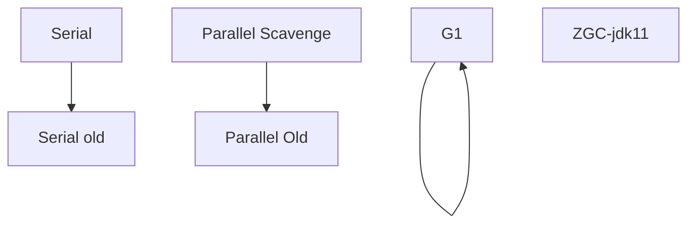

# 面试

## Java SE

### switch

switch的表达式中只能是6种类型：byte、short、char、int、枚举（jdk1.5）、String(jdk1.7)、**没有long**

case子句中的值必须是常量

default子句是可任选的，位置也是灵活的。当没有匹配的case时执行default，但default后面的case还会执行

情况多时可除一个数

case的各种情况呈现三角形，且后面的case都用到前面的数据，可以考虑倒着写

### 值传递

Java 语言的方法调用只支持参数的值传递，也就是说，方法得到的是参数值的一个拷贝，也就是说，把变量作为参数，通过方法调用对参数进行改变，结果影响不到原变量

故，变量是基本数据类型和String时要特别注意

```java
public class StringTest{
  public static void main(string[] args){
    String s = "Hello";
    change(s);
    System.out.println(s);  //Hello(未改变)
  }
  
  public static void change(String s){
    s = "Hi~~~~";
  }
}
```

### 类的组成

#### 属性赋值的先后顺序

① 默认初始化

② 显式初始化/⑤在代码块中赋值

③ 构造器中初始化

④ 通过"对象.方法" 或 "对象.属性"的方式，赋值

以上操作的先后顺序：① - ②/ ⑤ - ③ - ④ （**②/ ⑤由声明顺序决定**）

#### 内部类

静态内部类的实例化：

```java
A.B b = new A.B();
```

非静态内部类实例化：先造外部类 再造内部类

```java
A a = new A();
A.B b = a.new B(); //相当于调外部类的构造器
```

重名调用：

```java
System.out.println(a); //形参
System.out.println(this.a); //内部类
System.out.println(A.this.a); //外部类
```

局部内部类：在方法内，代码块内，构造器内

- 用于实现返回某个接口的实现类的对象 接口A 实用类定义为B
- 局部内部类  调用方法中  局部变量，这个局部变量需要被final修饰，即变为常量（final默认省略）

匿名内部类：

- 匿名内部类必须继承一个抽象类或者实现一个接口
- 匿名内部类不能定义任何静态成员和静态方法
- 当所在的方法的形参需要被匿名内部类使用时，必须声明为 final
- 匿名内部类不能是抽象的，它必须要实现继承的类或者实现的接口的所有抽象方法

局部内部类和匿名内部类访问局部变量的时候，**为什么变量必须要加上final**？

> 生命周期不一致
>
> -  局部变量直接存储在栈中，当方法执行结束后，非final的局部变量就被销毁
> - 局部内部类对局部变量的引用依然存在，如果局部内部类要调用局部变量时，就会出错
> - 加了final，可以确保局部内部类使用的变量与外层的局部变量区分开，解决了这个问题

### 对比

#### JVM、JRE和JDK

JDK=JRE+开发工具集：开发环境

JRE=JVM+Java SE标准类库：运行环境

(java.long包：基本数 据类型、基本数学函数、字符串处理、线程、异常处理类等)

JVM=一个虚拟机

#### break continue return

- break结束当前;break用于switch语句和循环语句中

- continue 结束当次;多层嵌套可定义标签;continue 用于循环语句中

- return 结束当前方法，并返回

break、continue之后不能有其他的语句

嵌套时可定义标签，标号语句必须紧接在循环的头部。

- lable1：for循环

- break lable1;

#### 成员、局部、静态变量

都是可变的量

不同：

- 作用域
- 存储位置
- 生命周期
- 初始值

静态变量：内存中只有一份，随类加载

#### final finally finalize

- final可以修饰类、变量、方法
  - 修饰类表示该类不能被继承
  - 修饰方法表示该方法不能被重写
  - 修饰变量表示该变量是一个常量不能被重新赋值
- finally一般作用在try-catch代码块中，在处理异常的时候，通常我们将一定要执行的代码方法 
  finally代码块中，表示不管是否出现异常，该代码块都会执行，一般用来存放一些关闭资源的代 
  码
- finalize是一个方法，属于Object类的一个方法，而Object类是所有类的父类，该方法一般由垃圾 
  回收器来调用，当我们调用System.gc() 方法的时候，由垃圾回收器调用finalize()，回收垃圾，一 
  个对象是否可回收的最后判断

#### this与super

区别：

- super:   它引用当前对象的**直接父类**中的成员
- this：它代表**当前对象**名

相同：

- super()和this()均需放在构造方法内**首行**
- 不能调用两个
- 不能同时出现在一个构造函数里
- 均不可以在static环境中使用
- 从本质上讲，this是一个指向本对象的指针, 然而super是一个Java关键字

#### 重写、重载

|            |     重写     |   重载   |
| :--------: | :----------: | :------: |
|   发生在   | 子类、实现类 | 同一个类 |
|  参数列表  |     相同     |   不同   |
| 权限修饰符 |   大于父类   |  无要求  |
|  private   |   不能重写   | 可以重载 |
|   构造器   |   不能重写   | 可以重载 |

#### 抽象类与接口

抽象类是自下而上的思想，通过子类捕捉通用的特征，抽象出父类

接口是自上而下的思想，是抽象方法的集合，是一种规范，通过实现类来实现具体的规范

相同点

- 不能实例化
- 需要被实现或继承
- 都包含抽象方法，需要子类或实现类覆盖

不同点

- 声明关键字
- 实现关键字
- 接口无**构造器**
- 接口只能是**public**
- 接口有**默认方法**和**静态方法**，提供了默认实现
- 单**继承**，多实现
- 接口**属性**只能final或static，即只能是**全局常量**

### 三大特征

#### 封装性

**封装性**

- 属性、方法、构造器前有权限修饰符修饰，多体现为private

- 高内聚，类的内部数据操作细节自己完成，不允许外部干涉

- 低耦合，禁止对象之间的不良交互，提高模块化

- 隐藏对象内部的复杂性，只对外公开简单的接口。便于外界调用，从而提高系统的可扩展性、可维护性。

  - 该隐藏的隐藏，该暴露的暴露
    - 隐藏信息
      - 主要是属性和供内部调用的方法，保护对象内部的状态，然后通过set和get方法维护

      - 还可以隐藏方法，仅供内部调用

      - 还可以隐藏构造函数，如单例模式

    - 暴露细节，构造器和实现某些功能的方法


|          private           |                缺省                |         protected          |               public               |
| :------------------------: | :--------------------------------: | :------------------------: | :--------------------------------: |
|           同类内           |               同包内               |         不同包子类         |              同工程内              |
| 属性、方法、构造器、内部类 | 属性、方法、构造器、内部类、**类** | 属性、方法、构造器、内部类 | 属性、方法、构造器、内部类、**类** |

#### 继承性

- 通过extends关键字实现
- 减少代码冗余，提高复用性
- 有利于功能扩展（直接让子类继承父类）
- 使类一类之间产生了关联，为多态性提供了前提
- 每个类都有默认根父类object
- 继承的属性可以和自有属性同名，默认调用自有属性
- 子类拥有父类非 private 的属性和方法
- 子类可以拥有自己属性和方法，即子类可以对父类进行扩展
- 子类可以用自己的方式实现父类的方法

#### 多态性

多态性（即向上转型）：程序中定义的引用变量所指向的具体类型和通过该引用变量发出的方法调用 
在编程时并不确定，而是在程序运行期间才确定，即一个引用变量到 底会指向哪个类的实例对象， 
该引用变量发出的方法调用到底是哪个类中实现的 方法，必须在由程序运行期间才能决定

在多态性中，调用重写的方法叫虚拟方法调用：

- 被重写的方法被调用时，编译时看左边父类（虚拟方法），运行时看右边子类

- 不能运行子类特有方法（未被重写）（编译看父类，父类没有，编译出错）

- 内存结构中仍然有子类特有方法的

重载在编译时，对于编译器而言，将方法名+不同形参对应的修饰生成调用地址，调用地址在编译期就绑定了，是一种“早绑定”或“静态绑定”

重写只有等到方法调用的那一刻，解释运行器才会确定所要调用的具体方法，是一种“晚绑定”或“动态绑定”

### 常用类

#### Object

##### 深拷贝和浅拷贝clone

- 浅拷贝（shallowCopy）只是增加了一个指针指向已存在的内存地址，如果原地址发生改变，那么浅复制出来的对象也会相应的改变

- 深拷贝（deepCopy）是增加了一个指针并且申请了一个新的内存，使这个增加的指针指向这个新的内存，使用深拷贝的情况下，释放内存的时候不会因为出现浅拷贝时释放同一个内存的错误

##### == 与 equals

==：基本数据类型比较值，引用数据类型比较地址值

equals：

- 没有重写，就是 ==
- 重写了，比较值
- 默认重写的类，如String、Date、File、包装类等

##### toString

- 当我们输出一个对象的引用时，实际上就是调用当前对象的toString() --- **默认调用**

  - 一般情况下有没有toString()两者相同

    ```java
    System.out.println(obj)
    System.out.println(obj.toString())
    ```

  - 特别注意**null**

    ```java
    obj=null;
    System.out.println(obj);						//null
    System.out.println(obj.toString());	//空指针异常
    ```

- 未被重写时，输出地址值

- 重写后，输出属性信息

- 默认重写的类，String、Date、File、包装类等

- **特别注意char[]**,其他数组未被重写

##### hashCode

hashCode() 的作用是获取哈希码，也称为散列码；它实际上是返回一个int整 数。这个哈希码的作用是确定该对象在哈希表中的索引位置。hashCode() 定义 在JDK的Object.java中，这就意味着Java中的任何类都包含有hashCode()函数。
散列表存储的是键值对(key-value)，它的特点是：能根据“键”快速的检索出  对应的“值”。这其中就利用到了散列码！（可以快速找到所需要的对象）

先通过hashCode值比较比直接通过equals遍历比较快的多

**为什么重写equals时  必须重写hashCode方法？**

- hashCode默认是计算对象的引用地址，而不是对象的值
- 在引用数据类型下，只重写equals，不重写hashCode，两个值相同的对象，根据地址值很可能计算出两个不同的hashCode，重写equals也就失去了意义

**重写hashCode为什么用31乘？**

- 选择系数的时候要选择尽量大的系数。因为如果计算出来的hash地址越大，所谓的“冲突”就越少，查找起来效率也会提高（减少冲突）
- 并且31只占用5 bit,相乘造成数据溢出的概率较小
- 31可以由i*31== (i<<5)-1来表示,现在很多虚拟机里面都有做相关优化（提高算法效率）
- 31是一个素数，素数作用就是如果我用一个数字来乘以这个素数，那么最终出来的结果只能被素数本身和被乘数还有1来整除！(减少冲突)

#### [String](#StringTable)

**StringBuffer、StringBuilder**

String：不可变，底层是final修饰的char[]（byte[]），不可被继承，通过反射改变value属性值，可以暴力改变

StringBuffer：可变，线程安全

StringBuilder：可变，线程不安全

底层都是char[]存储

可变：提前开辟**16**位空间，不够了就用位运算扩容，扩一次是原来**2倍+2**

- new对象时创建长度为16 + 字符串size的数组
- 扩容至2倍+2，还够就用size大小代替

#### 日期

**Date、SimpleDateFormat**

```java
// 实例化
new Date();	//Sun Apr 17 12:43:26 CST 2022
new Date(1650170606897L);	//Sun Apr 17 12:43:26 CST 2022

// 方法
toString(); //显示当前 年月日时分秒
getTime();	// 获取当前时间戳 

// 格式化  SimpleDateFormat
new SimpleDateFormat("yyyy/MM/dd hh:mm:ss").format(date);	//格式化
new SimpleDateFormat("yyyy/MM/dd hh:mm:ss").parse(string);//解析
```

**LocalDateTime、LocalTime、LocalDate、DateTimeFormatter**

```java
// 实例化
now() //静态方法，创建当前时间对象，可指定时区LocalDate date= LocalDate.now();
of() //静态方法，创建指定日期时间对象 LocalDate date= LocalDate.of(2020,5,6);

// 方法
getDayOfMonth()//等等 获取年/月/日/时/分/秒 dateTime.getDayOfMonth()
withDayOfMonth()//等等 把年/月/日修改为指定值 date.withDayOfMonth(22)
plusDays()//等等 当前对象添加年/月/日/时 dateTime.plusMonths(3)
minusDays()//等等 当前对象减去年/月/日/时 dateTime.minusDays(6)
  
// 格式化  DateTimeFormatter
DateTimeFormatter.ofPattern("yyyy-MM-dd hh:mm:ss").format(date);	//格式化
DateTimeFormatter.ofPattern("yyyy-MM-dd hh:mm:ss").format(string);	//解析
```

#### 包装类

基本类型、包装类 -------> String：String.valueOf(obj)

String ----------> 包装类：调用包装类的方法XXX.parseXXX(String 类型的变量)

**Integer a= 127 与 Integer b = 127相等吗**

享元模式，包装类的缓存

> *   Byte, Short, Long 、Integer缓存的范围都是 -128\~127，其中Integer的最大值可以设置虚拟机参数改变
> *   Character 缓存的范围是 0\~127
> *   Boolean 缓存了 TRUE 和 FALSE

#### 集合

**结构关系**

* |----Collection接口：**单列**集合，用来存储一个一个的对象
  - |----List接口：**有序、可重复**
    - |----ArrayList、LinkedList、Vector
  - |----Set接口
    - |----HashSet --- **无序、唯一**
      - LinkedHashSet
    - SortedSet ---- TreeSet --- **有序、唯一**
  - |----Queue接口

* |----Map接口：**双列**集合，用来存储一对(key - value)一对的数据
  - |----HashMap、LinkedHashMap、TreeMap、Hashtable、Properties

**Iterator**

如何边遍历边移除 Collection 中的元素？

```java
// 唯一正确方式是使用 Iterator.remove() 方法
Iterator<Integer> it = list.iterator();
while(it.hasNext()){
	*// do something*
	it.remove();5   }

// 错误，会报 ConcurrentModificationException 异常
// 会自动生成一个iterator 来遍历该 list，但同时该 list 正在被 Iterator.remove() 修改
// Java 一般不允许一个线程在遍历 Collection 时另一个线程修改它
Java 一般不允许一个线程在遍历 Collection 时另一个线程修改它
for(Integer i : list){
	list.remove(i)	}
```

##### **ArrayList**

**ArrayList**

- 源码分析：

  - jdk1.7 
    - 空参构造器创建长度为**10**的**Object[]数组 elementData**
    - 添加元素，容量不够，扩容为**1.5倍**，还不够时直接用**需要的+现有的**代替
    - 开发中采用带参构造器


  - jdk1.8
    - 创建时，**初始化为{ }**，没有定义长度
    - **调用add时，创建长度为10的数组**，节省内存

- 特点

  - 优点
    - 数组实现，是一种随机访问模式，实现了 **RandomAccess** 接口，**查找**的时候非常快
    - **顺序添加**一个元素的时候非常方便
  - 缺点
    - **删除**要复制的元素很多，那么就会比较耗费性能
    - **随机插入**要复制的元素很多，那么就会比较耗费性能
    - 线程不安全

##### LinkedList

**LinkedList**

- 源码分析
  - 维护了frist和last属性，用于双端操作
  - **Node**是一个内部类，维护了prev、element、next
  - 添加时，把元素封装到Node中
- 特点
  - 优点：增删 --- 快
  - 缺点：查改 --- 慢，线程不安全，内存占用高一些

##### Vector

**Vector**

- 源码分析
  - 初始长度也是10，每次会扩容到**2倍**
- 特点
  - 优点 --- 线程安全

##### HashSet

**HashSet**

- 源码分析
  - 底层是HashMap
  - 用k存储数据
  - v是一个new Object()，并没有实质意义，仅是为了避免空指针，所以把重写的这个方法被static修饰，变成静态的方法，节省内存
  - 一个bug：重复添加

##### LinkedHashSet

**LinkedHashSet**

- 插入略低，遍历略高

##### TreeSet

**TreeSet**

- 顺序存储
- 添加的数据必须是相同类的对象

- 底层源码为红黑树

- **不可重复性不是通过equals方法实现的，而是红黑树的特性实现的，或者说是由compareTo返回0决定的**
  - 在自然排序中，通过comparable中的compareTo方法，返回0，插入失败

  - 在定制排序中，通过comparator中的compare方法，返回值为0，元素相同，添加失败

##### **HashMap**

**HashMap**

- 源码分析

  - jdk1.7
    - 实例化后，创建长度为**16**的**Entry[] table**数组
    - 添加元素a时，调用a所在类的hashCode方法，计算哈希值

    - 通过某种算法(与运算，相当于取模)计算出HashSet底层数组存放的位置，判断是否已有元素

      - 没有元素，添加成功

      - 有元素b，或有链表形式存放的多个元素，比较哈希值，

        - 哈希值不同，添加成功，

        - 哈希值相同，调用a所在类的equals方法
          - 不同，添加成功
          - 相同添加失败，但value1替换原有元素

    - 元素越来越多的时候 ，hash冲突的几率也就越来越高，需要扩容

    - 到达 **临界**值 = 负载因子**0.75 * 旧容量** ，开始扩容

      - 扩容至2倍小于最大容量，且旧容量不小于16，扩容至**2倍**
      - 大于最大容量，旧临界值改为int的最大值
  - jdk1.8
    - 实例化的时候，没有创建长度16的Entry[]
    - 首次调用**put**方法时，**创建长度16的Node[]**

    - 先形成链表（七上八下）
      - jdk1.7中，a直接放在数组中，以链表方式指向其他元素

      - jdk1.8中，原来元素依然在数组中，向下指向元素a

    - 索引位置上的**链表上元素个数 > 8** ,且**数组长度 > 64**时，此索引上数据改为**红黑树**

- put方法

  - 调用put方法时，其实调用了putVal(hashCode,k,v,)
  - 判断table是否为空
  - 若为空，进行初始化或扩容
    - 容量大于0，扩容resize方法
      - 大于最大容量2^30，扩容至Integer最大值2^31-1
      - 否则，扩容至2倍后若小于最大容量，且初始化过，就扩容至2倍
      - 重新计算hash值，将元素复制到扩容后到数组
    - 否则，初始化，容量为默认值16
  - 不需要初始化或扩容，hash值进行与运算求模，找到存放位置
  - 位置上为空，直接放上去
  - 不为空，数组上去重
  - 不重复，判断是否是红黑树上的（TreeNode的对象），是就调用putTreeVal
    - putTreeVal
  - 不是红黑树就是链表就循环遍历，直到到头或重复就停止（链表去重）
    - 到头了判断是否需要树化，超过8个，就要树化

- hash冲突的解决

  - 链表 --- 链地址法

  - hash函数的2次扰动 --- 高低位异或

    ```java
    static final int hash(Object key) {
       int h;
       // 与自己右移16位进行异或运算（高低位异或）
       return (key == null) ? 0 : (h = key.hashCode()) ^ (h >>> 16);
    }
    ```

  - 红黑树

- 为什么HashMap中String、Integer这样的包装类适合作为K？

  - 都是final类型，即不可变性，保证key的不可更改性，不会存在获取 hash值不同的情况
  - 内部已重写了equals()、hashCode()等方法，遵守了HashMap内部的规范，不容易出现Hash值计算错误的情况
  
- **死循环（循环链表）问题**

  - 死循环发生在jdk1.7中的并发扩容
  - jkd1.7是采用头插法，扩容时在旧数组中从头到尾取出数据ABC，插入到新数组，这时候顺序正好反过来C->B->A
  - 当两个线程对同一对象同时进行扩容操作时，线程一和线程二都执行到了A，next指向B的引用
  - 此时线程一抢到时间片，顺利执行完扩容操作，完成了数据转移C->B->A
  - 这时候线程二next的引用依然存在，即A->B，发现形成了循环C->B->A->B

### 反射

**获取类**

- 对象.getClass
- 类.class
- Class.forName("全类名")
- 类加载器.loadClass("全类名")

## JVM

###  JVM 主要组成部分

#### 类加载子系统

**类加载子系统**：从文件系统或者网络中将Class文件，通过ClassLoader，加载到JVM或本地内存的方法区中

- ClassLoader
  - Bootstrap Class Loader：类加载器，加载核心库（java、javax、sun）
  - Extension ClassLoader：扩展类加载器，加载扩展库（jre/lib/ext目录下的class）
  - AppClassLoader：系统类加载器
- 过程
  - 加载：通过双亲委派机制向上委托至类加载器，属于自己的加载范畴的进行加载，否则下放，若加载的自定义类和核心类冲突，启动沙箱安全机制，报错找不到main方法
  - 链接（验证、准备 --- 类变量默认初始值、解析 --- 符号引用转为直接引用）
  - 初始化 --- 执行clinit方法，对静态变量进行赋值（下面C是本类，SC是父类）
    - 每个类都有一个**初始化锁LC**，线程获取LC，这个操作会导致当前线程一直等待，直到获取到LC锁
    - 如果C**正在被*其他线程*初始化**，当前线程会**释放LC锁进入阻塞状态**，并**等待C初始化完成**。此时当前线程需要重试这一个过程。执行初始化的过程时，线程的中断状态不受影响
    - 如果C**正在被*本线程*初始化**，即递归初始化，**释放**LC并且**正常返回**
    - 如果C**已经初始化完成**，**释放**LC并且**正常返回**
    - 如果C处于**错误状态**，表明不可能再完成初始化，释放LC并**抛出异常**NoClassFoundError异常
    - **否则**，将C**标记**为**正在被本线程初始化**，释放LC
      - 然后，初始化**final**且为**基础类型**的**静态常量**
      - 如果C是类而不是接口，且C的**父类**SC和各个接口还没有初始化，那么就在SC上面递归的进行完整的初始化过程，如果有必要，需要先验证和准备SC
      - 如果SC或初始化过程中抛出异常，则获取LC，将C标记为错误状态，并通知所有正在等待的线程，然后释放LC，然后再抛出同样的异常
      - 从C的classloader处获取assertion断言机制是否被打开
      - 接下来，按照文本顺序执行**静态变量初始化和静态代码块**，或**接口的字段初始化，把它们当作是一个个单独的代码块**
      - 如果执行正常，那就获取LC，标记C对象为已初始化，并通知所有正在等待的线程，然后释放LC，正常退出整个过程
      - 否则，如果抛出了异常E那么会中断退出，如果E不是Error，则以E为参数创建新的异常
      - 获取LC，将C标记为错误状态，通知所有等待的线程，释放LC，并抛出异常E

#### 运行时数据区

**运行时数据区**

- `程序计数器`：记录当前线程下一条指令地址，交由执行引擎读取，不会OOM，线程私有

- `虚拟机栈`：栈是运行时的单位，每个方法对应一个栈帧，**栈内存要适宜，过小OOM，过大线程少**

  - *局部变量表*，存放局部变量，大小在编译期确定，每个变量放到1-2个槽中，long、double占两个槽，成员方法首个变量都是this，超出作用域的变量占用的槽可以被复用

  - *操作数栈*，存放中间结果、中间变量，最大深度在编译期确定，入栈出栈进行自动回收，

    > 栈顶缓存技术，把栈顶栈帧存放到物理的CPU寄存器，减少IO，提升执行引擎效率

  - *动态链接*：指向方法区中，运行时常量池的方法引用，多态情况下，编译期无法将符号引用转化为直接引用的晚绑定，只能在运行时通过invokedynamic指令进行动态转化

  - *方法返回地址*，正常执行时，存放程序计数器的值，即下一条指令的地址；出现异常时，指向异常变量表中对应异常的地址

  - *其他附加信息*

- `本地方法栈`：通过本地方法接口来处理本地方法的栈

- `堆`：堆是存储的单位

  - 结构
    - 老年代：年轻代（伊甸园区：survivor区（from：to）） = 2:1
    - 在伊甸园区有一个TLAB线程私有的缓冲区，大小是伊甸园区的1%
    - jdk1.7后常量池和静态变量
    
  - 对象的内存分配过程 -- [CMS](#CMS)
    - 若存在并发，就先放进TLAB，放不下进入伊甸园区，大部分对象在伊甸园区被new出来
    
    - 伊甸园区满后，先进行空间分配担保（针对大对象）
      - 判断老年代连续空间是否大于年轻代所有对象大小，进行minorGC，没用的对象进行回收，有用的进入survivor0区
      - 或者年轻代连续空间大小是否大于survivor区平均大小，进行minorGC，没用的对象进行回收，有用的进入survivor0区
      - 都不满足，进行Full GC
      
    - 再次进行minorGC时，回收伊甸园区的同时，被动回收surface0区，有用的进入survivor1区，surface0区过去的对象，年龄+1
    
    - 反复执行后，survivor中年龄达到15时或经过年龄动态判定符号条件，进入老年代
    
      > Survivor一半以上的空间被相同年龄对象占用，那年龄>=该年龄的对象就可以直接进入老年代
    
    - 若survivor满了，伊甸园的直接进入老年代
    
    - 老年代满后，进行Major GC（仅CMS GC单独进行Major GC）或Full GC，好没空间报OOM

- `方法区`

  - 结构 - 存放类元信息（Klass）
    - 类信息（修饰符、全类名、父类名、接口列表）
    - 属性信息（修饰符、类型、属性名）
    - 方法信息（修饰符、返回值类型、方法名、参数数量与类型、异常列表、操作数栈与局部变量表的大小）
    - non-final的静态变量 --- **jdk1.7后在堆中**
    - 全局常量
    - 常量池（直接常量（整型，浮点，字符串）、符号引用 --- 运行时转化为直接引用存放到方法表） --- **jdk1.7后在堆中**
    - 对类加载器的引用
    - 对Class类的引用
    - 方法表，存放方法体字节码指令，包括动态链接时（虚方法）指向的直接引用
    - 即时编译器编译后的代码缓存等
  - 垃圾回收 --- 主要是常量、类
    - 常量回收简单
    - 类回收 --- 对象及子类对象已被回收、加载器被回收（难）、对应的Class对象不再被引用（没有反射、动态代理）

#### 执行引擎

**执行引擎** --- 从class --- 汇编语言 --- 机器码

- 解释器Interpreter
  - 现状普遍采用模版解释器，将字节码和模板函数关联，通过模板函数直接生成机器码
  - 结构
    - 解释器模块 --- 将字节码和模板函数关联
    - 机器码模板 --- 存放产生的机器码
- 即时编译器JIT
  - 将Class文件进行编译，缓存到本地内存
- HotSpot 的执行引擎
  - 解释器无需编译，可以直接工作，JIT优化出现异常时做出口，可做先锋，可做后补
  - JIT需要先编译，耗费一定时间，在客户端上表现出卡顿
  - JVM启动时，解释器发挥作用，省去了编译时间，JIT（一般是C2 -- Server Compiler）根据热点探测技术（又叫**栈上替换**），调用计数器统计方法调用次数，调用回边计数器统计循环体循环次数，得到热点代码进行编译，缓存到本地内存，提升执行效率
  - C2的优化策略 --- 即**逃逸分析**
  - C1的优化策略 --- 方法内联（减少栈帧、参数传递、方法跳转）、冗余消除（折叠不执行的代码）
  - 分层编译策略 --- C1、C2相互协助，开始时C1快，先执行，稳定后C2快，进行切换

- **本地方法接口**

  - 与操作系统交互
  - 与java环境交互
  - 与JVM交互

### 堆和栈的区别

- 物理内存：堆不连续 -- 慢
- 内存大小：一般堆大
- 存放内容：
  - 堆 -- 数组，对象，静态变量，常量池
  - 栈 -- 局部变量表、操作数栈、动态链接、方法返回地址
- 线程安全：堆线程共享

### 逃逸分析与栈上分配

- 逃逸：给成员变量赋值、方法返回值、实例引用传递
- 若对象没有发生逃逸，可以优先栈上分配，无需进行垃圾回收
- 逃逸分析
  - 分离对象、标量替换：未发生逃逸时，对象不需要连续空间，可以不在内存分配，也就是不创建对象，而是在CPU寄存器中，将聚合量进行标量（基本数据类型）替换
  - 栈上分配：若对象没有发生逃逸，可以优先栈上分配，无需进行垃圾回收
  - 同步省略：未发生逃逸时，对象只被一个线程访问，编译器就不会再考虑线程安全问题，即**锁消除**

### 对象

#### 创建过程

- 执行到new指令时，在元空间的常量池中定位类的符号引用，检查是否已经**加载**，即判断类的元信息是否存在，如果没有，通过双亲委派机制进行，使用相应的类加载器找ClassLoader+包名+类名为key的class文件，没有找到，就抛异常，找到了就加载，产生Class对象
- 计算占用空间，在堆中分配内存（分配方式取决于内存是否规整，即取决于GC算法），分配完内存即代表**实例化完成**
  - 如果内存规整（用过的挨着放一边，空闲的连续），使用指针碰撞
  - 如果不规则，方法表还需要维护一个空闲列表，找到一块够用的进行分配
- **并发处理**，采用 CAS + 失败重试来保障更新操作的 原子性同步处理 或 先尝试放到TLAB中，空间用完了加锁
- 此间伴随着**垃圾回收**
- **链接**（验证、准备）
- 设置对象头
- 执行init方法进行**初始化**：属性的显示初始化、代码块中初始化、构造器中初始化，**至此对象创建完成**
- 链接（**解析**）

#### 内存结构

- 对象头（Header）
  - 运行时元数据（Mark Word）-- hashCode、GC age、锁状态、锁类型、偏向锁线程ID、偏向锁时间戳
  - 类型指针（Instance Klass）指向方法区中类元信息
  - 数组长度
- 实例数据（Instance Data）：对象的属性方法信息
- 对齐填充（Padding）

#### 访问定位

- 句柄访问
  - 堆中维护句柄池，句柄池中包含类型指针（指向方法区）和实例指针（指向堆中实例池）
  - 优点：GC时对象的频繁移动，只需改变句柄池的指针引用，无需关心局部变量表的指针引用
- 直接指针访问
  - 类型指针直接在实例中的对象头中维护
  - HotSpot采用直接指针访问

### [StringTable](#String)

- 版本变化

  - jdk6之前，在永久代，底层是char[]
  - jdk7之后，在堆中
  - jdk9之后，底层是byte[] + 编码标记

- String Pool是一个固定大小的Hashtable，默认值大小长度是1009（也是设置时最小值），若String非常多，就会造成Hash冲突严重，从而导致链表会很长，而链表长了后直接会造成的影响就是当调用string.intern时性能会大幅下降

- 拼接

  - 常量与常量 --- 常量池 --- **编译期优化**
  - 有变量拼接 --- 堆中new String() --- **StringBuilder**的append() --- jdk1.5前采用StringBuffer
  - **intern()方法，返回常量池中的地址（没有就创建一个String对象）**
  - 变量拼接效率远高于常量拼接
    - 变量拼接只有一个StringBuilder
    - 常量拼接一次多一个StringBuilder，每次都调用toString方法

- intern()

  - 字面量直接进常量池

  - new String()的，先在堆中，调用intern，若常量池中有相同的，直接返回常量池中的引用，否则，先放到常量池中并返回引用

  -  `String str = new String("a") + new String("b")`产生几个对象？

    - 对象1：new StringBuilder()
    - 对象2：new String("a")
    - 对象3：常量池的 ldc a
    - 对象4：new String("b")

    - 对象5：常量池的 ldc b

    - 对象6：toString中会创建一个 new String("ab")，**调用toString方法，不会在常量池中生成ab**

  - 版本对比

    - jdk1.6

      - 常量池中无，复制一份对象到常量池中，返回池中的引用地址

    - jdk1.7

      - 常量池中无，复制一份地址到常量池中，返回池中的引用地址（两地址相同）

      - **池中先有为false，堆中先有为true**

        > 先有字面量，后有变量拼接 ---- false --- 常量池的地址不是复制过去的
        >
        > 先有变量拼接，后有字面量 ---- true --- 常量池的地址是堆中复制过去的
        >
        > 变量拼接后调用intern ---- true --- 常量池的地址是堆中复制过去的
        >
        > 字面量拼接后调用intern ---- false --- 常量池的地址不是复制过去的

- GC -- 这里的GC指的是堆中的对象

  - 一个HashTable用来存放去重后的对象（char或byte数组）
  - 一个阻塞队列，用来存放需要回收的对象的引用
  - 一个GC线程，在队列中拿到一个对象，放到HashTable，去堆中比较，有相同的调整引用，都指向HashTable中的数组

### GC算法

#### 标记算法

**标记算法** --- 判定算法

- *引用计数法*：维护一个计数器（空间浪费），指针引用通过加减计数（时间浪费），无法处理循环引用

  > Python使用了引用计数法，用弱引用解决循环引用的问题

- *可达性分析算法*

  - GCRoot  -- 根集合
    - 堆外结构对堆内对象的引用
      - 局部变量表上的引用对象
      - 静态变量的引用对象
      - 常量池中的引用对象
      - synchronized持有的对象
      - 基本数据类型对应的Class对象
      - 异常对象
      - 系统类加载器对象
    - 分代收集、局部回收时，被回收的区域之外的空间对被回收区域内对象的引用
      - 新生代被回收，老年代的对象可能是GCRoot
  - 以GCRoot为起点向下搜索，能触及的，在引用链上的，都做标记。没有标记的就是要回收的对象
  - 进行筛选，判断此对象是否有必要执行finalize（）方法
    - 没有重写，或已经被调用过finalize方法  ---  不必执行，不可触及，回收
    - 重写了，且没执行过，该对象放到一个队列中，等待finalize的执行
  - finalize（）方法是对象逃脱死亡的最后机会，稍后GC会对F-Queue队列中的对象进行第二次标记
    - finalize重新建立了引用，不再回收
  - 实际开发中不会重写finalize，可能造成对象复活，影响GC性能，优先级低很难被执行

#### 清除算法

**清除算法**

- *标记清除算法* --- 效率低，需要维修空闲列表，stw时间长
  - 标记：即可达性分析算法，从GCRoot遍历标记引用对象，标记在对象头中
  - 清除：遍历所有对象头，没有标记的进行回收，清除不是擦掉，而是覆盖
- *复制算法*
  - 内存分为两份，垃圾回收时，正在使用的对象复制到另一块内存，留下的清除
  - 优点：简单高效，没有碎片，不需要空闲列表
  - 缺点：浪费空间，回收率低时效率低（老年代）
- *标记压缩算法* --- 相当于标记 - 清除 - 整理
  - 标记：即可达性分析算法
  - 压缩：标记的对象放到内存一端，清理剩下的部分
  - 优点：没有碎片，节省空间
  - 缺点：效率比复制算法低，而且需要调整大量引用（直接指针访问）

- 对比

  |              | 标记清除           | 标记压缩         | 复制                                  |
  | ------------ | ------------------ | ---------------- | ------------------------------------- |
  | **速率**     | 中等               | 最慢             | 最快                                  |
  | **空间开销** | 少（但会堆积碎片） | 少（不堆积碎片） | 通常需要活对象的2倍空间（不堆积碎片） |
  | **移动对象** | 否                 | 是               | 是                                    |

- *分代收集算法*

  - 年轻代 --- 存活率低，回收频繁，内存小 --- 复制算法最佳，survivor区整好缓解双份内存的压力
  - 老年代 --- 存活率高，回收不频繁，内存大 --- 标记清除与标记压缩混合实现
    - 标记时间 与 存活对象成正比
    - 清除时间 与 管理内存成正比
    - 压缩时间 与 存活对象成正比

- *增量收集算法*

  - 垃圾收集线程 和 应用程序线程交替执行 --- 减少STW时间
  - 每次只收集小片空间，反复执行，直到回收完

  - 优点：减少STW时间
  - 缺点：时间片切换成本高，吞吐量下降

- *分区算法*

  - 整堆分割为若干小区间
  - 每个小区间的GC独立完成

### 垃圾回收器

**Serial、Serial Old** 

- Serial：串行回收、复制算法、完全STW --- 可搭配Serial Old、CMS（jdk8废弃，JDK9移除）
- Serial Old：串行回收、标记压缩算法 --- 可搭配Serial 、Parallel Scavenge
  - Client模式下的默认回收器
  - Server模式下主要有两个用途：配合Parallel scavenge、后补CMS

**ParNew**

- Parallel New：并行回收、复制算法、完全STW --- 可搭配CMS、Serial old（jdk8废弃，JDK9移除）
- Server模式下新生代的默认垃圾收集器
- 老年代搭配Serial old使用
- 除Serial外，目前只有ParNew GC能与CMS收集器配合工作

**Parallel Scavenge、Paeallel Old** --- 在Java8中，默认是此垃圾收集器

- Parallel Scavenge：并行回收、复制算法、完全STW、**自适应调节策略**（区别于Parallel New）、**吞吐量优先**
- Parallel old：并行回收、标记压缩算法，JDK1.6时代替老年代的serialold收集器
- JDK14中：弃用Paralle1 Scavenge和Serialold GC组合

#### CMS

**CMS** --- JDK14删除

- Concurrent-Mark-Sweep ：并发回收、**标记清除**、**低延迟**、
- **第一次实现了让垃圾收集线程与用户线程同时工作**
- 涉及STW的阶段主要是：初始标记 和 重新标记
  - **初始标记**：标记出GCRoots能直接关联到的对象 --- 短暂的**STW**
  - **并发标记**：标记的GCRoots开始遍历标记，和用户线程并发执行
  - **重新标记**：修正并发标记时的变动部分 --- 出现**STW**
  - **并发清除**：遍历清除，和用户线程并行执行
- 不再是老年代满时触发，达到**阈值触发**（因为是并发回收，确保有空间给用户线程）
- 失败时（老年代满了，用户线程停了）采用**后备预案**：临时启用**Serial old**收集器
- 不采取标记压缩算法是因为要想保证用户线程并发执行，就不能动存在的引用
- 并发阶段占用了线程资源，导致吞度量下降
- 失败时，已经并发标记-未重新标记修正的垃圾是**浮动垃圾**，Serial 无法回收，直到下次GC才能回收

#### G1

**G1**

- 侧重点在于**回收垃圾最大量的区间**（Region）-- **垃圾优先**（Garbage First）

- 采用分区算法、分代收集算法，把堆空间分隔成若干独立的region，对伊甸园区、survivor区、老年代采用不同的region来表示，**整体**采用**标记压缩**算法，**region之间**采用**复制**算法，不会有碎片产生

  > 不会有碎片产生有利于程序长时间运行，分配大对象时不会因为无法找到连续内存空间而提前触发下一次GC。尤其是当Java堆非常大的时候，G1的优势更加明显

  - 可分成1M-32M（2^n）的region，**大小相同**，`-XX:G1HeapRegionsize`指定

  - 五种region：伊甸园区、survivor区、养老区、未使用、**Humongous**（专门存储大对象 --- **大于1.5region**）

    > Humongous防止短期存在的大对象，直接进入老年代，得不到回收，一个H装不下，就找连续的H放

  - 没有碎片，所以通过**指针碰撞**来分配空间

  - *对象之间存在引用关系*，一个伊甸园区的对象可能引用了老年代的对象，分代收集器都面临这个问题

    - **为每个region维护一个记忆集（Remembered Set）**
    - **放对象**的时候产生**写屏障**中断写入
    - 先**检查对象引用是否在同一个region**，**不同就在cardTable中记录引用信息**
    - GC时，只需检查对应的记忆集，无需整堆扫描

- 适用于服务端、多核CPU、大内存，**可预测的停顿时间模型**

  - G1除了追求低停顿外，还能建立可预测的停顿时间模型，能让使用者明确指定，在一定长度的时间片段内，垃圾收集不得超过指定时间
  - 分区收集，降低STW时间
  - 后台维护**回收价值列表**，根据允许的GC时间，回收最有价值的区间，保证了G1收集器在有限的时间内可以获取尽可能高的收集效率
  - 最高情况比不过CMS，最差情况要好的多
  - 内存占用比CMS高，故适合大内存，**平衡点在6-8G**，与CMS相当

- 取代了CMS回收器以及Parallel+Parallel old组合。被oracle官方称为“全功能的垃圾收集器”

- 使用步骤

  - 开启G1 --- `-XX:+UseG1GC`
  - 设置堆最大内存 --- `-Xmx`
  - 设置最大的停顿时间 --- `-XX:MaxGCPauseMillis`

- 适用场景

  - 服务端、大内存（超过8G）
  - **低延迟（低于0.5s）** --- GC慢时，系统会调用用户线程帮助加速GC
  - 超过50%的Java堆被活动数据占用
  - 对象分配频率或年代提升频率变化很大

- 回收过程

  - 年轻代（*Young GC*）
    - 创建回收集，用于存放要回收的region
    - **初始标记** --- GCRoots包括堆外引用和记忆集中记录的region外引用 ---- **STW**
    - **复制对象** --- 从伊甸园区的region到survivor区的region（from区到to区的，年龄+1），survivor不够直接进去老年代的region
    - **处理引用** --- 处理强软弱虚等引用
  - *老年代并发标记 + Young GC* --- **老年代只有全垃圾的region才会被回收**
    - **初始标记** --- STW --- 触发一次Young GC
    - **根区域扫描** --- 扫描survivor直接引用的老年代对象，并标记，必须在Young GC之前完成，否则会产生浮动垃圾
    - **并发标记** --- 并行执行，可能会被Young GC中断
    - **重新标记** --- STW --- 修正（采用初始快照算法，很快）
    - **独占清理** --- STW --- 计算回收率，排序，识别可以混合回收的区域
    - **并发清理** --- 若发现整个region全是垃圾，立即回收，否则留到混合回收
  - 混合回收（*Mixed GC*）
    - 老年代并发标记后剩余的有垃圾的region分**8次清理**
    - 即混合回收的是**1/8老年代**的垃圾region，和**整个年轻代**的region
    - 混合回收的算法和年轻代回收的算法完全一样，只是回收集多了老年代的内存分段
    - 1/8的老年代垃圾region回收的是回收率高的region，默认**超过65%才回收**，否则任务回收率低，复制算法浪费时间
    - 也**不一定要进行8次**，默认**允许有10%的空间浪费**，GC时发现**垃圾占比低于10%，就不在进行回收**（浪费时间，不划算）
  - *后补方案FullGC*
    - G1就是想要避免FullGC，但是正常的回收过程不能正常执行的时候，只能STW，使用单线程进行FullGC
    - FullGC产生原因
      - 没有足够的空间存放Survivor过来的对象
      - 并发清理阶段空间耗尽
    - jdk10改进FullGC，可以并行执行
  

#### ZGC

**ZGC**:A Scalable Low-Latency Garbage Collector（Experimental）（ZGC：可伸缩的低延迟垃圾回收器）

- 在尽可能对吞吐量影响不大的前提下，实现在任意堆内存大小下都可以把垃圾收集的停颇时间限制在十毫秒以内的低延迟
- 基于Region内存布局的，（暂时）不设分代的，使用了读屏障、染色指针和内存多重映射等技术来实现可并发的标记-压缩算法的，以低延迟为首要目标
- 4个阶段：(初始标记---STW) -**并发标记 - 并发预备重分配 - 并发重分配 - 并发重映射**

#### 总结

**组合关系**

- Serial ---- Serial old、CMS（jdk8废弃，jdk9移除）
- Serial old ---- Serial 、Parallel Scavenge（jdk14废弃）
- ParNew ---- CMS、 Serial old（jdk8废弃，jdk9移除）
- Parallel Scavenge ---- Parallel Old、Serial Old
- Parallel Old ---- Parallel Scavenge
- CMS（jdk14删除） ---- Serial 、ParNew 
- G1

**特点**

- 最小化地使用内存和并行开销，请选Serial GC --- 内存小于100M、单核且对延迟无要求
- 最大化应用程序的吞吐量，请选Parallel GC
- 最小化GC的中断或停顿时间，请选CMS GC
- 官方推荐G1，性能高。现在互联网的项目，基本都是使用G1


**图示**


*JDK14*



### **解决full-gc频繁**

- 查看监控，以了解出现问题的时间点以及当前FGC的频率（可对比正常情况看频率是否正常）
- 了解该**时间点**之前有没有程序上线、基础组件升级等情况，**新改动的代码出现问题** --- 最常见
- 是否是**小范围**故障，若是，先禁用这几台服务器，不能禁用就进行扩容处理，**相应业务场景的代码问题**，业务场景使用频率低，上线时没有显露
- **大面积**故障，比较麻烦，重点是进行故障定位  ---- 每次GC是**否能回收内存**
  - **回收了 ---- 代码本身没问题**，了解JVM的参数设置，包括：堆空间各个区域的大小设置，新生代和老年代分别采用了哪些垃圾收集器，然后分析JVM参数设置是否合理，可能是**伊甸园太小**（调整年轻代大小或直接加内存）、**业务量太大**（加内存）
  - 没有回收 --- 直接通过 jmap -dump 命令dump出内存，使用工具定位到可疑对象，看下当前的内存泄漏情况、代码显式调用gc等等，查看是哪个对象占用了大量内存 --- 一般情况下都是代码问题，死循环，无界队列等
- 还可能出现第三方jar包的bug，如guava、log4j，极端情况出出现
- 解决方案：
  - 大多数情况下，扩容、禁用、重启、调参可解决大部分问题
  - 遇到第三方jar包的问题，一般只会出现在少数机器，禁用即可临时解决，然后后续再慢慢排查

### 内存溢出与内存泄漏

内存溢出：内存使用比GC快，满了，一般先GC再OOM，但是超大对象可能不GC，直接报OOM

**内存溢出原因及排查**

- java.lang.OutOfMemoryError: ......java heap space..... 堆栈溢出，代码问题的可能性极大
- java.lang.OutOfMemoryError: GC over head limit exceeded 系统处于高频的GC状态，而且回收的效果依然不佳的情况，就会开始报这个错误，这种情况一般是产生了很多不可以被释放的对象，有可能是引用使用不当导致，或申请大对象导致，但是java heap space的内存溢出有可能提前不会报这个错误，也就是可能内存就直接不够导致，而不是高频GC.
- java.lang.OutOfMemoryError: PermGen space jdk1.7之前才会出现的问题 ，原因是系统的代码非常多或引用的第三方包非常多、或代码中使用了大量的常量、或通过intern注入常量、 或者通过动态代码加载等方法，导致常量池的膨胀
- java.lang.OutOfMemoryError: Direct buffer memory 直接内存不足，因为jvm垃圾回收不会回收掉直接内存这部分的内存，所以可能原因是直接或间接使用了ByteBuffer中的 allocateDirect方法的时候，而没有做clear
- java.lang.StackOverflowError - Xss设置的太小
- java.lang.OutOfMemoryError: unable to create new native thread 堆外内存不足，无法为线程分配内存区域
- java.lang.OutOfMemoryError: request {} byte for {}out of swap 地址空间不够

内存泄漏是内存溢出的一种诱因

内存泄漏：

- 狭义上，长时间占用不再使用的对象或变量，不能被GC
- 广义上，导致生命周期变长，跑到老年代，不能被GC

- 比如，声明周期长的对象持有生命短的引用，尽管短的不再需要了，但是长的持有他，导致不能被回收
- 比如，循环引用、流未关闭、单例
- 怎样**阻止内存泄露**
  - 使用List、Map等集合时，在使用完成后赋值为null
  - 使用大对象时，在用完后赋值为null
  - 目前已知的jdk1.6的substring()方法会导致内存泄露
  - 避免一些死循环等重复创建或对集合添加元素，撑爆内存
  - 简洁数据结构、少用静态集合等
  - 及时的关闭打开的文件，socket句柄等
  - 多关注事件监听(listeners)和回调(callbacks)，比如注册了一个listener，当它不再被使用的时候，忘了注销该listener，可能就会产生内存泄露


### 强、软、弱、虚

- 强引用：是造成Java内存泄漏的主要原因之一，虚拟机宁愿抛出OOM异常，也不会回收强引用所指向对象
- 软引用：在OOM之前，会进行二次GC，回收软引用 
  - 缓存中可以用软引用，内存不足时，可以被自动回收
  - 使用`new SoftReference<>(强引用对象)`，并将`强引用对象 = null`，或者直接使用匿名对象
- 弱引用：每次GC时，发现即回收 --- 可以用来缓存大对象，如图片
- 虚引用：感受不到存在，用于跟踪垃圾回收过程
- 终结器引用：用于实现对象的finalize() 方法

### System.gc()

- 但是调用后不会马上生效，甚至不会进行回收
- `System.gc()`实际上调用的是`RunTime.getRunTime().gc()`
  - 源码中justRanFinalization=true时才会执行
  - 调用System.runFinalization()时才会变成true
- 可以通过 -XX:+DisableExplicitGC 禁掉 System.gc

### 安全点

- 只有在特定的位置才能停顿下来开始GC，这些位置称为“安全点“
- 数量上：太少可能导致GC等待的时间太长，太多，吞吐量下降，影响性能
- 选择：通常会根据“是否具有让程序长时间执行的特征”为标准，如方法调用、循环跳转和异常跳转等

- 抢占式中断：GC时马上**中断所有**线程，没在安全点上就重新跑起来

- 主动式中断：GC发生后，不马上中断，而是到达安全点的线程**自动挂起**，全部到达安全点后进行GC
- **问题**：sleep或阻塞状态的线程无法进入安全点，导致GC一直无法进行
- **解决**：安全区域 --- 一段不会改变引用的代码称为安全区域，任何位置上GC都是安全的
- 执行流程：**进入**安全区域时，添加一个**标识**，即将**离开**时，**检查**GC是否完成，没有完成**等待信号**才能继续运行

### 为什么移除永久代

1、字符串存在永久代中，容易出现性能问题和内存溢出

2、类及方法的信息等比较难确定其大小，永久代大小不容易确定，太小容易出现永久代溢 出，太大则容易导致老年代溢出。

3、永久代会为 GC 带来不必要的复杂度，并且回收效率偏低

**元空间的特点**： 

- 每个加载器有专门的存储空间
- 不会单独回收某个类
- 元空间里的对象的位置是固定的
- 如果发现某个加载器不再存货了，会把相关的空间整个回收

### 参数

- -XX：+PrintFlagsInitial：查看所有的参数的默认初始值
- -XX：+PrintFlagsFinal：查看所有的参数的最终值（可能会存在修改，不再是初始值）

- -Xms堆最小内存

- -Xmx堆最大内存

- -Xmn新生代大小

- -XX:NewRatio：配置新生代与老年代在堆结构的占比

- -XX:SurvivorRatio：设置新生代中Eden和S0/S1空间的比例
- -XX:MaxTenuringThreshold：设置新生代垃圾的最大年龄

- -XX:+HandlePromotionFailure空间分配担保
- -XX:+DoEscapeAnalysis开启逃逸分析（1.7 版本之后，HotSpot中默认开启）

- -XX:+UseTLAB开启TLAB空间

**GC**

- -XX:+UseSerialGC使用Serial和Serial old
- -xx:+UseParNewGC
- -XX:+UseParallelGC
- -XX:+UseParalleloldGC
- -XX:+UseConcMarkSweepGC使用CMS
- -XX:+UseG1GC

**日志分析**

- -XX:+PrintGc输出GC日志。类似：-verbose:gc

- -XX:+PrintGcDetails输出Gc的详细日志

  - `[GC`和`[FullGC`说明了这次垃圾收集的停顿类型，如果有"Full"则说明GC发生了STW

  - `(Allocation Failure)` --- GC的原因（分配失败，没有足够的内存）

  - `(Metadata GC Threshold)` --- GC原因（元空间达到GC阈值）

  - `[DefNew` - Serial，`[ParNew` - ParNew，`[PSYoungGen` - Paralle1 scavenge，`garbage-first heap` - G1

  - `[PSYoungGen：5986K->696K（8704K）]5986K->704K（9216K）` 

    【**年轻代**回收前大小 -> 回收后大小（总大小）】**整堆**回收前大小 -> 回收后大小（总大小）

  - `[Time：user` - 用户态耗时（GC消耗CPU的时间），`sys` - 内核态（系统调用）耗时，`,real` - 实际耗时（多核原因，不准，偏小）

- -XX:+PrintGCDatestamps 输出Gc的时间戳（以日期的形式，如2013-05-04T21：53：59.234+0800）

- -XX:+PrintHeapAtGC在进行Gc的前后打印出堆的信息

- -Xloggc:../logs/gc.1og日志文件的输出路径

## 高并发

### 基本概念

程序：完成特定任务的指令的集合，是一段代码

进程：是资源分配的最小单位，程序要运行就需要进程加载指令到内存，管理内存和IO，是程序的一个实例

线程：最小的调度单位，是进程的细化，线程按顺序交给CPU执行

并发

并行

### 生命周期

**操作系统的五种状态**

- 初始状态：线程实例被创建
- 就绪状态：与操作系统关联，可被调度
- 运行状态：抢到时间片，开始运行
- 阻塞状态：阻塞（BIO等）操作后，等待操作系统唤醒
- 终止状态：执行完毕，生命周期终结

**Thread.State枚举了六种状态**

- new：被创建，还未start

- runnable：等价于就绪、运行、阻塞。竞争成功或 

- blocked：竞争失败

- waiting：调用wait、join、park后进去waiting状态

- time_waiting：调用wait(n)、join(n)、parkNanos(n)、sleep(n)后进去waiting状态

- terminated：终止


### 活跃性

**死锁的必要条件**

- 多线程改善资源利用率，锁的粒度进行细化，两个以上线程间可能会产生死锁的僵持状态

- 互斥条件：资源是独占的，只能给一个进程使用，线程申请资源时，若资源被占有，必须等到该资源释放
- 不可剥夺：资源未使用完毕之前，不能被其他线程强行剥夺，只能由占有方主动释放
- 请求和保持：请求资源的同时，继续占有已分配的资源
- 循环条件：等待其他资源进入等待队列，各个线程之前形成环路，都在等待对方释放资源

**死锁的预防**

- 破坏“互斥条件”：使资源不被独占，请求共享资源，但是这样一般不符合高并发的场景
- 破坏“不可剥夺”：占用资源的同时请求资源陷入等待，这时主动释放已经占用的资源，如有需要，再重新请求
- 破坏“请求保持”：不允许已经占用资源的线程再次申请，或者再申请新资源时释放已经占有的资源
- 破坏“循环等待”：使线程资源不形成环路，如银行家算法，顺序申请资源，但是可能产生线程饥饿

**解决死锁**

- 使用jconsole、jstack工具定位死锁
- 使用top定位CPU占用高的Java进程，再利用 top -Hp 进程id 来定位是哪个线程，最后再用 jstack 排查

**活锁**

- 线程之间互相改变了终止条件，导致一直无法结束

- 线程没有阻塞，由于不满足终止条件，一直失败重试失败重试的循环

**饥饿**

- 多线程下，需要争夺时间片，不公平的程序，导致某线程一直得不到时间片，也无法终止的现象

### 线程的创建方式

- 继承Thread类，重写run方法，本质上Thread实现了Runnable接口
- 实现Runnable接口，重写run方法
- 实现Callable接口，实现call方法，通过FutureTask对获取到的Callable任务结果进行操作
  - 其中FutureTask是Future接口的唯一实现类，同时还实现了Runnable接口，既可以作为任务被执行，也可以获取Callable的返回值
- 线程池创建，juc包下提供了Executors工具类用于线程池的创建

### 线程池

**优点**

- 使用线程池减少线程创建销毁的次数，提高响应速度，增加资源的复用率
- 可以根据实际情况设置线程数等参数，防止实例过多导致内存溢出

- 线程是稀缺资源，使用线程池可以统一分配，调优，监控

**原理**

**创建**

- ThreadpoolExecutor

  ```java
  public ThreadPoolExecutor(int corePoolSize,                   //核心线程数
                            int maximumPoolSize,       	//最大线程数（=核心线程数 + 救急线程）
                            long keepAliveTime,                 //救急线程存活时间
                            TimeUnit unit,                      //时间单位
                            BlockingQueue<Runnable> workQueue,  //阻塞队列
                            ThreadFactory threadFactory,     	//线程工厂 --- 可以给线程起名字
                          RejectedExecutionHandler handler)   //拒绝策略
  ```

- Executors工具类

  - newFixedThreadPool --- 固定大小线程池 --- 核心=最大，LinkedBlockingQueue，适用于任务量已知，相对耗时的任务
  - newCachedThreadPool --- 缓冲线程池 --- 核心=0，无限创建，SynchronousQueue，适用于任务量大，执行时间短的任务
  - newSingleThreadExecutor --- 单线程池 --- 核心=最大=1，LinkedBlockingQueue，适用于多任务**排队执行**
    - 和单线程相比，有补救机制，
    - 和固定大小线程池相比，线程大小不可改变
  - newScheduledThreadPool --- 任务调度线程池 --- 延迟任务，周期任务

**数量**

- 要看是cpu密集型的运算还是io密集型的运算
- cpu密集型可以采用 cpu核心数 + 1，+1 是保证当线程由于页缺失故障（操作系统）或其它原因导致暂停时，额外的这个线程就能顶上去，保证 CPU 时钟周期不被浪费
- io密集型可以采用 cpu核心数 * 2
- 经验公式：线程数 = 核数 \* 期望 CPU 利用率 \* 总时间(CPU计算时间+等待时间) / CPU 计算时间
- 过小Cpu闲置，资源浪费，过大上下文切换频繁，影响性能

### 线程安全问题

- 安全问题的内存模型
  - java的内存模型有主内存和工作内存
  - 主内存中放的是共享变量（实例变量、静态变量、数组元素）
  - 工作内存对应的是线程的私有空间，存放的是私有变量（局部变量，方法参数）
  - 线程工作时要操作共享变量，为了更好的执行，不是直接修改主存中的变量
  - 而是拷贝一份到私有的工作内存中缓存起来，修改之后刷新到主内存的变量中
- 线程安全：没有共享资源的冲突，就不会有线程安全问题
- 多个线程操作共享变量，在临界区发生竟态条件，线程不安全
  - 对于属性，满足多线程，对临界区的共享资源进行读写或写写操作，线程不安全
  - 对于局部变量，发生逃逸（传入参数引用外部变量，作为返回值被外部引用，调用抽象方法等外星方法），线程不安全

- 实现线程安全的三种方式
  - 互斥同步（阻塞同步）（悲观锁）
    - 临界区：synchronized、ReentrantLock
    - 信号量：semaphore
    - 互斥量：mutex
  - 非阻塞同步（乐观锁）
    - cas
      - 先更新私有内存中的变量
      - 然后通过主存中的旧值对比确定此期间主存变量是否发生过更新，没有更新，就刷新到主存，否则进行重试，直到成功
      - 适用于线程少，多核心
      - 竞争激烈的话，造成CPU空转占用率高，影响性能
  - 不同步
    - 可重入代码：不可变，无状态
    - ThreadLocal：每个线程拷贝一份共享变量，单独处理
    - 线程本地存储

### 对比

#### synchronized与ReentrantLock

相同点：都可以解决线程安全问题，都是互斥的阻塞的同步方式，**都可重入**

- synchronized是关键字，是jvm层面的，执行完毕或遇到异常自动**释放**
- jdk1.6之前synchronized**性能**差，之后对锁进行了优化，性能大致相当
- ReentrantLock是APi层面的，需要手动释放锁
- ReentrantLock可以**中断**（阻塞状态可被打断），可**超时**，可**公平**、多**条件变量**

#### sleep（n）与wait（n）

*   sleep 是 Thread 方法，而 wait 是 Object 的方法
*   sleep 不需要强制和 synchronized 配合使用，但 wait 需要和 synchronized 一起用，即只有锁对象才能调用wait
*   **sleep 在睡眠的同时，不会释放对象锁**，但 wait 在等待的时候会释放对象锁
*   状态都是 TIMED\_WAITING

#### LinkedBlockingQueue 与 ArrayBlockingQueue 

*   Linked 支持有界，Array 强制有界
*   Linked 实现是链表，Array 实现是数组
*   Linked 是懒惰的，而 Array 需要提前初始化 Node 数组
*   Linked 每次入队会生成新 Node，而 Array 的 Node 是提前创建好的
*   Linked 两把锁，Array 一把锁

#### 集合对比

1.  Hashtable 继承 Dictionary 类，HashMap、ConcurrentHashMap 继承 AbstractMap，均实现 Map 接口

2.  Hashtable 底层是数组 + 链表，JDK8 以后 HashMap 和 ConcurrentHashMap 底层是数组 + 链表 + 红黑树

3.  HashMap 线程非安全，Hashtable 线程安全，Hashtable 的方法都加了 synchronized 关来确保线程同步

4.  ConcurrentHashMap、Hashtable **不允许 null 值**，HashMap 允许 null 值

5.  ConcurrentHashMap、HashMap 的初始容量为 16，Hashtable 初始容量为11，填充因子默认都是 0.75，两种 Map 扩容是当前容量翻倍：capacity \* 2，Hashtable 扩容时是容量翻倍 + 1：capacity\*2 + 1

### 类

#### Thread

- `join()` --- 进入阻塞waiting状态 --- `join()` --- 进入阻塞time_waiting状态
- `interrupt()` --- 打断sleep、wait、join报异常，并清除打断标记；打断运行的、park的，设置打断标记
- `isInterrupted()` --- 判断线程是否被打断，不会清除打断标记
- `interrupted()` --- 静态方法，判断当前线程是否被打断，会清除打断标记

#### LockSupport

- `LockSupport.park()` --- 暂停当前线程
- `LockSupport.unpark(暂停线程对象)` --- 恢复某个线程
- park()的线程被打断，则设置打断标记，即取消暂停，再次调用park()也无法停止

#### Atomic...

> *UpdateAndGet*
>
> - 通过get方法获取到旧值
> - 运算后的作为新值
> - 调用cas方法，如果返回true，则退出循环，否则一直循环
> - 其中运算部分封装为函数式接口
> - cas方法底层是用Unsafe的cas实现的
>
> *ABA问题*
>
> - 在原cas基础上增加了版本号，每次cas同时，比较stamp，若修改成功，版本号+1
> - 若只关注是否修改过，使用一个boolean的标记即可，比较mark，若修改成功，修改标记位
>

#### 字段更新器

- AtomicReferenceFieldUpdater、AtomicIntegerFieldUpdater、AtomicLongFieldUpdater
- 只能配合 volatile 修饰的字段使用，否则会出现异常IllegalArgumentException

#### Unsafe

- Unsafe 对象提供了非常底层的，操作内存、线程的方法，Unsafe 对象不能直接调用，只能通过反射获得
- 并不是不安全，而是直接操作底层，不建议直接调用
- `objectFieldOffset(Field var1)` --- 获取属性在内存中的偏移量
- `compareAndSwapInt(Object obj, long offset, int prev, int next)` --- 

#### Executors工具类

- newFixedThreadPool --- 固定大小线程池 --- 核心=最大，LinkedBlockingQueue，适用于任务量已知，相对耗时的任务
- newCachedThreadPool --- 缓冲线程池 --- 核心=0，无限创建，SynchronousQueue，适用于任务量大，执行时间短的任务
- newSingleThreadExecutor --- 单线程池 --- 核心=最大=1，LinkedBlockingQueue，适用于多任务**排队执行**
  - 和单线程相比，有补救机制，
  - 和固定大小线程池相比，线程大小不可改变
- newScheduledThreadPool --- 任务调度线程池 --- 延迟任务，周期任务

#### ForkJoinPool

- 体现的是一种分治思想，适用于能够进行任务拆分的 cpu 密集型运算
- ForkJoinPool在分治思想上增加了多线程，通过**工作窃取算法**提高cpu利用率
  - 工作窃取算法中，每个线程维护一个双端队列
  - 线程空闲时从其他线程的双端队列中取出最晚执行的任务
  - 但是在最后一个任务时，会存在竞争

#### semaphore

- 信号量，用来限制能同时访问共享资源的线程上限`new Semaphore(线程数，公平)`
- 同时刻，只能有一个线程通过`acquire()`取得执行权，通过`release()`释放执行权

#### CountdownLatch

- 计数器，用来进行线程同步协作，**等待所有线程完成**,`new CountDownLatch(等待的线程数)`
- `await()`，开始等待
- `countDown()`，每个等待的线程结束后调用，使计数器-1

### 原理

#### synchronized原理


- 同步代码块的字节码文件中，被`monitorenter`和`monitorexit`包裹，同时异常跳转的字节码中，也有monitorexit指令，可说明遇到异常自动释放锁（同步方法在字节码中没有这两个指令）
- Monitor是jvm中监视monitorenter、monitorexit指令运行的监视器，每个对象都内置了ObjectMonitor对象
- 而每个对象的对象头中mark-down记录了锁信息，指向ObjectMonitor对象
- Monitor包括Owner --- 正在运行的线程，WaitSet --- 条件变量，EntryList --- 阻塞列表（非公平）

**重量级锁**

- 开始时Owner为null，当线程1执行到synchronized(obj)，obj对象头的锁指针指向Monitor对象，将`Owner`指向线程1对象，线程1的状态是running
- 此时其他线程234也来执行，在源码中，还有一个`cxq `--- 竞争列表，是一个单向链表，在EntryList之前，不会阻塞，进入自旋，达到自旋阈值调用`park`方法进入`EntryList`，开始阻塞，线程234的状态是blocked
- 当线程1走出同步代码块，线程234开始竞争，通过`cas`改Owner，没抢到的继续阻塞
- 此时，若正在运行的线程调用wait等方法，不满足结束条件，进入`WaitSet`条件变量，状态为waiting或time_waiting
- 调用`notify、noyifyAll`后，根据`Qmode`不同类型进行不同的规则唤醒
  - 放在EntryList头部
  - 放在EntryList尾部
  - 若EntryList空，直接放cxq末尾
  - 若cxq空，放头部，否则放末尾

*重要的参数*

```c++
// initialize the monitor, exception the semaphore, all other fields
// are simple integers or pointers
ObjectMonitor() {
    _header       = NULL;
    _count        = 0;       // 记录线程个数
    _waiters      = 0,			
    _recursions   = 0;       // 线程重入次数
    _object       = NULL;    // 存储 Monitor 对象
    _owner        = NULL;    // 持有当前线程的 owner
    _WaitSet      = NULL;    // 处于wait状态的线程，会被加入到 _WaitSet
    _WaitSetLock  = 0 ;
    _Responsible  = NULL ;
    _succ         = NULL ;
    _cxq          = NULL ;   // 单向列表：进入EntryList之前，先在cxq，还未阻塞
    FreeNext      = NULL ;
    _EntryList    = NULL ;   // 处于等待锁block状态的线程，会被加入到该列表
    _SpinFreq     = 0 ;
    _SpinClock    = 0 ;
    OwnerIsThread = 0 ;
    _previous_owner_tid = 0;
}
```

**轻量级锁**

- 由于大部分资源的是不存在竞争的，都使用重量级锁性能太差
- 轻量级锁所适应的场景是线程交替执行同步块的场合，如果存在锁竞争，就会膨胀为重量级锁

- 上锁流程
  - 当线程1进入同步代码块，创建锁记录对象（Lock Record）
  - 在栈上分配锁记录（锁记录中记录了锁记录对象地址和状态、锁对象的引用）
  - 此时锁对象的对象头中记录了无锁的信息（hashcode、分代年龄、偏向锁标记0、锁类型01）
  - 锁对象的引用指向锁对象，并通过cas互换对象头、锁记录对象地址和状态
  - 线程1锁重入时，在栈中再分配一个锁记录空间，引用为null，重入一次就分配一次
  - 再有线程2进行cas操作时，由于锁记录中没有锁记录对象地址和状态了，cas失败
  - 失败后，判断是否重入，锁记录对象引用为null说明发生了重入，继续执行同步代码块
  - 没有发生重入，进行cas自旋
    - 成功（说明自旋过程中线程1释放了）
    - 达到阈值（自适应）后，升级为重量级锁，修改对象头锁类型，锁对象的对象头指向ObjectMonitor，锁记录信息保存到了ObjectMonitor对象的header字段中，进入Monitor的entryList
- 释放流程
  - 遍历锁记录，检查重入，最后一个锁记录，cas换回锁记录对象地址和状态
  - 失败即发生了锁膨胀，进行重量级锁释放，唤醒所有线程，重新竞争

**偏向锁**

- 轻量级锁在锁重入时多次CAS操作，即占用CPU，又浪费内存
- 在锁对象头中记录当前线程指针（线程指针，分代年龄，偏向锁标记1，锁类型01），是自己线程直接进入

- 流程
  - 进程1进入同步代码块时，检查是否是偏向锁（默认情况下，偏向锁默认开启）
    - 不是，通过cas操作修改锁对象头（001 ->101）
    - 是，检查是否是当前线程
      - 不是，cas操作修改锁对象头，改线程指针，修改成功，执行同步代码块，修改失败，进行锁撤销
      - 是，执行同步代码块
  - 偏向锁撤销是当出现锁竞争，都在改锁对象头中线程指针时发生的
    - 等待原持有线程到达安全点，检查偏向锁状态
      - 未退出同步代码块，锁升级，轻量级锁
      - 已退出同步代码块，指控线程指针，唤醒其他线程，其他线程进入代码块，检查是否是当前线程
- 批量重偏向：偏向锁撤销20次直接进行重偏向
- 批量撤销：偏向锁撤销40次，被判定为竞争激烈，不该偏向，改为不可偏向

**锁升级**

- 偏向锁 --- > 轻量级锁：发生竞争；调用hashCode
- 偏向锁 --- > 重量级锁：调用 wait/notify；调用join
- 轻量级锁 --- > 重量级锁：自旋达到自适应阈值

#### volatile原理

**缓存一致性** ---- **可见性（数据一致性）、有序性（顺序一致性）**

- 在多核系统中，处理器一般有一层或者多层的缓存，这些的缓存通过加速数据访问和降低共享内存在总线上的通讯来提高CPU性能，但是会存在**缓存一致性**问题

  > 内存与处理器之间的一致性：如何保证其它CPU的缓存中持有的变量的值是最新的
  >
  > 处理器之间的一致性：对于其它CPU，何时才能发现变量被修改
  >
  > 解决方式：加锁（总线加锁 --- 重量级，性能差，缓存行加锁 -- 出现伪共享问题）

  - 一般多处理器下的每个CPU都有一个自己的缓存，存储在这个缓存的数据是其它CPU是无法查看的，就会出现**内存可见性**问题
  - **数据上的一致性**：需要遵循一种协议，来保障数据一致性，比如**MESI 协议** 是一种缓存锁
    - M修改、E独占、S共享、I无效
    - 抢到所有权S ---> E，写操作 E ---> M，其他缓存行有读操作 其他请求行的S ---> I，改完M ---> S
    - 对于I状态的读操作，必须从主存读取
    - **总线嗅探**：每个处理器通过嗅探在总线上传播的数据来检查自己的缓存值是不是过期了，如果处理器发现自己缓存行对应的内存地址呗修改，就会将当前处理器的缓存行设置无效状态
    - **总线仲裁**：为解决多个主设备同时竞争总线控制权的问题，应当采用总线仲裁部件，以某种方式选择一个主设备优先获得总线控制权。只有获得了总线控制权的设备，才能开始传送数据
  - 现代cpu都支持多级指令流水线并行，IPC（一个时钟周期完成的指令数）> 1，而一条指令又可以分为五个阶段： 取指令 --- 指令译码 --- 执行指令 --- 访问内存 --- 数据写回，现代CPU通常在执行指令时会允许一定程度上的**乱序**，乱序不仅发生在**CPU乱序执行**上，还存在于**JIT指令重排**的激进优化中
    - 通过**内存屏障**解决乱序问题，内存屏障是一种刷新本地处理器缓存并使本地处理器缓存无效的指令
    - 内存屏障是遵循了as-if-serial原则的指令，即不管怎么重排，要保证单线程中的结果一致
      - LoadLoad：后面的读指令前读到
      - StoreStore：后面的写指令前写入
      - LoadStore：后面的写指令前读到
      - StoreLoad：后面的读指令前写入（**刷新到内存**，并**使其他处理器缓存行无效**）
    - **顺序上的一致性**：**volatile**
      - 通过对OpenJDK中的unsafe.cpp源码的分析，会发现被volatile关键字修饰的变量会存在一个“lock:”的前缀，这条汇编指令就会产生内存屏障
      - Lock前缀，Lock不是一种内存屏障，但是它能完成类似内存屏障的功能。Lock会对CPU总线和高速缓存加锁，可以理解为CPU指令级的一种锁。**类似于Lock指令。**
      - 在具体的执行上，**它先对总线和缓存加锁**，然后**执行后面的指令**，在**Lock锁住总线**的时候，其他CPU的读写请求都会**被阻塞**，**直到锁释放**。最后**释放锁后**会把高速缓存中的脏数据全部**刷新回主内存**，且这个**写回内存的操作**会使在其他CPU里**缓存了该地址的数据无效**
      - 内存屏障：是CPU指令。如果你的字段是volatile，Java内存模型将在写操作后插入一个写屏障指令，在读操作前插入一个读屏障指令。
        - 在每个volatile写前StoreStore
        - 在每个volatile写后StoreLoad
        - 在每个volatile读后LoadLoad
        - 在每个volatile读后LoadStore

**缓存行与伪共享**

- 每个缓存都是由**缓存行**组成，一般是64个字节，缓存的加入会造成数据副本的产生，即同一份数据会缓存在不同核心的缓存行中，当多线程修改互相独立的变量（无数据依赖性）时，如果这些变量共享同一个缓存行，就会无意中影响彼此的性能，这就是**伪共享 **
  - 比如核心1上运行的线程想要更改变量X，同时核心2上的线程想要更新变量Y
  - 不幸的是，这两个变量在同一个缓存行中，每个线程都要去竞争缓存行的所有权来更新变量
  - CPU 要保证数据的一致性，如果某个 CPU 核心更改了数据，其它 CPU 核心对应的整个缓存行必须失效
    - 如果核心1获得了所有权，缓存子系统将会使核心2中对应的缓存行失效
    - 当核心2获得了所有权然后执行更新操作，核心1就要使自己对应的缓存行失效
  - 解决办法是缓冲行填充，在变量前后填充额外的占位变量，避免变量和其他分组的被填充到同一个缓存行中，从而规避伪共享问题

**补充** ---- **原子性** ------jvm的8种原子性操作

- lock(锁定)、read(读取)、load(载入)、use(使用)、assign(赋值)、store(存储)、write(写入)、unlock(解锁)

**补充** ---- happens- before

同一个线程中的，前面的操作 happen-before 后续的操作。（即单线程内按代码顺序执行。但是，在不影响在单线程环境执行结果的前提下，编译器和处理器可以进行重排序，这是合法的。换句话说，这一是规则无法保证编译重排和指令重排）

- 同步监视器上的解锁操作 happen-before 其后续的加锁操作 --- 读之前写，读可见（**Synchronized** 规则）
- 对volatile变量的写操作 happen-before 后续的读操作 --- 读之前写，读可见（**volatile** 规则）
- 线程的start() 方法 happen-before 该线程所有的后续操作 --- 启动前，读可见（**线程启动**规则）
- 线程所有的操作 happen-before 其他线程在该线程上调用 **join** 返回成功后的操作 --- **结束**后，读可见
- **打断**前的写，被打断的读可见
- 对**变量默认值的写**，读可见
- 如果 a happen-before b，b happen-before c，则a happen-before c   ----  写屏障前，都读可见（**传递性**）

#### join原理

- 保护性暂停：一个线程等待另一个线程的执行结果
- 用wait、notifyAll实现
- 超时实现：每次循环重置wait(n) --- 记录剩余时间、重置经过（时间戳）时间

#### park-unpark原理

- 源码中，_counter 标识是否阻塞，0代表阻塞

**park**

- 检查_counter > 0，重置为0并返回
- 若_counter = 0，获取当前线程，若被打断，直接返回
- 根据时间戳判断是否超时，超时直接返回
- 更新时间戳
- 进入安全点，利用该thread构造一个ThreadBlockInVM
- 判断是否解锁或被打断，若是，直接返回
- 再次检查_counter
- 检查线程状态，若是wait就一直等待，若是timewait就等待超时

**unpark**

- 获取锁，若回去成功，将_counter = 1
- 检查是否非unpark
- 释放锁

#### LongAdder原理

- 在有竞争时，设置多个累加单元Cell
- Therad-0 累加 Cell\[0]，而 Thread-1 累加Cell\[1] … …
  - 因为 Cell 是数组形式，在内存中是连续存储的，一个 Cell 为 24 字节（16 字节的对象头和 8 字节的 value），因此缓存行可以存下 2 个的 Cell 对象
  - 这样问题来了，Core-0 要修改 Cell\[0]，Core-1 要修改 Cell\[1]，无论谁修改成功，都会导致对方 Core 的缓存行失效
  - `@sun.misc.Contended `注解用来解决这个问题，它的原理是在使用此注解的对象或字段的前后各增加 128 字节大小的padding"填充"，从而让 CPU 将对象预读至缓存时占用不同的缓存行，这样，每个核心操作不同的Cell数组，不会造成对方缓存行的失效，不会出现伪共享

- 最后将结果汇总
- 这样它们在累加时操作的不同的 Cell 变量，因此减少了 CAS 重试失败，从而提高性能

**Striped64** --- 抽象父类，定义了Cell

- 累加单元Cell[]
- 扩容标记cellsBusy，用来加锁
- 基础值base，无竞争下，cas累加

- Cell仅一个value属性，一个全参构造器，一个cas方法（直接调用Unsafe的cas）
- casBase方法，用于cas累加（直接调用Unsafe的cas）
- longAccumulate
  - cells创建
    - cells不存在 & 未加锁 & 未新建，用cellsBusy**加锁**
      - 成功 --- **创建cells数组**，长度为2，并初始化一个cell
      - 失败 --- 用**cas累加base**（没有竞争直接累加），失败，重试整个创建过程
  - cell创建
    - cells存在 & cell未创建，创建一个cell，**尝试加锁** --- 失败，已被加锁，*继续新建cell*
      - 成功，**尝试占用** --- 成功，返回，失败，已被占用，*继续创建cell*
  - cas cell
    - cells存在 & cell已创建，进行**cas cell累加**（没有竞争直接累加） --- 成功返回
      - 失败，**CPU是否超限** --- 是，*改变线程对应的cell*
        - 否，尝试**加锁** --- 失败，*改变线程对应的cell*
          - 成功，**扩容**2倍，重复整个过程
- increment -- 调用add方法
  - cells为空 --- cas base累加（没有竞争直接累加） --- 成功返回，失败，*调用longAccumulate*
  - 不为空 --- cell创建了 --- cas base累加（没有竞争直接累加） --- 成功返回，失败，*调用longAccumulate*
  - cells不为空 & cell没创建 --- *调用longAccumulate*

#### LinkedBlockingQueue原理

LinkedBlockingQueue：由链表结构组成的无界（默认大小 Integer.MAX_VALUE）阻塞队列

- 整个队列有head和last表示头和尾，h和first表示旧头和新头

- 每个节点Node又两个属性，next和item

- 入队采用尾插法，用Dummy 节点来占位

- 新来一个节点node被上一个的next属性指向，同时队列的last后移

  

- 出队先进先出，将头节点（head）赋值给h，h的下一个节点赋值给first标记

- 旧头的next指向自己，链表断开

- first赋给head，first的item置为null，变成Dummy节点

  

  

- 队列中有两把锁（生产锁putLock，消费锁takeLock），细分了锁的粒度，提高了性能

  - putLock保证尾节点安全，takeLock保证头节点安全
  - 但是当节点数只有一个时，就会出现竞争，阻塞，所以有一个Dummy占位节点

#### SynchronousQueue原理

- 成员变量
  - CPU的数量`static final int NCPUS = Runtime.getRuntime().availableProcessors()`
  - 自旋次数：指定超时时间maxTimedSpins=（单核0，多核32），未指定超时时间是指定的16倍
  - 超时时间阈值1毫米，小于阈值不会挂起
- 公平与非公平
  - TransferStack 是非公平的同步队列，因为所有的请求都被压入栈中，栈顶的元素会最先得到匹配，造成栈底的等待线程饥饿
  - TransferQueue 是公平的同步队列，采用 FIFO 的队列实现，请求节点与队尾模式不同，需要与队头发生匹配

#### ThreadPoolExecutor原理

- 用int的高3位表示线程状态，低29位表示线程数量，存储到AtomicInteger原子整数中，使用一次cas就可以完成赋值，效率高

#### AQS原理

AQS（AbstractQueuedSynchronizer）：是阻塞式锁和相关的同步器工具的框架

- state属性表示资源状态，独占或共享，供子类维护 --- get、set、casState
- 提供了一个先进先出的等待队列，类似Monitor中的EntryList
- 提供了多条件变量用来实现等待、唤醒机制，类似Monitor中的WaitSet
- 主要实现的方法tryAcquire、tryRelease、tryAcquireShared、tryReleaseShared、isHeldExclusively
- 实现不可重入
  - 重写tryAcquire
    - `compareAndSetState(0, 1)`
    - `setExclusiveOwnerThread(Thread.currentThread())`
  - 重写tryRelease
    - `setExclusiveOwnerThread(null)`
    - `setState(0)`

#### ReentrantLock原理

**非公平** --- 通过AQS的实现类NonfairSync、FairSync实现的

**可打断** --- `lockInterruptibly()`：获得可打断的锁

- `lock`上锁时，没有竞争时，将state改为1，exclusiveOwnerThread改成当前线程

- 出现竞争时，cas改state为1失败，进入`acquire`

- 调用`tryAcquire`成功则返回，失败会调用 `addWaiter `将当前线程封装成node入队，`acquireQueued `阻塞当前线程，返回 true 表示挂起过程中线程被中断唤醒过，false 表示未被中断过，打断过则会进入

  - **公平锁**中的tryAcquire先判断队列中有没有线程 -- `hasQueuedPredecessors`，有才去cas抢锁

  - tryAcquire调用nonfairTryAcquire，获取资源状态，无锁就抢，cas改状态，成功后改Owner，有锁就看是不是自己线程上的，是就要发生锁重入，累加state并设置（**可重入**），否则进入addWaiter逻辑

  - addWaiter中，把当前线程封装为独占的Node对象，通过尾插法插入到**阻塞队列**

  - acquireQueued中是一个**死循环**，直到获得锁才能结束，若是可打断模式，会进入cancelAcquire逻辑

    

  - cancelAcquire中

- `unlock`解锁时，调用`release`
- 调用`tryRelease`成功则彻底释放，包括重入的锁，唤醒队列中的后继节点
  - tryRelease中修改state，减去重入的值，判断持有者是否时当前线程，不是则抛异常，是就设置state
- 若有新线程来竞争，可以直接抢锁，抢到了就是对阻塞队列中的线程的不公平

**条件变量** --- ConditionObject

- 将await的线程包装成node对象，放到ConditionObject条件队列中，被唤醒就转移到阻塞队列
- 调用await进入`addConditionWaiter`，加入到条件队列，然后调用`fullyRelease`释放锁，唤醒阻塞队列中的下一个节点
- signal时，检查是否是独占锁，检查条件队列是否为空，不为空就进入doSignal
- 将node转移到阻塞队列
- signal是唤醒首个node，signalAll是唤醒所有node

#### ReentrantReadWriteLock原理

- 读写锁用的是同一个 Sycn 同步器，因此等待队列、state 等也是同一个，原理与 ReentrantLock 加锁相比没有特殊之处，不同是**写锁状态占了 state 的低 16 位，而读锁使用的是 state 的高 16 位**

- 内部类HoldCounter用于记录重入次数（属性count和常量线程id）
- 内部类ThreadLocalHoldCounter继承了ThreadLocal`<HoldCounter>`，线程安全的存放各自线程的HoldCounter

#### ConcurrentHashMap原理

- put调用了putVal，检查k，v是否为null，不能放null
- `spread`进行扰动运算，高低位都参与寻址运算（优化）
- 初始化，使用 cas 来保证并发安全，懒惰初始化 table
- 寻址，计算桶下标，数组为null说明没有hash冲突，直接放`casTabAt`
- 如果正处于扩容，其他线程帮助扩容`helpTransfer`
- 当桶下标有元素时，可能面临修改，用synchronized锁住桶的头节点，遍历所有节点，有相同的进行替换，没有相同的插入尾部
- 树化，当 table.length `< 64 时，先尝试扩容，超过 64 时，并且 链表.length >` 8 时，会将**链表树化**，树化过程会用 synchronized 锁住链表头
- 扩容，扩容时以 链表 为单位进行，需要对 链表头 进行 synchronized，每处理完一个桶，链表头设为ForwardingNode，此时，其他线程
  - get在迁移完毕的桶时，发现ForwardingNode，会从新的位置进行查询
  - get在还未迁移的桶时，在原数组上获取即可
  - get在正在迁移的桶时，因为移动过的节点next引用可能改变，导致顺序改变，所以不能只复制引用，而是复制整个节点对象，当然只有一个节点没有next引用，或者next引用没有改变，可以直接复制引用地址
  - put到还未迁移的桶时，直接put到旧对象上
  - put到正在迁移到桶时，拿不到锁，陷入阻塞
  - put到迁移完毕的桶时，发现是ForwardingNode，可能会帮助扩容（每个线程一次负责16个桶，小于16个不帮忙）
- get，无锁操作仅需要保证可见性
- size，元素个数保存在 baseCount 中，并发时的个数变动保存在 CounterCell\[] 当中，最后统计数量时累加

- jdk1.7中底成是采用Segment 数组 + HashEntry 数组 + 链表
  - 构造器有3个参数：容量（决定HashEntry容量大最小值），阈值，并发度2^n（数组大小）
  - Segments 数组默认大小为16，这个容量初始化指定后就不能扩容，并且不是懒惰初始化
  - Segment 是一种可重入锁，继承 ReentrantLock
  - Segments数组大小设置和并发数有关
  - HashEntry数组初始大小 = 容量/并发度，且最小为2，**超过阈值**进行扩容（jdk8中**达到阈值**就扩容）
  - 寻址是二次hash，取高n位，对应Segments位置
  - Segment[0]原型，是一个初始化好的数组，初始值容量为2，其他新创建的数组都以他为原型，若过程中Segment[0]发生扩容，此后新创建的HashEntry数组也是扩容后的容量 --- **原型模式**
  - 操作数据时，对Segments上锁，每个Segment对应一个HashEntry 数组，发生冲突时转化为链表

#### ThreadLocal原理

- jdk1.7时，在ThreadLocal中以Thread为k，ThreadLocalMap为v存储的

- jdk1.8时，在Thread中以ThreadLocal为k，ThreadLocalMap为v存储的

- 每个线程内有一个ThreadLocalMap类型的成员变量，用来存储资源对象

  - 调用set方法，就是以ThreadLocal自己作为key，资源对象作为value，放入当前线程的ThreadLocalMap集合中

  - 调用get方法，就是以ThreadLocal自己作为key，到当前线程中查找关联的资源值

  - 调用remove方法，就是以ThreadLocal自己作为key，移除当前线程关联的资源值

- 初始容量为16，扩容阈值为2/3，扩容为2倍

- hash冲突时采用开放寻址法

- ThreadLocalMap中的内部类Entry继承了WeakReference`<ThreadLocal>`

  - 在构造器中，只有k调用了父类弱引用的构造器，v没有采用弱引用

  - 如果k使用强引用，由于ThreadLocalMap一直对他保持引用，Gc时得不到回收，弱引用在OOM之前一定会回收，否则可能导致内存泄露

  - 但GC仅是让key的内存释放，后续还要根据key是否为nul来进一步释放值的内存，释放时机有

    - get发现值为null

    - set时，会使用启发式扫描，请除临近的null key，启发次数与元素个数，是否发现null key有关

    - remove时（推荐），因为一般使用ThreadLocal时都把它作为静态变量，因此GC无法回收

      > 实际应用中，ThreadLocal作为静态变量使用，即时k为弱引用，也得不到回收，所以要主动释放

#### CopyOnWriteArrayList原理

- CopyOnWriteArrayList 采用了**写入时拷贝**的思想，增删改操作会将底层数组拷贝一份，在新数组上执行操作，不影响其它线程的**并发读，读写分离**
- CopyOnWriteArraySet 底层对 CopyOnWriteArrayList 进行了包装，装饰器模式
- add方法，上锁，获取旧数组，拷贝到新数组，添加新元素，替换旧的数组，解锁
- get方法，不上锁，直接在原数组上操作

#### 线程池原理

**ThreadpoolExecutor**

- 核心参数

  ```java
  public ThreadPoolExecutor(int corePoolSize,                   //核心线程数
                            int maximumPoolSize,       	//最大线程数（=核心线程数 + 救急线程）
                            long keepAliveTime,                 //救急线程存活时间
                            TimeUnit unit,                      //时间单位
                            BlockingQueue<Runnable> workQueue,  //阻塞队列
                            ThreadFactory threadFactory,     	//线程工厂 --- 可以给线程起名字
                          RejectedExecutionHandler handler)   //拒绝策略
  ```

  > - 当线程数小于corePoolSize时，直接执行
  > - 当线程数大于corePoolSize时，放入workQueue
  > - 当workQueue满时，启动救急线程（maximumPoolSize - corePoolSize）
  > - 当线程数大于maximumPoolSize，或者救急线程达到存活时间，执行拒绝策略

- 拒绝策略

  - ThreadPoolExecutor.AbortPolicy() --- 抛异常
  - ThreadPoolExecutor.CallerRunsPolicy() --- 调用者自己运行
  - ThreadPoolExecutor.DiscardPolicy() --- 放弃
  - ThreadPoolExecutor.DiscardOldestPolicy() --- 放弃阻塞队列中最早的，本任务加入阻塞队列

- 方法

  - `execute`执行 --- `submit` 提交带返回值--- `invokeAll`批量提交带返回值 --- `invokeAny`任一提交
  - `shutdown`优雅关闭 --- `shutdownNow`暴力关闭 --- `awaitTermination` --- 关闭前的工作

#### 自定义线程池

**自定义阻塞队列**

- 成员变量

  - 双向链表 --- 任务队列`private Deque<T> queue = new ArrayDeque<>()`
  - 全剧锁 --- `private ReentrantLock lock = new ReentrantLock()`
  - 生产者条件变量 --- `lock.newCondition()`
  - 消费者条件变量 ---`lock.newCondition()`
  - 容量 --- `private int capacity`

- 成员方法

  - 添加

    ```java
    //尝试添加
    public void tryPut(RejectPolicy<T> rejectPolicy, T task) throws InterruptedException {
      lock.lock();
      try {
        if (queue.size() == capacity) {
          log.info("拒绝策略");
          rejectPolicy.reject(this, task);
        }else {
          log.debug("加入任务队列 {}", task);
          queue.addLast(task);
          emptyWaitSet.signal();
        }
      } finally {
        lock.unlock();
      }
    }
    ```

  - 获取

    ```java
    //  阻塞获取:带超时
    public T take(long timeout, TimeUnit unit) throws InterruptedException {
      lock.lock();
      try {
        //超时时间转化为纳秒
        long nanos = unit.toNanos(timeout);
        while (queue.isEmpty()) {
          if (nanos <= 0) {
            log.error("超时，没在阻塞队列拿到");
            return null;    //超时返回null
          }
          //返回值为剩余时间，避免虚假唤醒仍以开始超时时间等待
          nanos = emptyWaitSet.awaitNanos(nanos);
        }
        T t = queue.removeFirst();
        fullWaitSet.signal();
        log.info("成功在阻塞队列拿到+++++++++++++++");
        return t;
      } finally {
        lock.unlock();
      }
    }
    ```

  - 获取size

    ```java
    //  获取队列的size
    public int getSize() {
      lock.lock();
      try {
        return queue.size();
      } finally {
        lock.unlock();}}}
    ```

**自定义线程池**

```java
/**
 * 线程池
 */
@Slf4j
class ThreadPool {
  //  阻塞队列
  private BlockingQueue<Runnable> blockingQueue;
  //  线程集合
  private HashSet<Worker> blockingQueue = new HashSet<>();
  //  核心线程数
  private int corePoolSize;
  //  超时时间
  private long timeout;
  private TimeUnit unit;
  //  拒绝策略
  private RejectPolicy<Runnable> rejectPolicy;

  /**
   *
   * @param blockingQueueCapacity 阻塞队列容量
   * @param corePoolSize      线程池大小
   * @param timeout       超时时间
   * @param unit
   * @param rejectPolicy      拒绝策略
   */
  public ThreadPool(int blockingQueueCapacity,int corePoolSize, long timeout, TimeUnit unit, RejectPolicy<Runnable> rejectPolicy) {
    this.corePoolSize = corePoolSize;
    this.timeout = timeout;
    this.unit = unit;
    this.rejectPolicy = rejectPolicy;
    this.blockingQueue = new BlockingQueue<>(blockingQueueCapacity);
  }

  //  执行任务
  public void execute(Runnable task) throws InterruptedException {
    // 当任务数没有超过 coreSize 时，直接交给 worker 对象执行
    // 如果任务数超过 coreSize 时，加入任务队列暂存
    if (workers.size() < corePoolSize) {
      Worker worker = new Worker(task);
      log.debug("新增 worker{}, {}", worker, task);
      workers.add(worker);
      worker.start();
    }else {
      log.debug("满了，存入阻塞队列");
        blockingQueue.tryPut(rejectPolicy,task);
    }
  }

  //  内部类
  class Worker extends Thread {
    private Runnable task;
    public Worker(Runnable task) {
        this.task = task;
    }

    @SneakyThrows
    @Override
    public void run() {
      // 达到corePoolSize，存入阻塞队列（tryPut），阻塞队列满了，不让加入（拒绝策略，死等），
      // 小于线程池大小，直接进入run，每个worker进入循环，各一次task != null，直接执行；
      // 后面开始从阻塞队列take任务，(task = blockingQueue.take(timeout,unit)) != null，执行
      // 直到两个worker拿不到task，全部任务结束，线程集合把worker移除
      while (task != null || (task = blockingQueue.take(timeout,unit)) != null){
        try {
          log.debug("正在执行...{}", task);
          task.run();
        } finally {
          task = null;
        }
      }
      synchronized (workers){
        workers.remove(this);
        log.debug("worker 被移除{}", this);
      }
    }
  }
}
```

**拒绝策略**

```java
@FunctionalInterface
interface RejectPolicy<T> {
  void reject(BlockingQueue<T> queue, T task) throws InterruptedException;
}
```

#### 连接池原理

- 享元模式

- 有一个池子，一个连接的实现类

  ```java
  @Slf4j
  class Pool {
    //连接池大小
    private final int poolSize;
    //连接数组
    private Connection[] connections;
    //连接状态，0空闲，1繁忙
    private AtomicIntegerArray states;
  ​
    //构造方法初始化
    public Pool(int poolSize) {
      this.poolSize = poolSize;
      this.connections = new Connection[poolSize];
      this.states = new AtomicIntegerArray(new int[poolSize]);
      for (int i = 0; i < poolSize; i++) {
        connections[i] = new MyConnection();
      }
    }
  ​
    //借连接
    public Connection borrow() throws InterruptedException {
      while (true) {
        for (int i = 0; i < poolSize; i++) {
          if (states.compareAndSet(i, 0, 1)) {
            {
              log.debug("借到了，连接{}", i);
              return connections[i];
            }
          }
        }
        //cas适合段时间运行的片段，长时间会占用CPU资源
        synchronized (this) {
          log.debug("没借到，等");
            wait();
        }
      }
    }
    //归还连接
    public void free(Connection connection){
      for (int i = 0; i < poolSize; i++) {
          if(connections[i] == connection){
          states.set(i,0);  //不存在竞争，只有自己可以归还
          synchronized (this) {
            log.debug("用好了，连接{}已归还",i);
              notifyAll();
          }
          break;
        }
      }
    }
  }
  ```

## MyBatis

### 什么是 Mybatis？

1.  Mybatis 是一个**半ORM**（对象关系映射）框架，它内部封装了 JDBC，开发时 只需要关注 SQL 语句本身，不需要花费精力去处理加载驱动、创建连接、创建 statement 等繁杂的过程。程序员直接编写原生态 sql，可以严格控制 sql 执行性 能，灵活度高
2.  MyBatis 可以使用 **XML** 或**注解**来**配置和映射原生信息**，将 POJO 映射成数 据库中的记录，避免了几乎所有的 JDBC 代码和手动设置参数以及获取结果集
3.  通过 xml 文件或注解的方式将要执行的各种 statement 配置起来，并通过 java 对象和 statement 中 sql 的**动态参数**进行**映射生成最终执行的 sql 语句**，最 后由 mybatis 框架**执行 sql** 并将**结果映射为 java 对象并返回**（从执行 sql 到返 回 result 的过程）

### Mybaits 的优点

1、基于 SQL 语句编程，相当灵活，不会对应用程序或者数据库的现有设计造成任何影响，SQL 写在 XML 里，解除 sql 与程序代码的耦合(**低耦合**)，便于统一管理；提供 XML 标签，支持编写动态 SQL 语句，并**可重用**。

2、与 JDBC 相比，减少了 50%以上的代码量，消除了 JDBC 大量冗余的代码，不 需要手动开关连接；

3、很好的与各种数据库**兼容**（ MyBatis 使用 JDBC 来连接数据库，所以只要JDBC支持的数据库MyBatis都支持）

4、能够与 **Spring** 很好的集成；

5、提供映射标签，支持对象与数据库的 ORM 字段**关系映射**；提供对象关系映射 标签，支持对象关系组件维护

6、因为 MyBatis 需要程序员自己去编写 sql 语句，程序员可以结合数据库自身的特点灵活控制 sql 语句，因此能够实现比 Hibernate 等全自动 orm 框架更高的查询效率，能够完成复杂查询。

**MyBatis 框架的缺点**

1、SQL 语句的编写工作量较大，尤其当字段多、关联表多时，对开发人员编写 SQL 语句的功底有一定要求。

2、SQL 语句**依赖于数据库，导致数据库移植性差，不能随意更换数据库**

### MyBatis 框架适用场合

1、MyBatis 专注于 SQL 本身，是一个足够灵活的 DAO 层解决方案。

2、对性能的要求很高，或者需求变化较多的项目，如互联网项目，MyBatis 将是 不错的选择

### MyBatis 与 Hibernate

1）MyBatis 和 hibernate 不同，它不完全是一个 **ORM 框架**，因为 MyBatis 需要程序员自己编写 Sql 语句，不过 mybatis 可以通过 XML 或注解方式灵活配置要运行的 sql 语句，并将 java 对象和 sql 语句映射生成最终执行的 sql，最后将 sql 执行的结果再映射生成 java 对象，称之为半自动ORM 映射工具

2）Mybatis 学习门槛低，简单易学，程序员直接编写原生态 sql，**可严格控制 sql 执行性能**，灵活度高，非常适合对关系数据模型要求不高的软件开发，例如互联网软件、企业运营类软件等，因为这类软件需求变化频繁，一但需求变化要求成果输出迅速。但是灵活的前提是 mybatis 无法做到**数据库无关性**，如果需要实现支持多种数据库的软件则需要自定义多套 sql 映射文件，**工作量大**&#x20;

3）Hibernate 属于全自动 ORM 映射工具，使用 Hibernate 查询关联对象或者关联集合对象时，可以根据对象关系模型直接获取，所以它是全自动的。Hibernate**对象/关系映射能力强**，**数据库无关性好**，对于关系模型要求高的软件（例如 需求固定的定制化软件）如果用 hibernate 开发可以节省很多代码，提高效率。但是 Hibernate 的缺点是**学习门槛高**，要精通门槛更高，而且怎么设计 O/R 映射，在性能和对象模型之间如何权衡，以及怎样用好 Hibernate 需要具有很强的经验和能力才行

总之，按照用户的需求在有限的资源环境下只要能做出维护性、扩展性良好的软件架构都 是好架构，所以框架只有适合才是最好

### Mybatis 和 IBatis 变化？
- 重大改进
    - 有接口绑定,包括 注解 绑定和 xml 绑定
    - 动态 sql 由原来的节点配置变成 OGNL 表达式
    - 在一对一，多对一的时候引入了association节点，
    在一对多，多对多的时候引入了 collection 节点，
    不过都是在 resultMap 里面配置
- IBatis 里面的核心处理类 SqlMapClient
MyBatis 里面的核心处理类叫做 SqlSession
- 原来的#变量#  变成了#{变量}
原来的$变量$ 变成了${变量}
- 原来在 sql 节点里面的 class 改为 type
- 原来的 queryForObject、queryForList 
变成了 selectOne、selectList
- 原来的别名设置在映射文件里面，
变成入放在了核心配置文件里

### #{}和\${}

\#{}是预编译处理，\${}是字符串替换

Mybatis 在处理#{}时，会将 sql 中的#{}替换为?号，调用 PreparedStatement 的 set 方法来赋值；

Mybatis 在处理`${}时，就是把$`{}替换成变量的值。

使用#{}可以有效的防止 SQL 注入，提高系统安全性

### 模糊查询 like 语句该怎么写

第 1 种：在 Java 代码中添加 sql 通配符。

```java
string wildcardname = “%smi%”;
list<name> names = mapper.selectlike(wildcardname);
```

```xml
<select id=”selectlike”>
	select * from foo where bar like #{value}
</select>
```

第 2 种：在 sql 语句中拼接通配符，会引起 sql 注入

```java
string wildcardname = “smi”;
list<name> names = mapper.selectlike(wildcardname);
```

```xml
<select id=”selectlike”>
	select * from foo where bar like "%"#{value}"%"
</select>
```

### 如何执行批量插入?

方式一：普通的插入mapper + 普通的sqlSession java + 循环插入

方式二：普通的插入mapper + ExecutorType.BATCH + 循环插入

```java
List < string > names = new ArrayList();
names.add(“fred”);
names.add(“barney”);
names.add(“betty”);
names.add(“wilma”);

// 注意这里 ExecutorType.BATCH
Sqlsession sqlsession =
SqlSessionFactory.openSession(ExecutorType.BATCH);
try {
	NameMapper mapper = sqlSession.getMapper(NameMapper.class);
    for (String name: names) {
    	mapper.insertName(name);
    }
    sqlSession.commit();
} catch (Exception e) {
    e.printStackTrace();
    sqlSession.rollback();
	throw e;
}finally {
	sqlSession.close();
}
```

方式三：&lt;foreach&gt;标签(高效)

```xml
<insert id="insertMoreBatch">
   insert into tb_brand values
      <foreach collection="brands" item="brand" separator=",">
          (null,#{brand.brandName},#{brand.companyName},#{brand.ordered},#{brand.description},null)
      </foreach>
</insert>
```

```java
Brand brand1 = new Brand(null,"1","",5,"",null);
Brand brand2 = new Brand(null,"2","",6,"",null);
Brand brand3 = new Brand(null,"3","",7,"",null);
List<Brand> brands = Arrays.asList(brand1, brand2, brand3);
brandMapper.insertMoreBatch(brands);
```

### 有哪些 Executor 执行器？区别是什么？如何指定？
Mybatis 有三种基本的 Executor 执行器，SimpleExecutor、ReuseExecutor、 BatchExecutor。
- SimpleExecutor：每执行一次 update 或 select，就开启一个 Statement 对象，用完立刻关闭 Statement 对象
- ReuseExecutor：执行 update 或 select，以 sql 作为 key 查找Statement对象，存在就使用，不存在就创建，用完后，不关闭 Statement 对象，而是放置于 Map
- BatchExecutor：完成批处理

在 Mybatis 配置文件中，可以指定默认的 ExecutorType 执行器类型，也可以手动给DefaultSqlSessionFactory 的创建 SqlSession 的方法传递ExecutorType类型参数

### 如何获取自增主键值? 批量插入，能返回数据库主键列表吗？

insert 方法总是返回一个 int 值 ，这个值代表的是插入的行数。 如果采用自增长策略，自动生成的键值在 insert 方法执行完后可以被设置到传入 的参数对象中。直接调用对象的get方法即可

批量插入，能返回数据库主键列表，JDBC 都能，Mybatis 当然也能

### 属性名和字段名不一样，怎么办（如何将执行结果封装为目标对象并返回的？有哪些映射形式？）

第 1 种： 通过在查询的 sql 语句中定义字段名的别名，让字段名的别名和实体类 的属性名一致（列名不区分大小写，Mybatis 会忽略列名大小写）

```xml
<select id=”selectorder” parametertype=”int” resultetype=”me.gacl.domain.order”>
	select order_id id, order_no orderno ,order_price price form orders where order_id=#{id};
</select>
```

第 2 种： 通过来映射字段名和实体类属性名的一一对应的关系

```xml
<select id="getOrder" parameterType="int" resultMap="orderresultmap">
	select * from orders where order_id=#{id}
</select>

<resultMap type=”me.gacl.domain.order” id=”orderresultmap”>
    <!–用 id 属性来映射主键字段–>
    <id property=”id” column=”order_id”>
    <!–用 result 属性来映射非主键字段，property 为实体类属性名，column为数据表中的属性–>
    <result property = “orderno” column =”order_no”/>
    <result property=”price” column=”order_price” />
</reslutMap>
```

有了列名与属性名的映射关系后，Mybatis 通过反射创建对象，同时使用反射给对象的属性 逐一赋值并返回

### Mybatis 是否可以映射 Enum 枚举类？

Mybatis 可以映射枚举类，不单可以映射枚举类，Mybatis 可以映射任何对象到表的一列上
- 映射方式为自定义一个 TypeHandler，实现 TypeHandler 的 setParameter()和getResult()接口方法
- TypeHandler 有两个作用
    - 一是完成从 javaType 至 jdbcType 的转换
    - 二是完成 jdbcType 至 javaType 的转换
    - 体现为 setParameter()和 getResult()两个方法，分别代表设置 sql 问号占位符参数和获取列查询结果

### resultType、resultMap 区别？ 
1）类的名字和数据库表名相同时，可以直接设置 resultType 参数为 Pojo 类
2）若不同，需要设置 resultMap  将结果名字和 Pojo 名字进行转换

### 在 mapper 中如何传递多个参数?

有四种方式：自动生成Map，手动创建Map，**创建实体类对象，使用@param注解**

*   自动生成的map：以arg0、arg1…或param1、param2…为键，传入的参数为值

    `brand_name = #{arg0} ...`

*   手动创建的map：自定义map

    `brand_name = #{brandName} ...`

*   创建实体类对象：set方法注入属性，调用mapper时直接传入实体类对象

*   使用注解：加注解，注解的value与xml注入的值一致，调用时直接传入对应属性的参数

### Mybatis 动态 sql 有什么用？执行原理？有哪些动态 sql？

Mybatis 动态 sql 可以在 Xml 映射文件内，以标签的形式编写动态 sql，

执行原理 是根据表达式的值 完成逻辑判断并动态拼接 sql 的功能。

Mybatis 提供了 9 种动态 sql 标签：trim、where、set、foreach、if 、choose、when、otherwise、bind

*   &lt;trim&gt;解决 --- 添加或去除，行首行尾的逗号，连接符（prefix、suffix 、prefixOverrides、suffixOverrides ）

*   &lt;where&gt;解决 --- 只能去除行首

*
    &lt;foreach&gt;

*   &lt;if&gt;解决 --- null

*   &lt;choos&gt;&lt;when&gt;&lt;otherewise&gt;解决 --- &lt;if&gt;没有if esle的问题

*   &lt;set&gt;解决 --- 未更新的字段被null覆盖

*   &lt;bind&gt;用于模糊查询 -- 参数传递方式为实体对象 --- `其中参数名称必须是_parameter`，表示传入的查询对象Employee，否则会提示异常

    ```xml
    <select id="selectEmployeeLikeName" resultType="cn.mybatis.domain.Employee" parameterType="cn.mybatis.domain.Employee">
        <bind name="pattern" value="'%'+_parameter.getName() + '%'" />
        SELECT * FROM tb_employee WHERE loginname LIKE #{pattern}
    </select>
    ```

### MyBatis 里面的动态 Sql 是怎么设定的?用什么语法?

动态 Sql 一般是通过 if 节点来实现,通过 OGNL 语法来实现,但是如果要写的完整,必须配合 where,trim 节点
- where 节点是判断包含节点有内容就插入 where,否则不插入
- trim 节点是用来判断如果动态语句是以 and 或 or 开始,那么会自动把这个 and 或者 or 取掉

### 有哪些标签？

&lt;sql&gt;：sql片段

&lt;include&gt;：引入sql片段

&lt;resultMap&gt;： 自定义映射

`<selectKey>`为不支持自增的主键生成策略标签

**4个增删改查**

**9个动态标签**

**配置关联关系**

*   &lt;collection&gt;：一对多的多表查询
*   &lt;association&gt;：一对一、多对一的多表查询

### 被引用的标签（sql）一定要声明在（include）前面吗

虽然 Mybatis 解析 Xml 映射文件是按照顺序解析的，但是，被引用的 B 标签依然可以定义在任何地方，Mybatis 都可以正确识别
原理是，Mybatis 解析 A 标签，发现 A 标签引用了 B 标签，但是 B 标签尚未解析到，尚不存在，此时，Mybatis 会将 A 标签标记为未解析状态，然后继续解析余下的标签，包含 B 标签，待所有标签解析完毕，Mybatis 会重新 解析那些被标记为未解析的标签，此时再解析 A 标签时，B 标签已经存在，A 标签也就可以正常解析完成了

### 简述 Mybatis 的 Xml 映射文件和 Mybatis 内部数据结构之间的映射关系？

MyBatis 将所有 Xml 配置信息都封装到 All-In-One 重量级对象 Configuration 内部。在Xml 映射文件中，

*   `<parameterMap>`标签会被解析为ParameterMap 的对象，其每个子元素会被解析为 ParameterMapping 对象
*   `<resultMap>`标签会被解析为 ResultMap 对象，其每个子元素会被解析为 ResultMapping 对象
*   `<select>`、`<insert>`、`<update>`、`<delete>`标签均会被解析为 MapperStatement 对象，标签内的 sql 会被解析为 BoundSql 对象

### 什么是 MyBatis 的接口绑定？有哪些实现方式？

接口绑定，就是在 MyBatis 中任意定义接口,然后把接口里面的方法和 SQL 语句绑定, 我们直接调用接口方法就可以,这样比起原来了 SqlSession 提供的方法，我们可以有更加灵活的选择和设置。

接口绑定有两种实现方式

*   一种是通过注解绑定，就是在接口的方法上面加上 @Select、@Update 等注解，里面包含 Sql 语句来绑定；
*   另外一种就是通过 xml 里面写 SQL 来绑定, 在这种情况下,要指定 xml 映射文件里面的 namespace 必须 为接口的全路径名
*   当 Sql 语句比较简单时候,用注解绑定, 当 SQL 语句比较复杂 时候,用 xml 绑定,一般用 xml 绑定的比较多

### 使用 MyBatis 的 mapper 接口调用时有哪些要求？

1、Mapper 接口方法名和 mapper.xml 中定义的每个 **sql 的 id** 相同；

2、Mapper 接口方法的**输入参数类型**和 mapper.xml 中定义的每个 sql 的 parameterType 的类型相同；

3、Mapper 接口方法的**输出参数类型**和 mapper.xml 中定义的每个 sql 的 resultType 的类型相同；

4、Mapper.xml 文件中的 **namespace** 即是 mapper 接口的类路径。

### Dao 接口的工作原理是什么？Dao 接口里的方法能重载吗？

Dao 接口即 Mapper 接口。接口的全限名，就是映射文件中的 namespace 的值；

接口的方法名，就是映射文件中 Mapper 的 Statement 的 id 值；

接口方法内的 参数，就是传递给 sql 的参数。

Mapper 接口是没有实现类的，当调用接口方法时，接口全限名+方法名拼接字符 串作为 key 值，可唯一定位一个 MapperStatement。在 Mybatis 中，每一个CRUD标签，都会被解析为一个 MapperStatement 对象

Mapper 接口里的方法，是不能重载的，因为是使用 全限名+方法名 的保存和寻找策略。Mapper 接口的工作原理是 **JDK 动态代理**，Mybatis 运行时会使用 JDK 动态代理**为 Mapper 接口生成代理对象** proxy，代理对象会**拦截接口方法**，转而**执行 MapperStatement 所代表的 sql**，然后将 sql 执行**结果返回**

### Mybatis 的 Xml 映射文件中，不同的 Xml 映射文件，id 是否可以重复？

不同的 Xml 映射文件，如果配置了 namespace，那么 id 可以重复；如果没有配 置 namespace，那么 id 不能重复； 原因就是 namespace+id 是作为 Map的 key 使用的，如果没有 namespace，就剩下 id，那么，id 重复会导致数据互相覆盖。 有了 namespace，自然 id 就可以重复，namespace 不同，namespace+id 自然 也就不同

### Mybatis 能执行一对一、一对多的关联查询吗？有哪些实现方式，区别？

能，Mybatis不仅可以执行一对一、一对多的关联查询，还可以执行多对一，多对多的关联查询，
- 多对一查询，其实就是一对一查询，只需要把selectOne()修改为 selectList()即可；
- 多对多查询，其实就是一对多查询，只需要把 selectOne()修改为 selectList()即可。 

关联对象查询，有两种实现方式
- 一种是分步查询，分布查询的含义是使用子查询，单独发送一个sql去查询关联对象，赋给主对象，然后返回主对象
- 一种是嵌套查询，嵌套查询的含义为使用 join 查询，一部分列是A对象的属性值，另外一部分列是关联对象B的属性值，好处是只发一个sql查询，就可以把主对象和其关联对象查出来

### MyBatis 实现一对一有几种方式?具体怎么操作的？

联合查询是几个表联合查询,只查询一次, 通过在 resultMap 里面配置 association 节点配置一对一的类就可以完成；

嵌套查询是先查一个表，根据这个表里面的结果的 外键 id，去再另外一个表里面 查询数据,也是通过 association 配置，但另外一个表的查询通过 select 属性配置

> 如，根据员工id查员工信息及所在的部门信息

**级联**（表连接）

```xml
<resultMap id="EmpResultMap1" type="employee">
    <id column="emp_id" property="empId"/>
    <result column="emp_name" property="empName"/>
    <result column="dept_id" property="deptId"/>
    <result column="dept_id" property="dept.deptId"/>
    <result column="dept_name" property="dept.deptName"/>
</resultMap>
```

**关联**（表连接）

```xml
<resultMap id="EmpResultMap2" type="employee">
    <id column="emp_id" property="empId"/>
    <result column="emp_id" property="empId"/>
    <result column="emp_name" property="empName"/>
    <result column="age" property="age"/>
    <result column="dept_id" property="deptId"/>
    <association property="dept" javaType="department">
        <id column="dept_id" property="deptId"/>
        <result column="dept_name" property="deptName"/>
    </association>
</resultMap>

<select id="selectByEmpId1" resultMap="EmpResultMap2">
    select * from emp left join dept on emp.dept_id = dept.dept_id where emp_id = #{empId}
</select>
```

**分步**（子查询）

```xml
<resultMap id="EmpResultMap3" type="employee">
    <id column="emp_id" property="empId"/>
    <result column="emp_id" property="empId"/>
    <result column="emp_name" property="empName"/>
    <result column="age" property="age"/>
    <result column="dept_id" property="deptId"/>
    <association property="dept"
                 select="com.botuer.mapper.DepartmentMapper.selectByEmpIdStepTwo"
                 column="dept_id"></association>
</resultMap>

<select id="selectByEmpIdStepOne" resultMap="EmpResultMap3">
    select * from emp where emp_id = #{empId}
</select>
```

### MyBatis 实现 一对多 有几种方式,怎么操作的？

联合查询是几个表联合查询,只查询一次,通过在 resultMap 里面的 collection 节点配置一对多的类就可以完成；

嵌套查询（分步）是先查 一个表,根据这个表里面的 结果的外键 id,去再另外一个表里面查询数据,也是通过 配置 collection,但另外一个表的查询通过 select 节点配置

> 如，根据部门id查询部门信息以及对应的员工信息

**联合**（表连接）

```xml
<resultMap id="selectByDeptId1" type="department">
    <id column="dept_id" property="deptId"/>
    <result column="dept_name" property="deptName"/>
    <collection property="emps" ofType="employee">
        <id column="emp_id" property="empId"/>
        <result column="emp_id" property="empId"/>
        <result column="emp_name" property="empName"/>
        <result column="age" property="age"/>
        <result column="dept_id" property="deptId"/>
    </collection>
</resultMap>

<select id="selectByDeptId1" resultMap="selectByDeptId1">
    select * from dept left join emp on dept.dept_id = emp.dept_id where dept.dept_id = #{deptId}
</select>
```

**分步**（子查询）

```xml
<resultMap id="selectByDeptIdStepOne" type="department">
    <id column="dept_id" property="deptId"/>
    <result column="dept_name" property="deptName"/>
    <collection property="emps"
                select="com.botuer.mapper.EmployeeMapper.selectByDeptIdStepTwo"
                column="dept_id"></collection>
</resultMap>
```

### Mybatis 是否支持延迟加载？如果支持，它的实现原理是什么？

Mybatis 仅支持 association 关联对象和 collection 关联集合对象的延迟加 载，association 指的就是一对一，collection 指的就是一对多查询。

在 Mybatis 配置文件中，可以配置是否启用延迟加载 lazyLoadingEnabled=true|false。

它的原理是，使用 CGLIB 创建目标对象的代理对象，当调用目标方法时，进入拦 截器方法，比如调用a.getB().getName()，拦截器 invoke()方法发现 a.getB()是 null 值，那么就会单独发送事先保存好的查询关联 B 对象的 sql，把 B 查询上来， 然后调用 a.setB(b)，于是 a 的对象 b 属性就有值了，接着完成 a.getB().getName() 方法的调用。这就是延迟加载的基本原理。 当然了，不光是 Mybatis，几乎所有的包括 Hibernate，支持延迟加载的原理都 是一样的。

### Mybatis 的一级、二级缓存

1）一级缓存: 基于 PerpetualCache 的 HashMap 本地缓存，其存储作用域为 Session，当 Session flush 或 close 之后，该 Session 中的所有 Cache 就 将清空，默认打开一级缓存。

2）二级缓存与一级缓存其机制相同，默认也是采用 PerpetualCache，HashMap 存储，不同在于其存储作用域为Mapper(Namespace)，并且可自定义存储源， 如 EHCache。默认不打开二级缓存，要开启二级缓存，使用二级缓存的属性对应的实体类需要 实现 Serializable 序列化接口(可用来保存对象的状态),可在它的映射文件中配置 ；

3）对于缓存数据更新机制，当某一个作用域(一级缓存 Session/二级缓存 Namespaces)的进行了 C/U/D 操作后，默认该作用域下所有 select 中的缓存将 被 clear

### Mapper 编写有哪几种方式（Spring集成）

第一种：接口实现类继承 SqlSessionDaoSupport：使用此种方法需要编写 mapper 接口，mapper 接口实现类、mapper.xml 文件。

*   在 sqlMapConfig.xml 中配置 mapper.xml 的位置

    ```xml
    <mappers>
        <mapper resource="mapper.xml 文件的地址" />
        <mapper resource="mapper.xml 文件的地址" />
    </mappers>
    ```

*   定义 mapper 接口

*   实现类继承 SqlSessionDaoSupport

    mapper 方法中可以 this.getSqlSession()进行数据增删改查

*   mapper.xml 文件

    ```xml
    <bean id=" " class="mapper 接口的实现">
    	<property name="sqlSessionFactory" ref="sqlSessionFactory"></property>
    </bean>
    ```

第二种：使用 org.mybatis.spring.mapper.MapperFactoryBean：

*   在 sqlMapConfig.xml 中配置 mapper.xml 的位置，如果 mapper.xml 和 mappre 接口的名称相同且在同一个目录，这里可以不用配置

    ```xml
    <mappers>
        <mapper resource="mapper.xml 文件的地址" />
        <mapper resource="mapper.xml 文件的地址" />
    </mappers>
    ```

*   定义 mapper 接口

*   mapper.xml 中的 namespace 为 mapper 接口的地址

*   mapper 接口中的方法名和 mapper.xml 中的定义的 statement 的 id 保持一 致

*   Spring 中定义

    ```xml
    <bean id="" class="org.mybatis.spring.mapper.MapperFactoryBean">
        <property name="mapperInterface" value="mapper 接口地址" />
        <property name="sqlSessionFactory" ref="sqlSessionFactory" />
    </bean>
    ```

第三种：使用 mapper 扫描器

*   mapper.xml 文件编写：

    *   mapper.xml 中的 namespace 为 mapper 接口的地址；
    *   mapper 接口中的方法名和 mapper.xml 中的定义的 statement 的 id 保持一致；
    *   如果将 mapper.xml 和 mapper 接口的名称保持一致则不用在 sqlMapConfig.xml 中进行配置

*   定义 mapper 接口： 注意 mapper.xml 的文件名和 mapper 的接口名称保持一致，且放在同一个目录

*   spring配置 mapper 扫描器

    ```xml
    <bean class="org.mybatis.spring.mapper.MapperScannerConfigurer">
        <property name="basePackage" value="mapper 接口包地址"></property>
        <property name="sqlSessionFactoryBeanName" value="sqlSessionFactory"/>
    </bean>
    ```

*   使用扫描器后从 spring 容器中获取 mapper 的实现对象

### Mybatis 是如何进行分页的？分页插件的原理是什么？

分页

*   使用 RowBounds 对象进行分页，是针对 ResultSet 结果集执行的内存分页，而非物理分页

*   可以在 sql 内直接书写带有物理分页的参数来完成物理分页功能

*   也可以使用分页插件来完成物理分页

分页插件的基本原理是使用 Mybatis 提供的插件接口，实现自定义插件，在插件的拦截方法内拦截待执行的 sql，然后重写 sql，根据 dialect 方言，添加对应的物理分页语句和物理分页参数

### 简述 Mybatis 的插件运行原理，以及如何编写一个插件

Mybatis 仅可以编写针对 ParameterHandler、ResultSetHandler、 StatementHandler、Executor 这 4 种接口的插件

Mybatis 使用 **JDK 的动态代理**，为需要拦截的接口，生成代理对象，以实现接口方法拦截功能

*   每当执行这 4 种 接口对象的方法时，就会进入拦截方法
*   具体就是 InvocationHandler 的 invoke() 方法
*   当然，只会拦截那些你指定需要拦截的方法

编写插件：实现 Mybatis 的 Interceptor 接口并复写 intercept()方法，然后在给 插件编写注解，指定要拦截哪一个接口的哪些方法即可，记住，别忘了在配置文件中配置你编写的插件

### 设计Mybatis

*   读取xml --- Jsoup或dom4j

*   约束xml --- dtd 或 Schema

*   JDBC

    *   获取数据库连接 --- 得到Connection的对象conn

        *   ( 方式一：driver.connect(String url，Properties pro)  ---  properties对象含用户名、密码 )

        *   ( 方式二：DriverManager.getConnection(url, user, password) )

        *   **连接池**：BasicDataSourceFactory.createDataSource(Properties pro).getConnection()

            *   享元模式

                ```java
                class Pool {
                  // 连接池大小
                  private final int poolSize;
                  // 连接数组
                  private Connection[] connections;
                  // 连接状态，0空闲，1繁忙
                  private AtomicIntegerArray states;
                ​
                  // 构造方法初始化
                  public Pool(int poolSize) {
                    this.poolSize = poolSize;
                    this.connections = new Connection[poolSize];
                    this.states = new AtomicIntegerArray(new int[poolSize]);
                    for (int i = 0; i < poolSize; i++) {	//数据库连接
                      connections[i] = this.getConnection();}}
                  // 获取连接  
                  public static Connection getConnection() throws Exception {
                      InputStream is = ClassLoader.getSystemClassLoader().getResourceAsStream("jdbc.properties");
                    Properties pros = new Properties();
                    pros.load(is);
                    String user = pros.getProperty("user");
                    String password = pros.getProperty( "password");
                    String url = pros.getProperty("url");
                    String driver = pros.getProperty("driver");
                    Class.forName(driver);
                    Connection conn = DriverManager.getConnection(url, user, password);
                    return conn;}
                  // 借连接
                  public Connection borrow() throws InterruptedException {
                    while (true) {
                      for (int i = 0; i < poolSize; i++) {
                        if (states.compareAndSet(i, 0, 1)) {	//尝试改状态
                          {
                            log.debug("借到了，连接{}", i);
                            return connections[i];}}}
                      //cas适合短时间运行的片段，长时间会占用CPU资源
                      synchronized (this) {	//借了一圈没借到，等归还
                          wait();}}}
                  // 归还连接
                  public void free(Connection connection){
                    for (int i = 0; i < poolSize; i++) {
                        if(connections[i] == connection){ //匹配对应的连接
                        states.set(i,0);  //不存在竞争，只有自己可以归还，直接改状态
                        synchronized (this) {
                            notifyAll();	//归还成功，唤醒等待
                        }
                        break;}}}
                }
                ```

    *   PreparedStatment实现CRUD --- Statement存在sql注入
        *   预编译sql --- conn.prepareStatement(sql) --- 得到PreparedStatment对象ps
        *   填充占位符 --- ps.setXxx(k,v) --- Xxx是对应类型，k是从1开始的占位符序号，v是填充的值
        *   执行 --- ps.execute()

    *   关闭资源
        *   conn.close()
        *   ps.close()

    *   事务
        *   取消自动提交 --- conn.setAutoCommit(false)
        *   提交 --- conn.commit()
        *   回滚 --- conn.rollback()
        *   重置为自动提交 ---  conn.setAutoCommit(true)
        *   （隔离级别 --- conn.setTransactionIsolation(Connection静态属性)）

….

## Spring

### Spring Framework

- Spring 框架是一个为 Java 应用程序的开发提供了综合、广泛的基础性支持的 Java 平台
- Spring 帮助开发者解决了开发中基础性的问题，使得开发人员可以专注于应用程序的开发
- Spring 框架本身亦是按照设计模式精心打造，这使得我们可以在开发环境中安心的集成 Spring 框架，不必担心 Spring 是如何在后台进行工作的

**Spring Framework 有哪些功能？**

- Spring生态
- 轻量：Spring 是轻量的，基本的版本大约 2MB
- [控制反转](#IOC、DI)
- [容器](#)：Spring 包含并管理应用中对象的生命周期和配置
- [面向切面的编程(AOP)](#AOP)：Spring 支持面向切面的编程，并且把应用业务 逻辑和系统服务分开
- [模块化](#)：Spring 框架是按照**模块**的形式来组织的。由包和类的编号就可以看出其所属的模块，开发者仅仅需要选用他们需要的模块即可
  - 测试模块：囊括了**测试**环境，而且可以很方便的利用依赖注入来写入测试 
  - [MVC 框架](#MVC)：Spring 的 WEB 框架是个精心设计的框架，是 Web 框架的 一个很好的替代品
- [事务管理](#事务)：Spring 提供一个持续的事务管理接口，可以扩展到上至本地事务下至全局事务（JTA）
- 异常处理：Spring 提供方便的API把具体技术相关的异常（比如由JDBC， Hibernate or JDO 抛出的）转化为一致的 unchecked 异常
- 集成：Spring 并没有闭门造车，Spring 可以很好的**集成**其他框架

**Spring Framework   中有多少个模块，它们分别是什么？**


- Core Container（Spring 核心容器） --- 该层基本上是 Spring Framework 的核心。它包含以下模块：

  - Spring Core

  - Spring Beans

  - SpEL (Spring Expression Language) ：表达式语言


  - Spring Context


- Data Access/Integration（数据访问/集成） --- 该层提供与数据库交互的支持。它包含以下模块：

  - JDBC (Java DataBase Connectivity) 

  - ORM (Object Relational Mapping)：对象关系映射，mybatis

  - OXM (Object XML Mappers) ：bean与xml的映射

  - JMS (Java Messaging Service)：消息中间件，分布式支持，异步支持


  - Transaction：事务


- Web --- 该层提供了创建 Web 应用程序的支持。它包含以下模块：

  - Web

  - Web – Servlet

  - Web – Socket

  - Web – Portlet


- AOP --- 该层支持面向切面编程
- Aspects – 该模块为与 AspectJ 的集成提供支持
- Test --- 该层为使用 JUnit 和 TestNG 进行测试提供支持

- Instrumentation --- 该层为类检测和类加载器实现提供支持

- Messaging – 该模块为 STOMP 提供支持。它还支持注解编程模型，该模型用于从 WebSocket 客户端路由和处理 STOMP 消息

### IOC、DI

**控制反转**：本该由客户端创建的对象，交由装配器（**IOC容器**）**自动装配**，这个过程是通过**依赖注入**实现的

- IOC 容器：用于创建装配对象，配置并管理对象的完整生命周期，容器通过读取提供的配置元数据来接收对象实例化、配置、组装的指令。该元数据可以通过 XML，Java 注解或 Java 代码提供

- **依赖注入**：在编译阶段尚未知所需的功能是来自哪个的类的情况下，不创建对象，只描述如何创建，不直接在代码中将组件和服务连接在一起，而是配置文件中描述哪些组件需要哪些服务。由 IOC 容器将它们装配在一起，依赖注入实现方式：构造器注入、Setter 方法注入、接口注入（在 Spring Framework 中，仅使用构造函数和 setter 注入）

  > 用构造器参数实现强制依赖，setter 方法实现可选依赖
  
  |        构造函数注入        |          setter 注入           |
  | :------------------------: | :----------------------------: |
  |        没有部分注入        |         有**部分注入**         |
  |    不会覆盖 setter 属性    |     会**覆盖 setter 属性**     |
  | 任意修改都会创建一个新实例 | **任意修改不会创建一个新实例** |
  |     适用于设置很多属性     |       适用于设置少量属性       |
  

**spring 中有多少种 IOC 容器？**

- BeanFactory：工厂类。它会在客户端要求时实例化 bean

- ApplicationContext 接口：扩展了 BeanFactory 接口。它 在 BeanFactory 基础上提供了一些额外的功能

|       BeanFactory        |   ApplicationContext   |
| :----------------------: | :--------------------: |
|          懒加载          |        即时加载        |
| 使用语法显式提供资源对象 | 自己创建和管理资源对象 |
|       不支持国际化       |       支持国际化       |
|   不支持基于依赖的注解   |   支持基于依赖的注解   |

### bean

- 它们是构成用户应用程序主干的对象
- Bean 由 Spring IoC 容器管理
- 它们由 Spring IoC 容器实例化，配置，装配和管理
- Bean 是基于用户提供给容器的配置元数据创建

#### 配置(元数据)方式

- 基于 xml 配置：bean 所需的依赖项和服务在 XML 格式的配置文件中指定。这些配置文件通常 包含许多 bean 定义和特定于应用程序的配置选项

- 基于注解配置：默认情况下，Spring 容器中未打开注解装配

  ```xml
  <beans>
  	<context:annotation-config/>
  </beans>
  ```

- 基于 Java API 配置：

  - @Bean 扮演与元素相同的角色
  - @Configuration 类允许通过简单地调用同一个类中的其他 @Bean 方法 来定义 bean 间依赖关系

#### bean scope

- Singleton - 每个 Spring IoC 容器仅有一个单实例

- Prototype - 每次请求都会产生一个新的实例（内部 bean一般都是原型模式）

- Request - 每一次 HTTP 请求都会产生一个新的实例，并且该 bean 仅在当前 HTTP 请求内有效

- Session - 每一次 HTTP 请求都会产 生一个新的 bean，同时该 bean 仅在当前 HTTP session 内有效

- Global-session - 类似于标准的 HTTP Session 作用域，不过它仅仅在基于 portlet 的 web 应用中才有意义

  > Portlet 规范定义了全局 Session 的概念， 它被所有构成某个 portlet web 应用的各种不同的 portlet 所共享。在 global session 作用域中定义的 bean 被限定于全局 portlet Session 的生命周期范围内。如果你在 web 中使用 global session 作用域来标识 bean，那么 web 会自动当成 session 类型来使用
  >
  > 仅当用户使用支持 **Web** 的 ApplicationContext 时，**最后三个才可用**。

#### 注入数组与集合

- `<array>`、`<list>`、`<set>`
  - `<value>`数组元素`</value>`
  - `<ref bean="对应Bean的id">``</ref>`
- `<map>`
  - `<entry key="" value="">``</entry>`
- `<props>`：键值对，value只能是字符串
  - `<prop key="">`字符串`</prop>`

#### 生命周期

- 通过**BeanDefinitionReader**不同实现类读取bean配置的元数据
- 在**BeanDefinitionRegistry**进行bean定义的注册，放到**BeanDefinitionMap**中
- 遍历**BeanDefinitionMap**拿到每个**beanDefinition**
- 经过**BeanFactoryPostProcessor**后置处理器可以对bean定义信息的修改
- 通过反射在**BeanFactory**中开始创建对象，拿到实例化的对象，此时对象还未初始化
- 进入初始化流程，调用**populateBean**方法，填充属性
- 实现一系列**Aware**接口，设置对应的属性
- 调用**BeanPostProcessor**中**preProcessBeforeInitialization方法**，进行前置增强
- 调用**init-method**，执行初始化方法
- 调用**BeanPostProcessor**中**postProcessAfterInitialization**方法，进行后置增强
- 至此对象创建完成，**ApplicationContext**实现类对象调用**getBean**方法获取
- 当 spring 容器关闭时，调用 **DisposableBean** 接口的**destory**方法
- 如果为 bean 定义时指定了 **destroy-method** ，就调用对应的销毁方法

有两个重要的 bean 生命周期方法

- 第一个是 setup ， 它是在容器加载 bean 的时候被调用
- 第二个方法是 teardown 它是在容器卸载类的时候被调用

bean 标签有两个重要的属性（init-method 和 destroy-method）

- 定制初始化和注销方法
- 相应的注解（@PostConstruct 和 @PreDestroy）


#### 装配与自动装配

- 装配：在容器中把 bean 组装到一起，前提是容器知道 bean 的依赖关系

- 自动装配相互合作的 bean，这意味着容器不需要配置，能通过 Bean 工厂自动处理 bean 之间的协作

  - no：默认的方式是不进行自动装配，通过显式设置 ref 属性来进行装配
  - byName：
  - byType：
  - constructor：类似于byType，不过是应用于构造器的参数
  - autodetect：首先尝试使用 constructor 来自动装配，如果无法工作， 则使用 byType 方式

  > 在bean标签中添加属性autowire="byName"

- 自动装配的局限性

  - 重写：使用了构造器注入或者setter注入，那么将覆盖自动装配的依赖关系
  - 基本数据类型：你不能自动装配简单的属性，如基本数据类型，String 字符串，和类
  - 模糊特性：自动装配不如显式装配精确，如果有可能，建议使用显式装配

### **refresh**

1. **prepareRefresh**：刷新前的预处理

   > 一些方法为空，是给子类重写
   >
   > 1）、initPropertySources()初始化一些属性设置;子类自定义个性化的属性设置方法；
   > 2）、getEnvironment().validateRequiredProperties();检验属性的合法等
   > 3）、earlyApplicationEvents= new LinkedHashSet`<ApplicationEvent>`();保存容器中的一些早期的事件；

2. **obtainFreshBeanFactory**：初始化beanFactory，加载并解析配置

   > 1）、refreshBeanFactory();刷新【创建】BeanFactory
   >
   > - beanFactory是否已经存在，存在就先销毁
   > - beanFactory置为null
   > - new DefaultListableBeanFactory()创建beanFactory对象
   > - 设置BeanDefinition的id，加载BeanDefinition
   >
   > 2）、getBeanFactory();返回刚才GenericApplicationContext创建的BeanFactory对象；
   >
   > 3）、将创建的BeanFactory【DefaultListableBeanFactory】返回

3. **prepareBeanFactory**：设置beanFactory信息

   > 1）、设置BeanFactory的**类加载器**、支持**表达式解析器**...
   > 2）、添加部分**BeanPostProcessor**【ApplicationContextAwareProcessor和ApplicationListenerDetector】
   > 3）、设置忽略的自动装配的接口Environment**Aware**、EmbeddedValueResolverAware、xxx；
   > 4）、注册可以解析的自动装配；我们能直接在任何组件中自动注入：
   > 		BeanFactory、ResourceLoader、ApplicationEventPublisher、ApplicationContext
   > 5）、添加BeanPostProcessor【ApplicationListenerDetector】
   > 6）、添加编译时的**AspectJ**；
   > 7）、给BeanFactory中**注册**一些能用的**组件**；
   > 	environment【**ConfigurableEnvironment**】、
   > 	systemProperties【Map`<String, Object>`】、
   > 	systemEnvironment【Map`<String, Object>`】

4. **postProcessBeanFactory**：后置处理 --- 留给子类实现来在BeanFactory创建并预准备完成以后做进一步的设置

5. **invokeBeanFactoryPostProcessors**：BeanFactory后置处理器进行处理

   > 两个接口：BeanFactoryPostProcessor、BeanDefinitionRegistryPostProcessor
   >
   > - 先执行**BeanDefinitionRegistryPostProcessor**中**postProcessBeanDefinitionRegistry**(registry)方法
   >   - 获取所有的BeanDefinitionRegistryPostProcessor
   >   - 先执行实现了**PriorityOrdered优先级接口**的BeanDefinitionRegistryPostProcessor中的方法
   >   - 再执行实现了**Ordered顺序接口**的BeanDefinitionRegistryPostProcessor中的方法
   >   - 最后执行都没实现的BeanDefinitionRegistryPostProcessors中的方法
   >
   > - 再执行**BeanFactoryPostProcessor**中**postProcessBeanDefinitionRegistry**(registry)方法
   >   - 获取所有的BeanFactoryPostProcessor
   >   - 先执行实现了PriorityOrdered优先级接口的BeanFactoryPostProcessor中的方法
   >   - 在执行实现了Ordered顺序接口的BeanFactoryPostProcessor中的方法
   >   - 最后执行都没实现的BeanFactoryPostProcessor中的方法

6. **registerBeanPostProcessors**：注册Bean后置处理器

   > - 获取所有的 BeanPostProcessor;后置处理器都默认实现了PriorityOrdered、Ordered接口，先注册PriorityOrdered优先级接口的BeanPostProcessor；添加到BeanFactory中（addBeanPostProcessor(postProcessor)），再注册Ordered接口的，最后注册没有实现的
   > - 最终注册MergedBeanDefinitionPostProcessor
   > - 注册一个ApplicationListenerDetector；来在Bean创建完成后检查是否是ApplicationListener，如果是
   >   applicationContext.addApplicationListener((ApplicationListener) bean)

7. **initMessageSource**：初始化MessageSource组件 ---- 做**国际化功能、消息绑定、消息解析**

   > - 获取BeanFactory
   >
   > - 看容器中是否有id为messageSource的，类型是MessageSource的组件
   >   - 有，赋值给messageSource
   >   - 没有，自己创建一个DelegatingMessageSource
   >
   > - 把创建好的MessageSource注册在容器中，以后获取国际化配置文件的值的时候，可以自动注入MessageSource
   >
   >   - beanFactory.registerSingleton(MESSAGE_SOURCE_BEAN_NAME, this.messageSource)
   >
   >   - MessageSource.getMessage(String code, Object[] args, String defaultMessage, Locale locale)

8. **initApplicationEventMulticaster**：初始化事件多播器

   > - 获取BeanFactory
   >
   > - 从BeanFactory中获取applicationEventMulticaster的ApplicationEventMulticaster；
   >
   > - 如果上一步没有配置；创建一个SimpleApplicationEventMulticaster
   >
   > - 将创建的ApplicationEventMulticaster添加到BeanFactory中，以后其他组件直接自动注入

9. **onRefresh**：容器刷新时的自定义逻辑

   > - 空方法，让子类重写实现
   >
   > - 在AbstractApplicationContext的子类中初始化其他特殊的bean，其实就是初始化ThemeSource接口的实例
   > - 这个方法需要在所有单例bean初始化之前调用

10. **registerListeners**：注册监听器

    > 注册实现了ApplicationListener接口的监听器bean，这些监听器是注册到ApplicationEventMulticaster多播器中的。这不会影响到其它监听器bean。在注册完以后，还会将其前期的事件发布给相匹配的监听器 
    >
    > - 从容器中拿到所有的ApplicationListener
    >
    > - 添加到多播器中getApplicationEventMulticaster().addApplicationListenerBean(listenerBeanName)
    >
    > - 多播前面步骤产生的事件

11.  **finishBeanFactoryInitialization**：初始化剩下的所有单例的bean

    > - beanFactory.preInstantiateSingletons() ---- 初始化后剩下的单实例bean
    >   - 遍历beanNames，获取容器中的所有Bean，依次进行初始化和创建对象
    >   - 获取Bean的定义信息RootBeanDefinition
    >   - Bean不是抽象的，是单实例的，是懒加载；
    >   - 判断是否是FactoryBean ---- 是否是实现FactoryBean接口的Bean
    >   - 不是工厂Bean。利用getBean(beanName);创建对象
    >   - getBean(beanName)； ioc.getBean();
    >   - doGetBean(name, null, null, false)
    >     - transformedBeanName(name)获取beanName（参数可能是原始的beanName，加了&的，别名三种形式，进行统一转换）
    >     - getSingleton(beanName)从一二三级缓存中依次获取，能获取到说明这个Bean之前被创建过，进行循环引用的处理
    >     - 缓存中获取不到，开始Bean的创建对象流程
    >     - 获取Bean的定义信息
    >     - 获取当前Bean所有依赖，如果有其他Bean，按照getBean()把依赖的Bean先创建出来
    >     - 启动单实例Bean的创建流程 ---- createBean(beanName, mbd, args)
    >       - Object bean = resolveBeforeInstantiation(beanName, mbdToUse)
    >       - 让BeanPostProcessor先拦截返回代理对象InstantiationAwareBeanPostProcessor
    >       - 提前执行，先触发postProcessBeforeInstantiation()
    >       - 如果有返回值，触发postProcessAfterInitialization()
    >       - 如果前面的InstantiationAwareBeanPostProcessor没有返回代理对象doCreateBean
    >
    > **---------------------------------------------  bean的创建过程  ---------------------------------------------------**
    >
    > - 【创建Bean实例】；createBeanInstance(beanName, mbd, args);
    >   利用工厂方法或者对象的构造器创建出Bean实例
    >
    > - 调用MergedBeanDefinitionPostProcessor的postProcessMergedBeanDefinition(mbd, beanType, beanName)
    >
    > - 【Bean属性赋值】populateBean(beanName, mbd, instanceWrapper);
    >
    >   - 赋值之前：拿到InstantiationAwareBeanPostProcessor后置处理器；
    >     postProcessAfterInstantiation()
    >   - 拿到InstantiationAwareBeanPostProcessor后置处理器；
    >     postProcessPropertyValues()
    >   - 应用Bean属性的值；为属性利用setter方法等进行赋值；
    >     applyPropertyValues(beanName, mbd, bw, pvs)
    >
    > - 【Bean初始化】initializeBean(beanName, exposedObject, mbd)
    >
    >   - 【执行Aware接口方法】invokeAwareMethods(beanName, bean);执行xxxAware接口的方法BeanNameAware\BeanClassLoaderAware\BeanFactoryAware
    >   - 【执行后置处理器初始化之前】applyBeanPostProcessorsBeforeInitialization(wrappedBean, beanName);
    >     BeanPostProcessor.postProcessBeforeInitialization（）
    >   - 【执行初始化方法】invokeInitMethods(beanName, wrappedBean, mbd)
    >     - 是否是InitializingBean接口的实现；执行接口规定的初始化
    >     - 是否自定义初始化方法
    >   - 【执行后置处理器初始化之后】applyBeanPostProcessorsAfterInitialization
    >     BeanPostProcessor.postProcessAfterInitialization()
    >   - 注册Bean的销毁方法
    >
    > - 将创建的Bean添加到缓存中singletonObjects；
    >
    >   > ioc容器就是这些Map；很多的Map里面保存了单实例Bean，环境信息。。。。
    >   >
    >   > 所有Bean都利用getBean创建完成以后，检查所有的Bean是否是SmartInitializingSingleton接口的；如果是；就执行afterSingletonsInstantiated()

12. **finishRefresh**：进行生命周期的处理，BeanFactory初始化完成，IOC容器创建完成

    > - initLifecycleProcessor();初始化和生命周期有关的后置处理器；LifecycleProcessor
    >   - 默认从容器中找是否有lifecycleProcessor的组件【LifecycleProcessor】；如果没有new DefaultLifecycleProcessor();
    >   - 加入到容器；
    >   - 写一个LifecycleProcessor的实现类，可以在BeanFactory
    >     void onRefresh();
    >     void onClose()
    > - getLifecycleProcessor().onRefresh()
    >   - 拿到前面定义的生命周期处理器（BeanFactory）；回调onRefresh()
    > - publishEvent(new ContextRefreshedEvent(this));发布容器刷新完成事件
    > - liveBeansView.registerApplicationContext(this);


### 注解

开启注解

```xml
<context:annotation-config/>
```

常用注解

**1.声明bean的注解**

*@Component* 组件，没有明确的角色

*@Service* 在业务逻辑层使用（service层）

*@Repository* 在数据访问层使用（dao层）

*@Controller* 在展现层使用，控制器的声明（controller层）

**2.注入bean的注解**

*@Autowired*：由Spring提供

*@Inject*：由JSR-330提供

*@Resource*：由JSR-250提供

都可以注解在set方法和属性上，推荐注解在属性上（一目了然，少写代码）。

#### 配置类

*@Configuration* 声明当前类为配置类，相当于xml形式的Spring配置（类上），其中内部组合了@[Component](https://so.csdn.net/so/search?q=Component&spm=1001.2101.3001.7020)注解，表明这个类是一个bean（类上）

*@Bean* 注解在方法上，声明当前方法的返回值为一个bean，替代xml中的方式（方法上）

*@ComponentScan* 用于对Component进行扫描，相当于xml中的（类上）

*@WishlyConfiguration* 为@Configuration与@ComponentScan的组合注解，可以替代这两个注解

#### AOP

Spring支持AspectJ的注解式切面编程

*@Aspect* 声明一个切面（类上） 
使用*@After、@Before、@Around*定义通知（advice），可直接将拦截规则（切点）作为参数。

*@After* 在方法执行之后执行（方法上） 
*@Before* 在方法执行之前执行（方法上） 
*@Around* 在方法执行之前与之后执行（方法上）

*@PointCut* 声明切点 
在java配置类中使用*@EnableAspectJAutoProxy*注解**开启Spring对AspectJ代理的支持**（类上）

#### @Bean的属性支持

*@Scope* 设置Spring容器如何新建Bean实例（方法上，得有@Bean） 
其设置类型包括：

Singleton （单例,一个Spring容器中只有一个bean实例，默认模式）, 
Protetype （每次调用新建一个bean）, 
Request （web项目中，给每个http request新建一个bean）, 
Session （web项目中，给每个http session新建一个bean）, 
GlobalSession（给每一个 global http session新建一个Bean实例）

*@StepScope* 在Spring Batch中还有涉及

*@PostConstruct* 由JSR-250提供，在构造函数执行完之后执行，等价于xml配置文件中bean的initMethod

*@PreDestory* 由JSR-250提供，在Bean销毁之前执行，等价于xml配置文件中bean的destroyMethod

#### @Value注解

*@Value* 为属性注入值（属性上）

- 注入普通字符@Value("Michael Jackson")
- 注入操作系统属性@Value("#{systemProperties['os.name']}")
- 注入表达式结果@Value("#{ T(java.lang.Math).random() * 100 }") 
- 注入其它bean属性@Value("#{domeClass.name}")
- 注入文件资源@Value("classpath:com/hgs/hello/test.txt")
- 注入网站资源@Value("http://www.cznovel.com")
- 注入配置文件@Value("${book.name}")

#### 环境切换

*@Profile* 通过设定Environment的ActiveProfiles来设定当前context需要使用的配置环境。（类或方法上）

*@Conditional* Spring4中可以使用此注解定义条件话的bean，通过实现Condition接口，并重写matches方法，从而决定该bean是否被实例化。（方法上）

#### 异步相关

*@EnableAsync* 配置类中，通过此注解开启对异步任务的支持，叙事性AsyncConfigurer接口（类上）

*@Async* 在实际执行的bean方法使用该注解来申明其是一个异步任务（方法上或类上*所有的方法都将异步*，需要@EnableAsync开启异步任务）

#### 定时任务相关

*@EnableScheduling* 在配置类上使用，开启计划任务的支持（类上）

*@Scheduled* 来申明这是一个任务，包括cron,fixDelay,fixRate等类型（方法上，需先开启计划任务的支持）

#### @Enable…

这些注解主要用来开启对xxx的支持。 
*@EnableAspectJAutoProxy* 开启对AspectJ自动代理的支持

*@EnableAsync* 开启异步方法的支持

*@EnableScheduling* 开启计划任务的支持

*@EnableWebMvc* 开启Web MVC的配置支持

*@EnableConfigurationProperties* 开启对@ConfigurationProperties注解配置Bean的支持

*@EnableJpaRepositories* 开启对SpringData JPA Repository的支持

*@EnableTransactionManagement* 开启注解式事务的支持

*@EnableTransactionManagement* 开启注解式事务的支持

*@EnableCaching* 开启注解式的缓存支持

**11.测试相关注解**

*@RunWith* 运行器，Spring中通常用于对JUnit的支持

*@ContextConfiguration* 用来加载配置ApplicationContext，其中classes属性用来加载配置类

#### SpringMVC

*@EnableWebMvc* 在配置类中开启Web MVC的配置支持，如一些ViewResolver或者MessageConverter等，若无此句，重写WebMvcConfigurerAdapter方法（用于对SpringMVC的配置）

*@Controller* 声明该类为SpringMVC中的Controller

*@RequestMapping* 用于映射Web请求，包括访问路径和参数（类或方法上）

*@ResponseBody* 支持将返回值放在response内，而不是一个页面，通常用户返回json数据（返回值旁或方法上）

*@RequestBody* 允许request的参数在request体中，而不是在直接连接在地址后面。（放在参数前）

*@PathVariable* 用于接收路径参数，比如@RequestMapping(“/hello/{name}”)申明的路径，将注解放在参数中前，即可获取该值，通常作为Restful的接口实现方法

*@RestController* 该注解为一个组合注解，相当于@Controller和@ResponseBody的组合，注解在类上，意味着，该Controller的所有方法都默认加上了@ResponseBody

*@ControllerAdvice* 通过该注解，我们可以将对于控制器的全局配置放置在同一个位置，注解了@Controller的类的方法可使用@ExceptionHandler、@InitBinder、@ModelAttribute注解到方法上， 
这对所有注解了 @RequestMapping的控制器内的方法有效。

*@ExceptionHandler* 用于全局处理控制器里的异常

*@InitBinder* 用来设置WebDataBinder，WebDataBinder用来自动绑定前台请求参数到Model中

*@ModelAttribute* 本来的作用是绑定键值对到Model里，在@ControllerAdvice中是让全局的@RequestMapping都能获得在此处设置的键值对

### AOP

- AOP(Aspect-Oriented Programming), 即面向切面编程

- 与 OOP( Object-Oriented Programming, 面向对象编程) 相辅相成
- 提供了与 OOP 不同的抽象软件结构的视角，允许程序模块化横向切割关注点， 或横切典型的责任划分，如日志和事务管理
- 在 OOP 中, 我们以类(class)作为我们的基 本单元, 而 AOP 中的基本单元是 Aspect(切面)

**切面**

- 切面aspect 由 pointcut（切入点）和 advice（通知）组成
- 它既包含了横切逻辑的定义, 也包括了连接点的定义
- Spring AOP 就是负责实施切面的框架, 它将切面所定义的横切逻辑编织到切面所指定的连接点中
- AOP 的工作重心在于如何将增强编织目标对象的连接点上, 这里包含两个工作：定位到指定连接点，编写切面代码
  - 连接点：所有可以被增强的方法
  - 切入点：需要增强的办法
  - 通知：在切入点定义一个拦截器，进行方法的增强
  - 引入：允许我们在已存在的类中增加新的方法和属性
  - 目标对象：被一个或者多个切面所通知的对象。它通常是一个代理对象。也指被通知 （advised）对象
  - 代理：是通知目标对象后创建的对象。从客户端的角度看，代理对象和目标对象是一样的
  - 织入：将切面和到其他应用类型或对象连接或创建一个被通知对象的过程

**concern（关注点） 和 cross-cutting concern （横切关注点）的不同之处**

- 关注点是应用中一个模块的行为，一个关注点可能会被定义成一个我们想实现的 一个功能

- 横切关注点是一个关注点，此关注点是整个应用都会使用的功能，并影响整个应用，比如日志，安全和数据传输，几乎应用的每个模块都需要的功能。因此这些都属于横切关注点

**有几种不同类型的自动代理？** 

- BeanNameAutoProxyCreator 

- DefaultAdvisorAutoProxyCreator 

- Metadata autoproxying

#### 通知类型

- Before - 前置通知
- AfterReturning - 后置通知，不返回异常
- AfterThrowing - 异常通知
- After - 最终通知
- Around - 环绕通知

#### AOP的实现方式

- AspectJ采用的是静态代理：指使用 AOP 框架提供的命令进行编译，从而在编译阶段就可生成 AOP 代理类， 也称为编译时增强

  - 编译期织入：把切面类和目标类放在一起用ajc（ AspectJ 编译器 ）编译；

  - 编译后织入：已生成.class文件或打成jar包，再做增强处理；

  - 类加载时织入：在jvm加载目标类的时候，做字节码的替换

- Spring采用的是动态代理：在运行时在内存中“临时”生成 AOP 动态代理类，因此也被称为运行时增强
  - JDK 动态代理
  - CGLIB

关键区别:

| Spring AOP                                       | AspectJ                                                      |
| ------------------------------------------------ | ------------------------------------------------------------ |
| 在纯 Java 中实现                                 | 使用 Java 编程语言的扩展实现                                 |
| 不需要单独的编译过程                             | 除非设置 LTW，否则需要 AspectJ 编译器 (ajc)                  |
| 只能使用运行时织入                               | 运行时织入不可用。支持编译时、编译后和加载时织入             |
| 功能不强-仅支持**方法级**编织                    | 更强大 - 可以编织字段、方法、构造函数、静态初始值设定项、最终类/方法等......。 |
| 只能在由 Spring 容器管理的 bean 上实现           | 可以在所有域对象上实现                                       |
| 仅支持方法执行切入点                             | 支持所有切入点                                               |
| 代理是由目标对象创建的, 并且切面应用在这些代理上 | 在执行应用程序之前 (在运行时) 前, 各方面直接在代码中进行织入 |
| 比 AspectJ 慢多了                                | 更好的性能                                                   |
| 易于学习和应用                                   | 相对于 Spring AOP 来说更复杂                                 |
| 基于**动态代理**方式实现                         | 基于静态代理方式实现                                         |

### 事务

**Spring 支持两种类型的事务管理：**

- 编程式事务管理：这意味你通过编程的方式管理事务，给你带来极大的灵 活性，但是难维护
- **声明式事务管理**：这意味着你可以将业务代码和事务管理分离，你只需用 注解和 XML 配置来管理事务

**Spring 框架的事务管理有哪些优点？**

- 它为不同的事务 API 如 JTA，JDBC，Hibernate，JPA 和 JDO，提供一个不变的编程模式
- 它为编程式事务管理提供了一套简单的 API 而不是一些复杂的事务 AP
  - 它支持声明式事务管理
  - 它和 Spring 各种数据访问抽象层很好得集成

**你更倾向用那种事务管理类型？** 

- 大多数 Spring 框架的用户选择**声明式**事务管理，因为它对应用代码的影响最小， 因此更符合一个无侵入的轻量级容器的思想
- 声明式事务管理要优于编程式事务管理，虽然比编程式事务管理（这种方式允许你通过代码控制事务）少了一点灵活性

**事务配置**

- JdbcConfig类中配置事务管理器

  ```java
  public class JdbcConfig {
      @Value("${jdbc.driver}")
      private String driver;
      @Value("${jdbc.url}")
      private String url;
      @Value("${jdbc.username}")
      private String userName;
      @Value("${jdbc.password}")
      private String password;
  
      @Bean
      public DataSource dataSource(){
          DruidDataSource ds = new DruidDataSource();
          ds.setDriverClassName(driver);
          ds.setUrl(url);
          ds.setUsername(userName);
          ds.setPassword(password);
          return ds;
      }
  
      //配置事务管理器，mybatis使用的是jdbc事务
      @Bean
      public PlatformTransactionManager transactionManager(DataSource dataSource){
          DataSourceTransactionManager transactionManager = new DataSourceTransactionManager();
          transactionManager.setDataSource(dataSource);
          return transactionManager;
      }
  }
  ```

- 在spring配置类中开启事务注解`@EnableTransactionManagement`

- `@Transactional`属性

  - *readOnly*：true只读事务，false读写事务，增删改要设为false,查询设为true。

  - *timeout*:设置超时时间单位秒，在多长时间之内事务没有提交成功就自动回滚，-1表示不设置超时时间。
    - Spring的事务只会对`Error异常`和`RuntimeException异常`及其子类进行事务回顾，其他的异常类型是不会回滚的
      - **rollbackFor:当出现指定异常进行事务回滚**
      - **noRollbackFor:当出现指定异常不进行事务回滚**
      - rollbackForClassName等同于rollbackFor,只不过属性为异常的类全名字符串
      - noRollbackForClassName等同于noRollbackFor，只不过属性为异常的类全名字符串

  - *isolation*设置事务的隔离级别
    - DEFAULT :默认隔离级别, 会采用数据库的隔离级别
      - READ_UNCOMMITTED : 读未提交
      - READ_COMMITTED : 读已提交
      - REPEATABLE_READ : 重复读取
      - SERIALIZABLE: 串行化

**事务角色**

- 事务管理员：发起事务方，在Spring中通常指代业务层开启事务的方法
- 事务协调员：加入事务方，在Spring中通常指代数据层方法，也可以是业务层方法

注意:

目前的事务管理是基于`DataSourceTransactionManager`和`SqlSessionFactoryBean`使用的是同一个数据源

#### 事务传播行为

事务传播行为（propagation behavior）指的就是当一个事务方法被另一个事务方法调用时，这个事务方法应该如何运行

7种：对事务的要求程度可以从大到小排序：mandatory / supports / **required（默认）** / requires_new / nested / not supported / never

*PROPAGATION_REQUIRED*：如果当前没有事务，就创建一个新事务，如果当前存在事务，就加入该事务，这是最常见的选择，也是Spring默认的事务传播行为。(**required【需要】，没有新建，有加入**)
*PROPAGATION_SUPPORTS*：支持当前事务，如果当前存在事务，就加入该事务，如果当前不存在事务，就以非事务执行。（**supports【支持】，有则加入，没有就不管了，非事务运行**）
*PROPAGATION_MANDATORY*：支持当前事务，如果当前存在事务，就加入该事务，如果当前不存在事务，就抛出异常。（**mandatory【强制性】，有则加入，没有异常**）
*PROPAGATION_REQUIRES_NEW*：创建新事务，无论当前存不存在事务，都创建新事务。（**requires_new【需要新的】，不管有没有，直接创建新事务**）
*PROPAGATION_NOT_SUPPORTED*：以非事务方式执行操作，如果当前存在事务，就把当前事务挂起。（**not supported【不支持事务】，存在就挂起**）
*PROPAGATION_NEVER*：以非事务方式执行，如果当前存在事务，则抛出异常。（**never【不支持事务】，存在就异常**）
*PROPAGATION_NESTED*：如果当前存在事务，则在嵌套事务内执行。如果当前没有事务，则按REQUIRED属性执行。（**nested存在就在嵌套的执行，没有就找是否存在外面的事务，有则加入，没有则新建**）

### MVC

### SpringBoot

执行流程

- 初始化配置：通过类加载器，（loadFactories）读取 classpath 下所有的 spring.factories 配置文件，创建一些初始配置对象；通知监听者应用程序启动开始，创建环境对象 environment，用于读取环境配置

- 创建应用程序上下文-createApplicationContext，创建bean工厂对象 

- 刷新上下文（启动核心） 
  - 配置工厂对象，包括上下文类加载器，对象发布处理器，beanFactoryPostProcessor 
  - 注册并实例化 bean 工厂发布处理器，并且调用这些处理器，对包扫描解析(主要是 class 文件) 
  - 注册并实例化 bean 发布处理器 beanPostProcessor
  - 初始化一些与上下文有特别关系的 bean 对象（创建 tomcat 服务器） 
  - 实例化所有 bean 工厂缓存的 bean 对象（剩下的）
  - 发布通知-通知上下文刷新完成（启动 tomcat 服务器） 
- 通知监听者-启动程序完成

## SpringCloud

### CAP定理

- Consistency（一致性）：用户访问分布式系统中的任意节点，得到的数据必须一致
- Availability（可用性）：用户访问集群中的任意健康节点，必须能得到响应，而不是超时或拒绝
- Partition tolerance （分区容错性）因为网络故障或其它原因导致分布式系统中的部分节点与其它节点失去连接，形成独立分区，在集群出现分区时，整个系统也要持续对外提供服务
- 矛盾
  - 绝对的健康是无法保证的，也就是分区容错性是必须的
  - 出现宕机时，若要求一致性，那就等故障恢复，此期间陷入阻塞，服务不可用，即无法保证可用性
  - 出现宕机时，若要求可用性，那就是立即作出响应，当故障恢复时，出现一致性问题
- 方案 ---- BASE理论
  - **Basically Available** **（基本可用）**：分布式系统在出现故障时，**允许损失部分可用性**，即保证核心可用
  - **Soft State（软状态）：**在一定时间内，允许出现中间状态，比如**临时不一致**状态
  - **Eventually Consistent（最终一致性）**：虽然无法保证强一致性，但在软状态结束后，最终达到数据一致
- 解决 ---- AP或CP

### Eureka

**技术选型** --- 考虑两点：cap与高并发

- Eureka和Nacos采用的是AP，保证时效性 ------ 适合高并发
  - 每个集群之间的一致性，不保证
  - 集群节点内的三级缓存的一致性，不保证
- Zookeeper采用的是CP，保证一致性
  - 但是zookeeper也无法保证缓存中的一致性
  - 有并发时，打乱uri分配顺序，防止某台压力过大，源码最多支持3台zookeeper，除非改源码

### OpenFeign

#### 远程调用

- springCloud和Dubbo都可以进行远程调用
- Dubbo的定位始终是一款RPC框架，而Spring Cloud的目的是微服务架构下的一站式解决方案
- Spring Cloud抛弃了Dubbo的RPC通信，采用的是基于HTTP的REST方式
  - RPC是基于原生的TCP通信，建立长连接，不需要每次的3次握手，通过二进制传输，但实现比较复杂
  - http的rest风格是基于http协议，底层也是TCP，但是封装的很臃肿，通过json传输，但实现比较简单，而且更灵活，跨语言、跨平台
- Http客户端工具
  - HttpClient封装了原生的api：URLConnection、HttpUrlConnection --- Apache基金会的
  - OkHttp封装了原生的api：URLConnection、HttpUrlConnection ---- Square公司的
  - RestTemplate --- 对HttpClient、OkHttp的封装，需要拼接url，麻烦，可读性差 ---- spring
  - feign封装了原生的api：URLConnection、HttpUrlConnection ---- 不支持springMVC的注解
  - openfeign是feign的升级版 ----- 支持springMVC的注解

### Sentinel

对比：

|                | **Sentinel**                                   | **Hystrix**                   |
| -------------- | ---------------------------------------------- | ----------------------------- |
| 隔离策略       | 信号量隔离                                     | 线程池隔离/信号量隔离         |
| 熔断降级策略   | 基于慢调用比例或异常比例                       | 基于失败比率                  |
| 实时指标实现   | 滑动窗口                                       | 滑动窗口（基于 RxJava）       |
| 规则配置       | 支持多种数据源                                 | 支持多种数据源                |
| 扩展性         | 多个扩展点                                     | 插件的形式                    |
| 基于注解的支持 | 支持                                           | 支持                          |
| 限流           | 基于 QPS，支持基于调用关系的限流               | 有限的支持                    |
| 流量整形       | 支持慢启动、匀速排队模式                       | 不支持                        |
| 系统自适应保护 | 支持                                           | 不支持                        |
| 控制台         | 开箱即用，可配置规则、查看秒级监控、机器发现等 | 不完善                        |
| 常见框架的适配 | Servlet、Spring Cloud、Dubbo、gRPC  等         | Servlet、Spring Cloud Netflix |


### 分布式事务 - Seate

**三个角色**

- **TC (Transaction Coordinator) -** **事务协调者：**维护全局和分支事务的状态，协调全局事务提交或回滚
- **TM (Transaction Manager) -** **事务管理器：**定义全局事务的范围、开始全局事务、提交或回滚全局事务

- **RM (Resource Manager) -** **资源管理器：**管理分支事务处理的资源，与TC交谈以注册分支事务和报告分支事务的状态，并驱动分支事务提交或回滚 ---- **事务参与者**

**两阶段**

- 一阶段：

  - 事务协调者通知每个事务参与者执行本地事务

  - 本地事务执行完成后报告事务执行状态给事务协调者，此时事务不提交，继续持有数据库锁


- 二阶段：
  - 事务协调者基于一阶段的报告来判断下一步操作
    - 如果一阶段都成功，则通知所有事务参与者，提交事务
    - 如果一阶段任意一个参与者失败，则通知所有事务参与者回滚事务

**三阶段**

- 第一阶段（CanCommit 阶段） --- 发送状态，询问TC，TC挂了，回滚
- 第二阶段（PreCommit 阶段） --- 执行，不提交，询问TC，TC挂了，回滚
- 第三阶段（doCommit 阶段） --- 提交，TC挂了，依然提交

**XA模式**

- 一阶段
  - 每个事务参与者执行，但不提交，向事务协调者报告执行状态
  - 事务协调者检测状态，进行第二阶段的通知
- 二阶段：接收事务协调者的指令，进行提交或回滚
- 特点
  - 缺点：不提交等待TC指令，陷入阻塞
  - 优点：强一致性，没有代码入侵，简单

**AT模式**

- 一阶段
  - 记录undo_log（steta实现的数据快照），执行任务并提交，报告状态
  - 事务协调者检测状态，进行第二阶段的通知
- 二阶段：失败，根据快照恢复；成功，删除快照

- 特点
  - 缺点：脏写问题，占用空间且使用全局锁，最终一致性
  - 优点：不阻塞，没有代码侵入

**TCC模式** --- try、confirm、cancel回滚

- 一阶段 -- try
  - 执行，预留冻结，并提交，报告状态
  - **修改记录表（改进） ----  防止空回滚、事务悬挂 ---- 非null，说明回滚过**
  - 事务协调者检测状态，进行第二阶段的通知
- 二阶段
  - 接收事务协调者的指令，进行提交，**并删除记录表中信息**
  - 进行回滚（恢复冻结，即反向操作），**修改记录表中信息 --- null说明还没try**
- 特点
  - 优点：无阻塞且没有造成空间浪费，无全局锁，不依赖数据库事务，可以用于非事务型数据库
  - 缺点：最终一致性，代码侵入，幂等性（事务悬挂、空回滚）
    - 空回滚：try执行的满，阻塞了，到了事务的超时时间，通知进行回滚，此时没有预留冻结的数据，发生了空回滚，解决方法很简单，回滚前进行判断，try是否执行完
    - 事务悬挂：超时后，通知回滚了，并回滚完成，此时try才开始执行，导致预留的得不到释放，就是业务悬挂，解决方法也很简单，try前进行判断，cancel是否执行完
    - 需要表记录：事务id、事务状态、预留冻结的数据

**对比**


### 分布式锁

- **mysql分布式锁**
  - 专门一个表存锁（商品ID为主键），即一类商品一个锁，行级锁
  - 拿到锁挂了，没释放，造成死锁 ---- 加开始时间和过期时间字段，判断字段
  - 锁误删问题 ------ 开一个定时任务进行续期
- redis分布式锁 ---- 时效性高，用于高并发的情况
- zookeeper分布式锁 ---- 一致性高，用于对数据一致性高的情况

#### Redis

- Redis**死锁问题** ------ 加过期时间（原子性操作）
- **锁误删**的续期问题------ 开一个定时任务进行续期
- **删锁的原子性问题**（判断，删除） ----- 用lua
- **单点故障** -------- 做主从集群
- **主从同步**，master挂了，k还未同步到slave，slave升级为master，此时会同时拿到一个k ---- 红锁解决
  - 专门部署一个红锁集群，3-5台，请求来了按顺序拿锁，过半通过，不满足释放重新获取
  - 红锁的解决方案和redisson的MutiLock多锁类似，MutiLock中要求全票通过
  - **红锁重启问题**，重启某个节点时，该节点k丢失，被其他线程拿到，凑够半数拿到锁 ----- 延时启动（如24小时后，任务肯定执行完了，锁释放了）
- jvm中**stw**导致**续期线程停止** ------ zk+MySQL乐观锁，MySQL中存放版本号
- **实践生产中，一台Redis足够了**

#### Redisson

- Setnx问题：不可重入，可能死锁；不可重试；超时释放；主从一致性
- 手动没有解锁，也会为我解锁
- 不断获取锁，只要能获取锁就继续执行我们的业务
- 看门狗原理-redisson如何解决死锁
- 提供了读写锁、信号量（可以做分布式限流）、闭锁（都执行完了，上锁）

##### 可重入原理

- 采用hash结构用来存储锁，KEYS[1]锁是否存在，ARGV[1]锁失效时间，ARGV[2]持有者的线程ID
- 若KEYS[1] == 0 ，上锁，计数+1，设置过期时间
- 若ARGV[2] == 1，自己的锁，重入，计数+1，设置过期时间
- 都不满足，说明有锁且不是自己的，抢锁失败，返回pttl，即为当前这把锁的失效时间

##### 锁重试原理

- 判断超时时间== null，

  - null，抢锁，即可重入原理的代码
  - 不null，进入死循环自旋抢锁

- 若没有传时间的参数leaseTime ，也会抢锁，是默认看门狗时间

  `tryLockInnerAsync(waitTime, leaseTime, unit, threadId, RedisCommands.EVAL_LONG)`

##### 看门狗原理

- 抢锁方法参数leaseTime是`commandExecutor.getConnectionManager().getCfg().getLockWatchdogTimeout()`
- 监听抢锁结果中
  - 没有抢到，返回，重试
  - 抢到后，后台现成进行续约
- 续约newTimeout(timerTask, internalLockLeaseTime / 3, TimeUnit.MILLISECONDS)
  - 当到了租约的1/3时进行timerTask逻辑，即续约，timerTask是一个任务，重写了run方法
  - 续约并监听续约结果，若成功，递归调用，不停续约，失败，自动释放

##### MutiLock原理

- 集群中，主机宕机，从机升级，新的主机丢失了锁信息
- MutiLock锁，存放在每台机器上，主从相同，加锁需要写入到所有服务器，只有所有的服务器都写入成功，此时才是加锁成功
- 将多个锁添加到一个集合中，用while循环去不停去尝试拿锁，但是会有一个总共的加锁时间，这个时间是用需要加锁的个数 * 1500ms ，所有的锁都加锁成功， 那么此时才算是加锁成功，如果在此期间有线程加锁失败，则会再次去进行重试

#### zookeeper

### 分布式ID

## Dubbo

### RPC

四个组件

- 客户端（client）：服务调用方（消费者）
- 客户端存根（client stub）：存放服务端地址信息，将请求参数打包（序列化）为网络消息，解析响应（反序列化）
- 服务端存根（server stub）：存放客户端地址信息，接收客户端发送过来的消息并解析（反序列化），发送响应（序列化）
- 服务端（Server）：服务提供者（生产者）

调用过程 ---- PRC就是把中间步骤封装起来，只留下第一步和最后一步

- client 以本地调用方式调用服务
- client stub 接收到调用请求后负责将方法、入参等信息序列化（组装）成能够进行网络传输的消息体
- client stub 找到远程的服务地址，并且将消息通过网络发送给服务端
- server stub 收到消息后进行解码（反序列化操作）
- server stub 根据解码结果调用本地的服务进行相关处理
- 本地服务执行具体业务逻辑并将处理结果返回给 server stub
- server stub 将返回结果重新打包成消息（序列化）并通过网络发送至消费方
- client stub 接收到消息，并进行解码（反序列化）
- 服务消费方得到最终结果

RPC框架需要解决的问题

- 如何确定客户端和服务端之间的通信协议？
- 如何更高效地进行网络通信？
- 服务端提供的服务如何暴露给客户端？
- 客户端如何发现这些暴露的服务？
- 如何更高效地对请求对象和响应结果进行序列化和反序列化操作？

RPC的实现基础

- 需要有非常高效的网络通信，比如一般选择Netty作为网络通信框架
- 需要有比较高效的序列化框架，比如FastJson序列化框架
- 可靠的寻址方式（主要是提供服务的发现），比如可以使用Zookeeper来注册服务等等
- 如果是带会话（状态）的RPC调用，还需要有会话和状态保持的功能

关键技术

- 动态代理

  生成Client Stub（客户端存根）和Server Stub（服务端存根）的时候需要用到Java动态代理技术，可以使用JDK提供的原生的动态代理机制，也可以使用开源的：CGLib代理

- 序列化和反序列化

- NIO通信

  出于并发性能的考虑，传统的阻塞式 IO 显然不太合适，因此我们需要异步的 IO，即 NIO。Java 提供了 NIO 的解决方案，Java 7 也提供了更优秀的 NIO.2 支持。可以选择Netty或者MINA来解决NIO数据 传输的问题

- 服务注册中心

  可选：Redis、Zookeeper、Consul 、Etcd。一般使用ZooKeeper提供服务注册与发现功能，解决单点故障以及分布式部署的问题(注册中心)

原理架构


## Redis

### 什么是redis？

定义：开源，遵循BSD协议，高性能，k-v数据库

优势

- 性能极高，读11w/s，写8w/s
- 丰富数据结构
- 原子性，单操作原子性，多操作支持简单事务，通过 MULTI 和 EXEC 指令包起来
- 还支持 publish/subscribe, 通知, key 过期等等
- 可持久化

数据类型

- string（字符串），hash（哈希），list（列表）， set（集合）及 zsetsorted set：有序集合)
- 一个字符串类型的值能存储最大容量是512M
- 高级： HyperLogLog、Geo、Pub/Sub
- Redis Module，像 BloomFilter，RedisSearch，Redis-ML

redis 利用队列技术将并发访问变为串行访问，消除了传统数据库串行控制的开销

### 单线程 or 多线程

**Redis到底是单线程还是多线程？**

* 如果仅仅聊Redis的核心业务部分（命令处理），答案是单线程
* 如果是聊整个Redis，那么答案就是多线程

在Redis版本迭代过程中，在两个重要的时间节点上引入了多线程的支持：

* Redis v4.0：引入多线程异步处理一些耗时较旧的任务，例如异步删除命令unlink
* Redis v6.0：在核心网络模型中引入 多线程，进一步提高对于多核CPU的利用率

因此，对于Redis的核心网络模型，在Redis 6.0之前确实都是单线程。是利用epoll（Linux系统）这样的IO多路复用技术在事件循环中不断处理客户端情况。

**为什么Redis要选择单线程？**

* 抛开持久化不谈，Redis是纯  内存操作，执行速度非常快，它的性能瓶颈是网络延迟而不是执行速度，因此多线程并不会带来巨大的性能提升。
* 多线程会导致过多的上下文切换，带来不必要的开销
* 引入多线程会面临线程安全问题，必然要引入线程锁这样的安全手段，实现复杂度增高，而且性能也会大打折扣

### 数据类型

#### String

**String** --- **缓存结构体**（一般会优先选择hash，方便对某个属性修改）、**计数**（incr）

- 其基本编码方式是**RAW**，基于简单动态字符串（**SDS**）实现，存储上限为**512mb**

- 如果存储的SDS长度*小于44字节*，则会采用**EMBSTR**编码，此时object head与SDS是一段**连续空间**。申请内存时只需要调用一次内存分配函数，效率更高
- 如果存储的字符串是整数值，并且*大小在LONG_MAX范围内*，则会采用**INT**编码：直接将数据保存在RedisObject的ptr**指针位置**（刚好8字节），**不再需要SDS了**


#### List

**List** --- 采用QuickList来实现List，有序，可重复，插入删除快，查询一般 --- **有序队列**

> 在商品**秒杀**场景最怕的就是商品超卖，为了解决超卖问题，我们经常会将库存商品缓存到类似MQ的队列中，多线程的购买请求都是从**队列**中取，取完了就卖完了，但是用**MQ处理的话有点重**，这里就可以使用redis的list数据类型来实现，在秒杀前将本场秒杀的商品放到list中，因为list的**pop操作是原子性的**，所以即使有多个用户同时请求，也是依次pop，list空了pop**抛出异常就代表商品卖完了**


#### Set

**Set**  ---- 无序，不重复，查询快，支持交、并、差 --- **去重**

- **Dict**中的key用来存储元素，value统一为null

- 当存储的所有数据都是**整数**，元素数量不超过set-max-intset-entries时，采用**IntSet**编码，以节省内存

  

#### Zset

**Zset** --- **排序**、不重复、查询快

- **SkipList**：可以**排序**，并且可以同时存储score和ele值（member）

- HT（**Dict**）：可以键值存储，并且可以根据key找value

- 需要维护两个数据结构

  

- 为节省内存，数据不多时采用ziplist，ziplist本身**没有排序功能**，而且没有键值对的概念，因此需要有zset通过**编码实现** --- k、v挨着顺序存放

  

#### Hash

**Hash** --- **缓存结构体**

- 默认采用**ZipList**编码，用以节省内存

- ZipList中相邻的两个entry 分别保存field和value

  

- 当数据量较大时，Hash结构会**转为HT编码**，也就是**Dict**，触发条件有两个：

  * ZipList中的元素数量超过了hash-max-ziplist-entries（默认512）
  * ZipList中的任意entry大小超过了hash-max-ziplist-value（默认64字节）
  
  

#### 其他

- 位图 ( Bitmaps ) --- 签到
- 基数统计 ( HyperLogLogs ) --- 统计
- 地理坐标（Geo） --- 附近
- 流（Streams） --- 队列

### 数据结构

#### 动态字符串（SDS）

- 结构：len已用长度，alloc申请字节，flags头类型，buf[]字符数组

- 动态扩容：新串小于1M，**新串长度的两倍+1**，1是结束标识（\0），大于1M，**新串长度+1M+1**

- 优点：获取字符串长度的时间复杂度为O(1)、支持动态扩容、减少内存分配次数、二进制安全

  

#### IntSet

- 整数数组来实现

- 结构：encoding编码方式，支持存放16位、32位、64位整数、length个数、contents[]整数数组

- 插入流程：判断是否需要升级编码方式，进行扩容，倒序拷贝到正确位置（防止覆盖），新元素放置末尾，更改encoding和length属性

- 特点：元素唯一、有序，自动升级，节省空间，底层采用二分查找来查询

  

#### Dict

- 组成：字典由哈希表组成，哈希表由哈希节点组成

- 结构：字典Dict ---> 2个ht ---> entry

  - *type字典类型，不同的hash函数
  - *privdata用作hash运算
  - ht[2]两个hash表，rehash时用
    - \*\*table数组中保存的是指向entry的指针 ---- \*key键、v值、*next下个指针
    - size哈希表大小 --- 默认为4
    - sizemask掩码 = size-1用于取模
    - used，entry个数
  - rehashidx，rehash的进度
  - pauserehash，rehash是否暂停

- 扩容 --- 哈希冲突增多，链表过长，则查询效率会大大降低，需要扩容

  - 检查负载因子（LoadFactor = used/size） >= 1 **and** 没有后台进程  **or**  LoadFactor > 5
  - 扩容至第一个大于等于 used+1 的 2^n
  - 当LoadFactor `< 0.1 时，会做哈希表**收缩**，第一个大于等于minimal的2^n，不小于4

  - 扩容和收缩都要进行rehash，
    - 计算新hash表的realeSize
    - 申请内存空间，创建dictht，并赋值给dict.ht[1]
    - 设置dict.rehashidx = 0，标示开始rehash
    - 每次执行新增、查询、修改、删除操作时，都检查一下dict.rehashidx是否大于-1（**一次性rehash太耗时**）
      * 如果是，则将dict.ht[0].table[rehashidx]的entry链表rehash到dict.ht[1]，并且将rehashidx++
      * 直至dict.ht[0]的所有数据都rehash到dict.ht[1]
    - 将dict.ht[1]赋值给dict.ht[0]，给dict.ht[1]初始化为空哈希表，释放原来的dict.ht[0]的内存
    - 将rehashidx赋值为-1，代表rehash结束
    - 新增操作，则直接写入ht[1] ---- 确保ht[0]的数据只减不增，随着rehash最终为空


#### ZipList

**ZipList** ---- 必须是连续空间

- **压缩列表**：一种特殊的“双端链表”（**不是链表**） ，由一系列特殊编码的连续内存块组成。可以在任意一端进行压入/弹出操作, 并且该操作的时间复杂度为 O(1)
- 结构
  - zlbytes整个列表字节
  - zltail尾偏移量，用来确定尾节点地址
  - zllen，节点数量，最大值为UINT16_MAX （65534），超过会记为65535
  - entry，节点 --- **用前节点长度和本节点长度寻址，比链表的指针省内存**，但太长性能差
    - previous_entry_length：前一节点的长度，小于254记为1，大于254记为5
    - encoding，编码类型和节点数据长度，字符串（以00、01、10开头），整型（以11开头）
    - contents，节点数据，字符串，整型

  - zlend，标记末端

- 连锁更新问题
  - 连续的、长度为250~253字节之间的entry
  - 新增或删除可能导致连锁更新 ---- previous_entry_length的5或1的变换


#### QuickList

- 为解决ziplist必须是连续空间，大对象申请内存效率低的问题 --- 限制ZipList的长度和entry大小，分片存储，用链表维护分片，诞生了QuickList，即链表 + ZipList结构
- 可配置list-max-ziplist-size节点数量
  - 数值为正：ZipList的允许的entry个数的最大值
  - 数值为负：ZipList的最大内存大小（-1为4kb，-2为8kb**默认**，-3为16、32、64）
- 可配置list-compress-depth节点压缩
  - 0：特殊值，代表不压缩（**默认**）
  - 1：标示QuickList的首尾各有1个节点不压缩，中间节点压缩

  - 2：标示QuickList的首尾各有2个节点不压缩，中间节点压缩

  - …


#### SkipList

- 是一种链表，不同于普通链表的是**升序，节点可能多个指针**

- 结构：*header, *tail头指针、尾指针、length节点数量、level最大索引层级（默认1，是个链表）

  - 节点：ele值、score用于**排序**、*backward前节点指针、zskiplistLevel节点层级
    - 节点层级：*forward下一个节点指针、span索引跨度

  

#### RedisObject

- 任意数据类型的k、v都会被封装为一个RedisObject
- 非cluster模式下⼀个Redis节点包含默认是16个个database
- 每个database维护k、v的映射关系，k为String，v为Object（string, list, hash、set、sorted set）
- 映射关系通过dict字典维护，k为动态字符串，v用redisObject
- 结构
  - type对象类型（string, list, hash、set、sorted set）
  - encoding编码方式（11种）
  - lru：LRU_BITS，LRU淘汰策略时间
  - refcount引用计数，0时回收
  - *ptr：数据指针

### 缓存

#### 缓存一致性

**缓存一致性问题** ---- 设置有效期、异步通知（MQ、Canal）、同步双写

- **删除缓存**还是更新缓存？更新动作实际上只有最后一次生效，中间的更新动作意义并不大

- 如何保证缓存与数据库的操作的同时成功或失败？ --- **事务**

- 先操作缓存还是先操作数据库？**先操作数据库，再删除缓存**

  >` *先删除缓存，再操作数据库*
  >
  > 两个线程并发来访问时
  >
  > - 线程1先把缓存删了
  >
  > - 线程2查询缓存数据并不存在，此时他写入缓存（旧数据）
  >
  > - 线程1再执行更新数据库
  >
  > 实际上缓存中是旧的数据

- 实现核心思路

  - 缓存未命中，则查询数据库，将数据库结果写入缓存，并设置超时时间

  - 修改时，先修改数据库，再删除缓存


- 解决方案

  - 用户维度数据（订单、会员），并发几率小，采用上述方案即可

  - 菜单、介绍等基础数据，可以用Canal订阅binlog

  - 加锁保证并发读写，适用于可忽略临时脏数据

  - 放入缓存的数据本就不该是实时性、一致性超高的

  - 要求高的就应该查库


#### 缓存穿透

**缓存穿透**：缓存和数据库中都不存在，缓存永远不会生效，请求都打到数据库，瞬时压力增大，导致崩溃

- null结果缓存，并加入短暂过期时间

  - 优点：实现简单，维护方便
  - 缺点：额外的内存消耗，可能造成短期的不一致

- 布隆过滤

  > - 把list数据抽象成一个非常大的bitmap
  > - 不再使用list，而是将db中的id数据利用哈希思想
  > - id % bitmap.size  = 算出当前这个id对应应该落在bitmap的哪个索引上，然后将这个值从0变成1
  > - 查询的id去用相同的哈希算法， 算出来当前这个id应当落在bitmap的哪一位
  > - 然后判断这一位是0，还是1，如果是0则表明这一位上的数据**一定不存在**

  * 优点：内存占用较少，没有多余key
  * 缺点：实现复杂，存在误判（布隆过滤器走的是哈希思想，只要哈希思想，就可能存在哈希冲突）

- 做好数据的基础格式校验
- 加强用户权限校验
- 做好热点参数的限流

#### 缓存雪崩

**缓存雪崩**：同一时段大量的缓存key同时失效或Redis服务宕机，导致大量请求到达数据库

- 原有的失效时间基础上增加一个随机值，比如1-5分钟随机
- 利用Redis集群提高服务的可用性
- 给缓存业务添加降级限流策略
- 给业务添加多级缓存

#### 缓存击穿

**缓存击穿**：一个被高并发访问的key突然失效，无数的请求访问会在瞬间给数据库带来巨大的冲击

- 加锁，大量并发只让一个去查，其他人等待，查到以后释放锁，其他人获取到锁，先查缓存，就会有数据，不用去db
- 逻辑过期

### [分布式锁](#分布式锁)

### 持久化

#### RDB

- RDB持久化 --- 数据快照，内存中的所有数据都记录到磁盘中，故障重启后，从磁盘读取快照文件，恢复数据

  - 时机：执行save、bgsave命令、Redis停机时、触发RDB条件时（redis.conf配置文件，save "" 则表示禁用RDB，save 60 1000代表60秒内至少执行1000次修改则触发）
  - bgsave开始时会fork主进程得到子进程，子进程共享主进程的内存数据。子进程读取内存数据并写入新的RDB文件，用新RDB文件替换旧的RDB文件
  - 缺点

    - RDB执行间隔时间长，两次RDB之间写入数据有丢失的风险

    - fork子进程、压缩、写出RDB文件都比较耗时


#### AOF

- AOF持久化 --- 追加文件，每一个写命令都会记录在AOF文件，相当于命令的日志文件

  - 开启`appendonly yes`、`appendfilename "appendonly.aof"`
  - 配置appendfsync
    - always --- 同步刷盘，一条条记录，不丢数据，性能差
    - everysec --- 每秒刷盘，性能适中，最多丢1秒数据
    - no --- 先放缓冲区，操作系统决定何时刷盘，性能好，不安全
  - 记录的是命令，而相同k的多次写操作只有最后一次有用，所以通过执行bgrewriteaof命令，可以让AOF文件执行重写功能，用最少的命令达到相同效果（触发阈值也会自动重写，默认超过1倍或达到64mb）

- 对比：实际中结合两个优点搭配使用

  

### 分布式缓存

#### 主从

- 每个节点会有一个标记replid（从节点继承主节点的标记）和一个偏移量
- 第一次（根据标记判断，第一次时标记不同）建立连接时进行全量同步

- slave节点请求增量同步
- master节点判断replid，发现不一致，拒绝增量同步，进行全量同步

- master将完整内存数据生成RDB，发送RDB到slave

- slave清空本地数据，加载master的RDB

- master将RDB期间的命令记录在repl_baklog，并持续将log中的命令发送给slave

- slave执行接收到的命令，保持与master之间的同步

- 后面都会根据偏移量进行增量同步
- 待同步数据会放到环形数组
- 当落下的数据超过一圈，即被覆盖，只能进行全量同步
- 优化
  - 在master中配置repl-diskless-sync yes**启用无磁盘复制**，避免全量同步时的磁盘IO。
  - Redis**单节点上的内存占用不要太大**，减少RDB导致的过多磁盘IO
  - 适当提高repl_baklog的大小，发现slave宕机时尽快实现故障恢复，**尽可能避免全量同步**
  - 限制一个master上的slave节点数量，如果实在是太多slave，则可以采用**主-从-从链式结构**，减少master压力

#### 哨兵

- 作用：监控集群健康状态，通过选举进行故障恢复，通知其他从节点

- 原理：心跳机制检测健康状态，每秒一次ping pang指令，未响应则为主观下线，超过一半都任务下线判定为客观下线，开始选举新的master节点

  - 断开时间超时被排除
  - 找出优先级高的
  - 优先级相同的找偏移量小的
  - 都一样看运行id小的（都一样随便选就行）

  进行切换

  - sentinel向备选节点发送slaveof no one命令，让该节点成为master
  - sentinel向其他节点发送slaveof  ip 端口，让他们成为新主的从节点，开始同步数据
  - 故障节点标记为从节点

#### 分片

- 解决海量存储和高并发写
- 特点：多个master保存不同数据，对应有多个slave节点，master之间检测心跳（哨兵），客户端请求可以访问集群任意节点，最终都会被转发到正确节点
- 原理
  - Redis会把每一个master节点映射到0~16383共16384个插槽（hash slot）上
  - 数据与插槽绑定，根据有效部分计算插槽位置（取模）
    - 有｛｝的key，内部为有效部分，没有的整个key是有效部分
    - 用｛typeId｝为前缀可以将同一类数据固定的保存在同一个Redis实例
- 集群伸缩
- 故障转移
  - 首先是该实例与其它实例失去连接
  - 然后是疑似宕机
  - 最后是确定下线，自动提升一个slave为新的master
  - 当7002再次启动，就会变为一个slave节点了

### 内存回收

#### 过期策略

- DB结构体中，有两个Dict：一个用来记录key-value；另一个用来记录key-TTL
- 惰性删除：在访问时，检查该key的存活时间，如果已经过期才执行删除
- 周期删除：通过一个定时任务，周期性的抽样部分过期的key，然后执行删除。执行周期有两种：
  - SLOW模式执行频率默认为10，每个执行周期100ms，每次不超过25ms，逐个遍历db，逐个遍历db中的bucket，抽取20个key判断是否过期，如果没达到时间上限（25ms）并且过期key比例大于10%，再进行一次抽样，否则结束
  - FAST模式执行频率不固定，但两次间隔不低于2ms，每次耗时不超过1ms，逐个遍历db，逐个遍历db中的bucket，抽取20个key判断是否过期，如果没达到时间上限（1ms）并且过期key比例大于10%，再进行一次抽样，否则结束

#### 淘汰策略

> noeviction不
>
> allkeys所有
>
> volatile设置了过期策略的
>
> random随机
>
> LRU（Least Recently Used），最少最近使用。用当前时间减去最后一次访问时间，值越大则淘汰优先级越高
>
> LFU（Least Frequently Used），最少频率使用。会统计每个key的访问频率，值越小淘汰优先级越高

* noeviction： 不淘汰任何key，但是内存满时不允许写入新数据，**默认**就是这种策略。
* volatile-ttl： 对设置了TTL的key，比较key的剩余TTL值，TTL越小越先被淘汰
* allkeys-random：对全体key ，随机进行淘汰。也就是直接从db->dict中随机挑选
* volatile-random：对设置了TTL的key ，随机进行淘汰。也就是从db->expires中随机挑选。
* allkeys-lru： 对全体key，基于LRU算法进行淘汰
* volatile-lru： 对设置了TTL的key，基于LRU算法进行淘汰
* allkeys-lfu： 对全体key，基于LFU算法进行淘汰

- volatile-lfu： 对设置了TTL的key，基于LFI算法进行淘汰

LFU的访问次数之所以叫做逻辑访问次数，是因为并不是每次key被访问都计数，而是通过运算：

* 生成0~1之间的随机数R
* 计算 (旧次数 * lfu_log_factor + 1)，记录为P
* 如果 R `< P ，则计数器 + 1，且最大不超过255
* 访问次数会随时间衰减，距离上一次访问时间每隔 lfu_decay_time 分钟，计数器 -1

### 多级缓存

- 浏览器访问静态资源时，优先读取**浏览器本地缓存**
- 访问非静态资源时，访问服务端
- 请求到达Nginx后，优先读取**Nginx本地缓存**- OpenResty
- 如果Nginx本地缓存未命中，则去直接查询**Redis缓存**（不经过Tomcat）
- 如果Redis查询未命中，则查询Tomcat
- 请求进入Tomcat后，优先查询**JVM进程缓存** - Caffeine
- 如果JVM进程缓存未命中，则查询**数据库**

## MySQL

### 权限表

MySQL服务器通过权限表来控制用户对数据库的访问，权限表存放在mysql数据库里，由
mysql_install_db脚本初始化

- user权限表：记录允许连接到服务器的用户帐号信息，里面的权限是全局级的
- db权限表：记录各个帐号在各个数据库上的操作权限
- table_priv权限表：记录数据表级的操作权限
- columns_priv权限表：记录数据列级的操作权限
- host权限表：配合db权限表对给定主机上数据库级操作权限作更细致的控制。这个权限表不受GRANT和REVOKE语句的影响

### 查询流程

>` **逻辑架构**
>
> - 连接层：建立TCP连接，三次握手后**连接**成功，校验**认证**用户名密码，从权限表中查**权限**
>
> - 服务层
>
>   - sql interface：接收SQL命令，返回结果
>
>   - 解析器：语义分析、语法分析，创建语法树，在数据字典中查询语法树，验证权限，语法优化，重写命令
>
>   - 查询优化器：确定执行路径，生成执行计划
>
>   - 查询缓存：8.0删除
>
> - 引擎层：负责数据的存储与提取

- （连接池完成）建立TCP连接，三次握手后**连接**成功，校验**认证**用户名密码，从权限表中查**权限**

- 查询缓存：先在查询缓存中查，有就直接返回

  > 8.0废弃：缓存的是查询对应结果，不是执行计划
  >
  > - 匹配时逐字节比对，任何不同都是缓存不命中，命中率极低
  > - 任何对表的更新都会缓存失效
  > - 查询缓存受到互斥锁保护，多核服务器上并发查询导致阻塞

- 解析器

  - 词法分析：把字符串和空格的sql语句识别出表名，字段等信息
  - 语法分析：根据词法分析结果，根据语法分析去中的语法规则判断是否满足mysql语法，若满足，生成语法树

- 优化器

  - 进行逻辑优化，对sql进行等价变换，重写语句，如子查询优化、条件优化、外连接消除、嵌套连接消除
  - 进行物理优化，根据重写后的语句，计算最优的物理路径，选择最高效的索引
  - 确定出sql语句的执行路径

- 执行器

  - 判断是否具备权限，具备权限就执行查询并返回结果
  - 如果8.0以下版本会设置查询缓存
  - 不具备权限的返回权限错误

- InnoDB的缓冲池

  - 对使用频次高的热数据加载到内存中
  - 根据局部性原理，采用预读机制对正在使用的周围的数据提前加载
  - 更新时，修改的是内存中的数据，然后以一定频率刷新到磁盘
  - checkpoint机制：缓冲池不够用时，把不常用的数据强制刷新到磁盘，并回收
  - 持久化的一致性是由**Redo Log** & **Undo Log**保证的

### 存储引擎

- InnoDB
  - 支持事务，可以确保事务的完整提交或回滚
  - 支持外键、行级锁
  - 更新删除快
  - 用frm存储表结构，ibd存储数据和索引，8.0后都合并到ibd中
  - 支持B+树索引
  - 对比MyISAM
    - 写操作比MyISAM差些
    - MyISAM只缓存索引，InnoDB缓存索引和数据，占内存
- MyISAM - 被MongoDB取代
  - 不支持事务、外键、行级锁
  - 访问速度快，适用于无事务的、以查询或插入为主的
  - 支持B+树索引
- Memory - 被redis取代
  - 基于内存，快
  - 支持hash索引和B+树索引

### 索引

- 优点
  - 数据分布在磁盘的不连续的位置上，IO操作磁盘需要摆臂查询，索引降低了IO成本
  - 加速表连接
  - 分组、排序是降低CPU消耗
- 缺点
  - 空间上，每页16kb，B+树的每个节点就是一页，很大的树会占用很大空间
  - 时间上，增删改时，索引需要同步更新，索引本就是有序的双向链表，牵一发动全身，可能造成记录移位，页分裂、页面回收，若建立很多索引，都要进行这样的更新
  - sql执行前，会有优化器优化的阶段，计算出最优的执行计划，当索引很多时，给计算      路径带来压力
- 提高查询的速度，降低更新速度，进行大量的增删改时，最好是先删除索引，然后插入数据，完成后再创建索引

**聚集索引、二级索引**

- 使用主键进行记录和排序 -- 排序查找、范围查找非常快  ---- **二级索引使用列值**
  - 行 - 按主键 -- 单向链表
  - 用户记录页 - 按主键 -- 双向链表
  - 目录记录页 - 按主键 -- 双向链表
- 保存了完整的行数据（包括隐藏列） ---- **二级索引只保存主键+列值**，减少冗余
- 聚集索引有且只有一个，自动创建 --- (主键 -> 唯一 -> rowid隐藏列) ---- **二级索引可以有多个**
- 缺点
  - 插入性能依赖插入顺序 --- 以自增主键插入最快，否则会出现页分裂 --- 所以一般会定义一个自增的主键
  - 更新主键代价高，可能引起行移动
  - **增删改二级索引效率高**
- 回表查询：用列值通过二级索引查出主键，用主键查完整行数据

普通索引：没有任何限制条件的索引

唯一索引：唯一约束默认使用唯一索引，可以为null

主键索引：是特殊的唯一索引，只能有一个主键索引，不能为null

联合索引：组合索引、多列索引，多个字段组成的索引，遵循最左前缀原则，可以当作多个索引使用，节省空间

全文索引被ElasticSearch的倒排索引取代

空间索引

### 索引的设计原则

- 适用性

  - 若是唯一的字段，常见唯一约束

  - 频繁where的字段

  - 频繁group by、order by的字段

  - 更新、删除时where的字段，尤其是更新的字段不是索引字段

  - distinct的去重字段

  - join中连接字段，且类型必须一致

  - 使用类型小的字段

  - 使用字符串前缀：长串索引占空间，比较时耗时，具体要看区分度

    ```sql
    select count(distinct left(address,15)) / count(*) as sub
    ```

    - 对于二级索引，由于存在相同前缀，无法排序

  - 区分度高的字段

  - 使用最频繁的字段放在联合索引最左侧

  - 多个字段都要创建索引时，选择联合索引，优于单值索引

- 不适用性

  - where、group by、order by不用的字段
  - 数据量小的表，小于1000
  - 大量重复的字段
  - 经常更新的表
  - 无序的字段（身份证、UUID、MD5、HASH、无序长串），会造成行移动和页分裂
  - 不要定义冗余索引、重复索引

### InnoDB数据存储结构

- 页：IO基本单位，无论读一行还是多行，都是对行所在的页进行加载，mysql中默认16k
  - 内部结构：文件头、页头、最大最小记录、用户记录、空闲空间、页目录、文件尾
  - 文件头：页号、页类型、前后页页号、校验和、日志序列位置
  - 文件尾：校验和、日志序列位置
  - 空闲空间：页刚创建时没有用户记录，插入后被用户记录覆盖，没有空闲空间就新建页
  - 用户记录：存放指定**行格式**的用户记录
  - 最大最小记录：存放页中主键的最大值、最小值，由对象头和最大最小单词标识组成
  - 页目录：存储槽（记录分成几个组，槽是每组最后一条记录的地址偏移量，方便二分查找）
  - 页头：存储状态信息，如页目录中槽数量，空闲空间剩余大小，删除占用的空间等
- 区：64个页，1MB，区中的页不连续，通过双向链表关联
- 段：分配单位，段中的区不连续，不同类型的数据库对象，以不同的段存在，创建数据表、索引时，会创建相应的段
- 表空间：逻辑容器，一个段只能属于一个表空间，分为系统表空间、用户表空间、撤销表空间、临时表空间

### 行格式

行格式有：COMPACT行格式、Dynamic和Compressed行格式、Redundant行格式

COMPACT最常用

- 变长字段长度列表

- NULL值列表

- 记录头信息（5字节）
  - delete_mask：是否被删除，1是删除
  
    > **不会立即删除**
    >
    > 移除后其他的记录在磁盘上需要**重新排列**，导致性能消耗。所以只是打一个删除标记而已，所有被删除掉的记录都会组成一个所谓的**垃圾链表**，在这个链表中的记录占用的空间称之为**可重用空间**，之后如果有新记录插入到表中的话，可能把这些被删除的记录占用的存储空间**覆盖**掉
  
  - min_rec_mask：标记非叶子节点的最小记录，1是最小记录
  
  - record_type：记录的类型（0用户记录，1目录记录，2最小记录，3最大记录）
  
  - heap_no：数据在页中的位置（0最小记录，1最大记录，插入的记录从2开始）
  
  - n_owned：存储一共多少记录
  
  - next_record：下个记录的地址偏移量
  
- 记录的真实数据
  - 列数据
  - 隐藏列
    - DB_ROW_ID：行唯一标识，没有主键时才会有
    - DB_TRX_ID：事务ID
    - DB_ROLL_PTR：回滚指针


### B+树原理

- 按顺序存放，保证新页的主键值都大于已有页的主键值
- 只要不是顺序插入，必定会进行记录的移动，来保证有序，
- 伴随插入进行记录移动，页满后产生新页的过程就是页分裂
- 由于页的存放不是连续的，页号不是连续的，需要专门记录页号，InnoDB中专门用一种页记录页号和最小主键
- 当目录记录页满后又要进行页分裂，同时还需要一层新的目录页
- 这种结构就是B+树，这种目录记录页就是索引
- 页分裂时取中间值，保证一个页至少2条记录，否则层级非常多，效率低
- 主键一般为int/bigint，占4/8字节，指针占4/8字节，即1页16kb存1024个键值，深度为3的 1000^3 = 10亿，即IO一般不会超过3次


- 在InnoDB中，索引和数据是一起存放的

- 而MyISAM中，数据按插入的顺序存在数据文件，并没有排序，索引存放在索引文件，数据文件和索引文件通过主键索引关联，只不过主键索引的记录中仅含主键值+数据记录地址，主键索引和二级索引没有区别

  > - InnoDB的聚集索引和MyISAM的主键索引快，InnoDB聚集索引含全部行信息，MyISAM的主键索引需要拿着数据记录地址进行回表
  > - 都需要回表的情况下，MyISAM更快，直接用数据记录地址回表，而InnoDB需要用主键查，没有直接用地址查快

- mysql对B+树进行了优化，叶子节点不再是单向链表，改为了双向链表

- 根页位置万年不动

  - 创建索引时，会创建一个根页，此时没有用户记录，也没有目录记录
  - 随着插入数据，根页满了，此时，先将根页数据复制到新页中，根页升级为目录页，在新页上发生页分裂
  - 这样需要索引时，会从固定位置开始查询，效率高

- 二级索引要保证列值的唯一性

  - 目录项记录的内容是 `主键（聚集索引）或者列值（二级索引） + 页号`
  - 但是在二级索引中，列值不能保证是唯一的，导致查询时，在中间页中发现同列值对应两条路径
  - 故，目录项记录的内容应该是 `列值 + 主键 + 页号` 的搭配

### 算法的选择

**Hash**

- 在Hash的方式下，一个元素k位于hash(k)中，即通过Hash函数计算出k的位置，映射到**哈希表**中
- **碰撞** ，在**数据库中**一般**采用 链接法** 来解决
- Hash的检索效率非常高，基本一次检索就能找到数据，而B+树需要自顶向下依次查找，多次访问节点才能找到数据，进行多次I/O，**从效率上Hash比B+树快**
- 缺点
  - 稳定性：wHash索引仅能满足 `=` `!=` `IN`查询，如果进行`范围查询，时间复杂度退化为O(n)`，树形的有序性，依然保持O(log2N)
  - 排序：Hash索引没有顺序，排序时，还需要重新排序
  - hash碰撞：等值查询Hash效率更高，但是重复值很多，效率会极低，Hash冲突遍历桶，对行指针进行比较，非常耗时（如性别、年龄）
- InnoDB提供自适应Hash索引，某数据经常被访问，就会把数据页地址放在Hash表中

**二叉树** ---- 二叉树的深度可能非常大，退化成链表

**平衡二叉树（AVL、红黑树）** ---- 比链表效率高，但是深度还是高，I/O 操作次数多

**B-Tree** ---- 非叶子节点既保存索引，也保存数据记录

- **B+树查询效率更稳定**：统一到叶子节点查数据

- **B+ 树的查询效率更高**：B+树比B树更矮胖(阶数更大， 深度更低)

  > 中间节点的页不存放数据，节省了空间，可以存放更多指针，会变胖

- **在查询范围上，B+ 树的效率也比B树高**。这是因为所有关键字都出现在B+树的叶子节点中，叶子节点之间会有指针，数据又是递增的，这使得我们范围查找可以通过指针连接查找。而在B树中则需要通过中序遍历才能完成查询范围的查找，效率要低很多

### 性能分析

- 查看参数`show status kike 'Slow_queries'` --- 查看慢查询次数

- 统计查询成本`SHOW STATUS LIKE 'last_query_cost'` --- 最后一次查询的页数

- 查看执行成本`set profiling = 'ON'`、`show profile cpu,block io`

- 分析查询语句`EXPLAIN 查询语句`

  - type：针对单表的访问方法

    > <font color='blue'>system（InnoDB没有）> **const**（最好的） > eq_ref > ref （要求）></font>
    >
    > <font color='red'>fulltext > ref_or_null > index_merge >unique_subquery > index_subquery > range（最低要求） > </font>
    >
    > <font color='green'>index > ALL </font>

  - key：实际用到的索引

  - key_len：实际使用到的索引长度

  - rows：预估的需要读取的记录条数（越小越好），rows * filtered = 被驱动表要执行的次数

  - filtered：返回的行占读到的行（rows）的百分比（越大越好） ---- 对于单表查询无意义

  - Extra：额外信息

    - **No tables used**：当查询语句的没有FROM子句时
    - **Impossible WHERE**：查询语句的`WHERE`子句永远为`FALSE`时
    - **Using where**：全表扫描
    - **No matching min / max row**：使用聚合函数，但是没有符合条件的结果
    - **Using index**：使用覆盖索引
    - **Using index condition**：将要使用索引条件下推
    - **Using join buffer (Block Nested Loop)**：没有索引的字段进行表关联

- 查看优化器优化：`SHOW WARNINGS`

### 优化

**优化步骤**

- 选择数据库

- 优化表

  - 遵循三范式的原则
  - 多表联查 --- 反范式 --- 冗余字段
  - 表字段的数据类型选择：少用字符，不用长串，固定用CHAR，不固定用VARCHAR、不用ENUM、不用TEXT、BLOB、使用UNSIGNED、使用TIMESTAMP、使用DECIMAL

- 优化逻辑查询：优化查询、优化插入（禁用唯一性检查、禁用外键检查、禁止自动提交、必要时删除索引）

  ```mysql
  set unique_checks=0
  set unique_checks=1
  set foreign_key_checks=0
  set foreign_key_checks=1
  set autocommit=0
  set autocommit=1
  ```

- 优化物理查询：索引与多表连接顺序

- redis缓存

- 优化库结构：读写分离、分库分表（数据分片 --- 水平分表、垂直分库、垂直分表 --- 冷热分离）

- 服务器优化：硬件优化、参数优化 ---- `my.cnf`或者`my.ini`文件的[mysqld]组中

**优化查询语句与索引**

- 没有索引 --- 创建**全值匹配**的索引

- 优先考虑**覆盖索引** --- 减少回表

- **最佳左前缀法则**：按索引顺序查询，没有用到第一个字段，索引失效，跳过后的字段索引失效

- 主键插入顺序 --- **主键自增**

- **计算、函数、类型的隐式转换** --- 索引失效

- **范围**条件（大于、小于 和 between）后边的列 ---- 索引失效 ---- **范围查找放最后**（金额、日期）

- **否定**关键字、运算符（!=、is null、is not null、not like） --- 索引失效 --- **非空约束、默认值0、空串**

- **like**后接左模糊、全模糊 --- 索引失效 ---- 只有'%'不在第一个位置，索引才会起作用 --- **走搜索引擎来解决**

- **OR**前后的两个条件中的列**都是索引**时，查询中才使用索引

- **左外连接**：**被驱动表一定要创建索引**  ---- 内连接，优化器决定 --- 通过`EXPLAIN`和`SHOW WARNINGS`查看

  > join后接的表不一定是被驱动表，存在优化器的优化，**小结果集驱动大结果集**

- **子查询**：连接（**JOIN**）查询来替代 ---- 连接查询 `不需要建立临时表` --- 临时表无索引，慢

- **分组**：创建索引，避免全表扫描 ---- where效率高于having --- 先排序再分组 

- **排序**：创建索引，避免FileSort 排序 --- `内存中` 进行排序，占用`CPU较多`，若结果集大，内存放不下，还要IO到磁盘排序 ---- **排序条件若有两个，方向不一致，索引失效** 

  > 优化器优化时考虑：二级索引回表 ---->  少量数据filesort ---->  覆盖索引  ---->  分页后二级索引回表
  >
  > 能不排序就**不排序**（消耗CPU，可以放到业务逻辑中做排序）

- 当【范围条件】和【group by或者order by】的字段出现二选一时，优先观察条件字段的**过滤数量**，如果过滤的数据足够多，而需要排序的数据并不多时，优先把索引放在范围字段上

- 【order by、group by、distinct】，where条件过滤出来的结果集请保持在**1000行 以内**，否则SQL会很慢

- **分页**：用**子查询** ----- 在索引列完成分页子查询（覆盖查询），然后和返回的表做**等值查询**

- **字符串**：前缀索引 ----- 前缀索引与覆盖索引互斥

- **索引条件下推** --- 刚使用了索引，后遇同索引失效（%、不、范围），直接过滤再回表

- 不要使用`select *` --- 解析时会转化为全字段，费时费资源 ---- 无法使用覆盖索引

- `COUNT(*)`和`COUNT(1)`效率无差别

- EXISTS 和 IN 有索引的前提下小表驱动大表

  ```sql
  SELECT *FROM A WHERE cc IN (SELECT cc FROM B)
  
  SELECT *FROM A WHERE EXISTS (SELECT cc FROM B WHERE B.cc=A.cc)
  ```

- 普通索引 vs 唯一索引：查询时无区别，更新时用普通索引（唯一索引不能使用change buffer）

- 多使用`LIMIT 1` ---- 确定只有1条结果时使用，找到后不会再继续扫描 ---- 唯一索引就没必要使用limit 1了

- 多使用COMMIT：释放资源 --- 回滚段上的信息、锁、redo / undo log buffer等

**参数优化**

- `innodb_buffer_pool_size`：表和索引的最大缓存 --- 越大越快 ---- 太大影响操作系统性能

- `InnoDB_buffer_pool_instances`：将上述缓存分段，增加并发能力 --- 和size对应

- `key_buffer_size`：索引缓冲区大小 --- 线程共享 --- 太大操作系统频繁换页 --- 4GB内存对应`256M`或`384M`

- `table_cache`：同时打开的表个数 ---- 默认为2402，调到512-1024最佳 --- 太大影响操作系统性能

- `query_cache_size`：查询缓冲区大小 --- 查mysql控制台Qcache_lowmem_prunes值很大，加大（8.0弃用）

- `sort_buffer_size`：每个需要排序的线程缓冲区大小 --- 默认2097144字节(约2MB) --- 4GB内存对应6-8M

- `join_buffer_size = 8M`：联合查询能使用的缓冲区大小 ---- 每个连接独享

- `read_buffer_size`：每个线程连续扫描时为扫描的每个表分配的缓冲区的字节 --- 默认为64K,可以设置为4M

- `innodb_flush_log_at_trx_commit`：缓冲区数据写入日志文件时机

  > 0：每秒1次，写入日志文件，并同步到磁盘
  >
  > 1：提交事务时，写入日志文件，并同步到磁盘（默认）
  >
  > 2：提交事务时，写入日志文件 ----- 每秒1次，同步到磁盘（高并发下降低CPU使用率）

- `innodb_log_buffer_size`：事务日志使用的缓冲区

- `max_connections`：最大连接数 --- 默认151 --- 服务器性能决定 ---- 太大可能服务器僵死

- `back_log`：控制MySQL监听TCP端口时设置的积压请求栈大小 --- 默认max_connections / 5 --- 设置小于512

- `thread_cache_size`：线程池缓存线程数量的大小 ---- 默认为60，可以设置为120

```ini
[mysqld]
port = 3306 
serverid = 1 
socket = /tmp/mysql.sock 
#避免MySQL的外部锁定，减少出错几率增强稳定性
skip-locking 
#禁止MySQL对外部连接进行DNS解析，使用这一选项可以消除MySQL进行DNS解析的时间。但需要注意，如果开启该选项，则所有远程主机连接授权都要使用IP地址方式，否则MySQL将无法正常处理连接请求！ 
skip-name-resolve 
back_log = 384
key_buffer_size = 256M 
max_allowed_packet = 4M 
thread_stack = 256K
table_cache = 128K 
sort_buffer_size = 6M 
read_buffer_size = 4M
read_rnd_buffer_size=16M 
join_buffer_size = 8M 
myisam_sort_buffer_size =64M 
table_cache = 512 
thread_cache_size = 64 
query_cache_size = 64M
tmp_table_size = 256M 
max_connections = 768 
max_connect_errors = 10000000
wait_timeout = 10 
#该参数取值为服务器逻辑CPU数量*2，在本例中，服务器有2颗物理CPU，而每颗物理CPU又支持H.T超线程，所以实际取值为4*2=8
thread_concurrency = 8 
#开启该选项可以彻底关闭MySQL的TCP/IP连接方式，如果WEB服务器是以远程连接的方式访问MySQL数据库服务器则不要开启该选项！否则将无法正常连接！ 
skip-networking 
table_cache=1024
#默认为2M 
innodb_additional_mem_pool_size=4M 
innodb_flush_log_at_trx_commit=1
#默认为1M 
innodb_log_buffer_size=2M 
#你的服务器CPU有几个就设置为几。建议用默认一般为8 
innodb_thread_concurrency=8 
#默认为16M，调到64-256最挂
tmp_table_size=64M 
thread_cache_size=120 
query_cache_size=32M
```

### 事务

***ACID***

1. **原子性（Atomicity）** --- 由 undo 日志保证
   原子性是指事务是一个不可分割的工作单位，事务中的操作**要么都发生，要么都不发生**

2. **一致性（Consistency）** --- 由 undo 日志保证
   事务必须使数据库从一个合法性状态变换到另外一个合法性状态（遵从**客观事实**）

3. **隔离性（Isolation）** --- 由 `锁机制` 实现
   事务的隔离性是指一个事务的执行不能被其他事务干扰，即一个事务内部的操作及使用的数据对并发的其他事务是隔离的，**并发**执行的各个事务之间不能互相干扰

4. **持久性（Durability）** --- 由 redo 日志保证
   持久性是指一个事务一旦被提交，它对数据库中数据的改变就是永久性的，接下来的其他操作和数据库故障不应该对其有任何影响

***并发问题***

- **脏写**: T2的**更新**事务还未提交，又被T1更新，一旦T2回滚，T1更新的数据只是临时的
- **脏读**: T2的**更新**事务还未提交，就被T1读取，一旦T2回滚，T1读取的数据只是临时的
- **不可重复读**:  T2的 **更新**事务提交了，T1在T2提交前后两次读到的数据不同。
- **幻读**: T2 的**插入**事务提交了。T1在T2提交后读到的数据比T2提交前读到的多出几行

***隔离级别***

- **读已提交**：READ-COMMITTED
- **读未提交**：READ-UNCOMMITTED
- **可重复读**：REPEATABLE-READ
- **可序列化**：SERIALIZABLE

**事务日志**

- redo 
- undo

**MVVC**

**锁**

## MQ

### 技术选型

- ActiveMQ是老牌的消息中间件，国内很多公司过去运用的还是非常广泛的，功能很强大
  但是问题在于没法确认ActiveMQ可以支撑**互联网**公司的**高并发、高负载、高吞吐**的复杂场景，在国内互联网公司落地较少。而且使用较多的是一些**传统企业**，用ActiveMQ做**异步调用、系统解耦**
- RabbitMQ，他的好处在于可以支撑**高并发、高吞吐、性能很高**，同时有非常完善便捷的**后台管理界面**可以使用。另外，他还支持**集群化、高可用**部署架构、**消息高可靠**支持，功能较为完善，RabbitMQ的开源**社区活跃**，较高频率的迭代版本，来修复发现的 bug以及进行各种优化，因此综合考虑过后，公司采取了RabbitMQ，
  但是RabbitMQ也有一点缺陷，就是他自身是基于erlang语言开发的，所以导致较为难以分析里面的源码，也较难进行深层次的**源码定制和改造**，毕竟需要较为扎实的erlang语言功底才可以
- RocketMQ，是阿里开源的，经过阿里的生产环境的超高并发、 高吞吐的考验，性能卓越，同时还支持**分布式事务**等特殊场景。而且RocketMQ是基于**Java**语言开发的，适合深入阅读源码，有需要可以站在源码层面解决线上生产问题，包括源码的二次开发和改造
- Kafka提供的消息中间件的功能明显较少一些，相对上述几款MQ中间件要少很多。但是Kafka的优势在于专为超高吞吐量的**实时日志采集**、**实时数据同步**、**实时数据计算**等场景来设计。因此Kafka在大数据领域中配合实时计算技术（比如Spark Streaming、 Storm、Flink）使用的较多。但是在传统的MQ中间件使用场景中较少采用

### 常见问题

- 消息顺序：集群下，向MQ1发了A，向MQ2发了B，需要保证A先执行
  - 一对一，需要保证顺序的都发到同一台服务器 --- 并行度低，消费异常就会陷入阻塞
- 消息重复：网络问题 ---- 做幂等性处理

### 数据一致性（RocketMQ事务消息）

***思路***


- **预发送消息**：主动方应用先把消息**发送**给消息中间件，消息状态标记为**待确认**
- **持久化**：消息中间件收到消息之后，把消息**持久化**到消息存储中
- **返回持久化结果**：消息中间件返回（ack）消息持久化结果（成功，或者失效），主动方应用根据返回结果进行判断如何处理
- **业务操作处理**
  - 失败：放弃业务操作处理，结束（必须向上层返回失败结果）
  - 成功：执行业务操作处理
- **发送业务操作结果**：业务操作完成后，把业务操作结果（成功/失败）发送给消息中间件
- 消息中间件收到业务操作结果后，根据结果进行处理
  - 失败：**删除**消息存储中的消息，结束
  - 成功：**更新**消息存储中的消息状态为**待发送**（可发送）∙，紧接着执行消息投递；
- **正式发送消息**：前面的正向流程都成功后，向被动方应用投递消息；

***RocketMQ的实现***

- 首先服务 A 发送一个半事务消息(也称 half 消息)至 MQ 中。为什么要先发送一个 half 消息呢？这是为了保证服务 A 和 MQ 之间的通信正常，如果无法正常通信，则服务 A 可以直接返回一个异常，也就不用处理后面的逻辑的了
- 如果 half 消息发送成功，MQ 收到这个 half 消息后，会返回一个 success 响应给服务 A
- 服务 A 接收到 MQ 返回的 success 响应后，开始处理本地的业务逻辑，并提交本地事务
- 如果服务 A 本地事务提交成功，则会向 MQ 中发送 commit，表示将 half 消息提交，MQ 就会执行第 5 步操作；如果服务 A 本地事务提交失败，则直接回滚本地事务，并向 MQ 中发送 rollback，表示将之前的 half 消息进行回滚，MQ 接收到 rollback 消息后，就会将 half 消息删除
- 如果 commit，则将 half 消息写入到磁盘
- 如果 MQ 长时间没有接收到 commit 或者 rollback 消息，例如：服务 A 在处理本地业务时宕机了，或者发送的 commit、rollback 因为在弱网环境，数据丢失了。那么 MQ 就会在一定时间后尝试调用服务 A 提供的一个接口，通过这个接口来判断 half 消息的状态。所以服务 A 提供的接口，需要实现的业务逻辑是：通过数据库中对应数据的状态来判断，之前的 half 消息对应的业务是否执行成功。如果 MQ 从这个接口中得知 half 消息执行成功了，那么 MQ 就会将 half 消息持久化到本地磁盘，如果得知没有执行成功，那么就会将 half 消息删除
- 服务 B 从 MQ 中消费到对应的消息
- 服务 B 处理本地业务逻辑，然后提交本地事务

> Q: half 消息是个啥？
>
> A: 它和我们正常发送的普通消息是一样的，都是存储在 MQ 中，唯一不同的是 half 在 MQ 中不会立马被消费者消费到，除非这个 half 消息被 commit 了。(至于为什么未 commit 的 half 消息无法被消费者读取到，这是因为在 MQ 内部，对于事务消息而言，在 commit 之前，会先放在一个内部队列中，只有 commit 了，才会真正将消息放在消费者能读取到的 topic 队列中)

> Q: 为什么要先发送 half 消息？
>
> A: 前面已经解释过了，主要是为了保证服务 A 和 MQ 之间是否能正常通信，如果两者之间都不能正常通信，后面还玩个锤子，直接返回异常就可以了

> Q: 如果 MQ 接收到了 half 消息，但是在返回 success 响应的时候，因为网络原因，导致服务 A 没有接收到 success 响应，这个时候是什么现象？
>
> A: 当服务 A 发送 half 消息后，它会等待 MQ 给自己返回 success 响应，如果没有接收到，那么服务 A 也会直接结束，返回异常，不再执行后续逻辑。不执行后续逻辑，这样服务 A 也就不会提交 commit 消息给 MQ，MQ 长时间没接收到 commit 消息，那么它就会主动回调服务 A 的一个接口，服务 A 通过接口，查询本地数据后，发现这条消息对应的业务并没有正常执行，那么就告诉 MQ，这个 half 消息不能 commit，需要 rollback，MQ 知道后，就将 half 消息进行删除

> Q: 如果服务 A 本地事务执行失败了，怎么办？
>
> A: 服务 A 本地事务执行失败后，先对自己本地事务进行回滚，然后再向 MQ 发送 rollback 操作

> Q: 服务 A 本地事务提交成功或失败后，向 MQ 发送的 commit 或者 rollback 消息，因为网络问题丢失了，又该怎么处理？
>
> A: 和上一个问题一样，MQ 长时间没有接收到 half 消息的 commit 或者 rollback 消息，MQ 会主动回调服务 A 的接口，通过这个接口来判断自己该对这个 half 消息如何处理

> Q: 前面说的全是事务消息的实现流程，这和事务消息如何保证数据的最终一致性有什么关系呢？
>
> A: 有关系。首先，服务 A 执行本地事务并提交和向 MQ 中发送消息这是两个写操作，然后通过 RocketMQ 的事务消息，我们保证了这两个写操作要么都执行成功，要么都执行失败。然后让其他系统，如服务 B 通过消费 MQ 中的消息，然后再去执行自己本地的事务，这样到最后，服务 A 和服务 B 这两个系统的数据状态是不是达到了一致？这就是最终一致性的含义。
>
> 如果要求服务 A 和服务 B 的数据状态，在服务 A 返回给客户端之间，这两者就达到一致，这是强一致性，RocketMQ 是没法保证强一致性的。
>
> 目前通过可靠消息来保证数据的最终一致性是很多大厂都采用的方案，基本都是通过 MQ 和补偿机制来保证数据的一致性

> Q: 服务 B 本地事务提交失败了，怎么办？
>
> A: 如果服务 B 本地事务提交失败了，可以进行多次重试，直到成功。如果重试多次后，还是提交失败，例如此时服务 B 对应的 DB 宕机了，这个时候只要服务 B 不向 MQ 提交本次消息的 offset 即可。如果不提交 offset，那么 MQ 会在一定时间后，继续将这条消息推送给服务 B，服务 B 就可以继续执行本地事务并提交了，直到成功。这样，依旧是保证了服务 A 和服务 B 数据的最终一致性

### 可靠传输

***rabbitMQ***

- 生产者：RabbitMQ提供 transaction和confirm模式来确保生产者不丢消息
  - transaction机制就是说：发送消息前，开启事务，然后发送消息，如果发送过程中出现什么异常，事务就会回滚，如果发送成功则提交事务。然而，这种方式有个缺点：吞吐量下降；
  - confirm模式用的居多
    - 一旦channel开启confirm模式
    - 所有在该信道上发布的消息都将会被指派一个唯一的ID（从1开始）
    - 一旦消息被投递到所有匹配的队列之后；rabbitMQ就会发送一个ACK给生产者（包含消息的唯一ID），这就使得生产者知道消息已经正确到达目的队列了
    - 如果rabbitMQ没能处理该消息，则会发送一个nack消息给你，你可以进行重试操作
- 消息队列
  - 消息**持久化**解决 ---- 仅对关键信息做持久化，否则**影响性能**
    - 持久化配置可以和confirm机制配合使用，消息持久化磁盘后，再给生产者发送一个Ack信号。这样，如果消息持久化磁盘之前，rabbitMQ阵亡了，那么生产者收不到Ack信号，生产者会自动重发

  - 集群
    - 普通集群模式
      - queue只会放在一个 RabbitMQ 实例上，每个实例都同步 queue 的元数据，消费的时候，实际上如果连接到了另外一个实例，那么那个实例会从 queue 所在实例上拉取数据过来
      - 缺点：一个宕机了，消费时同步不到

    - 镜像集群模式
      - 无论元数据还是 queue 里的消息都会存在于多个实例上，
      - 每个 RabbitMQ 节点都有这个 queue 的一个完整镜像，包含 queue 的全部数据，然后每次写消息到 queue 的时候，都会自动把消息同步到多个实例的 queue 上
      - 缺点：空间浪费

- 消费者：一般是因为采用了自动确认消息模式，改为**手动**确认消息即可！
  - 自动确认是在接收到消息就发送了ack，消费失败就会丢消息
  - 手动确认是在消费成功后发送确认消息

> - 发送方接收确认是异步的，等待确认的同时，继续发送消息。当确认消息到达，触发生产者的回调方法来处理确认消息
>
> - **没有超时机制**，RabbitMQ 仅通过 Consumer 的连接中断来确认是否需要重新发送消息。也就是说，只要连接不**中断**，RabbitMQ 给了Consumer 足够长的时间来处理消息。保证数据的最终一致性
>   - 如果消费者接收到消息，在确认之前**断开了连接或取消订阅**，RabbitMQ 会认为消息没有被分发，然后重新分发给下一个订阅的消费者。（可能存在消息重复消费的隐患，**需要去重**）
>   - 如果消费者接收到消息却**没有确认**消息，连接**也未断开**，则 RabbitMQ 认为该消费者**繁忙**，将**不会给该消费者分发**更多的消息

***RocketMQ***

- 生产者：重试（默认2次） + 人工补偿
  - **同步**：发送消息时会同步阻塞等待Broker返回发送结果，如果发送失败不会收到发送结果SendResult,这种是**最可靠**的发送方式
  - 异步：发送消息可以在**回调**方法中得知发送结果
  - **单向**：发送是消息发送完之后就不管了，**不管**发送成功没成功，是**最不可靠**的一种方式
- 消息队列：刷盘、集群
- 消费者：手动ack、失败重试（15次）

***Kafka***

- 生产者：重试、ack

  - acks = 0 不会等待确认
  - acks = 1 这意味着leader会将记录写入其本地日志，但无需等待所有follwer服务器的完全确认即可做出回应，在这种情况下，当leader还没有将数据同步到Follwer宕机，存在丢失数据的可能性
  - acks = -1所有的分区副本备份完成，不会丢失数据这是最强有力的保证

- 消息队列：副本机制

  - 每个broker中的partition我们一般都会设置有replication（副本）的个数
  - 生产者写入的时候首先根据分发策略（有partition按partition，有key按key，都没有轮询）写入到leader中
  - follower（副本）再跟leader同步数据，这样有了备份，也可以保证消息数据的不丢失

- 消费者：手动ack、**offset commit**

  - 记录了每次消费的offset数值，下次继续消费的时候，会接着上次的offset进行消费。

  - kafka并不像其他消息队列，消费完消息之后，会将数据从队列中删除，而是维护了一个**日志文件**，通过时间和储存大小进行日志删除策略

  - 如果offset没有提交，程序启动之后，会从上次消费的位置继续消费，有可能存在**重复消费**的情况

  - earliest（最早）：当各分区下有已提交的offset时，从提交的offset开始消费；无提交的offset时，从头开始消费。

  - latest(最新的)：当各分区下有已提交的offset时，从提交的offset开始消费；无提交的offset时，消费新产生的该分区下的数据。

  - none(没有)：topic各分区都存在已提交的offset时，从offset后开始消费；只要有一个分区不存在已提交的offset，则抛出异常

    


### RabbitMQ

#### 模式

- 简单模式：拿走删除，存在未成功消费的隐患，可能消息丢失
  - 可以改成手动ack，但是处理完后要及时发送ack，否则可能会内存溢出

- 工作模式：多消费者监听同一个队列，谁抢到谁拿走，高并发下可能重复消费 --- 加锁
- 发布订阅：每个消费者监听自己的队列
  - 广播：消息通过交换机转发到所有绑定的队列，所有消费者都能消费
  - 路由：通过消息携带的key，匹配对应的队列，对应的消费者消费 --- 异常管理错误通知
  - 主题：模糊匹配

#### 积压与队满

- 消息积压 ---- 方案一：紧急扩容

  - 先修复消费者，确保能正常速度消费，然后停掉所有消费者
  - 新建topic，partition 是原来的 10 倍，临时建立好原先 10 倍的 queue 数量
  - 然后写一个临时的分发数据的 consumer 程序，这个程序部署上去消费积压的数据，消费之后不做耗时的处理，直接均匀轮询写入临时建立好的 10 倍数量的 queue
  - 接着临时征用 10 倍的机器来部署 consumer，每一批 consumer 消费一个临时 queue 的数据。这种做法相当于是临时将 queue 资源和 consumer 资源扩大 10 倍，以正常的
    10 倍速度来消费数据
  - 等快速消费完积压数据之后，得恢复原先部署的架构，重新用原先的 consumer 机器来消费消息

- 消息积压 ---- 方案二：过期丢失 ---- 加班补数据

  - 设置了过期时间，超时清理，数据丢失
  - 过了高峰期，写程序，将丢失的那批数据，写个临时程序，一点一点的查出来，然后重新灌入 mq 里面去，把白天丢的数据给他补回来

- 消息队列满了 ---- 方案一处理不及时

  - 方案一：**多余的消息发送到Broker时可以使用死信队列保证消息不会被丢弃**
  - 临时写程序，接入数据来消费，消费一个丢弃一个，都不要了，快速消费掉所有的消息，到了晚上再补数据吧

### Kafka


## 业务

### 短信登录

- session的问题：分布式下的tomcat中的**session不共享**，这台机器有，换台机器就没了，登录拦截存在问题，可以**拷贝**session到多台服务器，每台都有，**浪费**，服务器压力大，拷贝存在**延迟**
- 数据类型的选择：string更直观，性能不好，hash键值对，只需要更新对应的属性即可
- 敏感信息保护：以手机号为key容易暴露隐私，随机生成以一个token令牌更合适
- 发送验证码

  - 校验手机号格式`RegexUtils.isPhoneInvalid(phone)`
  - 生成验证码`RandomUtil.randomNumbers(6)`
  - 保存到redis`stringRedisTemplate.opsForValue().set(LOGIN_CODE_KEY + phone)`
  - 发送验证码`调用第三方api`
- 登录/注册

  - 校验手机号

  - 从redis获取验证码`stringRedisTemplate.opsForValue().get(LOGIN_CODE_KEY + phone)`

  - 校验验证码

  - 根据手机号`查库`

    - 不存在，根据手机号创建用户

    - 存在，保存到redis
- 拦截器：只拦截登录路径，其他路径不拦截，导致token有效期不能刷新，再加一个拦截器

### 排行榜

- 实现点赞，用到set的不可重复，**实现排序，用到zset即sortedSet**
- **点赞业务**实现：
  * 获取登录用户
  * 判断是否点过赞`stringRedisTemplate.opsForZSet().score(key, userId.toString())`
    * 未点赞，则可以点赞（更新数据库，赞数+1，用户id放入redis的set中）
    * 已点赞，则取消点赞（更新数据库，赞数-1，用户id在redis中移除）
- **查询top5**
  - 查询top5的点赞用户 zrange key 0 4`stringRedisTemplate.opsForZSet().range(key, 0, 4)`
    - 没有，返回空集合`Collections.emptyList()`
    - 有，拿到id，查库

### 关注

- **关注业务**

  - 获取登录用户
  - 判断到底是关注还是取关
    - 关注 --- 更新数据库，放入redis的set`stringRedisTemplate.opsForSet().add(key, followUserId.toString())`
    - 取关 --- 更新数据库，删除redis` stringRedisTemplate.opsForSet().remove(key, followUserId.toString())`

- **共同关注**

  - 获取当前用户
  - 求交集`stringRedisTemplate.opsForSet().intersect(key, key2)`
    - 无交集，返回空集合`Collections.emptyList()`
    - 有交集，拿到id集合查库

- 推送 --- Feed流沉浸式推送

  - **新增blog业务**
    - 获取登录用户
    - 保存blog
    - 查询所有粉丝
    - 推送笔记id给所有粉丝`stringRedisTemplate.opsForZSet().add(key, blog.getId().toString(), System.currentTimeMillis())`

  - **分页查询业务**

    - 获取当前用户

    - 查询收件箱`Set<ZSetOperations.TypedTuple<String>> typedTuples = stringRedisTemplate.opsForZSet().reverseRangeByScoreWithScores(key, 0, lastId, offset, 2)`

    - 非空判断 --- null直接返回

    - 解析blogId、minTime（时间戳）、offset

      > - 每次查询完成后，需要得到数据的最小时间戳，作为下一次查询的条件
      >
      > - 下次查询需要找到与上一次查询相同的查询个数，作为偏移量，跳过这些查询过的数据
      >
      > 综上：我们的请求参数中就需要携带上一次查询的**最小时间戳（ lastId）、偏移量**（offset）这两个参数
      >
      > 这两个参数**第一次会由前端来指定**，以后的查询就根据后台结果作为条件，再次传递到后台

    - 根据id查询blog

      - 查询blog有关的用户 --- blog内容包含用户信息（**需要加排序**）
      - 查询blog是否被点赞

    - 封装并返回

- **互相关注**

### 签到 --- 位图BitMap

- 签到

  - 获取当前登录用户

  - 获取日期

  - 拼接key

  - 获取今天是本月的第几天

  - 写入Redis SETBIT key offset 1

- 统计

  - 获取当前登录用户

  - 获取日期

  - 拼接key

  - 获取今天是本月的第几天

  - 获取本月截止今天为止的所有的签到记录，返回的是一个十进制的数字 BITFIELD sign:5:202203 GET u14 0， bitField可以多个子命令同时查询，故需要集合封装返回结果，这里其实集合中就一个元素

  - 循环遍历

    ```java
    int count = 0;
    while (true) {
        // 6.1.让这个数字与1做与运算，得到数字的最后一个bit位  // 判断这个bit位是否为0
        if ((num & 1) == 0) {
            // 如果为0，说明未签到，结束
            break;
        }else {
            // 如果不为0，说明已签到，计数器+1
            count++;
        }
        // 把数字右移一位，抛弃最后一个bit位，继续下一个bit位
        num >>>= 1;
    }
    ```

### 秒杀

**请求流程**

- 发送请求先经过浏览器 ---- 浏览器缓存
- 经过DNS，进行域名解析
- 到达CDN，内容分发网络，找到最近的服务器集群
- 云服务器的前置网关
- Nginx负载均衡
- getway网关
- 服务
- IO

**架构原则**

- 减少用户和服务端的交互
  - 少量的数据传输：请求参数，响应数据减少，降低对网络带宽的占用，降低对cpu的消耗，非必要信息不要穿
  - 或减少请求数：合并请求
  - 路径要短：经过的节点要少，保证可靠性 99%^5=95%，多级缓存
    - 浏览器访问静态资源时，优先读取**浏览器本地缓存**
    - 请求到达Nginx后，优先读取**Nginx本地缓存**- OpenResty
    - 如果Nginx本地缓存未命中，则去直接查询**Redis缓存**
    - 请求进入Tomcat后，优先查询**JVM进程缓存** - Caffeine
    - 如果JVM进程缓存未命中，则查询**数据库**
  - 依赖要少：只展示优先级高的，无关紧要的去掉
  - 不要单点：保证高可用：负载均衡，水平扩展
- 动静分离
  - 数据区分：根据url、用户、浏览时间、地域、缓存 ----- 静态数据，放到cdn或负载均衡（nginx）
    - 如商品详情的url为k，详情json为v，缓存起来
    - 地域，cdn分配到离用户最近的分布式集群
    - 不同的用户做不同的缓存
- 热点数据
  - 实时识别热点数据
    - 分析日志，系统计算某个页面商品访问量大，通过MQ发布订阅
    - 专门的秒杀系统消费MQ的消息，数据量大的时候水平扩容（k8s）
  - 优化热点数据
    - 最近最少使用
    - MQ中分桶（对url关键字分析），防止宕机时影响到其他服务
    - 限流、削峰
    - 局部限流 --- 锁、队列、序列化
    - 验证码、答题
      - 题库的生成
      - 题库的推送
      - 判题 --- 缓存

- 防机器
  - 人机交互
  - 黑名单，封掉ip

**业务逻辑**

- 查询优惠券

- 判断是否具备秒杀条件

  - 秒杀是否开始
  - 秒杀是否结束
  - 库存是否充足 --- redis缓存
  - *一人一券一单*：查库：是否用券下过单（**存在并发问题**） --- --- 悲观锁

- MQ

- 创建订单（订单id，用户id，优惠券id）（**存在并发问题**）

- 扣减库存（**存在并发问题**） --- --- 数据库乐观锁 --- 尝试扣减

  - 下单后扣库存，恶意下单，占用库存
  - 付款后扣库存，都下单了，导致只有部分付款成功
  - 解决：预扣库存，超时回退（支付中状态）

- 付款

  - 调第三方api
  - 第三方回调 ---- **存库**
  - **定时任务将库中信息存入消息队列**
  - 修改订单状态的业务逻辑，订阅消息队列

- 事务与并发

  - 事务与锁：@Transactional方法被spring的事务控制，同步代码块执行完，**锁释放**，但当前方法**事务未提交**，新的线程拿到锁，造成并发 ------ 封装方法，再同步调用，且全包住

  - 降低锁粒度，不能使用同步方法或this锁，只需要锁住当前用户`userId`

  - **包装类toString()是new String()**，仍不是同一个对象，故`userId.toString().intern()`

  - spring的事务是AOP实现的，也就是代理对象处理的事务，**非代理对象执行事务方法不生效**，this.的方式调用的事务不生效，需要利用代理对象调用来生效`AopContext.currentProxy()`

  - 集群下的并发问题 --- [分布式锁](#分布式锁)

    > 失效原因：多个tomcat，对应多个jvm，两个线程不在同一个tomcat，在对应的多个jvm中拿不到同一个锁对象 --- 锁不住

    - 加锁的原子性问题（死锁）
    - 锁误删：到期释放后手动二次释放，删的是其他线程的锁
    - 删除的原子性问题：Lua脚本
    - 自动续期问题 --- Redisson
    
  - 集群下的事务问题 --- [分布式事务](#分布式事务 - Seate)

### 购物车

**添加购物车**

- 是否登录 --- 否，信息存cookie
- 已登录，查cookie，没有信息，购物车信息添加到数据库
- 有信息，进行合并，添加到数据库并清空cookie
- 修改状态

**打开购物车**

- 是否登录 --- 否，从cookie中拿信息
- 已登录 --- 查库，获取商品信息
- 计算折扣、计算总价

### 下单

[电商订单流程图 (edrawsoft.cn)](https://www.edrawsoft.cn/viewer/public/s/max/86c2a804399935)

**登录校验**

**校验订单** ---- 存在校验：查库、空值；合法校验：如订单的单价 != 商品单价

- 订单是否为空
- 商品是否存在
- 用户是否存在
- 商品单价是否合法
- 购买数量是否合法

**生成预订单**

- 设置订单状态不可见
- 设置订单Id（雪花算法）
- 核算运费是否正确
- 核算订单总额是否正确
- 是否使用优惠券
  - 判断优惠券是否合法
    - 优惠券不存在
    - 优惠券已使用
- 是否使用用户余额
  - 判断余额是否合法
    - 无余额
    - 有余额校验用户
- 核算订单总价
- 设置订单时间
- 保存订单到数据库

**扣减库存**

- 存在性检验
  - 库存日志对象非空
  - 商品ID非空
  - 库存数量非空
  - 库存数量<=0
- 库存不足
- 减库存
- 记录库存日志

**扣减优惠券**

- 是否使用
- 优惠券存在性检验
- 扣减优惠券

**扣减用户余额**

- 扣减余额
  - 已经付款
  - 未付款 --- 扣减余额
- 回退余额
  - 未付款 --- 不能回退
  - 防止多次退款
  - 退款
  - 记录日志

**确认订单**

**MQ失败补偿** ---- 发送下单失败消息

- 发送消息 --- 封装TO对象 --- 包含回滚必需的数据
- 接收消息
  - 更改订单状态
  - 回退库存
    - 解析消息、消费消息
    - 有未处理
      - 处理过
        - 成功或正在处理，直接返回
        - 处理失败--判断消费消息次数--超过5次直接退出
        - 不超过5次-----数据库乐观锁方式更改消息，处理状态为正在处理
        - 更改库存--处理状态为处理成功
      - 未处理
        - 更改消息状态为正在处理
        - 更改库存 --- 处理状态为处理成功
  - 回退优惠券 --- 使用了才回退
  - 回退用户余额 --- 使用了才回退

**支付业务**

- 定时任务判断是否支付成功，放入MQ
  - 失败取消回退
  - 成功确认订单信息 --- 修改订单状态、物流信息、评价等
- 积分业务、会员业务

### 幂等性

- 要求用户对于同一操作发起的一次请求或者多次请求的结果是一致的
- 情况：多次点击、回退页面再次提交、微服务之间的调用触发重试
- 数据库的幂等性
  - 查询 ---- 天然幂等性
  - 增加 ---- 需要幂等
  - 删除 ---- 物理删除，天然幂等；逻辑删除，需要幂等
  - 更新 ---- 常量更新，天然幂等；变量更新，需要幂等

**解决方案**

- token

  - 请求头中携带token，存放在redis中

  - 处理请求时，从redis中获取

  - 如果存在，说明是第一次请求，执行请求，删除redis中的token

  - 如果不存在，说明是重复请求，拒绝

  - 问题1 --- 删除与执行的时机

    - 先删除后执行 ---- 未完成执行，重试机制发现不存在token，无法执行
    - 先执行后删除 ---- 没能正常删除，多次点击或者回退再提交，出现幂等问题
    - 采取先删后执行，重试时重新请求一次，放到redis中

  - 问题2 --- 获取、比较、删除必须保证原子性

    - redis.get(token) 、token.equals、redis.del(token)如果这两个操作不是原子，可能导 致，高并发下，都 get 到同样的数据，判断都成功，继续业务并发执行

    - lua脚本

      ```lua
      if redis.call('get', KEYS[1]) == ARGV[1] then return redis.call('del', KEYS[1]) else return 0 e
      ```

- 锁
  - 更新 ---- 使用数据库的乐观锁
  - 分布式锁
- 新增 --- 用主键约束、唯一约束、或者专门做一个去重表、redis的set去重

## IO

### 阻塞IO


### 非阻塞IO


### IO多路复用


#### 基于epoll的服务器端流程

服务器启动以后，服务端会去调用epoll_create，创建一个epoll实例，epoll实例中包含两个数据

1、红黑树（为空）：rb_root 用来去记录需要被监听的FD

2、链表（为空）：list_head，用来存放已经就绪的FD

创建好了之后，会去调用epoll_ctl函数，此函数会会将需要监听的数据添加到rb_root中去，并且对当前这些存在于红黑树的节点设置回调函数，当这些被监听的数据一旦准备完成，就会被调用，而调用的结果就是将红黑树的fd添加到list_head中去(但是此时并没有完成)

3、当第二步完成后，就会调用epoll_wait函数，这个函数会去校验是否有数据准备完毕（因为数据一旦准备就绪，就会被回调函数添加到list_head中），在等待了一段时间后(可以进行配置)，如果等够了超时时间，则返回没有数据，如果有，则进一步判断当前是什么事件，如果是建立连接时间，则调用accept() 接受客户端socket，拿到建立连接的socket，然后建立起来连接，如果是其他事件，则把数据进行写出


### 信号驱动


### 异步IO


## 网络

### Https

**发展**

- 对称加密：保证算法不暴露，

  一代：密钥内嵌在服务器中，过于单一不灵活

  二代：在密钥中添加一个因子，每次用户发送数据前，先发送密码因子，但密码因子容易被截获

- 非对称加密：服务器内嵌私钥，用户有公钥，私钥要保证永不暴露，私钥公钥互解，但公钥解不开公钥，用户访问时，需要请求服务器下载公钥

  三代：用户请求下载公钥时，拦截者替他请求，下发后截获公钥，给用户返回假的公钥，用户请求的数据发出后，拦截者用伪造的私钥解密，篡改后发给服务器

- 四代：CA签名

  服务器对下发的公钥进行认证（向CA机构提交信息进行校验，如域名与所有者信息对应或有管理权限，对服务器进行一次修改或上传，只有有权限的才能修改）

  --- > 认证完后CA用机构自己的私钥对公钥加密生成证书，下发给用户客户端的不在是公钥，而是加密公钥后的证书

  --- > 操作系统内置了CA的解密公钥，可以解密

  --- > 若拦截者拦截下证书，可以解开（和三代类似），但没有CA的私钥不能再加密，只能用自己的私钥加密，发给用户后，用户无法用CA的公钥解密，就无法得到服务器公钥，拦截者下发假公钥失败

  --- > 未拦截，用户顺利得到服务器公钥，就可以对数据加密，向服务器传递数据

  --- > 拦截者可以解开证书，得到服务器公钥，但是公公解不开加密数据

## Nginx

### 运行原理

用户 --->  通过网络向nginx服务器发送请求（http://192.168.10.105/index.html）

​		---> nginx服务器开启sbin/nginx可执行文件 

​		---> 开启主进程Master，读取并校验配置文件 

​		---> 开启子进程Worker接收请求 

​		---> Worker解析请求，读取文件 

​		---> 做出响应

### 0拷贝

sendfile说明

- 未开启时

  发出请求 ---> nginx读取所需要的**资源**（html、css等），加载到应用程序**内存**（进行一次拷贝）

  ​				---> 发送到**网络接口**缓存（进行第二次拷贝）

  > 说明：nginx就是个运行在操作系统上的软件，nginx绑定注册一个端口，用户发送请求后，是通过网络接口转发给nginx，nginx接收到用户请求

- 开启后

  发出请求 ---> nginx直接向**网络接口**缓存发送一个sendfile信号(方法中携带一个文件描述符)

  ​				---> 网络接口**直接读取**资源

## 设计模式

### 六大原则

- 开闭原则：对扩展开放，对修改关闭
- 里氏代换原则：子类重写父类方法，结果应该与期望的是一致的（多实现类结果符合父类定义）
- 依赖倒转原则：针对接口编程，依赖抽象，不依赖具体
- 接口隔离原则：是两个功能就不要写到一个接口中
- 迪米特法则（最少知道原则）：一个实体中尽量少的与其他实体相互作用
- 合成复用原则：多组合，少继承

### 创建型

#### 工厂模式

**普通工厂模式** --- 单一职责，实现类少

- 功能接口 --- 定义功能
- 多个功能实现类 --- 重写
- 工厂类 --- 返回各种实现类的实例 --- 每增加一个实现类，都需要改动

**工厂方法模式** --- 单一职责，实现类多

- 功能接口 --- 定义功能
- 多个功能实现类 --- 重写
- 工厂接口 --- 定义返回实现类的方法
- 多个工厂实现类

**抽象工厂模式** --- 多职责

- 功能接口 --- 定义功能
- 多个功能实现类 --- 重写
- 总厂接口 --- 定义分厂
- 工厂接口 --- 定义返回实现类的方法
- 多个工厂实现类

#### 单例模式

**饿汉式**

**懒汉式**

**枚举**

**内部类**

#### 建造者模式

- 抽象建造者
- 具体建造者
- 指导者
- 产品

#### 原型模式

### 结构型

#### 适配器模式

#### 装饰器模式

#### 代理模式

#### 外观模式

#### 桥接模式

#### 组合模式

#### 享元模式

### 行为型

#### 策略模式

#### 模板方法模式

#### 观察者模式

#### 迭代子模式

#### 责任链模式

#### 命令模式

#### 备忘录模式

#### 状态模式

#### 访问者模式

#### 中介者模式

#### 解释器模式

